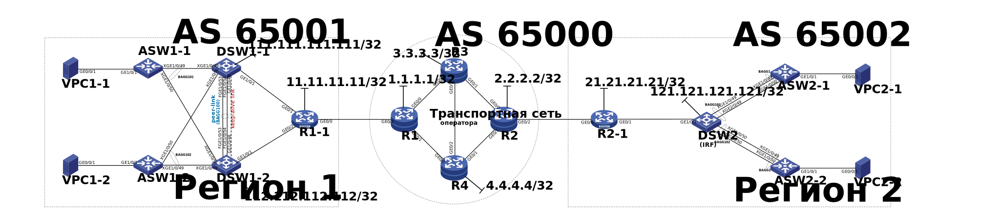
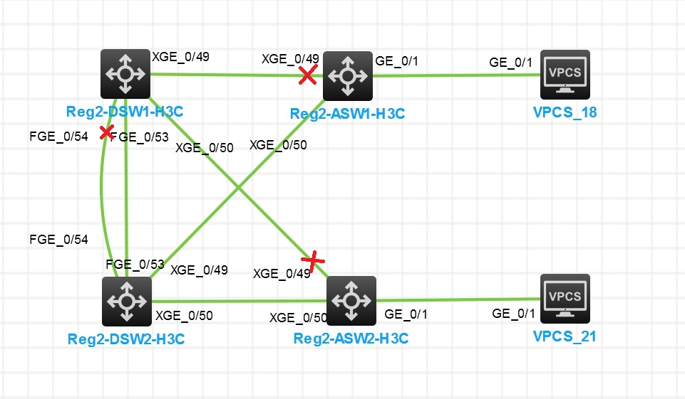
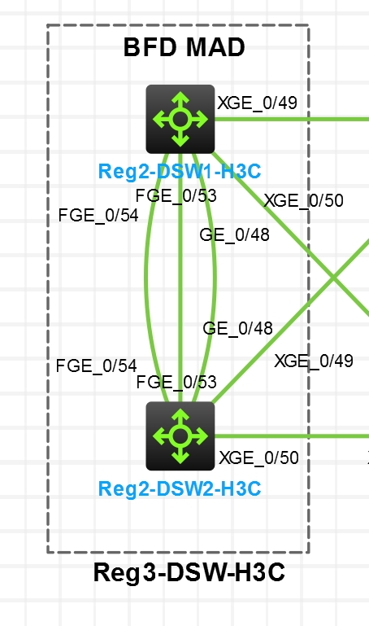
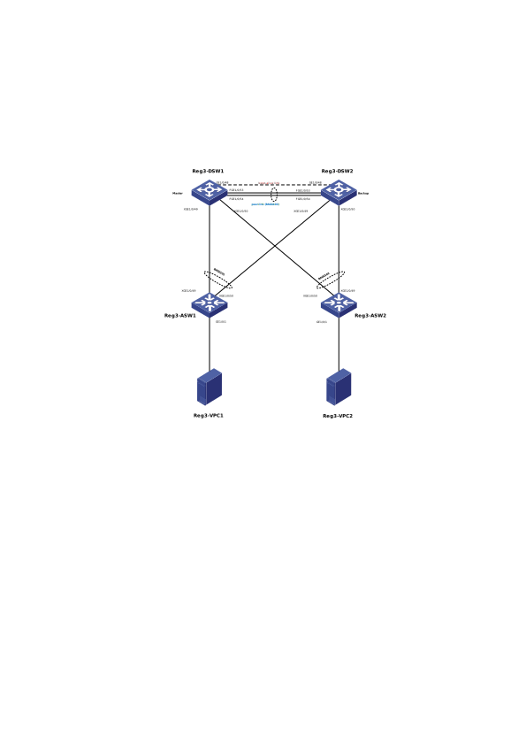
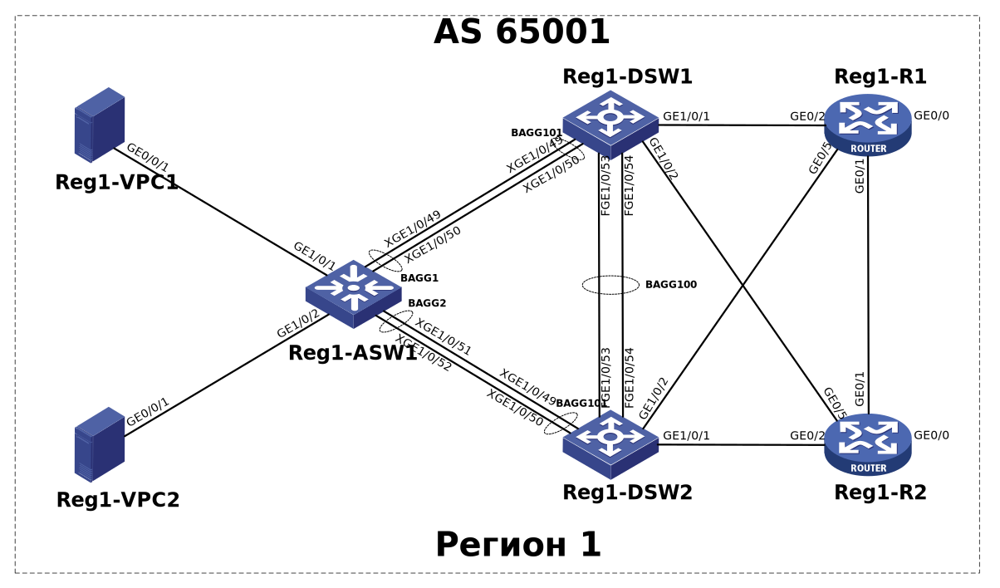

# Построение георазнесённой мультисервисной сети оператора связи

## Оглавление
1. [Цель](#цель)
2. [Задачи](#задачи)
3. [Сетевая топология](#Сетевая-топология)
4. [План IP адресации](#План-IP-адресации)
5. [Протоколы L2/L3 (внутри региона)](#Протоколы-L2/L3-(внутри-региона))

    5.1. [Настройка агрегации линков](#Настройка-агрегации-линков)
	
    5.2. [Настройка VRRP](#Настройка-VRRP)
	
    5.3. [Настройка Spanning Tree (RSTP)](#Настройка-Spanning-Tree-(RSTP))
   
    5.4. [Объединение коммутаторов в стек](#Объединение-коммутаторов-в-стек)
   
    5.5. [Проблемы стекирования](#Проблемы-стекирования)
   
    5.6. [Настройка BFD MAD](#Настройка-BFD-MAD)
   
    5.7. [Настройка M-LAG](#Настройка-M-LAG)
   
    5.8. [Настройка OSPF](#Настройка-OSPF)
   
6. [Протоколы L3 (транспортная сеть)](#Протоколы-L3-(транспортная-сеть))

    6.1. [Настройка IS-IS](#Настройка-IS-IS)

    6.2. [Настройка eBGP](#Настройка-EBGP)
	
    6.3. [Настройка iBGP](#Настройка-iBGP)

    6.4. [Настройка IP/MPLS](#Настройка-IP/MPLS)

    6.5. [Настройка TE](#Настройка-TE)

7. [Выводы](#Выводы)


# Цель

111

# Задачи

2222

# Сетевая топология

Топология сети приведена на рисунке:




# План IP адресации

444


# Протоколы L2/L3 (внутри региона)

## Настройка агрегации линков

На оборудовании H3C агрегация линков называется Bridge-Aggregation Group (BAGG) для коммутаторов
и Router-Aggregation Group (RAGG) для маршрутизаторов. Совместима с Ether-Trunk от Huawei и
Port-Channel от Cisco. Настраиваю BAGG100 между DSW-коммутаторами на портах 40GBase, BAGG101 между DSW И ASW на портах 10GBase.

Reg1-DSW1:
```   
interface Bridge-Aggregation100
 description to Reg1-DSW2 (BAGG100)
 port link-type trunk
 port trunk permit vlan 10 20 99
 link-aggregation mode dynamic
quit
 
interface Bridge-Aggregation101
 description to Reg1-ASW (BAGG1)
 port link-type trunk
 port trunk permit vlan 10 20 99
 link-aggregation mode dynamic
quit

int XGE1/0/49
 description to Reg1-ASW1 (XGE1/0/49)
 port link-type trunk
 port trunk permit vlan 10 20 99
 port link-aggregation group 101
quit

int XGE1/0/50
 description to Reg1-ASW1 (XGE1/0/50)
 port link-type trunk
 port trunk permit vlan 10 20 99
 port link-aggregation group 101
quit


int FGE1/0/53
 description to Reg1-DSW2 (FGE1/0/53)
 port link-type trunk
 port trunk permit vlan 10 20 99
 port link-aggregation group 100
quit

int FGE1/0/54
 description to Reg1-DSW2 (FGE1/0/54)
 port link-type trunk
 port trunk permit vlan 10 20 99
 port link-aggregation group 100
quit
```   
На Reg1-DSW2 настройка аналогична.


## Настройка VRRP

Настройка:

Reg1-DSW1:

```   
interface Vlan-interface99
 ip address 10.1.99.251 24
 vrrp vrid 1 virtual-ip 10.1.99.254
 vrrp vrid 1 priority 100
quit


interface Vlan-interface10
 ip address 10.1.10.251 24
 vrrp vrid 2 virtual-ip 10.1.10.254
 vrrp vrid 2 priority 100
quit

interface Vlan-interface20
 ip address 10.1.20.251 24
 vrrp vrid 3 virtual-ip 10.1.20.254
 vrrp vrid 3 priority 100
quit
```   
Reg1-DSW2:

```   
interface Vlan-interface99
 ip address 10.1.99.252 24
 vrrp vrid 1 virtual-ip 10.1.99.254
 vrrp vrid 1 priority 200
 quit

interface Vlan-interface10
 ip address 10.1.10.252 24
 vrrp vrid 2 virtual-ip 10.1.10.254
 vrrp vrid 2 priority 200
quit

interface Vlan-interface20
 ip address 10.1.20.252 24
 vrrp vrid 3 virtual-ip 10.1.20.254
 vrrp vrid 3 priority 200
quit
```   


Вывод состояния VRRP:

```   
[Reg1-DSW1]disp vrrp verbose
IPv4 Virtual Router Information:
 Running mode : Standard
 Total number of virtual routers : 3
   Interface Vlan-interface10
     VRID             : 2                   Adver Timer  : 100
     Admin Status     : Up                  State        : Backup
     Config Pri       : 100                 Running Pri  : 100
     Preempt Mode     : Yes                 Delay Time   : 0
     Become Master    : 0ms left
     Auth Type        : Not supported
     Version          : 3
     Virtual IP       : 10.1.10.254
     Virtual MAC      : 0000-5e00-0102
     Master IP        : 10.1.10.252

   Interface Vlan-interface20
     VRID             : 3                   Adver Timer  : 100
     Admin Status     : Up                  State        : Backup
     Config Pri       : 100                 Running Pri  : 100
     Preempt Mode     : Yes                 Delay Time   : 0
     Become Master    : 0ms left
     Auth Type        : Not supported
     Version          : 3
     Virtual IP       : 10.1.20.254
     Virtual MAC      : 0000-5e00-0103
     Master IP        : 10.1.20.252

   Interface Vlan-interface99
     VRID             : 1                   Adver Timer  : 100
     Admin Status     : Up                  State        : Backup
     Config Pri       : 100                 Running Pri  : 100
     Preempt Mode     : Yes                 Delay Time   : 0
     Become Master    : 0ms left
     Auth Type        : Not supported
     Version          : 3
     Virtual IP       : 10.1.99.254
     Virtual MAC      : 0000-5e00-0101
     Master IP        : 10.1.99.252

```   


```   
[Reg1-DSW2]disp vrrp verbose
IPv4 Virtual Router Information:
 Running mode : Standard
 Total number of virtual routers : 3
   Interface Vlan-interface10
     VRID             : 2                   Adver Timer  : 100
     Admin Status     : Up                  State        : Master
     Config Pri       : 200                 Running Pri  : 200
     Preempt Mode     : Yes                 Delay Time   : 0
     Auth Type        : Not supported
     Version          : 3
     Virtual IP       : 10.1.10.254
     Virtual MAC      : 0000-5e00-0102
     Master IP        : 10.1.10.252

   Interface Vlan-interface20
     VRID             : 3                   Adver Timer  : 100
     Admin Status     : Up                  State        : Master
     Config Pri       : 200                 Running Pri  : 200
     Preempt Mode     : Yes                 Delay Time   : 0
     Auth Type        : Not supported
     Version          : 3
     Virtual IP       : 10.1.20.254
     Virtual MAC      : 0000-5e00-0103
     Master IP        : 10.1.20.252

   Interface Vlan-interface99
     VRID             : 1                   Adver Timer  : 100
     Admin Status     : Up                  State        : Master
     Config Pri       : 200                 Running Pri  : 200
     Preempt Mode     : Yes                 Delay Time   : 0
     Auth Type        : Not supported
     Version          : 3
     Virtual IP       : 10.1.99.254
     Virtual MAC      : 0000-5e00-0101
     Master IP        : 10.1.99.252
```   


Проверка работы VRRP:

```   
Reg1-VPC1> ping 10.1.10.254
84 bytes from 10.1.10.254 icmp_seq=1 ttl=255 time=3.500 ms
84 bytes from 10.1.10.254 icmp_seq=2 ttl=255 time=2.000 ms
84 bytes from 10.1.10.254 icmp_seq=3 ttl=255 time=2.000 ms
84 bytes from 10.1.10.254 icmp_seq=4 ttl=255 time=2.000 ms
84 bytes from 10.1.10.254 icmp_seq=5 ttl=255 time=2.500 ms
Reg1-VPC1>
```   
Меняю vrrp priority на значение 200 на коммутаторе Reg1-DSW1, на Reg1-DSW2 ставлю в значение 100:


```   
[Reg1-DSW2]interface Vlan-interface99
[Reg1-DSW2-Vlan-interface99]vrrp vrid 1 priority 100

[Reg1-DSW1]interface Vlan-interface99
[Reg1-DSW1-Vlan-interface99]vrrp vrid 1 priority 200
```   

Провека:
```   
[Reg1-DSW1]disp vrrp verbose
IPv4 Virtual Router Information:
 Running mode : Standard
 Total number of virtual routers : 3
   Interface Vlan-interface10
     VRID             : 2                   Adver Timer  : 100
     Admin Status     : Up                  State        : Backup
     Config Pri       : 100                 Running Pri  : 100
     Preempt Mode     : Yes                 Delay Time   : 0
     Become Master    : 0ms left
     Auth Type        : Not supported
     Version          : 3
     Virtual IP       : 10.1.10.254
     Virtual MAC      : 0000-5e00-0102
     Master IP        : 10.1.10.252

   Interface Vlan-interface20
     VRID             : 3                   Adver Timer  : 100
     Admin Status     : Up                  State        : Backup
     Config Pri       : 100                 Running Pri  : 100
     Preempt Mode     : Yes                 Delay Time   : 0
     Become Master    : 0ms left
     Auth Type        : Not supported
     Version          : 3
     Virtual IP       : 10.1.20.254
     Virtual MAC      : 0000-5e00-0103
     Master IP        : 10.1.20.252

   Interface Vlan-interface99
     VRID             : 1                   Adver Timer  : 100
     Admin Status     : Up                  State        : Master
     Config Pri       : 200                 Running Pri  : 200
     Preempt Mode     : Yes                 Delay Time   : 0
     Auth Type        : Not supported
     Version          : 3
     Virtual IP       : 10.1.99.254
     Virtual MAC      : 0000-5e00-0101
     Master IP        : 10.1.99.251
```   


```   
[Reg1-DSW2-Vlan-interface99]disp vrrp verbose
IPv4 Virtual Router Information:
 Running mode : Standard
 Total number of virtual routers : 3
   Interface Vlan-interface10
     VRID             : 2                   Adver Timer  : 100
     Admin Status     : Up                  State        : Master
     Config Pri       : 200                 Running Pri  : 200
     Preempt Mode     : Yes                 Delay Time   : 0
     Auth Type        : Not supported
     Version          : 3
     Virtual IP       : 10.1.10.254
     Virtual MAC      : 0000-5e00-0102
     Master IP        : 10.1.10.252

   Interface Vlan-interface20
     VRID             : 3                   Adver Timer  : 100
     Admin Status     : Up                  State        : Master
     Config Pri       : 200                 Running Pri  : 200
     Preempt Mode     : Yes                 Delay Time   : 0
     Auth Type        : Not supported
     Version          : 3
     Virtual IP       : 10.1.20.254
     Virtual MAC      : 0000-5e00-0103
     Master IP        : 10.1.20.252

   Interface Vlan-interface99
     VRID             : 1                   Adver Timer  : 100
     Admin Status     : Up                  State        : Backup
     Config Pri       : 100                 Running Pri  : 100
     Preempt Mode     : Yes                 Delay Time   : 0
     Become Master    : 0ms left
     Auth Type        : Not supported
     Version          : 3
     Virtual IP       : 10.1.99.254
     Virtual MAC      : 0000-5e00-0101
     Master IP        : 10.1.99.251

```   
Видно, что Master для Vlan-interface99 переместился на Reg1-DSW1.

Настройка на маршрутизаторах (Регион 2) аналогична.


## Настройка Spanning Tree (RSTP)

Рассмотрим настройку RSTP (Rapid Spanning-tree Protocol) на примере Региона 2.

Для предотвращения образования петель поднимем на всех коммутаторах региона RSTP с помощью команды:
```   
stp mode rstp
stp global enable
```   

Посмотрим состояние портов на всех коммутаторах:

```   
[Reg2-DSW1]disp stp brief
 MST ID   Port                                Role  STP State   Protection
 0        FortyGigE1/0/53                     ROOT  FORWARDING  NONE
 0        FortyGigE1/0/54                     ALTE  DISCARDING  NONE
 0        Ten-GigabitEthernet1/0/49           DESI  FORWARDING  NONE
 0        Ten-GigabitEthernet1/0/50           DESI  FORWARDING  NONE

[Reg2-DSW2]disp stp br
 MST ID   Port                                Role  STP State   Protection
 0        FortyGigE1/0/53                     DESI  FORWARDING  NONE
 0        FortyGigE1/0/54                     DESI  FORWARDING  NONE
 0        Ten-GigabitEthernet1/0/49           DESI  FORWARDING  NONE
 0        Ten-GigabitEthernet1/0/50           DESI  FORWARDING  NONE

[Reg2-ASW1]disp stp br
 MST ID   Port                                Role  STP State   Protection
 0        GigabitEthernet1/0/1                DESI  FORWARDING  NONE
 0        Ten-GigabitEthernet1/0/49           ALTE  DISCARDING  NONE
 0        Ten-GigabitEthernet1/0/50           ROOT  FORWARDING  NONE

[Reg2-ASW2]disp stp br
 MST ID   Port                                Role  STP State   Protection
 0        GigabitEthernet1/0/1                DESI  FORWARDING  NONE
 0        Ten-GigabitEthernet1/0/49           ALTE  DISCARDING  NONE
 0        Ten-GigabitEthernet1/0/50           ROOT  FORWARDING  NONE
```   

Корневым мостом является Reg2-DSW2 (RootPort ID==0.0)

```   
[Reg2-DSW1]disp stp | include RootPort ID
 RootPort ID         : 128.54

[[Reg2-DSW2]disp stp | include RootPort ID
 RootPort ID         : 0.0

[Reg2-ASW1]disp stp | include RootPort
 RootPort ID         : 128.51

[Reg2-ASW2]disp stp | include RootPort
 RootPort ID         : 128.51
```   

Для наглядности DISCARDING порты отмечены на рисунке крестиком:





## Объединение коммутаторов в стек

Технология стэкирования не стандартизована и у каждого вендора своя. У H3C она называется IRF (Intelligent Resilient Framework), у Huawei &mdash; iStack, у Cisco &mdash; Stack.

Объединим DSW-коммутаторы в Регионе 2 в стек.

Reg2-DSW1:
```   
# блокируем интерфейсы
int range fge1/0/53 fge1/0/54
 shut
quit

# добавляем физические порты в виртуальный порт irf-port
irf member 1 renumber 1

irf-port 1/1
port group int fge1/0/53
port group int fge1/0/54
int range fge1/0/53 fge1/0/54

# задаю приоритет == 32, чтобы данный физический коммутатор был первым в стеке
irf member 1 priority 32


undo shutdown

save

# Для активации перезагружаем коммутатор (одновременно с Reg2-DSW2)

irf-port-configuration active
quit
reboot
Y

```   

На Reg2-DSW2 настройка аналогична, но задаю "второй номер" в стеке:
```   
int range fge1/0/53 fge1/0/54
shut
quit

irf member 1 renumber 2

irf-port 1/2
port group int fge1/0/53
port group int fge1/0/54
int range fge1/0/53 fge1/0/54
undo shutdown

save

irf-port-configuration active
quit
reboot
Y            
```   
Коммутаторы проводят выборы мастера. Тот, которой не пройдет, автоматически перезапустится. После завершения перезапуска формируется IRF.

Поскольку первый коммутатор вручную настроен с приоритетом 32 (значение по умолчанию равно 1, чем больше значение, тем выше приоритет, а максимальное значение равно 32), он будет выбран в качестве основного, и DSW2 перезапустится. После перезагрузки настройка IRF будет завершена и системное имя объединяется в Reg2-DSW1..

Присвою имя стекированному коммутатору Reg2-DSW (уже без порядкового номера). На втором коммутаторе (при подключении к нему консолью) имя изменится автоматически.

```   
<Reg2-DSW1>
<Reg2-DSW>
```   

Т.о. у нас теперь один логичесий коммутатор DSW в Регионе 2.
Что видно в настройках:

```   
[Reg2-DSW]disp cur
#
 version 7.1.070, Alpha 7170
#
 sysname Reg2-DSW
#

...

irf-port 1/1
 port group interface FortyGigE1/0/53
 port group interface FortyGigE1/0/54
#
irf-port 2/2
 port group interface FortyGigE2/0/53
 port group interface FortyGigE2/0/54
#
...
```   
Видно, что порты на втором коммутаторе стека отображаются как порты виртуальной "второй интерфейсной карты" (**2**/0/XX), как если бы это был коммутатор с несколькими интерфейсными картами.

Посмотрим, что стало с RSTP:


```   
[Reg2-DSW]disp stp brief
 MST ID   Port                                Role  STP State   Protection
 0        Ten-GigabitEthernet1/0/49           DESI  FORWARDING  NONE
 0        Ten-GigabitEthernet1/0/50           DESI  FORWARDING  NONE
 0        Ten-GigabitEthernet2/0/49           DESI  FORWARDING  NONE
 0        Ten-GigabitEthernet2/0/50           DESI  FORWARDING  NONE

[Reg2-ASW1]disp stp brief
 MST ID   Port                                Role  STP State   Protection
 0        GigabitEthernet1/0/1                DESI  FORWARDING  NONE
 0        Ten-GigabitEthernet1/0/49           ROOT  FORWARDING  NONE
 0        Ten-GigabitEthernet1/0/50           ALTE  DISCARDING  NONE

[Reg2-ASW2]disp stp brief
 MST ID   Port                                Role  STP State   Protection
 0        GigabitEthernet1/0/1                DESI  FORWARDING  NONE
 0        Ten-GigabitEthernet1/0/49           ROOT  FORWARDING  NONE
 0        Ten-GigabitEthernet1/0/50           ALTE  DISCARDING  NONE
```   

Корневым мостом теперь является Reg2-DSW (RootPort ID==0.0), т.е. наш стекированный коммутатор.
```   
[Reg2-DSW]disp stp | include RootPort
 RootPort ID         : 0.0

[Reg2-ASW1]disp stp | include RootPort
 RootPort ID         : 128.50

[Reg2-ASW2]disp stp | include RootPort
 RootPort ID         : 128.50
```   

Далее настраиваю Bridge-Aggregation Groups в LACP.


Теперь нет DISCARDING портов:

```   
[Reg2-DSW]disp stp br
 MST ID   Port                                Role  STP State   Protection
 0        Bridge-Aggregation101               DESI  FORWARDING  NONE
 0        Bridge-Aggregation102               DESI  FORWARDING  NONE

[Reg2-ASW1]disp stp br
 MST ID   Port                                Role  STP State   Protection
 0        Bridge-Aggregation1                 ROOT  FORWARDING  NONE
 0        GigabitEthernet1/0/1                DESI  FORWARDING  NONE

[Reg2-ASW2]disp stp br
 MST ID   Port                                Role  STP State   Protection
 0        Bridge-Aggregation1                 ROOT  FORWARDING  NONE
 0        GigabitEthernet1/0/1                DESI  LEARNING    NONE
[Reg2-ASW2]disp stp br
 MST ID   Port                                Role  STP State   Protection
 0        Bridge-Aggregation1                 ROOT  FORWARDING  NONE
 0        GigabitEthernet1/0/1                DESI  FORWARDING  NONE

```
Т.е. построена схема без петель.

Т.о. получили отказоустойчивую схему L2 с резервирование 1+1 коммутатора уровня ядра/распределения и резервирование каналов 1+1 до коммутаторов уровня доступа.


## Проблемы стекирования

Смоделируем отказ межкоммутаторных линков, образующих стек:

```
[Reg2-DSW]int range fge1/0/53 fge1/0/54
[Reg2-DSW-if-range]shut
%Oct  4 20:16:23:282 2025 Reg2-DSW LLDP/6/LLDP_DELETE_NEIGHBOR: -Slot=2; Nearest bridge agent neighbor deleted on port FortyGigE2/0/53 (IfIndex 566), neighbor's chassis ID is 1ac2-93f6-1100, port ID is FortyGigE1/0/53.
%Oct  4 20:16:23:760 2025 Reg2-DSW IFNET/3/PHY_UPDOWN: Physical state on the interface FortyGigE1/0/53 changed to down.
%Oct  4 20:16:23:761 2025 Reg2-DSW IFNET/5/LINK_UPDOWN: Line protocol state on the interface FortyGigE1/0/53 changed to down.
%Oct  4 20:16:23:761 2025 Reg2-DSW IFNET/3/PHY_UPDOWN: Physical state on the interface FortyGigE2/0/53 changed to down.
%Oct  4 20:16:23:762 2025 Reg2-DSW IFNET/5/LINK_UPDOWN: Line protocol state on the interface FortyGigE2/0/53 changed to down.
%Oct  4 20:16:23:318 2025 Reg2-DSW LLDP/6/LLDP_DELETE_NEIGHBOR: -Slot=2; Nearest bridge agent neighbor deleted on port FortyGigE2/0/54 (IfIndex 567), neighbor's chassis ID is 1ac2-93f6-1100, port ID is FortyGigE1/0/54.
%Oct  4 20:16:23:789 2025 Reg2-DSW STM/3/STM_LINK_DOWN: IRF port 1 went down.
%Oct  4 20:16:23:790 2025 Reg2-DSW DEV/3/BOARD_REMOVED: Board was removed from slot 2, type is H3C S6850.
%Oct  4 20:16:23:800 2025 Reg2-DSW LAGG/6/LAGG_INACTIVE_NODEREMOVE: Member port XGE2/0/49 of aggregation group BAGG101 changed to the inactive state, because the card that hosts the port was absent.
%Oct  4 20:16:23:819 2025 Reg2-DSW LAGG/6/LAGG_INACTIVE_NODEREMOVE: Member port XGE2/0/50 of aggregation group BAGG102 changed to the inactive state, because the card that hosts the port was absent.
%Oct  4 20:16:23:845 2025 Reg2-DSW IFNET/3/PHY_UPDOWN: Physical state on the interface FortyGigE1/0/54 changed to down.
%Oct  4 20:16:23:848 2025 Reg2-DSW IFNET/5/LINK_UPDOWN: Line protocol state on the interface FortyGigE1/0/54 changed to down.
```

Стэк развалился, оба коммутатора считают себя главными, в сети два устройства с одинаковым именем.

Ниже диагностика с первого коммутатора стека:
```
<Reg2-DSW>disp irf
MemberID    Role    Priority  CPU-Mac         Description
 *+1        Master  32        1ac2-93f6-1104  ---
--------------------------------------------------
 * indicates the device is the master.
 + indicates the device through which the user logs in.

 The bridge MAC of the IRF is: 1ac2-93f6-1100
 Auto upgrade                : yes
 Mac persistent              : 6 min
 Domain ID                   : 0
<Reg2-DSW>disp irf link
Member 1
 IRF Port  Interface                             Status
 1         FortyGigE1/0/53                       DOWN
           FortyGigE1/0/54                       DOWN
 2         disable                               --
<Reg2-DSW>disp irf conf
<Reg2-DSW>disp irf configuration
 MemberID NewID    IRF-Port1                     IRF-Port2
 1        1        FortyGigE1/0/53               disable
                   FortyGigE1/0/54
```

И со второго:
```
<Reg2-DSW>disp irf
MemberID    Role    Priority  CPU-Mac         Description
 *+2        Master  1         1ac2-82c2-1004  ---
--------------------------------------------------
 * indicates the device is the master.
 + indicates the device through which the user logs in.

 The bridge MAC of the IRF is: 1ac2-93f6-1100
 Auto upgrade                : yes
 Mac persistent              : 6 min
 Domain ID                   : 0
<Reg2-DSW>disp irf link
Member 2
 IRF Port  Interface                             Status
 1         disable                               --
 2         FortyGigE2/0/53                       DOWN
           FortyGigE2/0/54                       DOWN
<Reg2-DSW>disp irf conf
<Reg2-DSW>disp irf configuration
 MemberID NewID    IRF-Port1                     IRF-Port2
 2        2        disable                       FortyGigE2/0/53
                                                 FortyGigE2/0/54
```


Также аварийные сообщения с коммутаторов уровня доступа:
```
[Reg2-ASW1]
%Oct  4 20:19:30:851 2025 Reg2-ASW1 LAGG/6/LAGG_INACTIVE_PHYSTATE: Member port XGE1/0/50 of aggregation group BAGG1 changed to the inactive state, because the physical state of the port is down.
%Oct  4 20:19:30:853 2025 Reg2-ASW1 IFNET/3/PHY_UPDOWN: Physical state on the interface Ten-GigabitEthernet1/0/50 changed to down.
%Oct  4 20:19:30:853 2025 Reg2-ASW1 IFNET/5/LINK_UPDOWN: Line protocol state on the interface Ten-GigabitEthernet1/0/50 changed to down.


[Reg2-ASW2]
%Oct  4 20:19:31:553 2025 Reg2-ASW2 LAGG/6/LAGG_INACTIVE_PHYSTATE: Member port XGE1/0/50 of aggregation group BAGG1 changed to the inactive state, because the physical state of the port is down.
%Oct  4 20:19:31:555 2025 Reg2-ASW2 IFNET/3/PHY_UPDOWN: Physical state on the interface Ten-GigabitEthernet1/0/50 changed to down.
%Oct  4 20:19:31:555 2025 Reg2-ASW2 IFNET/5/LINK_UPDOWN: Line protocol state on the interface Ten-GigabitEthernet1/0/50 changed to down.
```

Восстановим стек:

```
[Reg2-DSW-if-range]undo shut
%Oct  4 20:33:35:573 2025 Reg2-DSW LAGG/6/LAGG_LACP_RECEIVE_TIMEOUT: -Slot=2; LACPDU reception timed out on member port XGE2/0/50 in aggregation group BAGG102.
%Oct  4 20:33:37:113 2025 Reg2-DSW LLDP/6/LLDP_CREATE_NEIGHBOR: Nearest bridge agent neighbor created on port FortyGigE1/0/54 (IfIndex 55), neighbor's chassis ID is 1ac2-93f6-1100, port ID is FortyGigE2/0/54.
%Oct  4 20:33:37:124 2025 Reg2-DSW LAGG/6/LAGG_ACTIVE: Member port XGE2/0/50 of aggregation group BAGG102 changed to the active state.
%Oct  4 20:33:35:890 2025 Reg2-DSW LLDP/6/LLDP_CREATE_NEIGHBOR: -Slot=2; Nearest bridge agent neighbor created on port Ten-GigabitEthernet2/0/50 (IfIndex 563), neighbor's chassis ID is 1ac3-6812-1400, port ID is Ten-GigabitEthernet1/0/50.
%Oct  4 20:33:37:466 2025 Reg2-DSW IFNET/3/PHY_UPDOWN: Physical state on the interface FortyGigE2/0/53 changed to up.
%Oct  4 20:33:35:902 2025 Reg2-DSW LLDP/6/LLDP_CREATE_NEIGHBOR: -Slot=2; Nearest bridge agent neighbor created on port FortyGigE2/0/54 (IfIndex 567), neighbor's chassis ID is 1ac2-93f6-1100, port ID is FortyGigE1/0/54.
%Oct  4 20:33:37:471 2025 Reg2-DSW IFNET/5/LINK_UPDOWN: Line protocol state on the interface FortyGigE2/0/53 changed to up.
%Oct  4 20:33:37:472 2025 Reg2-DSW IFNET/3/PHY_UPDOWN: Physical state on the interface FortyGigE2/0/54 changed to up.
%Oct  4 20:33:37:476 2025 Reg2-DSW IFNET/5/LINK_UPDOWN: Line protocol state on the interface FortyGigE2/0/54 changed to up.
%Oct  4 20:33:37:478 2025 Reg2-DSW IFNET/3/PHY_UPDOWN: Physical state on the interface Ten-GigabitEthernet2/0/50 changed to up.
%Oct  4 20:33:37:480 2025 Reg2-DSW IFNET/5/LINK_UPDOWN: Line protocol state on the interface Ten-GigabitEthernet2/0/50 changed to up.
%Oct  4 20:33:37:671 2025 Reg2-DSW HA/5/HA_BATCHBACKUP_STARTED: Batch backup of standby board in slot 2 started.
%Oct  4 20:33:37:774 2025 Reg2-DSW IFNET/3/PHY_UPDOWN: Physical state on the interface Ten-GigabitEthernet2/0/49 changed to up.
%Oct  4 20:33:36:185 2025 Reg2-DSW LAGG/6/LAGG_LACP_RECEIVE_TIMEOUT: -Slot=2; LACPDU reception timed out on member port XGE2/0/49 in aggregation group BAGG101.
%Oct  4 20:33:36:191 2025 Reg2-DSW LLDP/6/LLDP_CREATE_NEIGHBOR: -Slot=2; Nearest bridge agent neighbor created on port Ten-GigabitEthernet2/0/49 (IfIndex 562), neighbor's chassis ID is 1ac3-5bae-1300, port ID is Ten-GigabitEthernet1/0/50.
%Oct  4 20:33:37:799 2025 Reg2-DSW LAGG/6/LAGG_ACTIVE: Member port XGE2/0/49 of aggregation group BAGG101 changed to the active state.
%Oct  4 20:33:37:814 2025 Reg2-DSW IFNET/5/LINK_UPDOWN: Line protocol state on the interface Ten-GigabitEthernet2/0/49 changed to up.
%Oct  4 20:33:38:675 2025 Reg2-DSW HA/5/HA_BATCHBACKUP_FINISHED: Batch backup of standby board in slot 2 has finished.
%Oct  4 20:33:57:258 2025 Reg2-DSW LLDP/6/LLDP_CREATE_NEIGHBOR: -Slot=2; Nearest bridge agent neighbor created on port FortyGigE2/0/53 (IfIndex 566), neighbor's chassis ID is 1ac2-93f6-1100, port ID is FortyGigE1/0/53.
```


Диагностика:

```
<Reg2-DSW>disp irf
MemberID    Role    Priority  CPU-Mac         Description
 *+1        Master  32        1ac2-93f6-1104  ---
   2        Standby 1         1ac2-82c2-1004  ---
--------------------------------------------------
 * indicates the device is the master.
 + indicates the device through which the user logs in.

 The bridge MAC of the IRF is: 1ac2-93f6-1100
 Auto upgrade                : yes
 Mac persistent              : 6 min
 Domain ID                   : 0
<Reg2-DSW>disp irf link
Member 1
 IRF Port  Interface                             Status
 1         FortyGigE1/0/53                       UP
           FortyGigE1/0/54                       UP
 2         disable                               --
Member 2
 IRF Port  Interface                             Status
 1         disable                               --
 2         FortyGigE2/0/53                       UP
           FortyGigE2/0/54                       UP

<Reg2-DSW>disp irf configuration
 MemberID NewID    IRF-Port1                     IRF-Port2
 1        1        FortyGigE1/0/53               disable
                   FortyGigE1/0/54
 2        2        disable                       FortyGigE2/0/53
                                                 FortyGigE2/0/54
```

На восстановление стека в лабораторных условиях ушло две минуты, что достаточно много по времени. Т.о. даже при случайной блокировке портов, например ошибка ввода/скрипта при проведении работ, возможна аварийная ситуации высокого приоритета.

Ниже рассмотрим, какие средства есть для защиты стека.

## Настройка BFD MAD

Разделение IRF происходит, когда фабрика IRF распадается на несколько фабрик IRF из-за сбоев в работе каналов IRF. Разделённые фабрики IRF работают с одним и тем же IP-адресом.
Такое разделение приводит к проблемам маршрутизации и пересылки в сети.

Для защиты стека IRF у Н3С предусмотрено четыре механизма Multi-active detection (MAD):
- LACP MAD &mdash; требуется третье устройство, подключенное к обоим коммутаторам;
- BFD MAD &mdash; на уровне L2 создаётся прямое подключение между коммутаторами;
- ARP MAD &mdash; через запрос Gratuitous ARP, с идентификатором активного коммутатора;	
- ND MAD &mdash; с помощью пакетов NS (протокол Neighbor Discovery IPv6).

У каждого из этих механизмов есть свои преимущества и недостатки. Так, у LACP MAD высокая скорость обнаружения, не требуется дополнительного линка, но требуется промежуточное устройство, работающее по LACP. У BFD MAD также высокая скорость обнаружения, но требуется дополнительный канал между устройствами фабрики IRF. У ARP MAD низкая скорость обнаружения, но не требуются дополнительные устройства и каналы. У ND MAD скорость обнаружения ниже, чем у LACP и BFD MAD, не требуются дополнительные устройства и каналы, но используются сценарии IPv6.

Реализуем BFD MAD. Для этого добавим дополнительный линк между коммутаторами (GE1/0/48 &mdash; GE2/0/48).
Схема представлена на рисунке:




Настройка:

```   
vlan 999
 description FOR_BFD_MAD_ONLY
 port GE1/0/48 GE2/0/48
quit

int Vlan-interface999
 mad bfd enable
 mad ip address 192.168.99.1 24 member 1
 mad ip address 192.168.99.2 24 member 2
quit


# отключаем STP на портах BFD, т.к. spanning-tree и BFD MAD взаимоисключающие:

int GE1/0/48
 undo stp enable
quit

int GE2/0/48
 undo stp enable
quit

```   

Проверка:
```   
[Reg2-DSW]disp bfd session
 Total sessions: 1     Up sessions: 0     Init mode: Active

 IPv4 session working in control packet mode:

 LD/RD            SourceAddr      DestAddr        State  Holdtime    Interface
 32833/0          192.168.99.1    192.168.99.2    Down      /        Vlan999
[Reg2-DSW]disp mad verbose
Multi-active recovery state: No
Excluded ports (user-configured):
Excluded ports (system-configured):
  IRF physical interfaces:
    FortyGigE1/0/53
    FortyGigE1/0/54
    FortyGigE2/0/53
    FortyGigE2/0/54
  BFD MAD interfaces:
    Vlan-interface999
MAD ARP disabled.
MAD ND disabled.
MAD LACP disabled.
MAD BFD enabled interface: Vlan-interface999
  MAD status                 : Normal
  Member ID   MAD IP address       Neighbor   MAD status
  1           192.168.99.1/24      2          Normal
  2           192.168.99.2/24      1          Normal
```   

Отключаем порты стека.
IRF разделяется, MAD обнаруживает разделение IRF, отключает все сетевые порты на втором коммутаторе, второй коммутатор не работает, первый коммутатор работает. Статус сеанса BFD ненадолго изменится с "Down" на "Up", а затем снова изменится на "Down", так что статус сеанса BFD, который мы видим, всегда будет "Down". Статус в выводе команды **disp mad** изменится с "Normal" на "Faulty".

```   
[Reg2-DSW]disp bfd sess
 Total sessions: 1     Up sessions: 0     Init mode: Active

 IPv4 session working in control packet mode:

 LD/RD            SourceAddr      DestAddr        State  Holdtime    Interface
 32833/0          192.168.99.1    192.168.99.2    Down      /        Vlan999

[Reg2-DSW]disp mad verbose
Multi-active recovery state: No
Excluded ports (user-configured):
Excluded ports (system-configured):
  IRF physical interfaces:
    FortyGigE1/0/53
    FortyGigE1/0/54
  BFD MAD interfaces:
    Vlan-interface999
MAD ARP disabled.
MAD ND disabled.
MAD LACP disabled.
MAD BFD enabled interface: Vlan-interface999
  MAD status                 : Faulty
  Member ID   MAD IP address       Neighbor   MAD status
  1           192.168.99.1/24      2          Faulty

```   
Конфигурация доступна по ссылке: [ссылке](./cfg/Reg2-DSW-H3C-BFD-MAD.cfg)

## Настройка M-LAG

В Регионе 3 применим технологию объединения коммутатров M-LAG. Данная технология избавлена от
недостатком классического стекирования, т.к. control-plane разнесён между коммутаторами.

Схема представлена на рисунке.




Настроим M-LAG со стороны Reg3-DSW1, также выполним настройку VRRP:

```   

m-lag system-mac 1-1-1
m-lag system-number 1
m-lag system-priority 123
m-lag keepalive ip destination 111.111.111.112 source 111.111.111.111

int ge1/0/48
 port link-mode route
 ip address 111.111.111.111 24
quit

m-lag mad exclude interface ge1/0/48

int bridge-aggregation 100
 link-aggregation mode dynamic
quit

int fge1/0/53
 port link-aggregation group 100
quit

int fge1/0/54
 port link-aggregation group 100
quit

int bridge-aggregation 100
 port m-lag peer-link 1
quit

int bridge-aggregation 101
 link-aggregation mode dynamic
 port m-lag group 1
quit

interface xge1/0/49
 port link-aggregation group 101
quit

int bridge-aggregation 102
 link-aggregation mode dynamic
 port m-lag group 2
quit

int xge1/0/50
 port link-aggregation group 102
quit

vlan 10
 description Radio
quit

vlan 20
 description Tech
quit

interface bridge-aggregation 101
 port link-type trunk
 port trunk permit vlan 10
quit

interface bridge-aggregation 102
 port link-type trunk
 port trunk permit vlan 20
quit

interface vlan-interface 10
 ip address 10.3.10.251 24
quit

interface vlan-interface 20
 ip address 10.3.20.251 24
quit

m-lag mad exclude interface vlan-interface 10
m-lag mad exclude interface vlan-interface 20

interface vlan-interface 10
 vrrp vrid 1 virtual-ip 10.3.10.254
 vrrp vrid 1 priority 200
quit

interface vlan-interface 20
 vrrp vrid 2 virtual-ip 10.3.20.254
 vrrp vrid 2 priority 200
quit
```   
Настройка на Reg3-DSW2 аналогична.

На коммутаторах уровня доступа (на примере Reg3-ASW1) настройки следующие:

```   
interface bridge-aggregation 101
 link-aggregation mode dynamic
quit

interface range xge1/0/49 to xge1/0/50
 port link-aggregation group 101
quit

# Create VLAN 10.

vlan 10
 description Radio
quit

interface bridge-aggregation 101
 port link-type trunk
 port trunk permit vlan 10
quit
```   

Проверим, что Reg3-DSW1 сформировал систему M-LAG с Reg3-DSW2:

```   
[Reg3-DSW1]display m-lag summary
Flags: A -- Aggregate interface down, B -- No peer M-LAG interface configured
       C -- Configuration consistency check failed

Peer-link interface: BAGG100
Peer-link interface state (cause): UP
Keepalive link state (cause): UP

                     M-LAG interface information
M-LAG IF    M-LAG group  Local state (cause)  Peer state  Remaining down time(s)
BAGG101     1            UP                   UP          -
BAGG102     2            UP                   UP          -
[Reg3-DSW1]display m-lag verbose
Flags: A -- Home_Gateway, B -- Neighbor_Gateway, C -- Other_Gateway,
       D -- PeerLink_Activity, E -- DRCP_Timeout, F -- Gateway_Sync,
       G -- Port_Sync, H -- Expired

Peer-link interface/Peer-link interface ID: BAGG100/1
State: UP
Cause: -
Local DRCP flags/Peer DRCP flags: ABDFG/ABDFG
Local Selected ports (index): FGE1/0/53 (54), FGE1/0/54 (55)
Peer Selected ports indexes: 54, 55
Reserved VLANs: -

M-LAG interface/M-LAG group ID: BAGG101/1
Local M-LAG interface state: UP
Peer M-LAG interface state: UP
M-LAG group state: UP
Local M-LAG interface down cause: -
Remaining M-LAG DOWN time: -
Local M-LAG interface LACP MAC: Config=N/A, Effective=0001-0001-0001
Peer M-LAG interface LACP MAC: Config=N/A, Effective=0001-0001-0001
Local M-LAG interface LACP priority: Config=32768, Effective=123
Peer M-LAG interface LACP priority: Config=32768, Effective=123
Local DRCP flags/Peer DRCP flags: ABDFG/ABDFG
Local Selected ports (index): XGE1/0/49 (50)
Peer Selected ports indexes: 50

M-LAG interface/M-LAG group ID: BAGG102/2
Local M-LAG interface state: UP
Peer M-LAG interface state: UP
M-LAG group state: UP
Local M-LAG interface down cause: -
Remaining M-LAG DOWN time: -
Local M-LAG interface LACP MAC: Config=N/A, Effective=0001-0001-0001
Peer M-LAG interface LACP MAC: Config=N/A, Effective=0001-0001-0001
Local M-LAG interface LACP priority: Config=32768, Effective=123
Peer M-LAG interface LACP priority: Config=32768, Effective=123
Local DRCP flags/Peer DRCP flags: ABDFG/ABDFG
Local Selected ports (index): XGE1/0/50 (51)
Peer Selected ports indexes: 51
```   

Проверяем, что Reg3-ASW1 и Reg3-ASW2 корректно сформировали агрегированные соединения с системой M-LAG:

```   
[Reg3-ASW1]display link-aggregation verbose
Loadsharing Type: Shar -- Loadsharing, NonS -- Non-Loadsharing
Port: A -- Auto
Port Status: S -- Selected, U -- Unselected, I -- Individual
Flags:  A -- LACP_Activity, B -- LACP_Timeout, C -- Aggregation,
        D -- Synchronization, E -- Collecting, F -- Distributing,
        G -- Defaulted, H -- Expired

Aggregate Interface: Bridge-Aggregation101
Aggregation Mode: Dynamic
Loadsharing Type: Shar
System ID: 0x8000, 268f-4241-1e00
Local:
  Port                Status  Priority Oper-Key  Flag
--------------------------------------------------------------------------------
  XGE1/0/49           S       32768    1         {ACDEF}
  XGE1/0/50           S       32768    2         {ACDEF}
Remote:
  Actor               Priority Index    Oper-Key SystemID               Flag
--------------------------------------------------------------------------------
  XGE1/0/49(R)        32768    16386    40001    0x7b  , 0001-0001-0001 {ACDEF}
  XGE1/0/50           32768    32770    40001    0x7b  , 0001-0001-0001 {ACDEF}


[Reg3-ASW2]display link-aggregation verbose
Loadsharing Type: Shar -- Loadsharing, NonS -- Non-Loadsharing
Port: A -- Auto
Port Status: S -- Selected, U -- Unselected, I -- Individual
Flags:  A -- LACP_Activity, B -- LACP_Timeout, C -- Aggregation,
        D -- Synchronization, E -- Collecting, F -- Distributing,
        G -- Defaulted, H -- Expired

Aggregate Interface: Bridge-Aggregation102
Aggregation Mode: Dynamic
Loadsharing Type: Shar
System ID: 0x8000, 26a5-e3d0-1f00
Local:
  Port                Status  Priority Oper-Key  Flag
--------------------------------------------------------------------------------
  XGE1/0/49           S       32768    1         {ACDEF}
  XGE1/0/50           S       32768    2         {ACDEF}
Remote:
  Actor               Priority Index    Oper-Key SystemID               Flag
--------------------------------------------------------------------------------
  XGE1/0/49(R)        32768    16387    40002    0x7b  , 0001-0001-0001 {ACDEF}
  XGE1/0/50           32768    32771    40002    0x7b  , 0001-0001-0001 {ACDEF}
```   
Конфигурационныe файлы можно найти по [ссылке](./cfg).

## Настройка OSPF

В качестве протокола внутренней маршрутизации в регионах используем протокол OSPF.

Рассмотрим настройку протокола OSPF на примере Региона 1. OSPF поднимаем на маршрутизаторах и коммутаторах уровня ядра/распределения.
Ввиду наличия всего двух маршрутизаторов и двух L3-коммутаторов в сети, можно ограничиться area 0. Всем устройствам назначены Loopback-интеряейсы.
Изменены стандартные таймеры OSPF на интерфейсах  Timers: Hello 3, Dead 12 с целью улучшения сходимости протокола. Включен silent-interface all
(passive interface default), чтобы не отправлять hello в клиентские порты и вне региона. Применена команда ospf network-type p2p для оптимизации работы протокола.

Схема сети региона представлена на рисунке. 


Таблица OSPF router-id, для простоты совпадает с Loopback-ами:

| NE | router-id | 
|-----| ----| 
|Reg1-R1 | 11.11.11.11 |
|Reg1-R2 | 12.12.12.12 |
|Reg1-DSW1 | 111.111.111.111 |
|Reg1-DSW2 | 112.112.112.112 |

Настройка на маршрутизаторе Reg1-R1:
```   
ospf 1 router-id 11.11.11.11
 import-route direct
 silent-interface all
 undo silent-interface GE0/1
 undo silent-interface GE0/2
 undo silent-interface GE5/0
  area 0
 quit
quit

int loopback0
 ospf 1 area 0
quit

int GE0/1
 ospf 1 area 0
 ospf network-type p2p
 ospf timer hello 3
 ospf timer dead 12
quit

int GE0/2
 ospf 1 area 0
 ospf network-type p2p
 ospf timer hello 3
 ospf timer dead 12
quit

int GE5/0
 ospf 1 area 0
 ospf network-type p2p
 ospf timer hello 3
 ospf timer dead 12
quit

```   


На Reg1-R2 настройка аналогична.

Настройка на коммутаторе Reg1-DSW1:
```   
ospf 1 router-id 111.111.111.111
 silent-interface all
 undo silent-interface GE1/0/1
 undo silent-interface GE1/0/2
  area 0
 quit
quit

int loopback0
 ip address 111.111.111.111 32
 ospf 1 area 0
quit

int GE1/0/1
 ospf 1 area 0
 ospf network-type p2p
 ospf timer hello 3
 ospf timer dead 12
quit

int GE1/0/2
 ospf 1 area 0
 ospf network-type p2p
 ospf timer hello 3
 ospf timer dead 12
quit

interface Vlan-interface10
 ospf 1 area 0
quit

interface Vlan-interface20
 ospf 1 area 0
quit

interface Vlan-interface99
 ospf 1 area 0
quit
```   
На Reg1-DSW2 настройка аналогична.

Диагностика протокола приведена ниже.

На маршрутизаторах:
```   
[Reg1-R1]disp ip routing-table

Destinations : 22       Routes : 27

Destination/Mask   Proto   Pre Cost        NextHop         Interface
0.0.0.0/32         Direct  0   0           127.0.0.1       InLoop0
10.1.0.0/31        Direct  0   0           10.1.0.0        GE0/1
10.1.0.0/32        Direct  0   0           127.0.0.1       InLoop0
10.1.0.2/31        Direct  0   0           10.1.0.2        GE0/2
10.1.0.2/32        Direct  0   0           127.0.0.1       InLoop0
10.1.0.4/31        Direct  0   0           10.1.0.4        GE5/0
10.1.0.4/32        Direct  0   0           127.0.0.1       InLoop0
10.1.0.6/31        O_INTRA 10  2           10.1.0.1        GE0/1
                   O_INTRA 10  2           10.1.0.5        GE5/0
10.1.0.8/31        O_INTRA 10  2           10.1.0.1        GE0/1
                   O_INTRA 10  2           10.1.0.3        GE0/2
10.1.10.0/24       O_INTRA 10  2           10.1.0.3        GE0/2
                   O_INTRA 10  2           10.1.0.5        GE5/0
10.1.20.0/24       O_INTRA 10  2           10.1.0.3        GE0/2
                   O_INTRA 10  2           10.1.0.5        GE5/0
10.1.99.0/24       O_INTRA 10  2           10.1.0.3        GE0/2
                   O_INTRA 10  2           10.1.0.5        GE5/0
11.11.11.11/32     Direct  0   0           127.0.0.1       InLoop0
12.12.12.12/32     O_INTRA 10  1           10.1.0.1        GE0/1
111.111.111.111/32 O_INTRA 10  1           10.1.0.3        GE0/2
112.112.112.112/32 O_INTRA 10  1           10.1.0.5        GE5/0
127.0.0.0/8        Direct  0   0           127.0.0.1       InLoop0
127.0.0.1/32       Direct  0   0           127.0.0.1       InLoop0
127.255.255.255/32 Direct  0   0           127.0.0.1       InLoop0
224.0.0.0/4        Direct  0   0           0.0.0.0         NULL0
224.0.0.0/24       Direct  0   0           0.0.0.0         NULL0
255.255.255.255/32 Direct  0   0           127.0.0.1       InLoop0
[Reg1-R1]
[Reg1-R1]disp ospf routing

         OSPF Process 1 with Router ID 11.11.11.11
                  Routing Table

 Routing for network
 Destination        Cost     Type    NextHop         AdvRouter       Area
 10.1.0.2/31        1        Stub    0.0.0.0         11.11.11.11     0.0.0.0
 112.112.112.112/32 1        Stub    10.1.0.5        112.112.112.112 0.0.0.0
 10.1.0.4/31        1        Stub    0.0.0.0         11.11.11.11     0.0.0.0
 10.1.20.0/24       2        Stub    10.1.0.3        111.111.111.111 0.0.0.0
 10.1.20.0/24       2        Stub    10.1.0.5        112.112.112.112 0.0.0.0
 10.1.10.0/24       2        Stub    10.1.0.3        111.111.111.111 0.0.0.0
 10.1.10.0/24       2        Stub    10.1.0.5        112.112.112.112 0.0.0.0
 111.111.111.111/32 1        Stub    10.1.0.3        111.111.111.111 0.0.0.0
 10.1.99.0/24       2        Stub    10.1.0.3        111.111.111.111 0.0.0.0
 10.1.99.0/24       2        Stub    10.1.0.5        112.112.112.112 0.0.0.0
 11.11.11.11/32     0        Stub    0.0.0.0         11.11.11.11     0.0.0.0
 10.1.0.8/31        2        Stub    10.1.0.1        12.12.12.12     0.0.0.0
 10.1.0.8/31        2        Stub    10.1.0.3        111.111.111.111 0.0.0.0
 10.1.0.6/31        2        Stub    10.1.0.1        12.12.12.12     0.0.0.0
 10.1.0.6/31        2        Stub    10.1.0.5        112.112.112.112 0.0.0.0
 10.1.0.0/31        1        Stub    0.0.0.0         11.11.11.11     0.0.0.0
 12.12.12.12/32     1        Stub    10.1.0.1        12.12.12.12     0.0.0.0

 Total nets: 17
 Intra area: 17  Inter area: 0  ASE: 0  NSSA: 0
[Reg1-R1]disp ospf peer

         OSPF Process 1 with Router ID 11.11.11.11
               Neighbor Brief Information

 Area: 0.0.0.0
 Router ID       Address         Pri Dead-Time  State             Interface
 12.12.12.12     10.1.0.1        1   10         Full/ -           GE0/1
 111.111.111.111 10.1.0.3        1   10         Full/ -           GE0/2
 112.112.112.112 10.1.0.5        1   11         Full/ -           GE5/0
[Reg1-R1]disp ospf peer verbose

         OSPF Process 1 with Router ID 11.11.11.11
                 Neighbors

 Area 0.0.0.0 interface 10.1.0.0(GigabitEthernet0/1)'s neighbors
 Router ID: 12.12.12.12      Address: 10.1.0.1         GR State: Normal
   State: Full  Mode: Nbr is master  Priority: 1
   DR: None   BDR: None   MTU: 0
   Options is 0x42 (-|O|-|-|-|-|E|-)
   Dead timer due in 9   sec
   Neighbor is up for 00:01:36
   Authentication Sequence: [ 0 ]
   Neighbor state change count: 5
   BFD status: Disabled

 Area 0.0.0.0 interface 10.1.0.2(GigabitEthernet0/2)'s neighbors
 Router ID: 111.111.111.111  Address: 10.1.0.3         GR State: Normal
   State: Full  Mode: Nbr is master  Priority: 1
   DR: None   BDR: None   MTU: 0
   Options is 0x42 (-|O|-|-|-|-|E|-)
   Dead timer due in 9   sec
   Neighbor is up for 00:00:57
   Authentication Sequence: [ 0 ]
   Neighbor state change count: 5
   BFD status: Disabled

 Area 0.0.0.0 interface 10.1.0.4(GigabitEthernet5/0)'s neighbors
 Router ID: 112.112.112.112  Address: 10.1.0.5         GR State: Normal
   State: Full  Mode: Nbr is master  Priority: 1
   DR: None   BDR: None   MTU: 0
   Options is 0x42 (-|O|-|-|-|-|E|-)
   Dead timer due in 10  sec
   Neighbor is up for 00:00:51
   Authentication Sequence: [ 0 ]
   Neighbor state change count: 5
   BFD status: Disabled

 Last Neighbor Down Event:
 Router ID: 112.112.112.112
 Local Address: 10.1.0.4
 Remote Address: 10.1.0.5
 Time: Oct 13 05:55:32 2025
 Reason: Ospf Interface Parameters Changed

[Reg1-R1]disp ospf lsdb

         OSPF Process 1 with Router ID 11.11.11.11
                 Link State Database

                         Area: 0.0.0.0
 Type      LinkState ID    AdvRouter       Age  Len   Sequence  Metric
 Router    111.111.111.111 111.111.111.111 73   120   80000023  0
 Router    112.112.112.112 112.112.112.112 68   120   80000023  0
 Router    11.11.11.11     11.11.11.11     66   108   80000033  0
 Router    12.12.12.12     12.12.12.12     67   108   8000002B  0

                 AS External Database
 Type      LinkState ID    AdvRouter       Age  Len   Sequence  Metric
 External  11.11.11.11     11.11.11.11     995  36    80000017  1
 External  10.1.0.4        11.11.11.11     995  36    80000017  1
 External  10.1.0.0        11.11.11.11     995  36    80000017  1
 External  10.1.0.2        11.11.11.11     995  36    80000017  1
 External  12.12.12.12     12.12.12.12     1439 36    80000016  1
 External  10.1.0.8        12.12.12.12     1439 36    80000016  1
 External  10.1.0.6        12.12.12.12     1439 36    80000016  1
 External  10.1.0.0        12.12.12.12     1439 36    80000016  1

```   
На коммутаторах:
```   
[Reg1-DSW1]disp ip routing-table

Destinations : 32       Routes : 34

Destination/Mask   Proto   Pre Cost        NextHop         Interface
0.0.0.0/32         Direct  0   0           127.0.0.1       InLoop0
10.1.0.0/31        O_INTRA 10  2           10.1.0.2        GE1/0/1
                                           10.1.0.8        GE1/0/2
10.1.0.2/31        Direct  0   0           10.1.0.3        GE1/0/1
10.1.0.3/32        Direct  0   0           127.0.0.1       InLoop0
10.1.0.4/31        O_INTRA 10  2           10.1.0.2        GE1/0/1
10.1.0.6/31        O_INTRA 10  2           10.1.0.8        GE1/0/2
10.1.0.8/31        Direct  0   0           10.1.0.9        GE1/0/2
10.1.0.9/32        Direct  0   0           127.0.0.1       InLoop0
10.1.10.0/24       Direct  0   0           10.1.10.251     Vlan10
10.1.10.0/32       Direct  0   0           10.1.10.251     Vlan10
10.1.10.251/32     Direct  0   0           127.0.0.1       InLoop0
10.1.10.255/32     Direct  0   0           10.1.10.251     Vlan10
10.1.20.0/24       Direct  0   0           10.1.20.251     Vlan20
10.1.20.0/32       Direct  0   0           10.1.20.251     Vlan20
10.1.20.251/32     Direct  0   0           127.0.0.1       InLoop0
10.1.20.255/32     Direct  0   0           10.1.20.251     Vlan20
10.1.99.0/24       Direct  0   0           10.1.99.251     Vlan99
10.1.99.0/32       Direct  0   0           10.1.99.251     Vlan99
10.1.99.251/32     Direct  0   0           127.0.0.1       InLoop0
10.1.99.254/32     Direct  1   0           127.0.0.1       InLoop0
10.1.99.255/32     Direct  0   0           10.1.99.251     Vlan99
11.11.11.11/32     O_INTRA 10  1           10.1.0.2        GE1/0/1
12.12.12.12/32     O_INTRA 10  1           10.1.0.8        GE1/0/2
111.111.111.111/32 Direct  0   0           127.0.0.1       InLoop0
112.112.112.112/32 O_INTRA 10  2           10.1.0.2        GE1/0/1
                                           10.1.0.8        GE1/0/2
127.0.0.0/8        Direct  0   0           127.0.0.1       InLoop0
127.0.0.0/32       Direct  0   0           127.0.0.1       InLoop0
127.0.0.1/32       Direct  0   0           127.0.0.1       InLoop0
127.255.255.255/32 Direct  0   0           127.0.0.1       InLoop0
224.0.0.0/4        Direct  0   0           0.0.0.0         NULL0
224.0.0.0/24       Direct  0   0           0.0.0.0         NULL0
255.255.255.255/32 Direct  0   0           127.0.0.1       InLoop0
[Reg1-DSW1]disp ospf routing

         OSPF Process 1 with Router ID 111.111.111.111
                  Routing Table

                Topology base (MTID 0)

 Routing for network
 Destination        Cost     Type    NextHop         AdvRouter       Area
 10.1.10.0/24       1        Stub    0.0.0.0         111.111.111.111 0.0.0.0
 12.12.12.12/32     1        Stub    10.1.0.8        12.12.12.12     0.0.0.0
 10.1.0.0/31        2        Stub    10.1.0.2        11.11.11.11     0.0.0.0
 10.1.0.0/31        2        Stub    10.1.0.8        12.12.12.12     0.0.0.0
 10.1.0.2/31        1        Stub    0.0.0.0         111.111.111.111 0.0.0.0
 10.1.0.4/31        2        Stub    10.1.0.2        11.11.11.11     0.0.0.0
 10.1.0.6/31        2        Stub    10.1.0.8        12.12.12.12     0.0.0.0
 10.1.0.8/31        1        Stub    0.0.0.0         111.111.111.111 0.0.0.0
 112.112.112.112/32 2        Stub    10.1.0.2        112.112.112.112 0.0.0.0
 112.112.112.112/32 2        Stub    10.1.0.8        112.112.112.112 0.0.0.0
 11.11.11.11/32     1        Stub    10.1.0.2        11.11.11.11     0.0.0.0
 10.1.20.0/24       1        Stub    0.0.0.0         111.111.111.111 0.0.0.0
 10.1.99.0/24       1        Stub    0.0.0.0         111.111.111.111 0.0.0.0
 111.111.111.111/32 0        Stub    0.0.0.0         111.111.111.111 0.0.0.0

 Total nets: 14
 Intra area: 14  Inter area: 0  ASE: 0  NSSA: 0
[Reg1-DSW1]disp ospf peer

         OSPF Process 1 with Router ID 111.111.111.111
               Neighbor Brief Information

 Area: 0.0.0.0
 Router ID       Address         Pri Dead-Time  State             Interface
 11.11.11.11     10.1.0.2        1   11         Full/ -           GE1/0/1
 12.12.12.12     10.1.0.8        1   9          Full/ -           GE1/0/2
[Reg1-DSW1]disp ospf peer verbose

         OSPF Process 1 with Router ID 111.111.111.111
                 Neighbors


 Area 0.0.0.0 interface 10.1.0.3(GigabitEthernet1/0/1)'s neighbors
 Router ID: 11.11.11.11      Address: 10.1.0.2         GR state: Normal
   State: Full  Mode: Nbr is slave  Priority: 1
   DR: None   BDR: None   MTU: 0
   Options is 0x42 (-|O|-|-|-|-|E|-)
   Dead timer due in 9   sec
   Neighbor is up for 00:03:17
   Authentication sequence: [ 0 ]
   Neighbor state change count: 5
   BFD status: Disabled


 Area 0.0.0.0 interface 10.1.0.9(GigabitEthernet1/0/2)'s neighbors
 Router ID: 12.12.12.12      Address: 10.1.0.8         GR state: Normal
   State: Full  Mode: Nbr is slave  Priority: 1
   DR: None   BDR: None   MTU: 0
   Options is 0x42 (-|O|-|-|-|-|E|-)
   Dead timer due in 11  sec
   Neighbor is up for 00:03:17
   Authentication sequence: [ 0 ]
   Neighbor state change count: 5
   BFD status: Disabled

 Last Neighbor Down Event:
 Router ID: 12.12.12.12
 Local Address: 10.1.0.9
 Remote Address: 10.1.0.8
 Time: Oct 13 05:57:07 2025
 Reason: Ospf Interface Parameters Changed

[Reg1-DSW1]disp ospf lsdb

         OSPF Process 1 with Router ID 111.111.111.111
                 Link State Database

                         Area: 0.0.0.0
 Type      LinkState ID    AdvRouter       Age  Len   Sequence  Metric
 Router    111.111.111.111 111.111.111.111 202  120   80000023  0
 Router    112.112.112.112 112.112.112.112 198  120   80000023  0
 Router    11.11.11.11     11.11.11.11     197  108   80000033  0
 Router    12.12.12.12     12.12.12.12     197  108   8000002B  0

                 AS External Database
 Type      LinkState ID    AdvRouter       Age  Len   Sequence  Metric
 External  12.12.12.12     12.12.12.12     1571 36    80000016  1
 External  11.11.11.11     11.11.11.11     1128 36    80000017  1
 External  10.1.0.8        12.12.12.12     1571 36    80000016  1
 External  10.1.0.4        11.11.11.11     1128 36    80000017  1
 External  10.1.0.6        12.12.12.12     1571 36    80000016  1
 External  10.1.0.0        11.11.11.11     1128 36    80000017  1
 External  10.1.0.0        12.12.12.12     1571 36    80000016  1
 External  10.1.0.2        11.11.11.11     1128 36    80000017  1

```   

Проверка сетевой связности (с VPC пингуются коммутаторы и маршрутизаторы по Loopback-ам):
```   
Reg1-VPC1> ping 11.11.11.11
84 bytes from 11.11.11.11 icmp_seq=1 ttl=254 time=2.000 ms
84 bytes from 11.11.11.11 icmp_seq=2 ttl=254 time=1.500 ms
84 bytes from 11.11.11.11 icmp_seq=3 ttl=254 time=3.000 ms
84 bytes from 11.11.11.11 icmp_seq=4 ttl=254 time=3.000 ms
84 bytes from 11.11.11.11 icmp_seq=5 ttl=254 time=2.000 ms

Reg1-VPC1> ping 111.111.111.111
84 bytes from 111.111.111.111 icmp_seq=1 ttl=255 time=4.000 ms
84 bytes from 111.111.111.111 icmp_seq=2 ttl=255 time=1.500 ms
84 bytes from 111.111.111.111 icmp_seq=3 ttl=255 time=2.000 ms
84 bytes from 111.111.111.111 icmp_seq=4 ttl=255 time=1.500 ms
84 bytes from 111.111.111.111 icmp_seq=5 ttl=255 time=2.000 ms

Reg1-VPC1> ping 12.12.12.12
84 bytes from 12.12.12.12 icmp_seq=1 ttl=254 time=2.000 ms
84 bytes from 12.12.12.12 icmp_seq=2 ttl=254 time=2.000 ms
84 bytes from 12.12.12.12 icmp_seq=3 ttl=254 time=1.500 ms
84 bytes from 12.12.12.12 icmp_seq=4 ttl=254 time=2.500 ms
84 bytes from 12.12.12.12 icmp_seq=5 ttl=254 time=2.000 ms

Reg1-VPC1> ping 112.112.112.112
84 bytes from 112.112.112.112 icmp_seq=1 ttl=255 time=1.500 ms
84 bytes from 112.112.112.112 icmp_seq=2 ttl=255 time=1.500 ms
84 bytes from 112.112.112.112 icmp_seq=3 ttl=255 time=1.000 ms
84 bytes from 112.112.112.112 icmp_seq=4 ttl=255 time=1.000 ms
84 bytes from 112.112.112.112 icmp_seq=5 ttl=255 time=1.500 ms
```   

С маршрутизатора пингуется VPC:
```   
[Reg1-R1]ping 10.1.10.1
Ping 10.1.10.1 (10.1.10.1): 56 data bytes, press CTRL+C to break
56 bytes from 10.1.10.1: icmp_seq=0 ttl=63 time=7.193 ms
56 bytes from 10.1.10.1: icmp_seq=1 ttl=63 time=2.076 ms
56 bytes from 10.1.10.1: icmp_seq=2 ttl=63 time=2.008 ms
56 bytes from 10.1.10.1: icmp_seq=3 ttl=63 time=2.527 ms
56 bytes from 10.1.10.1: icmp_seq=4 ttl=63 time=2.293 ms

--- Ping statistics for 10.1.10.1 ---
5 packet(s) transmitted, 5 packet(s) received, 0.0% packet loss
round-trip min/avg/max/std-dev = 2.008/3.219/7.193/1.995 ms
[Reg1-R1]%Oct 12 20:46:47:383 2025 Reg1-R1 PING/6/PING_STATISTICS: Ping statistics for 10.1.10.1: 5 packet(s) transmitted, 5 packet(s) received, 0.0% packet loss, round-trip min/avg/max/std-dev = 2.008/3.219/7.193/1.995 ms.

```   
Настройка в остальных регионах аналогична.

Конфигурационныe файлы можно найти по [ссылке](./cfg).

# Протоколы L3 (транспортная сеть)

## Настройка IS-IS

В качестве протокола внутренней маршрутизации на транспортной сети оператора применим протокол IS-IS.

Выбор протокола  обусловлена простотой настройки, масштабируемость, гибкостью при построении сетей операторов, простотой расширения для IPv6.

Сконфигурируем IS-IS как level-L1 для взаимодействия в рамках одной общей зоны. Назначим NSAP-адреса для P/PE-маршрутизаторов согласно таблицы:
| Маршрутизатор| NSAP-адрес   |
| --------     | -------     |
| PE1          | 49.6500.0000.0000.0001.00 |
| PE2          | 49.6500.0000.0000.0002.00 |
| PE3          | 49.6500.0000.0000.0003.00 |
| PE4          | 49.6500.0000.0000.0004.00 |

Где 49 &mdash; указывает тип адреса (приватный), 6500 &mdash; номер зоны, 0000.0000.000**X** &mdash; ID устройства (у нас будет по номеру маршрутизатора), 00 - селектор (всегда ноль).

На интерфейсах настроим isis circuit-type p2p для оптимизации работы протокола.
Заданы is-name для передачи информации о hostname ISIS соседям в пределах общей зоны.
На интерфейсах подключения регионов настроим режим isis silent, чтобы не отправлять hello в клиентские порты.

Настройка на примере маршрутизатора PE3:
```   
isis 65000
 is-level level-1
 network-entity 49.6500.0000.0000.0003.00
 is-name PE3
quit

interface GE0/0/0
 isis enable 65000
 isis circuit-type p2p 
quit

interface GE0/0/1
 isis enable 65000
 isis circuit-type p2p 
quit

interface GE0/0/2
 isis enable 65000
 isis circuit-type p2p 
quit

interface GE0/0/7
 isis enable 65000
 isis silent
quit

interface GE0/0/8
 isis enable 65000
 isis silent
quit

int loopback0
  isis enable 65000
quit
```   

Для остальных маршрутизаторов настройки аналогичны.

Диагностика протокола на примере PE3 приведена ниже.
```   
[PE3]display ip routing-table

Destinations : 20       Routes : 23

Destination/Mask   Proto   Pre Cost        NextHop         Interface
1.1.1.1/32         IS_L1   15  10          10.0.0.2        GE0/0/1
2.2.2.2/32         IS_L1   15  10          10.0.0.7        GE0/0/2
3.3.3.3/32         Direct  0   0           127.0.0.1       Loop0
4.4.4.4/32         IS_L1   15  10          10.0.0.11       GE0/0/0
10.0.0.0/31        IS_L1   15  20          10.0.0.2        GE0/0/1
                   IS_L1   15  20          10.0.0.7        GE0/0/2
10.0.0.2/31        Direct  0   0           10.0.0.3        GE0/0/1
10.0.0.3/32        Direct  0   0           127.0.0.1       GE0/0/1
10.0.0.4/31        IS_L1   15  20          10.0.0.2        GE0/0/1
                   IS_L1   15  20          10.0.0.11       GE0/0/0
10.0.0.6/31        Direct  0   0           10.0.0.6        GE0/0/2
10.0.0.6/32        Direct  0   0           127.0.0.1       GE0/0/2
10.0.0.8/31        IS_L1   15  20          10.0.0.7        GE0/0/2
                   IS_L1   15  20          10.0.0.11       GE0/0/0
10.0.0.10/31       Direct  0   0           10.0.0.10       GE0/0/0
10.0.0.10/32       Direct  0   0           127.0.0.1       GE0/0/0
10.0.0.12/31       IS_L1   15  20          10.0.0.2        GE0/0/1
10.0.0.16/31       Direct  0   0           10.0.0.16       GE0/0/7
10.0.0.16/32       Direct  0   0           127.0.0.1       GE0/0/7
127.0.0.0/8        Direct  0   0           127.0.0.1       InLoop0
127.0.0.1/32       Direct  0   0           127.0.0.1       InLoop0
127.255.255.255/32 Direct  0   0           127.0.0.1       InLoop0
255.255.255.255/32 Direct  0   0           127.0.0.1       InLoop0
[PE3]display isis peer

                       Peer information for IS-IS(65000)
                       ---------------------------------

 System ID: PE4
 Interface: GE0/0/0                 Circuit Id:  001
 State: Up     HoldTime: 22s        Type: L1           PRI: --

 System ID: PE1
 Interface: GE0/0/1                 Circuit Id:  001
 State: Up     HoldTime: 25s        Type: L1           PRI: --

 System ID: PE2
 Interface: GE0/0/2                 Circuit Id:  001
 State: Up     HoldTime: 26s        Type: L1           PRI: --
```   

Проверка сетевой связности (пинги по Loopback-ам):

С маршрутизатора PE1:
```  
[PE1]ping 2.2.2.2
Ping 2.2.2.2 (2.2.2.2): 56 data bytes, press CTRL+C to break
56 bytes from 2.2.2.2: icmp_seq=0 ttl=255 time=3.257 ms
56 bytes from 2.2.2.2: icmp_seq=1 ttl=255 time=0.472 ms
56 bytes from 2.2.2.2: icmp_seq=2 ttl=255 time=0.620 ms
56 bytes from 2.2.2.2: icmp_seq=3 ttl=255 time=0.759 ms
56 bytes from 2.2.2.2: icmp_seq=4 ttl=255 time=0.632 ms

--- Ping statistics for 2.2.2.2 ---
5 packet(s) transmitted, 5 packet(s) received, 0.0% packet loss
round-trip min/avg/max/std-dev = 0.472/1.148/3.257/1.058 ms
[PE1]%Oct 13 19:48:10:195 2025 PE1 PING/6/PING_STATISTICS: Ping statistics for 2.2.2.2: 5 packet(s) transmitted, 5 packet(s) received, 0.0% packet loss, round-trip min/avg/max/std-dev = 0.472/1.148/3.257/1.058 ms.

[PE1]ping 3.3.3.3
Ping 3.3.3.3 (3.3.3.3): 56 data bytes, press CTRL+C to break
56 bytes from 3.3.3.3: icmp_seq=0 ttl=255 time=1.462 ms
56 bytes from 3.3.3.3: icmp_seq=1 ttl=255 time=0.690 ms
56 bytes from 3.3.3.3: icmp_seq=2 ttl=255 time=0.629 ms
56 bytes from 3.3.3.3: icmp_seq=3 ttl=255 time=0.508 ms
56 bytes from 3.3.3.3: icmp_seq=4 ttl=255 time=0.960 ms

--- Ping statistics for 3.3.3.3 ---
5 packet(s) transmitted, 5 packet(s) received, 0.0% packet loss
round-trip min/avg/max/std-dev = 0.508/0.850/1.462/0.340 ms
[PE1]%Oct 13 19:48:15:873 2025 PE1 PING/6/PING_STATISTICS: Ping statistics for 3.3.3.3: 5 packet(s) transmitted, 5 packet(s) received, 0.0% packet loss, round-trip min/avg/max/std-dev = 0.508/0.850/1.462/0.340 ms.

[PE1]ping 4.4.4.4
Ping 4.4.4.4 (4.4.4.4): 56 data bytes, press CTRL+C to break
56 bytes from 4.4.4.4: icmp_seq=0 ttl=255 time=1.013 ms
56 bytes from 4.4.4.4: icmp_seq=1 ttl=255 time=0.487 ms
56 bytes from 4.4.4.4: icmp_seq=2 ttl=255 time=0.481 ms
56 bytes from 4.4.4.4: icmp_seq=3 ttl=255 time=0.631 ms
56 bytes from 4.4.4.4: icmp_seq=4 ttl=255 time=1.778 ms

--- Ping statistics for 4.4.4.4 ---
5 packet(s) transmitted, 5 packet(s) received, 0.0% packet loss
round-trip min/avg/max/std-dev = 0.481/0.878/1.778/0.490 ms
[PE1]%Oct 13 19:48:21:565 2025 PE1 PING/6/PING_STATISTICS: Ping statistics for 4.4.4.4: 5 packet(s) transmitted, 5 packet(s) received, 0.0% packet loss, round-trip min/avg/max/std-dev = 0.481/0.878/1.778/0.490 ms.

[PE1]
```  

И с маршрутизатора PE3:
```   
[PE3]ping 1.1.1.1
Ping 1.1.1.1 (1.1.1.1): 56 data bytes, press CTRL+C to break
56 bytes from 1.1.1.1: icmp_seq=0 ttl=255 time=1.593 ms
56 bytes from 1.1.1.1: icmp_seq=1 ttl=255 time=0.457 ms
56 bytes from 1.1.1.1: icmp_seq=2 ttl=255 time=0.539 ms
56 bytes from 1.1.1.1: icmp_seq=3 ttl=255 time=0.459 ms
56 bytes from 1.1.1.1: icmp_seq=4 ttl=255 time=0.776 ms

--- Ping statistics for 1.1.1.1 ---
5 packet(s) transmitted, 5 packet(s) received, 0.0% packet loss
round-trip min/avg/max/std-dev = 0.457/0.765/1.593/0.430 ms
[PE3]%Oct 13 19:47:27:808 2025 PE3 PING/6/PING_STATISTICS: Ping statistics for 1.1.1.1: 5 packet(s) transmitted, 5 packet(s) received, 0.0% packet loss, round-trip min/avg/max/std-dev = 0.457/0.765/1.593/0.430 ms.

[PE3]ping 2.2.2.2
Ping 2.2.2.2 (2.2.2.2): 56 data bytes, press CTRL+C to break
56 bytes from 2.2.2.2: icmp_seq=0 ttl=255 time=2.649 ms
56 bytes from 2.2.2.2: icmp_seq=1 ttl=255 time=0.742 ms
56 bytes from 2.2.2.2: icmp_seq=2 ttl=255 time=1.204 ms
56 bytes from 2.2.2.2: icmp_seq=3 ttl=255 time=0.581 ms
56 bytes from 2.2.2.2: icmp_seq=4 ttl=255 time=0.698 ms

--- Ping statistics for 2.2.2.2 ---
5 packet(s) transmitted, 5 packet(s) received, 0.0% packet loss
round-trip min/avg/max/std-dev = 0.581/1.175/2.649/0.767 ms
[PE3]%Oct 13 19:47:33:948 2025 PE3 PING/6/PING_STATISTICS: Ping statistics for 2.2.2.2: 5 packet(s) transmitted, 5 packet(s) received, 0.0% packet loss, round-trip min/avg/max/std-dev = 0.581/1.175/2.649/0.767 ms.

[PE3]
[PE3]ping 4.4.4.4
Ping 4.4.4.4 (4.4.4.4): 56 data bytes, press CTRL+C to break
56 bytes from 4.4.4.4: icmp_seq=0 ttl=255 time=2.417 ms
56 bytes from 4.4.4.4: icmp_seq=1 ttl=255 time=0.462 ms
56 bytes from 4.4.4.4: icmp_seq=2 ttl=255 time=0.639 ms
56 bytes from 4.4.4.4: icmp_seq=3 ttl=255 time=0.733 ms
56 bytes from 4.4.4.4: icmp_seq=4 ttl=255 time=0.511 ms

--- Ping statistics for 4.4.4.4 ---
5 packet(s) transmitted, 5 packet(s) received, 0.0% packet loss
round-trip min/avg/max/std-dev = 0.462/0.952/2.417/0.738 ms
[PE3]%Oct 13 19:47:42:435 2025 PE3 PING/6/PING_STATISTICS: Ping statistics for 4.4.4.4: 5 packet(s) transmitted, 5 packet(s) received, 0.0% packet loss, round-trip min/avg/max/std-dev = 0.462/0.952/2.417/0.738 ms.

```   

Конфигурационныe файлы можно найти по [ссылке](./cfg).

## Настройка eBGP
текст
```   
```   


```   
```   
	
## Настройка iBGP
текст
```   
```   


```   
```   

## Настройка IP/MPLS
текст
```   
```   


```   
```   

## Настройка TE
текст
```   
```   


```   
```   

# Выводы

```   
```   


```   
```   


```   
```   

```   
```   


```   
```   


```   
```   


#### Всякая фигня

Тире:


En-Dash         &ndash;

Em-Dash         &mdash;

Minus Symbol    &minus;


стрелки:

Up arrow (^): &uarr;
Down arrow (v): &darr;
Left arrow (<): &larr;
Right arrow (>): &rarr;
Double headed arrow (-): &harr;
