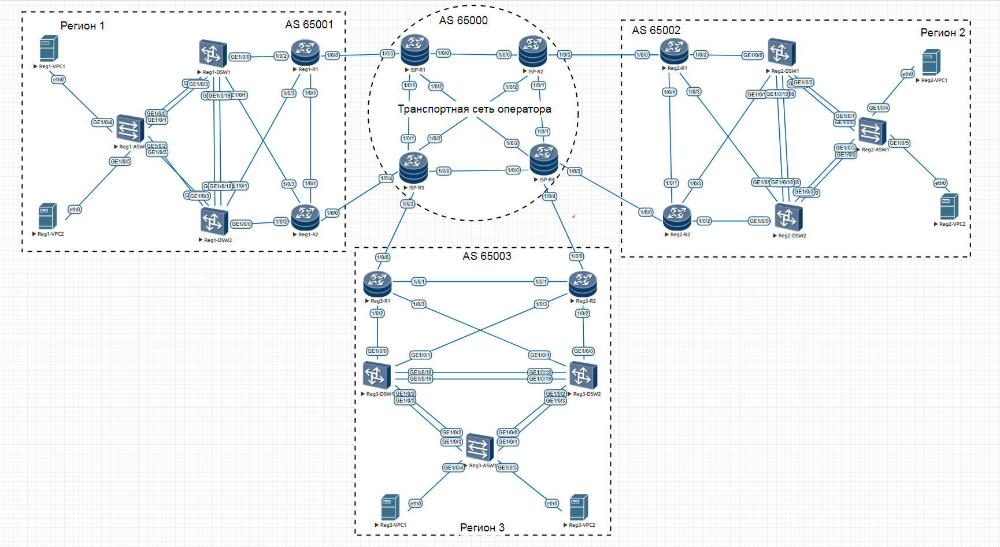

# Построение георазнесённой мультисервисной сети оператора связи

Примерная схема топологии пртведена на рисунке:



# Протоколы L2/L3 (внутри филиала)

## Настройка агрегации линков

На оборудовании H3C агрегация линков называется Bridge-Aggregation Group (BAGG). Настраиваю BAGG100 между DSW-коммутаторами на портах 40GBase, BAGG101 между DSW И ASW на портах 10GBase.

Reg1-DSW1:
```   
interface Bridge-Aggregation100
 description *** to Reg1-DSW2 (BAGG100)
 port link-type trunk
 port trunk permit vlan 10 20 99
 link-aggregation mode dynamic
quit
 
interface Bridge-Aggregation101
 description *** to Reg1-ASW (BAGG1)
 port link-type trunk
 port trunk permit vlan 10 20 99
 link-aggregation mode dynamic
quit

int XGE1/0/49
 description *** to Reg1-ASW1 (XGE1/0/49)
 port link-type trunk
 port trunk permit vlan 10 20 99
 port link-aggregation group 101
quit

int XGE1/0/50
 description *** to Reg1-ASW1 (XGE1/0/50)
 port link-type trunk
 port trunk permit vlan 10 20 99
 port link-aggregation group 101
quit


int FGE1/0/53
 description *** to Reg1-DSW2 (FGE1/0/53)
 port link-type trunk
 port trunk permit vlan 10 20 99
 port link-aggregation group 100
quit

int FGE1/0/54
 description *** to Reg1-DSW2 (FGE1/0/54)
 port link-type trunk
 port trunk permit vlan 10 20 99
 port link-aggregation group 100
quit
```   
На Reg1-DSW2 настройка аналогична.


## Настройка и проверка VRRP

Настройка:

Reg1-DSW1:

```   
interface Vlan-interface99
 ip address 10.1.99.251 24
 vrrp vrid 1 virtual-ip 10.1.99.254
 vrrp vrid 1 priority 100
quit


interface Vlan-interface10
 ip address 10.1.10.251 24
 vrrp vrid 2 virtual-ip 10.1.10.254
 vrrp vrid 2 priority 100
quit

interface Vlan-interface20
 ip address 10.1.20.251 24
 vrrp vrid 3 virtual-ip 10.1.20.254
 vrrp vrid 3 priority 100
quit
```   
Reg1-DSW2:

```   
interface Vlan-interface99
 ip address 10.1.99.252 24
 vrrp vrid 1 virtual-ip 10.1.99.254
 vrrp vrid 1 priority 200
 quit

interface Vlan-interface10
 ip address 10.1.10.252 24
 vrrp vrid 2 virtual-ip 10.1.10.254
 vrrp vrid 2 priority 200
quit

interface Vlan-interface20
 ip address 10.1.20.252 24
 vrrp vrid 3 virtual-ip 10.1.20.254
 vrrp vrid 3 priority 200
quit
```   


Вывод состояния VRRP:

```   
[Reg1-DSW1]disp vrrp verbose
IPv4 Virtual Router Information:
 Running mode : Standard
 Total number of virtual routers : 3
   Interface Vlan-interface10
     VRID             : 2                   Adver Timer  : 100
     Admin Status     : Up                  State        : Backup
     Config Pri       : 100                 Running Pri  : 100
     Preempt Mode     : Yes                 Delay Time   : 0
     Become Master    : 0ms left
     Auth Type        : Not supported
     Version          : 3
     Virtual IP       : 10.1.10.254
     Virtual MAC      : 0000-5e00-0102
     Master IP        : 10.1.10.252

   Interface Vlan-interface20
     VRID             : 3                   Adver Timer  : 100
     Admin Status     : Up                  State        : Backup
     Config Pri       : 100                 Running Pri  : 100
     Preempt Mode     : Yes                 Delay Time   : 0
     Become Master    : 0ms left
     Auth Type        : Not supported
     Version          : 3
     Virtual IP       : 10.1.20.254
     Virtual MAC      : 0000-5e00-0103
     Master IP        : 10.1.20.252

   Interface Vlan-interface99
     VRID             : 1                   Adver Timer  : 100
     Admin Status     : Up                  State        : Backup
     Config Pri       : 100                 Running Pri  : 100
     Preempt Mode     : Yes                 Delay Time   : 0
     Become Master    : 0ms left
     Auth Type        : Not supported
     Version          : 3
     Virtual IP       : 10.1.99.254
     Virtual MAC      : 0000-5e00-0101
     Master IP        : 10.1.99.252

```   


```   
[Reg1-DSW2]disp vrrp verbose
IPv4 Virtual Router Information:
 Running mode : Standard
 Total number of virtual routers : 3
   Interface Vlan-interface10
     VRID             : 2                   Adver Timer  : 100
     Admin Status     : Up                  State        : Master
     Config Pri       : 200                 Running Pri  : 200
     Preempt Mode     : Yes                 Delay Time   : 0
     Auth Type        : Not supported
     Version          : 3
     Virtual IP       : 10.1.10.254
     Virtual MAC      : 0000-5e00-0102
     Master IP        : 10.1.10.252

   Interface Vlan-interface20
     VRID             : 3                   Adver Timer  : 100
     Admin Status     : Up                  State        : Master
     Config Pri       : 200                 Running Pri  : 200
     Preempt Mode     : Yes                 Delay Time   : 0
     Auth Type        : Not supported
     Version          : 3
     Virtual IP       : 10.1.20.254
     Virtual MAC      : 0000-5e00-0103
     Master IP        : 10.1.20.252

   Interface Vlan-interface99
     VRID             : 1                   Adver Timer  : 100
     Admin Status     : Up                  State        : Master
     Config Pri       : 200                 Running Pri  : 200
     Preempt Mode     : Yes                 Delay Time   : 0
     Auth Type        : Not supported
     Version          : 3
     Virtual IP       : 10.1.99.254
     Virtual MAC      : 0000-5e00-0101
     Master IP        : 10.1.99.252
```   


Проверка работы VRRP:

```   
Reg1-VPC1> ping 10.1.10.254
84 bytes from 10.1.10.254 icmp_seq=1 ttl=255 time=3.500 ms
84 bytes from 10.1.10.254 icmp_seq=2 ttl=255 time=2.000 ms
84 bytes from 10.1.10.254 icmp_seq=3 ttl=255 time=2.000 ms
84 bytes from 10.1.10.254 icmp_seq=4 ttl=255 time=2.000 ms
84 bytes from 10.1.10.254 icmp_seq=5 ttl=255 time=2.500 ms
Reg1-VPC1>
```   
Меняю vrrp priority на значение 200 на коммутаторе Reg1-DSW1, на Reg1-DSW2 ставлю в значение 100:


```   
[Reg1-DSW2]interface Vlan-interface99
[Reg1-DSW2-Vlan-interface99]vrrp vrid 1 priority 100

[Reg1-DSW1]interface Vlan-interface99
[Reg1-DSW1-Vlan-interface99]vrrp vrid 1 priority 200
```   

Провека:
```   
[Reg1-DSW1]disp vrrp verbose
IPv4 Virtual Router Information:
 Running mode : Standard
 Total number of virtual routers : 3
   Interface Vlan-interface10
     VRID             : 2                   Adver Timer  : 100
     Admin Status     : Up                  State        : Backup
     Config Pri       : 100                 Running Pri  : 100
     Preempt Mode     : Yes                 Delay Time   : 0
     Become Master    : 0ms left
     Auth Type        : Not supported
     Version          : 3
     Virtual IP       : 10.1.10.254
     Virtual MAC      : 0000-5e00-0102
     Master IP        : 10.1.10.252

   Interface Vlan-interface20
     VRID             : 3                   Adver Timer  : 100
     Admin Status     : Up                  State        : Backup
     Config Pri       : 100                 Running Pri  : 100
     Preempt Mode     : Yes                 Delay Time   : 0
     Become Master    : 0ms left
     Auth Type        : Not supported
     Version          : 3
     Virtual IP       : 10.1.20.254
     Virtual MAC      : 0000-5e00-0103
     Master IP        : 10.1.20.252

   Interface Vlan-interface99
     VRID             : 1                   Adver Timer  : 100
     Admin Status     : Up                  State        : Master
     Config Pri       : 200                 Running Pri  : 200
     Preempt Mode     : Yes                 Delay Time   : 0
     Auth Type        : Not supported
     Version          : 3
     Virtual IP       : 10.1.99.254
     Virtual MAC      : 0000-5e00-0101
     Master IP        : 10.1.99.251
```   


```   
[Reg1-DSW2-Vlan-interface99]disp vrrp verbose
IPv4 Virtual Router Information:
 Running mode : Standard
 Total number of virtual routers : 3
   Interface Vlan-interface10
     VRID             : 2                   Adver Timer  : 100
     Admin Status     : Up                  State        : Master
     Config Pri       : 200                 Running Pri  : 200
     Preempt Mode     : Yes                 Delay Time   : 0
     Auth Type        : Not supported
     Version          : 3
     Virtual IP       : 10.1.10.254
     Virtual MAC      : 0000-5e00-0102
     Master IP        : 10.1.10.252

   Interface Vlan-interface20
     VRID             : 3                   Adver Timer  : 100
     Admin Status     : Up                  State        : Master
     Config Pri       : 200                 Running Pri  : 200
     Preempt Mode     : Yes                 Delay Time   : 0
     Auth Type        : Not supported
     Version          : 3
     Virtual IP       : 10.1.20.254
     Virtual MAC      : 0000-5e00-0103
     Master IP        : 10.1.20.252

   Interface Vlan-interface99
     VRID             : 1                   Adver Timer  : 100
     Admin Status     : Up                  State        : Backup
     Config Pri       : 100                 Running Pri  : 100
     Preempt Mode     : Yes                 Delay Time   : 0
     Become Master    : 0ms left
     Auth Type        : Not supported
     Version          : 3
     Virtual IP       : 10.1.99.254
     Virtual MAC      : 0000-5e00-0101
     Master IP        : 10.1.99.251

```   
Видно, что Master для Vlan-interface99 переместился на Reg1-DSW1.

Настройка на маршрутизаторах (Регион 2) аналогична.


## Настройка Spanning Tree (RSTP)

Рассмотрим настройку RSTP (Rapid Spanning-tree Protocol) на примере Региона 2.

Для предотвращения образования петель поднимем на всех коммутаторах региона RSTP с помощью комманды:
```   
stp mode rstp
stp global enable
```   

Посмотрим состояние портов на всех коммутаторах:

```   
[Reg2-DSW1]disp stp brief
 MST ID   Port                                Role  STP State   Protection
 0        FortyGigE1/0/53                     ROOT  FORWARDING  NONE
 0        FortyGigE1/0/54                     ALTE  DISCARDING  NONE
 0        Ten-GigabitEthernet1/0/49           DESI  FORWARDING  NONE
 0        Ten-GigabitEthernet1/0/50           DESI  FORWARDING  NONE

[Reg2-DSW2]disp stp br
 MST ID   Port                                Role  STP State   Protection
 0        FortyGigE1/0/53                     DESI  FORWARDING  NONE
 0        FortyGigE1/0/54                     DESI  FORWARDING  NONE
 0        Ten-GigabitEthernet1/0/49           DESI  FORWARDING  NONE
 0        Ten-GigabitEthernet1/0/50           DESI  FORWARDING  NONE

[Reg2-ASW1]disp stp br
 MST ID   Port                                Role  STP State   Protection
 0        GigabitEthernet1/0/1                DESI  FORWARDING  NONE
 0        Ten-GigabitEthernet1/0/49           ALTE  DISCARDING  NONE
 0        Ten-GigabitEthernet1/0/50           ROOT  FORWARDING  NONE

[Reg2-ASW2]disp stp br
 MST ID   Port                                Role  STP State   Protection
 0        GigabitEthernet1/0/1                DESI  FORWARDING  NONE
 0        Ten-GigabitEthernet1/0/49           ALTE  DISCARDING  NONE
 0        Ten-GigabitEthernet1/0/50           ROOT  FORWARDING  NONE
```   

Корневым мостом является Reg2-DSW2 (RootPort ID==0.0)

```   
[Reg2-DSW1]disp stp | include RootPort ID
 RootPort ID         : 128.54

[[Reg2-DSW2]disp stp | include RootPort ID
 RootPort ID         : 0.0

[Reg2-ASW1]disp stp | include RootPort
 RootPort ID         : 128.51

[Reg2-ASW2]disp stp | include RootPort
 RootPort ID         : 128.51
```   

Для наглядности DISCARDING порты отмечены на рисунке крестиком:


## Объединение коммутаторов в стек

Технология стэкирования не стандартизована и у каждого вендора своя. У H3C она называется IRF (Intelligent Resilient Framework), у Huawei -- iStack, у Cisco -- Stack.

Объединим DSW-коммутаторы в Регионе 2 в стек.

Reg2-DSW1:
```   
# блокируем интерфейсы
int range fge1/0/53 fge1/0/54
 shut
quit

# добавляем физические порты в виртуальный порт irf-port
irf member 1 renumber 1

irf-port 1/1
port group int fge1/0/53
port group int fge1/0/54
int range fge1/0/53 fge1/0/54

# задаю приоритет == 32, чтобы данный физический коммутатор был первым в стеке
irf member 1 priority 32


undo shutdown

save

# Для активации перезагружаем коммутатор (одновременно с Reg2-DSW2)

irf-port-configuration active
quit
reboot
Y

```   

На Reg2-DSW2 настройка аналогична, но задаю "второй номер" в стеке:
```   
int range fge1/0/53 fge1/0/54
shut
quit

irf member 1 renumber 2

irf-port 1/2
port group int fge1/0/53
port group int fge1/0/54
int range fge1/0/53 fge1/0/54
undo shutdown

save

irf-port-configuration active
quit
reboot
Y            
```   
Коммутаторы проводят выборы мастера. Тот, которой не пройдет, автоматически перезапустится. После завершения перезапуска формируется IRF.

Поскольку первый коммутатор вручную настроен с приоритетом 32 (значение по умолчанию равно 1, чем больше значение, тем выше приоритет, а максимальное значение равно 32), он будет выбран в качестве основного, и DSW2 перезапустится. После перезагрузки настройка IRF будет завершена и системное имя объединяется в Reg2-DSW1..

Присвою имя стекированному коммутатору Reg2-DSW (уже без порядкового номера). На втором коммутаторе (при подключении к нему консолью) имя изменится автоматически.

```   
<Reg2-DSW1>
<Reg2-DSW>
```   

Т.о. у нас теперь один логичесий коммутатор DSW в Регионе 2.
Что видно в настройках:

```   
[Reg2-DSW]disp cur
#
 version 7.1.070, Alpha 7170
#
 sysname Reg2-DSW
#

...

irf-port 1/1
 port group interface FortyGigE1/0/53
 port group interface FortyGigE1/0/54
#
irf-port 2/2
 port group interface FortyGigE2/0/53
 port group interface FortyGigE2/0/54
#
...
```   
Видно, что порты на втором коммутаторе стека отображаются как порты виртуальной "второй интерфейсной карты" (_2_/0/XX), как если бы это был коммутатор с несколькими интерфейсными картами.

Посмотрим, что стало с RSTP:


```   
[Reg2-DSW]disp stp brief
 MST ID   Port                                Role  STP State   Protection
 0        Ten-GigabitEthernet1/0/49           DESI  FORWARDING  NONE
 0        Ten-GigabitEthernet1/0/50           DESI  FORWARDING  NONE
 0        Ten-GigabitEthernet2/0/49           DESI  FORWARDING  NONE
 0        Ten-GigabitEthernet2/0/50           DESI  FORWARDING  NONE

[Reg2-ASW1]disp stp brief
 MST ID   Port                                Role  STP State   Protection
 0        GigabitEthernet1/0/1                DESI  FORWARDING  NONE
 0        Ten-GigabitEthernet1/0/49           ROOT  FORWARDING  NONE
 0        Ten-GigabitEthernet1/0/50           ALTE  DISCARDING  NONE

[Reg2-ASW2]disp stp brief
 MST ID   Port                                Role  STP State   Protection
 0        GigabitEthernet1/0/1                DESI  FORWARDING  NONE
 0        Ten-GigabitEthernet1/0/49           ROOT  FORWARDING  NONE
 0        Ten-GigabitEthernet1/0/50           ALTE  DISCARDING  NONE
```   

Корневым мостом теперь является Reg2-DSW (RootPort ID==0.0), т.е. наш стекированный коммутатор.
```   
[Reg2-DSW]disp stp | include RootPort
 RootPort ID         : 0.0

[Reg2-ASW1]disp stp | include RootPort
 RootPort ID         : 128.50

[Reg2-ASW2]disp stp | include RootPort
 RootPort ID         : 128.50
```   

Далее настраиваю Bridge-Aggregation Groups в LACP.


Теперь нет DISCARDING портов:

```   
[Reg2-DSW]disp stp br
 MST ID   Port                                Role  STP State   Protection
 0        Bridge-Aggregation101               DESI  FORWARDING  NONE
 0        Bridge-Aggregation102               DESI  FORWARDING  NONE

[Reg2-ASW1]disp stp br
 MST ID   Port                                Role  STP State   Protection
 0        Bridge-Aggregation1                 ROOT  FORWARDING  NONE
 0        GigabitEthernet1/0/1                DESI  FORWARDING  NONE

[Reg2-ASW2]disp stp br
 MST ID   Port                                Role  STP State   Protection
 0        Bridge-Aggregation1                 ROOT  FORWARDING  NONE
 0        GigabitEthernet1/0/1                DESI  LEARNING    NONE
[Reg2-ASW2]disp stp br
 MST ID   Port                                Role  STP State   Protection
 0        Bridge-Aggregation1                 ROOT  FORWARDING  NONE
 0        GigabitEthernet1/0/1                DESI  FORWARDING  NONE

```
Т.е. построена схема без петель.

Т.о. получили отказоустойчивую схему L2 с резервирование 1+1 коммутатора уровня ядра/распределения и резервирование каналов 1+1 до коммутаторов уровня доступа.


## Проблемы стекирования

Смоделируем отказ межкоммутаторных линков, образующих стек:

```
[Reg2-DSW]int range fge1/0/53 fge1/0/54
[Reg2-DSW-if-range]shut
%Oct  4 20:16:23:282 2025 Reg2-DSW LLDP/6/LLDP_DELETE_NEIGHBOR: -Slot=2; Nearest bridge agent neighbor deleted on port FortyGigE2/0/53 (IfIndex 566), neighbor's chassis ID is 1ac2-93f6-1100, port ID is FortyGigE1/0/53.
%Oct  4 20:16:23:760 2025 Reg2-DSW IFNET/3/PHY_UPDOWN: Physical state on the interface FortyGigE1/0/53 changed to down.
%Oct  4 20:16:23:761 2025 Reg2-DSW IFNET/5/LINK_UPDOWN: Line protocol state on the interface FortyGigE1/0/53 changed to down.
%Oct  4 20:16:23:761 2025 Reg2-DSW IFNET/3/PHY_UPDOWN: Physical state on the interface FortyGigE2/0/53 changed to down.
%Oct  4 20:16:23:762 2025 Reg2-DSW IFNET/5/LINK_UPDOWN: Line protocol state on the interface FortyGigE2/0/53 changed to down.
%Oct  4 20:16:23:318 2025 Reg2-DSW LLDP/6/LLDP_DELETE_NEIGHBOR: -Slot=2; Nearest bridge agent neighbor deleted on port FortyGigE2/0/54 (IfIndex 567), neighbor's chassis ID is 1ac2-93f6-1100, port ID is FortyGigE1/0/54.
%Oct  4 20:16:23:789 2025 Reg2-DSW STM/3/STM_LINK_DOWN: IRF port 1 went down.
%Oct  4 20:16:23:790 2025 Reg2-DSW DEV/3/BOARD_REMOVED: Board was removed from slot 2, type is H3C S6850.
%Oct  4 20:16:23:800 2025 Reg2-DSW LAGG/6/LAGG_INACTIVE_NODEREMOVE: Member port XGE2/0/49 of aggregation group BAGG101 changed to the inactive state, because the card that hosts the port was absent.
%Oct  4 20:16:23:819 2025 Reg2-DSW LAGG/6/LAGG_INACTIVE_NODEREMOVE: Member port XGE2/0/50 of aggregation group BAGG102 changed to the inactive state, because the card that hosts the port was absent.
%Oct  4 20:16:23:845 2025 Reg2-DSW IFNET/3/PHY_UPDOWN: Physical state on the interface FortyGigE1/0/54 changed to down.
%Oct  4 20:16:23:848 2025 Reg2-DSW IFNET/5/LINK_UPDOWN: Line protocol state on the interface FortyGigE1/0/54 changed to down.
```

Стэк развалился, оба коммутатора считают себя главными, в сети два устройства с одинаковым именем.

Нижн диагностика с первого коммутатора стека:
```
<Reg2-DSW>disp irf
MemberID    Role    Priority  CPU-Mac         Description
 *+1        Master  32        1ac2-93f6-1104  ---
--------------------------------------------------
 * indicates the device is the master.
 + indicates the device through which the user logs in.

 The bridge MAC of the IRF is: 1ac2-93f6-1100
 Auto upgrade                : yes
 Mac persistent              : 6 min
 Domain ID                   : 0
<Reg2-DSW>disp irf link
Member 1
 IRF Port  Interface                             Status
 1         FortyGigE1/0/53                       DOWN
           FortyGigE1/0/54                       DOWN
 2         disable                               --
<Reg2-DSW>disp irf conf
<Reg2-DSW>disp irf configuration
 MemberID NewID    IRF-Port1                     IRF-Port2
 1        1        FortyGigE1/0/53               disable
                   FortyGigE1/0/54
```

И со второго:
```
<Reg2-DSW>disp irf
MemberID    Role    Priority  CPU-Mac         Description
 *+2        Master  1         1ac2-82c2-1004  ---
--------------------------------------------------
 * indicates the device is the master.
 + indicates the device through which the user logs in.

 The bridge MAC of the IRF is: 1ac2-93f6-1100
 Auto upgrade                : yes
 Mac persistent              : 6 min
 Domain ID                   : 0
<Reg2-DSW>disp irf link
Member 2
 IRF Port  Interface                             Status
 1         disable                               --
 2         FortyGigE2/0/53                       DOWN
           FortyGigE2/0/54                       DOWN
<Reg2-DSW>disp irf conf
<Reg2-DSW>disp irf configuration
 MemberID NewID    IRF-Port1                     IRF-Port2
 2        2        disable                       FortyGigE2/0/53
                                                 FortyGigE2/0/54
```


Также аварийные сообщения с коммутаторов уровня доступа:
```
[Reg2-ASW1]
%Oct  4 20:19:30:851 2025 Reg2-ASW1 LAGG/6/LAGG_INACTIVE_PHYSTATE: Member port XGE1/0/50 of aggregation group BAGG1 changed to the inactive state, because the physical state of the port is down.
%Oct  4 20:19:30:853 2025 Reg2-ASW1 IFNET/3/PHY_UPDOWN: Physical state on the interface Ten-GigabitEthernet1/0/50 changed to down.
%Oct  4 20:19:30:853 2025 Reg2-ASW1 IFNET/5/LINK_UPDOWN: Line protocol state on the interface Ten-GigabitEthernet1/0/50 changed to down.


[Reg2-ASW2]
%Oct  4 20:19:31:553 2025 Reg2-ASW2 LAGG/6/LAGG_INACTIVE_PHYSTATE: Member port XGE1/0/50 of aggregation group BAGG1 changed to the inactive state, because the physical state of the port is down.
%Oct  4 20:19:31:555 2025 Reg2-ASW2 IFNET/3/PHY_UPDOWN: Physical state on the interface Ten-GigabitEthernet1/0/50 changed to down.
%Oct  4 20:19:31:555 2025 Reg2-ASW2 IFNET/5/LINK_UPDOWN: Line protocol state on the interface Ten-GigabitEthernet1/0/50 changed to down.
```

Восстановим стек:

```
[Reg2-DSW-if-range]undo shut
%Oct  4 20:33:35:573 2025 Reg2-DSW LAGG/6/LAGG_LACP_RECEIVE_TIMEOUT: -Slot=2; LACPDU reception timed out on member port XGE2/0/50 in aggregation group BAGG102.
%Oct  4 20:33:37:113 2025 Reg2-DSW LLDP/6/LLDP_CREATE_NEIGHBOR: Nearest bridge agent neighbor created on port FortyGigE1/0/54 (IfIndex 55), neighbor's chassis ID is 1ac2-93f6-1100, port ID is FortyGigE2/0/54.
%Oct  4 20:33:37:124 2025 Reg2-DSW LAGG/6/LAGG_ACTIVE: Member port XGE2/0/50 of aggregation group BAGG102 changed to the active state.
%Oct  4 20:33:35:890 2025 Reg2-DSW LLDP/6/LLDP_CREATE_NEIGHBOR: -Slot=2; Nearest bridge agent neighbor created on port Ten-GigabitEthernet2/0/50 (IfIndex 563), neighbor's chassis ID is 1ac3-6812-1400, port ID is Ten-GigabitEthernet1/0/50.
%Oct  4 20:33:37:466 2025 Reg2-DSW IFNET/3/PHY_UPDOWN: Physical state on the interface FortyGigE2/0/53 changed to up.
%Oct  4 20:33:35:902 2025 Reg2-DSW LLDP/6/LLDP_CREATE_NEIGHBOR: -Slot=2; Nearest bridge agent neighbor created on port FortyGigE2/0/54 (IfIndex 567), neighbor's chassis ID is 1ac2-93f6-1100, port ID is FortyGigE1/0/54.
%Oct  4 20:33:37:471 2025 Reg2-DSW IFNET/5/LINK_UPDOWN: Line protocol state on the interface FortyGigE2/0/53 changed to up.
%Oct  4 20:33:37:472 2025 Reg2-DSW IFNET/3/PHY_UPDOWN: Physical state on the interface FortyGigE2/0/54 changed to up.
%Oct  4 20:33:37:476 2025 Reg2-DSW IFNET/5/LINK_UPDOWN: Line protocol state on the interface FortyGigE2/0/54 changed to up.
%Oct  4 20:33:37:478 2025 Reg2-DSW IFNET/3/PHY_UPDOWN: Physical state on the interface Ten-GigabitEthernet2/0/50 changed to up.
%Oct  4 20:33:37:480 2025 Reg2-DSW IFNET/5/LINK_UPDOWN: Line protocol state on the interface Ten-GigabitEthernet2/0/50 changed to up.
%Oct  4 20:33:37:671 2025 Reg2-DSW HA/5/HA_BATCHBACKUP_STARTED: Batch backup of standby board in slot 2 started.
%Oct  4 20:33:37:774 2025 Reg2-DSW IFNET/3/PHY_UPDOWN: Physical state on the interface Ten-GigabitEthernet2/0/49 changed to up.
%Oct  4 20:33:36:185 2025 Reg2-DSW LAGG/6/LAGG_LACP_RECEIVE_TIMEOUT: -Slot=2; LACPDU reception timed out on member port XGE2/0/49 in aggregation group BAGG101.
%Oct  4 20:33:36:191 2025 Reg2-DSW LLDP/6/LLDP_CREATE_NEIGHBOR: -Slot=2; Nearest bridge agent neighbor created on port Ten-GigabitEthernet2/0/49 (IfIndex 562), neighbor's chassis ID is 1ac3-5bae-1300, port ID is Ten-GigabitEthernet1/0/50.
%Oct  4 20:33:37:799 2025 Reg2-DSW LAGG/6/LAGG_ACTIVE: Member port XGE2/0/49 of aggregation group BAGG101 changed to the active state.
%Oct  4 20:33:37:814 2025 Reg2-DSW IFNET/5/LINK_UPDOWN: Line protocol state on the interface Ten-GigabitEthernet2/0/49 changed to up.
%Oct  4 20:33:38:675 2025 Reg2-DSW HA/5/HA_BATCHBACKUP_FINISHED: Batch backup of standby board in slot 2 has finished.
%Oct  4 20:33:57:258 2025 Reg2-DSW LLDP/6/LLDP_CREATE_NEIGHBOR: -Slot=2; Nearest bridge agent neighbor created on port FortyGigE2/0/53 (IfIndex 566), neighbor's chassis ID is 1ac2-93f6-1100, port ID is FortyGigE1/0/53.
```


Диагностика:

```
<Reg2-DSW>disp irf
MemberID    Role    Priority  CPU-Mac         Description
 *+1        Master  32        1ac2-93f6-1104  ---
   2        Standby 1         1ac2-82c2-1004  ---
--------------------------------------------------
 * indicates the device is the master.
 + indicates the device through which the user logs in.

 The bridge MAC of the IRF is: 1ac2-93f6-1100
 Auto upgrade                : yes
 Mac persistent              : 6 min
 Domain ID                   : 0
<Reg2-DSW>disp irf link
Member 1
 IRF Port  Interface                             Status
 1         FortyGigE1/0/53                       UP
           FortyGigE1/0/54                       UP
 2         disable                               --
Member 2
 IRF Port  Interface                             Status
 1         disable                               --
 2         FortyGigE2/0/53                       UP
           FortyGigE2/0/54                       UP

<Reg2-DSW>disp irf configuration
 MemberID NewID    IRF-Port1                     IRF-Port2
 1        1        FortyGigE1/0/53               disable
                   FortyGigE1/0/54
 2        2        disable                       FortyGigE2/0/53
                                                 FortyGigE2/0/54
```

На восстановление стека в лабораторных условиях ушло две минуты, что достаточно много по времени. Т.о. даже при случайной блокировке портов, например ошибка ввода/скрипта при проведении работ, возможна аварийная ситуации высокого приоритета.

Ниже рассмотрим, какие средства есть для защиты стека.

## Настройка BFD MAD

Разделение IRF происходит, когда фабрика IRF распадается на несколько фабрик IRF из-за сбоев в работе каналов IRF. Разделённые фабрики IRF работают с одним и тем же IP-адресом.
Такое разделение приводит к проблемам маршрутизации и пересылки в сети.

Для защиты стека IRF у Н3С предусмотрено четыре механизма Multi-active detection (MAD):
- LACP MAD -- требуется третье устройство, подключенное к обоим коммутаторам;
- BFD MAD -- на уровне L2 создаётся прямое подключение между коммутаторами;
- ARP MAD -- через запрос Gratuitous ARP, с идентификатором активного коммутатора;	
- ND MAD -- с помощью пакетов NS (протокол Neighbor Discovery IPv6).

У каждого из этих механизмов есть свои преимущества и недостатки. Так, у LACP MAD высокая скорость обнаружения, не требуется дополнительного линка, но требуется промежуточное устройство, работающее по LACP. У BFD MAD также высокая скорость обнаружения, но требуется дополнительный канал между устройствами фабрики IRF. У ARP MAD низкая скорость обнаружения, но не требуются дополнительные устройства и каналы. У ND MAD скорость обнаружения ниже, чем у LACP и BFD MAD, не требуются доп. устройства и каналы, но используются сценарии IPv6.

Реализую BFD MAD. Для этого добавлю дополнительный линк между коммутаторами (GE1/0/48 -- GE2/0/48).
Схема представлена на рисунке:


Настройка:

```   
vlan 999
 description FOR_BFD_MAD_ONLY
 port GE1/0/48 GE2/0/48
quit

int Vlan-interface999
 mad bfd enable
 mad ip address 192.168.99.1 24 member 1
 mad ip address 192.168.99.2 24 member 2
quit


# отключаю STP на портах BFD, т.к. spanning-tree и BFD MAD взаимоисключающие:

int GE1/0/48
 undo stp enable
quit

int GE2/0/48
 undo stp enable
quit

```   

Проверка:
```   
[Reg2-DSW]disp bfd session
 Total sessions: 1     Up sessions: 0     Init mode: Active

 IPv4 session working in control packet mode:

 LD/RD            SourceAddr      DestAddr        State  Holdtime    Interface
 32833/0          192.168.99.1    192.168.99.2    Down      /        Vlan999
[Reg2-DSW]disp mad verbose
Multi-active recovery state: No
Excluded ports (user-configured):
Excluded ports (system-configured):
  IRF physical interfaces:
    FortyGigE1/0/53
    FortyGigE1/0/54
    FortyGigE2/0/53
    FortyGigE2/0/54
  BFD MAD interfaces:
    Vlan-interface999
MAD ARP disabled.
MAD ND disabled.
MAD LACP disabled.
MAD BFD enabled interface: Vlan-interface999
  MAD status                 : Normal
  Member ID   MAD IP address       Neighbor   MAD status
  1           192.168.99.1/24      2          Normal
  2           192.168.99.2/24      1          Normal
```   

Отключу порты стека.
IRF разделяется, MAD обнаруживает разделение irf, отключает все сетевые порты на втором коммутаторе, второй коммутатор не работает, первый коммутатор работает. Статус сеанса bfd ненадолго изменится с "Down" на "Up", а затем снова изменится на "Down", так что статус сеанса bfd, который мы видим, всегда будет "Down" Статус disp mad изменится с "Normal" на "Faulty".

```   
[Reg2-DSW]disp bfd sess
 Total sessions: 1     Up sessions: 0     Init mode: Active

 IPv4 session working in control packet mode:

 LD/RD            SourceAddr      DestAddr        State  Holdtime    Interface
 32833/0          192.168.99.1    192.168.99.2    Down      /        Vlan999

[Reg2-DSW]disp mad verbose
Multi-active recovery state: No
Excluded ports (user-configured):
Excluded ports (system-configured):
  IRF physical interfaces:
    FortyGigE1/0/53
    FortyGigE1/0/54
  BFD MAD interfaces:
    Vlan-interface999
MAD ARP disabled.
MAD ND disabled.
MAD LACP disabled.
MAD BFD enabled interface: Vlan-interface999
  MAD status                 : Faulty
  Member ID   MAD IP address       Neighbor   MAD status
  1           192.168.99.1/24      2          Faulty

```   
Конфигурация доступна по ссылке: [ссылке](./cfg/Reg2-DSW-H3C-BFD-MAD.cfg)

## Настройка M-LAG

В Регионе 3 применю технологию объединения коммутатров M-LAG. Данная технология избавлена от недостатком классического стекирования, т.к. control-plane разнесён между коммутаторами. 

Проверка SVG-картинки:


```   
```   


```   
```   


```   
```   


```   
```   


```   
```   


```   
```   


