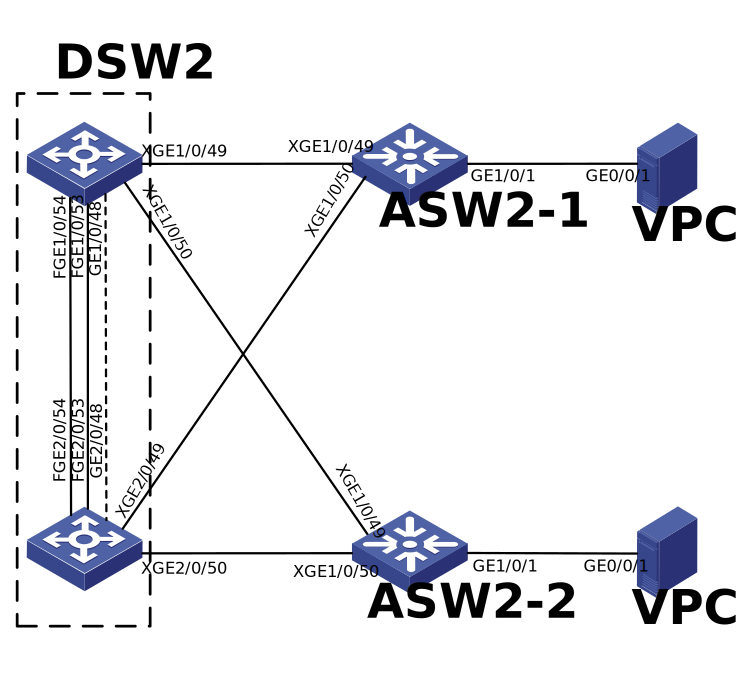
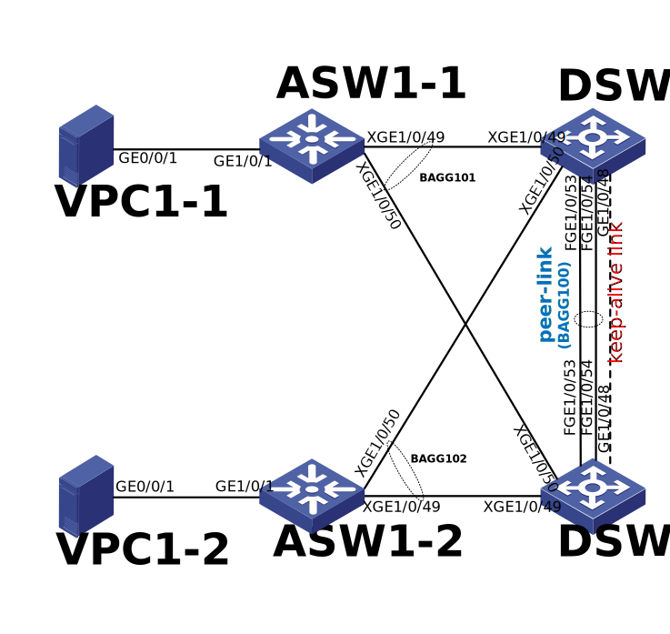

# Построение георазнесённой мультисервисной сети оператора связи

Данная работа является курсовым проектом по курсу "Network Engineer. Professional" компании OTUS.

Проектная работа реализована в среде H3C Cloud Lab на оборудовании H3C. Выбор оборудования обусловлен необходимостью анализа конфигураций оборудования H3C, а выбор среды &mdash; более низкими требованиями к ресурсам, чем у EVE-NG.

Автор по своей профессиональной деятельности не занимается настройкой и эксплуатацией сетевого оборудования более 15-ти лет. Ранее автор не имел опыта работы и настройки оборудования H3C. 

## Оглавление
1. [Цель](#цель)
2. [Задачи](#задачи)
3. [Сетевая топология](#Сетевая-топология)
4. [План IP адресации](#План-IP-адресации)
5. [Протоколы L2-L3 внутри региона](#Протоколы-L2-L3-внутри-региона)

    5.1. [Настройка агрегации линков](#Настройка-агрегации-линков)
	
    5.2. [Настройка VRRP](#Настройка-VRRP)
	
    5.3. [Настройка Spanning Tree](#Настройка-Spanning-Tree)
   
    5.4. [Объединение коммутаторов в стек](#Объединение-коммутаторов-в-стек)
   
    5.5. [Проблемы стекирования](#Проблемы-стекирования)
   
    5.6. [Настройка BFD MAD](#Настройка-BFD-MAD)
   
    5.7. [Настройка M-LAG](#Настройка-M-LAG)
   
    5.8. [Настройка OSPF](#Настройка-OSPF)
   
6. [Протоколы L3 транспортной сети](#Протоколы-L3-транспортной-сети)

    6.1. [Настройка IS-IS](#Настройка-IS-IS)

    6.2. [Настройка eBGP](#Настройка-EBGP)
	
    6.3. [Настройка iBGP](#Настройка-iBGP)

    6.4. [Настройка GRE](#Настройка-GRE)

 7. [Выводы](#Выводы)

## Цель

Разработка архитектуры георазнесённой мультисервисной сети оператора связи с проработкой транспортной и региональных составляющих.
## Задачи

- Проектирование транспортной сети оператора связи
- Проектирование сетей региональных филиалов
- Проектирование гибкого адресного пространства
- Проектирование сетевых протоколов, обеспечивающих мультисервисность, отказоустойчивость и быструю сходимость 

## Сетевая топология

Топология сети приведена на рисунке (рекомендуется открыть рисунок в отдельной вкладке/окне).


В данной топологии приведена упрощённая модель георазнесённой сети оператора сотовой связи, состоящей из двух регионов и транспортной сети. В каждом регионе есть два сервиса:
- Radio &mdash; обеспечивает связность сетевых элементов, таких как BSC, RNC, eNodeB с SGSN/SGW (их роль выпоняют VPC);
- Tech &mdash; технологическая сеть оператора.

В каждом регионе применена упрощённая трёх-уровневая архитектура Cisco-сети, где уровень ядра и распределения объединены в один уровень (коммутаторы DSW), уровень доступа оставлен без изменений (коммутаторы ASW).

Транспортная сеть состоит из четырёх маршрутизаторов.

Данные упрощения применены для возможности реализации в лабораторной среде: лишние элементы потребляют память и производительность ядер процессора хост-системы.

Принятые графические обозначения:

Маршрутизатор транспортной сети:


Маршрутизатор региона:


Коммутатор уровня ядра/распределения региона:


Коммутатор уровня доступа региона:


Loopback-интерфейсы сетевых элементов:


## План IP адресации

### Таблица распределения адресного пространства

| Net | Vlan | Name | Description |
| ------- | ------- | ------- | ------- |
| 10.0.0.0/16 | - | Сеть оператора | Транспорт |
| 10.1.0.0/16 | - |  | Регион 1 |
| 10.2.0.0/16 | - |  | Регион 2 |
| 10.0.0.0/24 | - | Пространство для интерконнекта | Транспорт |
| 10.1.0.0/24 | - |  | Регион 1 |
| 10.2.0.0/24 | - |  | Регион 2 |
| 10.1.10.0/24 | 10 | VLAN10 | Регион 1 |
| 10.2.10.0/24 | 10 |  | Регион 2 |
| 10.1.20.0/24 | 20 | VLAN20 | Регион 1 |
| 10.2.20.0/24 | 20 |  | Регион 2 |
| 10.1.99.0/24 | 99 | VLAN99, управление коммутаторами | Регион 1 |
| 10.2.99.0/24 | 99 |  | Регион 2 |

### Таблица распределения IP-адресов

| HostName | Loopback | Port | IP-address | Network | Location | Description | Комментарий |
| ------- | ------- | ------- | ------- | ------- | ------- | ------- | ------- |
|  |  |  |  |  |  |  |  |
| R1 | 1.1.1.1 | GE0/0 | 10.0.0.0 | 10.0.0.0/31 | Транспорт | to R3 (GE0/0) |  |
| R1 | 1.1.1.1 | GE0/1 | 10.0.0.2 | 10.0.0.2/31 | Транспорт | to R4 (GE0/0) |  |
| R1 | 1.1.1.1 | GE0/2 | 10.0.0.4 | 10.0.0.4.31 | Транспорт | to R1-1 (GE0/0) |  |
| R2 | 2.2.2.2 | GE0/0 | 10.0.0.6 | 10.0.0.6/31 | Транспорт | to R3 (GE0/1) |  |
| R2 | 2.2.2.2 | GE0/1 | 10.0.0.8 | 10.0.0.8/31 | Транспорт | to R4 (GE0/1) |  |
| R2 | 2.2.2.2 | GE0/2 | 10.0.0.10 | 10.0.0.10/31 | Транспорт | to R2-1(GE0/0) |  |
| R3 | 3.3.3.3 | GE0/0 | 10.0.0.1 | 10.0.0.0/31 | Транспорт | to R1 (GE0/0) |  |
| R3 | 3.3.3.3 | GE0/1 | 10.0.0.7 | 10.0.0.6/31 | Транспорт | to R2 (GE0/0) |  |
| R3 | 3.3.3.3 | GE0/2 | 10.0.0.12 | 10.0.0.12/31 | Транспорт | to R4 (GE0/0) |  |
| R4 | 4.4.4.4 | GE0/0 | 10.0.0.3 | 10.0.0.2/31 | Транспорт | to R1 (GE0/1) |  |
| R4 | 4.4.4.4 | GE0/1 | 10.0.0.9 | 10.0.0.8/31 | Транспорт | to R2 (GE0/1) |  |
| R4 | 4.4.4.4 | GE0/2 | 10.0.0.13 | 10.0.0.12.31 | Транспорт | to R3 (GE0/2) |  |
| R1-1 | 11.11.11.11 | GE0/0 | 10.0.0.5 | 10.0.0.4/31 | Регион 1 | to R1 (GE0/2) |  |
| R1-1 | 11.11.11.11 | GE0/1 | 10.1.0.0 | 10.1.0.0/31 | Регион 1 | to DSW1-1 (GE1/0/1) |  |
| R1-1 | 11.11.11.11 | GE0/2 | 10.1.0.2 | 10.1.0.2/31 | Регион 1 | to DSW1-2 (GE1/0/2) |  |
| DSW1-1 | 111.111.111.111 | GE1/0/1 | 10.1.0.1 | 10.1.0.0/31 | Регион 1 | to R1-1 (GE0/1) |  |
| DSW1-2 | 112.112.112.112 | GE1/0/1 | 10.1.0.3 | 10.1.0.2/31 | Регион 1 | to R1-1 (GE0/2) |  |
| R2-1 | 21.21.21.21 | GE0/0 | 10.0.0.11 | 10.0.0.10/31 | Регион 2 | to R2 (GE0/2) |  |
| R2-1 | 21.21.21.21 | RAGG1 | 10.2.0.0 | 10.2.0.0/31 | Регион 2 | to DSW2 (BAGG1) |  |
| DSW2 | 121.121.121.121 | BAGG1 | 10.2.0.1 | 10.2.0.0/31 | Регион 2 | to R2-1 (RAGG1) |  |
| DSW1-1, DSW1-2 | - | - | 10.1.10.254 | 10.1.10.0/24 | Регион 1 |  | VRRP VLAN10 |
| DSW1-1, DSW1-2 | - | - | 10.1.20.254 | 10.1.20.0/24 | Регион 1 |  | VRRP VLAN20 |
| DSW1-1, DSW1-2 | - | - | 10.1.99.254 | 10.1.99.0/24 | Регион 1 |  | VRRP VLAN99 |
| DSW1-1 |  | Vlan10 | 10.1.10.251 | 10.1.10.0/24 | Регион 1 |  | VLAN10 |
| DSW1-2 |  | Vlan10 | 10.1.10.252 | 10.1.10.0/24 | Регион 1 |  | VLAN10 |
| DSW1-1 |  | Vlan20 | 10.1.20.251 | 10.1.20.0/24 | Регион 1 |  | VLAN20 |
| DSW1-2 |  | Vlan20 | 10.1.20.252 | 10.1.20.0/24 | Регион 1 |  | VLAN20 |
| DSW1-1 |  | Vlan99 | 10.1.99.251 | 10.1.99.0/24 | Регион 1 |  | VLAN99 |
| DSW1-2 |  | Vlan99 | 10.1.99.252 | 10.1.99.0/24 | Регион 1 |  | VLAN99 |
| DSW2 |  | Vlanif99 | 10.2.99.101 | 10.2.99.0/24 | Регион 2 |  | VLAN99 |
| ASW2-1 |  | Vlanif99 | 10.2.99.201 | 10.2.99.0/24 | Регион 2 |  | VLAN99 |
| ASW2-2 |  | Vlanif99 | 10.2.99.202 | 10.2.99.0/24 | Регион 2 |  | VLAN99 |
| VPC1-1 | - | eth0 | 10.1.10.1 | 10.1.10.0/24 | Регион 1 |  | VLAN10 |
| VPC1-2 | - | eth0 | 10.1.20.2 | 10.1.20.0/24 | Регион 1 |  | VLAN20 |
| VPC2-1 | - | eth0 | 10.2.10.1 | 10.2.10.0/24 | Регион 2 |  | VLAN10 |
| VPC2-2 | - | eth0 | 10.2.20.2 | 10.2.20.0/24 | Регион 2 |  | VLAN20 |

## Протоколы L2-L3 внутри региона

### Настройка агрегации линков

На оборудовании H3C агрегация линков называется Bridge-Aggregation Group (BAGG) для коммутаторов
и Router-Aggregation Group (RAGG) для маршрутизаторов. Совместима с Ether-Trunk от Huawei и
Port-Channel от Cisco. Настраиваю BAGG100 между DSW-коммутаторами на портах 40GBase, BAGG101 между DSW И ASW на портах 10GBase.


<details>
<summary>  DSW1-1: </summary>

```   
interface Bridge-Aggregation100
 description to DSW1-2 (BAGG100)
 port link-type trunk
 port trunk permit vlan 10 20 99
 link-aggregation mode dynamic
quit
 
interface Bridge-Aggregation101
 description to ASW1-1 (BAGG1)
 port link-type trunk
 port trunk permit vlan 10 20 99
 link-aggregation mode dynamic
quit

int XGE1/0/49
 description to ASW1-1 (XGE1/0/49)
 port link-type trunk
 port trunk permit vlan 10 20 99
 port link-aggregation group 101
quit

int XGE1/0/50
 description to ASW1-1 (XGE1/0/50)
 port link-type trunk
 port trunk permit vlan 10 20 99
 port link-aggregation group 101
quit


int FGE1/0/53
 description to DSW1-2 (FGE1/0/53)
 port link-type trunk
 port trunk permit vlan 10 20 99
 port link-aggregation group 100
quit

int FGE1/0/54
 description to DSW1-2 (FGE1/0/54)
 port link-type trunk
 port trunk permit vlan 10 20 99
 port link-aggregation group 100
quit
```   

</details>

### Настройка VRRP

Настройка:

<details>
<summary>  DSW1-1: </summary>

```   
interface Vlan-interface99
 ip address 10.1.99.251 24
 vrrp vrid 1 virtual-ip 10.1.99.254
 vrrp vrid 1 priority 100
quit


interface Vlan-interface10
 ip address 10.1.10.251 24
 vrrp vrid 2 virtual-ip 10.1.10.254
 vrrp vrid 2 priority 100
quit

interface Vlan-interface20
 ip address 10.1.20.251 24
 vrrp vrid 3 virtual-ip 10.1.20.254
 vrrp vrid 3 priority 100
quit
```   

</details>

<details>
<summary>  DSW1-2: </summary>

```   
interface Vlan-interface99
 ip address 10.1.99.252 24
 vrrp vrid 1 virtual-ip 10.1.99.254
 vrrp vrid 1 priority 200
 quit

interface Vlan-interface10
 ip address 10.1.10.252 24
 vrrp vrid 2 virtual-ip 10.1.10.254
 vrrp vrid 2 priority 200
quit

interface Vlan-interface20
 ip address 10.1.20.252 24
 vrrp vrid 3 virtual-ip 10.1.20.254
 vrrp vrid 3 priority 200
quit
```   

</details>


Вывод состояния VRRP:


<details>
<summary> Состояние VRRP </summary>

```   
[DSW1-1]disp vrrp verbose
IPv4 Virtual Router Information:
 Running mode : Standard
 Total number of virtual routers : 3
   Interface Vlan-interface10
     VRID             : 2                   Adver Timer  : 100
     Admin Status     : Up                  State        : Backup
     Config Pri       : 100                 Running Pri  : 100
     Preempt Mode     : Yes                 Delay Time   : 0
     Become Master    : 0ms left
     Auth Type        : Not supported
     Version          : 3
     Virtual IP       : 10.1.10.254
     Virtual MAC      : 0000-5e00-0102
     Master IP        : 10.1.10.252

   Interface Vlan-interface20
     VRID             : 3                   Adver Timer  : 100
     Admin Status     : Up                  State        : Backup
     Config Pri       : 100                 Running Pri  : 100
     Preempt Mode     : Yes                 Delay Time   : 0
     Become Master    : 0ms left
     Auth Type        : Not supported
     Version          : 3
     Virtual IP       : 10.1.20.254
     Virtual MAC      : 0000-5e00-0103
     Master IP        : 10.1.20.252

   Interface Vlan-interface99
     VRID             : 1                   Adver Timer  : 100
     Admin Status     : Up                  State        : Backup
     Config Pri       : 100                 Running Pri  : 100
     Preempt Mode     : Yes                 Delay Time   : 0
     Become Master    : 0ms left
     Auth Type        : Not supported
     Version          : 3
     Virtual IP       : 10.1.99.254
     Virtual MAC      : 0000-5e00-0101
     Master IP        : 10.1.99.252


[DSW1-2]disp vrrp verbose
IPv4 Virtual Router Information:
 Running mode : Standard
 Total number of virtual routers : 3
   Interface Vlan-interface10
     VRID             : 2                   Adver Timer  : 100
     Admin Status     : Up                  State        : Master
     Config Pri       : 200                 Running Pri  : 200
     Preempt Mode     : Yes                 Delay Time   : 0
     Auth Type        : Not supported
     Version          : 3
     Virtual IP       : 10.1.10.254
     Virtual MAC      : 0000-5e00-0102
     Master IP        : 10.1.10.252

   Interface Vlan-interface20
     VRID             : 3                   Adver Timer  : 100
     Admin Status     : Up                  State        : Master
     Config Pri       : 200                 Running Pri  : 200
     Preempt Mode     : Yes                 Delay Time   : 0
     Auth Type        : Not supported
     Version          : 3
     Virtual IP       : 10.1.20.254
     Virtual MAC      : 0000-5e00-0103
     Master IP        : 10.1.20.252

   Interface Vlan-interface99
     VRID             : 1                   Adver Timer  : 100
     Admin Status     : Up                  State        : Master
     Config Pri       : 200                 Running Pri  : 200
     Preempt Mode     : Yes                 Delay Time   : 0
     Auth Type        : Not supported
     Version          : 3
     Virtual IP       : 10.1.99.254
     Virtual MAC      : 0000-5e00-0101
     Master IP        : 10.1.99.252
```   

</details>

Проверка работы VRRP:

```   
VPC1-1> ping 10.1.10.254
84 bytes from 10.1.10.254 icmp_seq=1 ttl=255 time=3.500 ms
84 bytes from 10.1.10.254 icmp_seq=2 ttl=255 time=2.000 ms
84 bytes from 10.1.10.254 icmp_seq=3 ttl=255 time=2.000 ms
84 bytes from 10.1.10.254 icmp_seq=4 ttl=255 time=2.000 ms
84 bytes from 10.1.10.254 icmp_seq=5 ttl=255 time=2.500 ms
VPC1-1>
```   
Меняю vrrp priority на значение 200 на коммутаторе DSW1-1, на DSW1-2 ставим в значение 100:


```   
[DSW1-2]interface Vlan-interface99
[DSW1-2-Vlan-interface99]vrrp vrid 1 priority 100

[DSW1-1]interface Vlan-interface99
[DSW1-1-Vlan-interface99]vrrp vrid 1 priority 200
```   

<details>
<summary> Проверка: </summary>

```   
[DSW1-1]disp vrrp verbose
IPv4 Virtual Router Information:
 Running mode : Standard
 Total number of virtual routers : 3
   Interface Vlan-interface10
     VRID             : 2                   Adver Timer  : 100
     Admin Status     : Up                  State        : Backup
     Config Pri       : 100                 Running Pri  : 100
     Preempt Mode     : Yes                 Delay Time   : 0
     Become Master    : 0ms left
     Auth Type        : Not supported
     Version          : 3
     Virtual IP       : 10.1.10.254
     Virtual MAC      : 0000-5e00-0102
     Master IP        : 10.1.10.252

   Interface Vlan-interface20
     VRID             : 3                   Adver Timer  : 100
     Admin Status     : Up                  State        : Backup
     Config Pri       : 100                 Running Pri  : 100
     Preempt Mode     : Yes                 Delay Time   : 0
     Become Master    : 0ms left
     Auth Type        : Not supported
     Version          : 3
     Virtual IP       : 10.1.20.254
     Virtual MAC      : 0000-5e00-0103
     Master IP        : 10.1.20.252

   Interface Vlan-interface99
     VRID             : 1                   Adver Timer  : 100
     Admin Status     : Up                  State        : Master
     Config Pri       : 200                 Running Pri  : 200
     Preempt Mode     : Yes                 Delay Time   : 0
     Auth Type        : Not supported
     Version          : 3
     Virtual IP       : 10.1.99.254
     Virtual MAC      : 0000-5e00-0101
     Master IP        : 10.1.99.251

[DSW1-2-Vlan-interface99]disp vrrp verbose
IPv4 Virtual Router Information:
 Running mode : Standard
 Total number of virtual routers : 3
   Interface Vlan-interface10
     VRID             : 2                   Adver Timer  : 100
     Admin Status     : Up                  State        : Master
     Config Pri       : 200                 Running Pri  : 200
     Preempt Mode     : Yes                 Delay Time   : 0
     Auth Type        : Not supported
     Version          : 3
     Virtual IP       : 10.1.10.254
     Virtual MAC      : 0000-5e00-0102
     Master IP        : 10.1.10.252

   Interface Vlan-interface20
     VRID             : 3                   Adver Timer  : 100
     Admin Status     : Up                  State        : Master
     Config Pri       : 200                 Running Pri  : 200
     Preempt Mode     : Yes                 Delay Time   : 0
     Auth Type        : Not supported
     Version          : 3
     Virtual IP       : 10.1.20.254
     Virtual MAC      : 0000-5e00-0103
     Master IP        : 10.1.20.252

   Interface Vlan-interface99
     VRID             : 1                   Adver Timer  : 100
     Admin Status     : Up                  State        : Backup
     Config Pri       : 100                 Running Pri  : 100
     Preempt Mode     : Yes                 Delay Time   : 0
     Become Master    : 0ms left
     Auth Type        : Not supported
     Version          : 3
     Virtual IP       : 10.1.99.254
     Virtual MAC      : 0000-5e00-0101
     Master IP        : 10.1.99.251

```   

</details>

Видно, что Master для Vlan-interface99 переместился на DSW1-1.

### Настройка Spanning Tree

Для предотвращения образования петель активируем STP. На всех коммутаторах всех регионов настроим более
современную версию протокола &mdash; RSTP (Rapid Spanning-tree Protocol) на примере Региона 2.
Данный протокол обладает достаточно быстрой сходимостью (около 1 секунды) и поддерживается большинством производителей datacom-оборудования.

Поднимем на всех коммутаторах региона RSTP:
```   
stp mode rstp
stp global enable
```   

Посмотрим состояние портов на всех коммутаторах:

```   
[DSW2-1]disp stp brief
 MST ID   Port                                Role  STP State   Protection
 0        FortyGigE1/0/53                     ROOT  FORWARDING  NONE
 0        FortyGigE1/0/54                     ALTE  DISCARDING  NONE
 0        Ten-GigabitEthernet1/0/49           DESI  FORWARDING  NONE
 0        Ten-GigabitEthernet1/0/50           DESI  FORWARDING  NONE

[DSW2-2]disp stp br
 MST ID   Port                                Role  STP State   Protection
 0        FortyGigE1/0/53                     DESI  FORWARDING  NONE
 0        FortyGigE1/0/54                     DESI  FORWARDING  NONE
 0        Ten-GigabitEthernet1/0/49           DESI  FORWARDING  NONE
 0        Ten-GigabitEthernet1/0/50           DESI  FORWARDING  NONE

[ASW2-1]disp stp br
 MST ID   Port                                Role  STP State   Protection
 0        GigabitEthernet1/0/1                DESI  FORWARDING  NONE
 0        Ten-GigabitEthernet1/0/49           ALTE  DISCARDING  NONE
 0        Ten-GigabitEthernet1/0/50           ROOT  FORWARDING  NONE

[ASW2-2]disp stp br
 MST ID   Port                                Role  STP State   Protection
 0        GigabitEthernet1/0/1                DESI  FORWARDING  NONE
 0        Ten-GigabitEthernet1/0/49           ALTE  DISCARDING  NONE
 0        Ten-GigabitEthernet1/0/50           ROOT  FORWARDING  NONE
```   

Корневым мостом является DSW2-2 (RootPort ID==0.0)

```   
[DSW2-1]disp stp | include RootPort ID
 RootPort ID         : 128.54

[[DSW2-2]disp stp | include RootPort ID
 RootPort ID         : 0.0

[ASW2-1]disp stp | include RootPort
 RootPort ID         : 128.51

[ASW2-2]disp stp | include RootPort
 RootPort ID         : 128.51
```   

Для наглядности DISCARDING порты отмечены на рисунке крестиком:


### Объединение коммутаторов в стек

Технология стэкирования не стандартизована и у каждого производителя своя.
У H3C она называется IRF (Intelligent Resilient Framework), у Huawei &mdash; iStack, у Cisco &mdash; Stack.
Т.е. не могут стекироваться коммутаторы разных производителей оборудования. Также не могут стекироваться коммутаторы разных линеек одного и того же производителя.
Более того: для стекирования могут использоваться только коммутаторы одной модели с одинаковой версией прошивки.

Объединим DSW-коммутаторы в Регионе 2 в стек.

<details>
<summary>  DSW2-1: </summary>

```   
# блокируем интерфейсы
int range fge1/0/53 fge1/0/54
 shut
quit

# добавляем физические порты в виртуальный порт irf-port
irf member 1 renumber 1

irf-port 1/1
port group int fge1/0/53
port group int fge1/0/54
int range fge1/0/53 fge1/0/54

# задаём приоритет == 32, чтобы данный физический коммутатор был первым в стеке
irf member 1 priority 32


undo shutdown

save

# Для активации перезагружаем коммутатор (одновременно с DSW2-2)

irf-port-configuration active
quit
reboot
Y

```   
</details>


<details>
<summary>  DSW2-2: </summary>

```   
int range fge1/0/53 fge1/0/54
 shut
quit
irf member 1 renumber 2
irf-port 1/2
port group int fge1/0/53
port group int fge1/0/54
int range fge1/0/53 fge1/0/54

undo shutdown

save

irf-port-configuration active
quit
reboot
Y            
```   
</details>


Коммутаторы проводят выборы мастера. Тот, которой не пройдет, автоматически перезапустится. После завершения перезапуска формируется IRF.

Поскольку первый коммутатор вручную настроен с приоритетом 32 (значение по умолчанию равно 1, чем больше значение, тем выше приоритет, а максимальное значение равно 32), он будет выбран в качестве основного, и DSW2 перезапустится. После перезагрузки настройка IRF будет завершена и системное имя объединяется в DSW2-1..

Присвою имя стекированному коммутатору DSW2 (уже без порядкового номера). На втором коммутаторе (при подключении к нему консолью) имя изменится автоматически.

```   
<DSW2-1>
<DSW2>
```   

Т.о. у нас теперь один логический коммутатор DSW в Регионе 2.
Что видно в настройках:

```   
[DSW2]disp cur
#
 version 7.1.070, Alpha 7170
#
 sysname DSW2
#

...

irf-port 1/1
 port group interface FortyGigE1/0/53
 port group interface FortyGigE1/0/54
#
irf-port 2/2
 port group interface FortyGigE2/0/53
 port group interface FortyGigE2/0/54
#
...
```   
Видно, что порты на втором коммутаторе стека отображаются как порты виртуальной "второй интерфейсной карты" (**2**/0/XX), как если бы это был коммутатор с несколькими интерфейсными картами.

Посмотрим, что стало с RSTP:


```   
[DSW2]disp stp brief
 MST ID   Port                                Role  STP State   Protection
 0        Ten-GigabitEthernet1/0/49           DESI  FORWARDING  NONE
 0        Ten-GigabitEthernet1/0/50           DESI  FORWARDING  NONE
 0        Ten-GigabitEthernet2/0/49           DESI  FORWARDING  NONE
 0        Ten-GigabitEthernet2/0/50           DESI  FORWARDING  NONE

[ASW2-1]disp stp brief
 MST ID   Port                                Role  STP State   Protection
 0        GigabitEthernet1/0/1                DESI  FORWARDING  NONE
 0        Ten-GigabitEthernet1/0/49           ROOT  FORWARDING  NONE
 0        Ten-GigabitEthernet1/0/50           ALTE  DISCARDING  NONE

[ASW2-2]disp stp brief
 MST ID   Port                                Role  STP State   Protection
 0        GigabitEthernet1/0/1                DESI  FORWARDING  NONE
 0        Ten-GigabitEthernet1/0/49           ROOT  FORWARDING  NONE
 0        Ten-GigabitEthernet1/0/50           ALTE  DISCARDING  NONE
```   

Корневым мостом теперь является DSW2 (RootPort ID==0.0), т.е. наш стекированный коммутатор.
```   
[DSW2]disp stp | include RootPort
 RootPort ID         : 0.0

[ASW2-1]disp stp | include RootPort
 RootPort ID         : 128.50

[ASW2-2]disp stp | include RootPort
 RootPort ID         : 128.50
```   

Далее настраиваем Bridge-Aggregation Groups в LACP.


Теперь нет DISCARDING портов:

```   
[DSW2]disp stp br
 MST ID   Port                                Role  STP State   Protection
 0        Bridge-Aggregation101               DESI  FORWARDING  NONE
 0        Bridge-Aggregation102               DESI  FORWARDING  NONE

[ASW2-1]disp stp br
 MST ID   Port                                Role  STP State   Protection
 0        Bridge-Aggregation1                 ROOT  FORWARDING  NONE
 0        GigabitEthernet1/0/1                DESI  FORWARDING  NONE

[ASW2-2]disp stp br
 MST ID   Port                                Role  STP State   Protection
 0        Bridge-Aggregation1                 ROOT  FORWARDING  NONE
 0        GigabitEthernet1/0/1                DESI  LEARNING    NONE
[ASW2-2]disp stp br
 MST ID   Port                                Role  STP State   Protection
 0        Bridge-Aggregation1                 ROOT  FORWARDING  NONE
 0        GigabitEthernet1/0/1                DESI  FORWARDING  NONE

```
Т.е. построена схема без петель.

Т.о. получили отказоустойчивую схему L2 с резервирование 1+1 коммутатора уровня ядра/распределения и резервирование каналов 1+1 до коммутаторов уровня доступа.


### Проблемы стекирования

Смоделируем отказ межкоммутаторных линков, образующих стек:

```
[DSW2]int range fge1/0/53 fge1/0/54
[DSW2-if-range]shut
%Oct  4 20:16:23:282 2025 DSW2 LLDP/6/LLDP_DELETE_NEIGHBOR: -Slot=2; Nearest bridge agent neighbor deleted on port FortyGigE2/0/53 (IfIndex 566), neighbor's chassis ID is 1ac2-93f6-1100, port ID is FortyGigE1/0/53.
%Oct  4 20:16:23:760 2025 DSW2 IFNET/3/PHY_UPDOWN: Physical state on the interface FortyGigE1/0/53 changed to down.
%Oct  4 20:16:23:761 2025 DSW2 IFNET/5/LINK_UPDOWN: Line protocol state on the interface FortyGigE1/0/53 changed to down.
%Oct  4 20:16:23:761 2025 DSW2 IFNET/3/PHY_UPDOWN: Physical state on the interface FortyGigE2/0/53 changed to down.
%Oct  4 20:16:23:762 2025 DSW2 IFNET/5/LINK_UPDOWN: Line protocol state on the interface FortyGigE2/0/53 changed to down.
%Oct  4 20:16:23:318 2025 DSW2 LLDP/6/LLDP_DELETE_NEIGHBOR: -Slot=2; Nearest bridge agent neighbor deleted on port FortyGigE2/0/54 (IfIndex 567), neighbor's chassis ID is 1ac2-93f6-1100, port ID is FortyGigE1/0/54.
%Oct  4 20:16:23:789 2025 DSW2 STM/3/STM_LINK_DOWN: IRF port 1 went down.
%Oct  4 20:16:23:790 2025 DSW2 DEV/3/BOARD_REMOVED: Board was removed from slot 2, type is H3C S6850.
%Oct  4 20:16:23:800 2025 DSW2 LAGG/6/LAGG_INACTIVE_NODEREMOVE: Member port XGE2/0/49 of aggregation group BAGG101 changed to the inactive state, because the card that hosts the port was absent.
%Oct  4 20:16:23:819 2025 DSW2 LAGG/6/LAGG_INACTIVE_NODEREMOVE: Member port XGE2/0/50 of aggregation group BAGG102 changed to the inactive state, because the card that hosts the port was absent.
%Oct  4 20:16:23:845 2025 DSW2 IFNET/3/PHY_UPDOWN: Physical state on the interface FortyGigE1/0/54 changed to down.
%Oct  4 20:16:23:848 2025 DSW2 IFNET/5/LINK_UPDOWN: Line protocol state on the interface FortyGigE1/0/54 changed to down.
```

Стэк развалился, оба коммутатора считают себя главными, в сети два устройства с одинаковым именем.

Ниже диагностика с первого коммутатора стека.
<details>
<summary> Диагностика с первого коммутатора стека: </summary>

```
<DSW2>disp irf
MemberID    Role    Priority  CPU-Mac         Description
 *+1        Master  32        1ac2-93f6-1104  ---
--------------------------------------------------
 * indicates the device is the master.
 + indicates the device through which the user logs in.

 The bridge MAC of the IRF is: 1ac2-93f6-1100
 Auto upgrade                : yes
 Mac persistent              : 6 min
 Domain ID                   : 0
<DSW2>disp irf link
Member 1
 IRF Port  Interface                             Status
 1         FortyGigE1/0/53                       DOWN
           FortyGigE1/0/54                       DOWN
 2         disable                               --
<DSW2>disp irf conf
<DSW2>disp irf configuration
 MemberID NewID    IRF-Port1                     IRF-Port2
 1        1        FortyGigE1/0/53               disable
                   FortyGigE1/0/54
```
</details>

<details>
<summary> Диагностика со второго коммутатора стека: </summary>

```
<DSW2>disp irf
MemberID    Role    Priority  CPU-Mac         Description
 *+2        Master  1         1ac2-82c2-1004  ---
--------------------------------------------------
 * indicates the device is the master.
 + indicates the device through which the user logs in.

 The bridge MAC of the IRF is: 1ac2-93f6-1100
 Auto upgrade                : yes
 Mac persistent              : 6 min
 Domain ID                   : 0
<DSW2>disp irf link
Member 2
 IRF Port  Interface                             Status
 1         disable                               --
 2         FortyGigE2/0/53                       DOWN
           FortyGigE2/0/54                       DOWN
<DSW2>disp irf conf
<DSW2>disp irf configuration
 MemberID NewID    IRF-Port1                     IRF-Port2
 2        2        disable                       FortyGigE2/0/53
                                                 FortyGigE2/0/54
```
</details>


Также приведены аварийные сообщения с коммутаторов уровня доступа:
```
[ASW2-1]
%Oct  4 20:19:30:851 2025 ASW2-1 LAGG/6/LAGG_INACTIVE_PHYSTATE: Member port XGE1/0/50 of aggregation group BAGG1 changed to the inactive state, because the physical state of the port is down.
%Oct  4 20:19:30:853 2025 ASW2-1 IFNET/3/PHY_UPDOWN: Physical state on the interface Ten-GigabitEthernet1/0/50 changed to down.
%Oct  4 20:19:30:853 2025 ASW2-1 IFNET/5/LINK_UPDOWN: Line protocol state on the interface Ten-GigabitEthernet1/0/50 changed to down.


[ASW2-2]
%Oct  4 20:19:31:553 2025 ASW2-2 LAGG/6/LAGG_INACTIVE_PHYSTATE: Member port XGE1/0/50 of aggregation group BAGG1 changed to the inactive state, because the physical state of the port is down.
%Oct  4 20:19:31:555 2025 ASW2-2 IFNET/3/PHY_UPDOWN: Physical state on the interface Ten-GigabitEthernet1/0/50 changed to down.
%Oct  4 20:19:31:555 2025 ASW2-2 IFNET/5/LINK_UPDOWN: Line protocol state on the interface Ten-GigabitEthernet1/0/50 changed to down.
```

Восстановим стек:

```
[DSW2-if-range]undo shut
%Oct  4 20:33:35:573 2025 DSW2 LAGG/6/LAGG_LACP_RECEIVE_TIMEOUT: -Slot=2; LACPDU reception timed out on member port XGE2/0/50 in aggregation group BAGG102.
%Oct  4 20:33:37:113 2025 DSW2 LLDP/6/LLDP_CREATE_NEIGHBOR: Nearest bridge agent neighbor created on port FortyGigE1/0/54 (IfIndex 55), neighbor's chassis ID is 1ac2-93f6-1100, port ID is FortyGigE2/0/54.
%Oct  4 20:33:37:124 2025 DSW2 LAGG/6/LAGG_ACTIVE: Member port XGE2/0/50 of aggregation group BAGG102 changed to the active state.
%Oct  4 20:33:35:890 2025 DSW2 LLDP/6/LLDP_CREATE_NEIGHBOR: -Slot=2; Nearest bridge agent neighbor created on port Ten-GigabitEthernet2/0/50 (IfIndex 563), neighbor's chassis ID is 1ac3-6812-1400, port ID is Ten-GigabitEthernet1/0/50.
%Oct  4 20:33:37:466 2025 DSW2 IFNET/3/PHY_UPDOWN: Physical state on the interface FortyGigE2/0/53 changed to up.
%Oct  4 20:33:35:902 2025 DSW2 LLDP/6/LLDP_CREATE_NEIGHBOR: -Slot=2; Nearest bridge agent neighbor created on port FortyGigE2/0/54 (IfIndex 567), neighbor's chassis ID is 1ac2-93f6-1100, port ID is FortyGigE1/0/54.
%Oct  4 20:33:37:471 2025 DSW2 IFNET/5/LINK_UPDOWN: Line protocol state on the interface FortyGigE2/0/53 changed to up.
%Oct  4 20:33:37:472 2025 DSW2 IFNET/3/PHY_UPDOWN: Physical state on the interface FortyGigE2/0/54 changed to up.
%Oct  4 20:33:37:476 2025 DSW2 IFNET/5/LINK_UPDOWN: Line protocol state on the interface FortyGigE2/0/54 changed to up.
%Oct  4 20:33:37:478 2025 DSW2 IFNET/3/PHY_UPDOWN: Physical state on the interface Ten-GigabitEthernet2/0/50 changed to up.
%Oct  4 20:33:37:480 2025 DSW2 IFNET/5/LINK_UPDOWN: Line protocol state on the interface Ten-GigabitEthernet2/0/50 changed to up.
%Oct  4 20:33:37:671 2025 DSW2 HA/5/HA_BATCHBACKUP_STARTED: Batch backup of standby board in slot 2 started.
%Oct  4 20:33:37:774 2025 DSW2 IFNET/3/PHY_UPDOWN: Physical state on the interface Ten-GigabitEthernet2/0/49 changed to up.
%Oct  4 20:33:36:185 2025 DSW2 LAGG/6/LAGG_LACP_RECEIVE_TIMEOUT: -Slot=2; LACPDU reception timed out on member port XGE2/0/49 in aggregation group BAGG101.
%Oct  4 20:33:36:191 2025 DSW2 LLDP/6/LLDP_CREATE_NEIGHBOR: -Slot=2; Nearest bridge agent neighbor created on port Ten-GigabitEthernet2/0/49 (IfIndex 562), neighbor's chassis ID is 1ac3-5bae-1300, port ID is Ten-GigabitEthernet1/0/50.
%Oct  4 20:33:37:799 2025 DSW2 LAGG/6/LAGG_ACTIVE: Member port XGE2/0/49 of aggregation group BAGG101 changed to the active state.
%Oct  4 20:33:37:814 2025 DSW2 IFNET/5/LINK_UPDOWN: Line protocol state on the interface Ten-GigabitEthernet2/0/49 changed to up.
%Oct  4 20:33:38:675 2025 DSW2 HA/5/HA_BATCHBACKUP_FINISHED: Batch backup of standby board in slot 2 has finished.
%Oct  4 20:33:57:258 2025 DSW2 LLDP/6/LLDP_CREATE_NEIGHBOR: -Slot=2; Nearest bridge agent neighbor created on port FortyGigE2/0/53 (IfIndex 566), neighbor's chassis ID is 1ac2-93f6-1100, port ID is FortyGigE1/0/53.
```


Диагностика приведена ниже.

<details>
<summary> Диагностика восстановления стека: </summary>


```
<DSW2>disp irf
MemberID    Role    Priority  CPU-Mac         Description
 *+1        Master  32        1ac2-93f6-1104  ---
   2        Standby 1         1ac2-82c2-1004  ---
--------------------------------------------------
 * indicates the device is the master.
 + indicates the device through which the user logs in.

 The bridge MAC of the IRF is: 1ac2-93f6-1100
 Auto upgrade                : yes
 Mac persistent              : 6 min
 Domain ID                   : 0
<DSW2>disp irf link
Member 1
 IRF Port  Interface                             Status
 1         FortyGigE1/0/53                       UP
           FortyGigE1/0/54                       UP
 2         disable                               --
Member 2
 IRF Port  Interface                             Status
 1         disable                               --
 2         FortyGigE2/0/53                       UP
           FortyGigE2/0/54                       UP

<DSW2>disp irf configuration
 MemberID NewID    IRF-Port1                     IRF-Port2
 1        1        FortyGigE1/0/53               disable
                   FortyGigE1/0/54
 2        2        disable                       FortyGigE2/0/53
                                                 FortyGigE2/0/54
```
</details>

На восстановление стека в лабораторных условиях ушло две минуты, что достаточно много по времени. Т.о. даже
при случайной блокировке портов стека, например ошибка ввода и/или заранее подготовленного скрипта при проведении работ (не говоря уже о повреждении линков/портов), возможна аварийная ситуации высокого приоритета.

Ниже рассмотрим, какие средства есть для защиты стека.

### Настройка BFD MAD

Разделение IRF происходит, когда фабрика IRF распадается на несколько фабрик IRF из-за сбоев в работе каналов IRF. Разделённые фабрики IRF работают с одним и тем же IP-адресом.
Такое разделение приводит к проблемам маршрутизации и пересылки в сети.

Для защиты стека IRF у Н3С предусмотрено четыре механизма Multi-active detection (MAD):
- LACP MAD &mdash; требуется третье устройство, подключенное к обоим коммутаторам;
- BFD MAD &mdash; на уровне L2 создаётся прямое подключение между коммутаторами;
- ARP MAD &mdash; через запрос Gratuitous ARP, с идентификатором активного коммутатора;	
- ND MAD &mdash; с помощью пакетов NS (протокол Neighbor Discovery IPv6).

У каждого из этих механизмов есть свои преимущества и недостатки. Так, у LACP MAD высокая скорость обнаружения, не требуется дополнительного линка, но требуется промежуточное устройство, работающее по LACP. У BFD MAD также высокая скорость обнаружения, но требуется дополнительный канал между устройствами фабрики IRF. У ARP MAD низкая скорость обнаружения, но не требуются дополнительные устройства и каналы. У ND MAD скорость обнаружения ниже, чем у LACP и BFD MAD, не требуются дополнительные устройства и каналы, но используются сценарии IPv6.

Реализуем BFD MAD. Для этого добавим дополнительный линк между коммутаторами (GE1/0/48 &mdash; GE2/0/48).
Схема представлена на рисунке:




Настройка:

```   
vlan 999
 description FOR_BFD_MAD_ONLY
 port GE1/0/48 GE2/0/48
quit

int Vlan-interface999
 mad bfd enable
 mad ip address 192.168.99.1 24 member 1
 mad ip address 192.168.99.2 24 member 2
quit


# отключаем STP на портах BFD, т.к. spanning-tree и BFD MAD взаимоисключающие:

int GE1/0/48
 undo stp enable
quit

int GE2/0/48
 undo stp enable
quit

```   

<details>
<summary> Проверка: </summary>

```   
[DSW2]disp bfd session
 Total sessions: 1     Up sessions: 0     Init mode: Active

 IPv4 session working in control packet mode:

 LD/RD            SourceAddr      DestAddr        State  Holdtime    Interface
 32833/0          192.168.99.1    192.168.99.2    Down      /        Vlan999
[DSW2]disp mad verbose
Multi-active recovery state: No
Excluded ports (user-configured):
Excluded ports (system-configured):
  IRF physical interfaces:
    FortyGigE1/0/53
    FortyGigE1/0/54
    FortyGigE2/0/53
    FortyGigE2/0/54
  BFD MAD interfaces:
    Vlan-interface999
MAD ARP disabled.
MAD ND disabled.
MAD LACP disabled.
MAD BFD enabled interface: Vlan-interface999
  MAD status                 : Normal
  Member ID   MAD IP address       Neighbor   MAD status
  1           192.168.99.1/24      2          Normal
  2           192.168.99.2/24      1          Normal
```   
</details>

Отключаем порты стека.
IRF разделяется, MAD обнаруживает разделение IRF, отключает все сетевые порты на втором коммутаторе, второй коммутатор не работает, первый коммутатор работает. Статус сеанса BFD ненадолго изменится с "Down" на "Up", а затем снова изменится на "Down", так что статус сеанса BFD, который мы видим, всегда будет "Down". Статус в выводе команды **disp mad** изменится с "Normal" на "Faulty".

```   
[DSW2]disp bfd sess
 Total sessions: 1     Up sessions: 0     Init mode: Active

 IPv4 session working in control packet mode:

 LD/RD            SourceAddr      DestAddr        State  Holdtime    Interface
 32833/0          192.168.99.1    192.168.99.2    Down      /        Vlan999

[DSW2]disp mad verbose
Multi-active recovery state: No
Excluded ports (user-configured):
Excluded ports (system-configured):
  IRF physical interfaces:
    FortyGigE1/0/53
    FortyGigE1/0/54
  BFD MAD interfaces:
    Vlan-interface999
MAD ARP disabled.
MAD ND disabled.
MAD LACP disabled.
MAD BFD enabled interface: Vlan-interface999
  MAD status                 : Faulty
  Member ID   MAD IP address       Neighbor   MAD status
  1           192.168.99.1/24      2          Faulty

```   
Конфигурация доступна по ссылке: [ссылке](./cfg/DSW2-BFD-MAD.cfg)

### Настройка M-LAG

В Регионе 1 применим технологию объединения коммутатров M-LAG. Данная технология избавлена от
недостатком классического стекирования, т.к. control-plane разнесён между коммутаторами.

Схема представлена на рисунке.




Настроим M-LAG, также выполним настройку VRRP:

<details>
<summary> DSW1-1: </summary>


```   

m-lag system-mac 1-1-1
m-lag system-number 1
m-lag system-priority 123
m-lag keepalive ip destination 99.99.99.100 source 99.99.99.99

int ge1/0/48
 port link-mode route
 ip address 99.99.99.99 24
quit

m-lag mad exclude interface ge1/0/48

int bridge-aggregation 100
 link-aggregation mode dynamic
quit

int fge1/0/53
 port link-aggregation group 100
quit

int fge1/0/54
 port link-aggregation group 100
quit

int bridge-aggregation 100
 port m-lag peer-link 1
quit

int bridge-aggregation 101
 link-aggregation mode dynamic
 port m-lag group 1
quit

interface xge1/0/49
 port link-aggregation group 101
quit

int bridge-aggregation 102
 link-aggregation mode dynamic
 port m-lag group 2
quit

int xge1/0/50
 port link-aggregation group 102
quit

vlan 10
 description Radio
quit

vlan 20
 description Tech
quit

interface bridge-aggregation 101
 port link-type trunk
 port trunk permit vlan 10
quit

interface bridge-aggregation 102
 port link-type trunk
 port trunk permit vlan 20
quit

interface vlan-interface 10
 ip address 10.1.10.251 24
quit

interface vlan-interface 20
 ip address 10.1.20.251 24
quit

m-lag mad exclude interface vlan-interface 10
m-lag mad exclude interface vlan-interface 20

interface vlan-interface 10
 vrrp vrid 1 virtual-ip 10.1.10.254
 vrrp vrid 1 priority 200
quit

interface vlan-interface 20
 vrrp vrid 2 virtual-ip 10.1.20.254
 vrrp vrid 2 priority 200
quit
```   
</details>


<details>
<summary> DSW1-2: </summary>

```   
m-lag system-mac 1-1-1
m-lag system-number 2
m-lag system-priority 123
m-lag keepalive ip destination 99.99.99.99 source 99.99.99.100

interface ge1/0/48
 port link-mode route
 ip address 99.99.99.100 24
quit

m-lag mad exclude interface ge1/0/48

interface bridge-aggregation 100
 link-aggregation mode dynamic
quit

interface fge1/0/53
 port link-aggregation group 100
quit

interface fge1/0/54
 port link-aggregation group 100
quit

interface bridge-aggregation 100
 port m-lag peer-link 1
 undo mac-address static source-check enable
quit

interface bridge-aggregation 101
 link-aggregation mode dynamic
 port m-lag group 1
quit

interface xge1/0/49
 port link-aggregation group 101
quit

interface bridge-aggregation 102
 link-aggregation mode dynamic
 port m-lag group 2
quit

interface xge1/0/50
 port link-aggregation group 102
quit

vlan 10
quit

vlan 20
quit

interface bridge-aggregation 101
 port link-type trunk
 port trunk permit vlan 10
quit

interface bridge-aggregation 102
 port link-type trunk
 port trunk permit vlan 20
quit

interface vlan-interface 10
 ip address 10.3.10.252 24
quit

interface vlan-interface 20
 ip address 10.3.20.252 24
quit

m-lag mad exclude interface vlan-interface 10
m-lag mad exclude interface vlan-interface 20

interface vlan-interface 10
 vrrp vrid 1 virtual-ip 10.1.10.254
quit

interface vlan-interface 20
 vrrp vrid 2 virtual-ip 10.1.20.254
quit

```   
</details>

На коммутаторах уровня доступа (на примере ASW1-1) настройки следующие:

```   
interface bridge-aggregation 101
 link-aggregation mode dynamic
quit

interface range xge1/0/49 to xge1/0/50
 port link-aggregation group 101
quit

vlan 10
 description Radio
quit

interface bridge-aggregation 101
 port link-type trunk
 port trunk permit vlan 10
quit
```   

Проверим, что DSW1-1 сформировал систему M-LAG с DSW1-2:

<details>
<summary> DSW1-1: </summary>

```   
[DSW1-1]display m-lag summary
Flags: A -- Aggregate interface down, B -- No peer M-LAG interface configured
       C -- Configuration consistency check failed

Peer-link interface: BAGG100
Peer-link interface state (cause): UP
Keepalive link state (cause): UP

                     M-LAG interface information
M-LAG IF    M-LAG group  Local state (cause)  Peer state  Remaining down time(s)
BAGG101     1            UP                   UP          -
BAGG102     2            UP                   UP          -
[DSW1-1]display m-lag verbose
Flags: A -- Home_Gateway, B -- Neighbor_Gateway, C -- Other_Gateway,
       D -- PeerLink_Activity, E -- DRCP_Timeout, F -- Gateway_Sync,
       G -- Port_Sync, H -- Expired

Peer-link interface/Peer-link interface ID: BAGG100/1
State: UP
Cause: -
Local DRCP flags/Peer DRCP flags: ABDFG/ABDFG
Local Selected ports (index): FGE1/0/53 (54), FGE1/0/54 (55)
Peer Selected ports indexes: 54, 55
Reserved VLANs: -

M-LAG interface/M-LAG group ID: BAGG101/1
Local M-LAG interface state: UP
Peer M-LAG interface state: UP
M-LAG group state: UP
Local M-LAG interface down cause: -
Remaining M-LAG DOWN time: -
Local M-LAG interface LACP MAC: Config=N/A, Effective=0001-0001-0001
Peer M-LAG interface LACP MAC: Config=N/A, Effective=0001-0001-0001
Local M-LAG interface LACP priority: Config=32768, Effective=123
Peer M-LAG interface LACP priority: Config=32768, Effective=123
Local DRCP flags/Peer DRCP flags: ABDFG/ABDFG
Local Selected ports (index): XGE1/0/49 (50)
Peer Selected ports indexes: 50

M-LAG interface/M-LAG group ID: BAGG102/2
Local M-LAG interface state: UP
Peer M-LAG interface state: UP
M-LAG group state: UP
Local M-LAG interface down cause: -
Remaining M-LAG DOWN time: -
Local M-LAG interface LACP MAC: Config=N/A, Effective=0001-0001-0001
Peer M-LAG interface LACP MAC: Config=N/A, Effective=0001-0001-0001
Local M-LAG interface LACP priority: Config=32768, Effective=123
Peer M-LAG interface LACP priority: Config=32768, Effective=123
Local DRCP flags/Peer DRCP flags: ABDFG/ABDFG
Local Selected ports (index): XGE1/0/50 (51)
Peer Selected ports indexes: 51
```   

</details>


Проверяем, что ASW1-1 и ASW1-2 корректно сформировали агрегированные соединения с системой M-LAG:

```   
[ASW1-1]display link-aggregation verbose
Loadsharing Type: Shar -- Loadsharing, NonS -- Non-Loadsharing
Port: A -- Auto
Port Status: S -- Selected, U -- Unselected, I -- Individual
Flags:  A -- LACP_Activity, B -- LACP_Timeout, C -- Aggregation,
        D -- Synchronization, E -- Collecting, F -- Distributing,
        G -- Defaulted, H -- Expired

Aggregate Interface: Bridge-Aggregation101
Aggregation Mode: Dynamic
Loadsharing Type: Shar
System ID: 0x8000, 268f-4241-1e00
Local:
  Port                Status  Priority Oper-Key  Flag
--------------------------------------------------------------------------------
  XGE1/0/49           S       32768    1         {ACDEF}
  XGE1/0/50           S       32768    2         {ACDEF}
Remote:
  Actor               Priority Index    Oper-Key SystemID               Flag
--------------------------------------------------------------------------------
  XGE1/0/49(R)        32768    16386    40001    0x7b  , 0001-0001-0001 {ACDEF}
  XGE1/0/50           32768    32770    40001    0x7b  , 0001-0001-0001 {ACDEF}


[ASW1-2]display link-aggregation verbose
Loadsharing Type: Shar -- Loadsharing, NonS -- Non-Loadsharing
Port: A -- Auto
Port Status: S -- Selected, U -- Unselected, I -- Individual
Flags:  A -- LACP_Activity, B -- LACP_Timeout, C -- Aggregation,
        D -- Synchronization, E -- Collecting, F -- Distributing,
        G -- Defaulted, H -- Expired

Aggregate Interface: Bridge-Aggregation102
Aggregation Mode: Dynamic
Loadsharing Type: Shar
System ID: 0x8000, 26a5-e3d0-1f00
Local:
  Port                Status  Priority Oper-Key  Flag
--------------------------------------------------------------------------------
  XGE1/0/49           S       32768    1         {ACDEF}
  XGE1/0/50           S       32768    2         {ACDEF}
Remote:
  Actor               Priority Index    Oper-Key SystemID               Flag
--------------------------------------------------------------------------------
  XGE1/0/49(R)        32768    16387    40002    0x7b  , 0001-0001-0001 {ACDEF}
  XGE1/0/50           32768    32771    40002    0x7b  , 0001-0001-0001 {ACDEF}
```   
Конфигурационныe файлы можно найти по [ссылке](./cfg).

### Настройка OSPF

В качестве протокола внутренней маршрутизации в регионах используем протокол OSPF.

Рассмотрим настройку протокола OSPF на примере Региона 1. OSPF поднимаем на маршрутизаторЕ и коммутаторах уровня ядра/распределения.
Ввиду наличия одного маршрутизатора и двух L3-коммутаторов в сети, можно ограничиться area 0. Всем устройствам назначены Loopback-интеряейсы.
Изменены стандартные таймеры OSPF на интерфейсах: Hello == 3, Dead == 12 с целью улучшения сходимости протокола. Включен silent-interface all
(passive interface default), чтобы не отправлять hello в клиентские порты и вне региона. Применена команда ospf network-type p2p для оптимизации работы протокола.

Таблица OSPF router-id, для простоты совпадает с Loopback-ами:

| NE | router-id | 
|-----| ----| 
|R1-1 | 11.11.11.11 |
|DSW1-1 | 111.111.111.111 |
|DSW1-2 | 112.112.112.112 |


Ниже приведена настройка протокола OSPF на всех маршрутизаторах и DSW региона.
<details>
<summary> R1-1: </summary>

```   
ospf 1 router-id 11.11.11.11
 import-route direct
 silent-interface all
 undo silent-interface GE0/1
 undo silent-interface GE0/2
  area 0
 quit
quit

ip route-static 0.0.0.0 0.0.0.0 10.0.0.4

int loopback0
 ospf 1 area 0
quit


int GE0/1
 description to DSW1-1 (GE1/0/1)
 ospf 1 area 0
 ospf network-type p2p
 ospf timer hello 3
 ospf timer dead 12
quit

int GE0/2
 description to DSW1-2 (GE1/0/1)
 ospf 1 area 0
 ospf network-type p2p
 ospf timer hello 3
 ospf timer dead 12
quit


```   
</details>

<details>
<summary> DSW1-1: </summary>

```  
ospf 1 router-id 111.111.111.111
 silent-interface all
 undo silent-interface GE1/0/1
  area 0
 quit
quit

int loopback0
 ip address 111.111.111.111 32
 ospf 1 area 0
quit

int GE1/0/1
 ospf 1 area 0
 ospf network-type p2p
 ospf timer hello 3
 ospf timer dead 12
quit

interface Vlan-interface10
 ospf 1 area 0
quit

interface Vlan-interface20
 ospf 1 area 0
quit

interface Vlan-interface99
 ospf 1 area 0
quit
```   
</details>

<details>
<summary> DSW1-2: </summary>

```  
ospf 1 router-id 112.112.112.112
 silent-interface all
 undo silent-interface GE1/0/1
  area 0
 quit
quit

int loopback0
 ip address 112.112.112.112 32
 ospf 1 area 0
quit

int GE1/0/1
 ospf 1 area 0
 ospf network-type p2p
 ospf timer hello 3
 ospf timer dead 12
quit

interface Vlan-interface10
 ospf 1 area 0
quit

interface Vlan-interface20
 ospf 1 area 0
quit

interface Vlan-interface99
 ospf 1 area 0
quit
```   
</details>


Диагностика протокола приведена ниже.

<details>
<summary> На R1-1: </summary>

```   
[R1-1]disp ip routing-table

Destinations : 17       Routes : 20

Destination/Mask   Proto   Pre Cost        NextHop         Interface
0.0.0.0/32         Direct  0   0           127.0.0.1       InLoop0
10.1.0.0/31        Direct  0   0           10.1.0.0        GE0/1
10.1.0.0/32        Direct  0   0           127.0.0.1       InLoop0
10.1.0.2/31        Direct  0   0           10.1.0.2        GE0/2
10.1.0.2/32        Direct  0   0           127.0.0.1       InLoop0
10.1.10.0/24       O_INTRA 10  2           10.1.0.1        GE0/1
                   O_INTRA 10  2           10.1.0.3        GE0/2
10.1.20.0/24       O_INTRA 10  2           10.1.0.1        GE0/1
                   O_INTRA 10  2           10.1.0.3        GE0/2
10.1.99.0/24       O_INTRA 10  2           10.1.0.1        GE0/1
                   O_INTRA 10  2           10.1.0.3        GE0/2
11.11.11.11/32     Direct  0   0           127.0.0.1       InLoop0
111.111.111.111/32 O_INTRA 10  1           10.1.0.1        GE0/1
112.112.112.112/32 O_INTRA 10  1           10.1.0.3        GE0/2
127.0.0.0/8        Direct  0   0           127.0.0.1       InLoop0
127.0.0.1/32       Direct  0   0           127.0.0.1       InLoop0
127.255.255.255/32 Direct  0   0           127.0.0.1       InLoop0
224.0.0.0/4        Direct  0   0           0.0.0.0         NULL0
224.0.0.0/24       Direct  0   0           0.0.0.0         NULL0
255.255.255.255/32 Direct  0   0           127.0.0.1       InLoop0
[R1-1]
[R1-1]disp ospf routing

         OSPF Process 1 with Router ID 11.11.11.11
                  Routing Table

 Routing for network
 Destination        Cost     Type    NextHop         AdvRouter       Area
 10.1.0.2/31        1        Stub    0.0.0.0         11.11.11.11     0.0.0.0
 112.112.112.112/32 1        Stub    10.1.0.3        112.112.112.112 0.0.0.0
 10.1.20.0/24       2        Stub    10.1.0.1        111.111.111.111 0.0.0.0
 10.1.20.0/24       2        Stub    10.1.0.3        112.112.112.112 0.0.0.0
 10.1.10.0/24       2        Stub    10.1.0.1        111.111.111.111 0.0.0.0
 10.1.10.0/24       2        Stub    10.1.0.3        112.112.112.112 0.0.0.0
 111.111.111.111/32 1        Stub    10.1.0.1        111.111.111.111 0.0.0.0
 10.1.99.0/24       2        Stub    10.1.0.1        111.111.111.111 0.0.0.0
 10.1.99.0/24       2        Stub    10.1.0.3        112.112.112.112 0.0.0.0
 11.11.11.11/32     0        Stub    0.0.0.0         11.11.11.11     0.0.0.0
 10.1.0.0/31        1        Stub    0.0.0.0         11.11.11.11     0.0.0.0

 Total nets: 11
 Intra area: 11  Inter area: 0  ASE: 0  NSSA: 0
[R1-1]
[R1-1]disp ospf peer

         OSPF Process 1 with Router ID 11.11.11.11
               Neighbor Brief Information

 Area: 0.0.0.0
 Router ID       Address         Pri Dead-Time  State             Interface
 111.111.111.111 10.1.0.1        1   12         Full/ -           GE0/1
 112.112.112.112 10.1.0.3        1   10         Full/ -           GE0/2
[R1-1]
[R1-1]disp ospf peer verbose

         OSPF Process 1 with Router ID 11.11.11.11
                 Neighbors

 Area 0.0.0.0 interface 10.1.0.0(GigabitEthernet0/1)'s neighbors
 Router ID: 111.111.111.111  Address: 10.1.0.1         GR State: Normal
   State: Full  Mode: Nbr is master  Priority: 1
   DR: None   BDR: None   MTU: 0
   Options is 0x42 (-|O|-|-|-|-|E|-)
   Dead timer due in 10  sec
   Neighbor is up for 00:08:13
   Authentication Sequence: [ 0 ]
   Neighbor state change count: 9
   BFD status: Disabled

 Area 0.0.0.0 interface 10.1.0.2(GigabitEthernet0/2)'s neighbors
 Router ID: 112.112.112.112  Address: 10.1.0.3         GR State: Normal
   State: Full  Mode: Nbr is master  Priority: 1
   DR: None   BDR: None   MTU: 0
   Options is 0x42 (-|O|-|-|-|-|E|-)
   Dead timer due in 11  sec
   Neighbor is up for 00:04:28
   Authentication Sequence: [ 0 ]
   Neighbor state change count: 10
   BFD status: Disabled

 Last Neighbor Down Event:
 Router ID: 112.112.112.112
 Local Address: 10.1.0.2
 Remote Address: 10.1.0.7
 Time: Oct 21 08:23:08 2025
 Reason: DeadInterval timer expired

[R1-1]
[R1-1]disp ospf lsdb

         OSPF Process 1 with Router ID 11.11.11.11
                 Link State Database

                         Area: 0.0.0.0
 Type      LinkState ID    AdvRouter       Age  Len   Sequence  Metric
 Router    111.111.111.111 111.111.111.111 419  96    8000000D  0
 Router    112.112.112.112 112.112.112.112 201  96    8000000E  0
 Router    11.11.11.11     11.11.11.11     200  84    8000000A  0

                 AS External Database
 Type      LinkState ID    AdvRouter       Age  Len   Sequence  Metric
 External  11.11.11.11     11.11.11.11     574  36    80000001  1
 External  10.1.0.0        11.11.11.11     574  36    80000001  1
 External  10.1.0.2        11.11.11.11     574  36    80000001  1
[R1-1]

```   
</details>


<details>
<summary> На коммутаторах: </summary>

```   
[DSW1-1]disp ip routing-table

Destinations : 27       Routes : 27

Destination/Mask   Proto   Pre Cost        NextHop         Interface
0.0.0.0/32         Direct  0   0           127.0.0.1       InLoop0
10.1.0.0/31        Direct  0   0           10.1.0.1        GE1/0/1
10.1.0.1/32        Direct  0   0           127.0.0.1       InLoop0
10.1.0.2/31        O_INTRA 10  2           10.1.0.0        GE1/0/1
10.1.10.0/24       Direct  0   0           10.1.10.251     Vlan10
10.1.10.0/32       Direct  0   0           10.1.10.251     Vlan10
10.1.10.251/32     Direct  0   0           127.0.0.1       InLoop0
10.1.10.255/32     Direct  0   0           10.1.10.251     Vlan10
10.1.20.0/24       Direct  0   0           10.1.20.251     Vlan20
10.1.20.0/32       Direct  0   0           10.1.20.251     Vlan20
10.1.20.251/32     Direct  0   0           127.0.0.1       InLoop0
10.1.20.255/32     Direct  0   0           10.1.20.251     Vlan20
10.1.99.0/24       Direct  0   0           10.1.99.251     Vlan99
10.1.99.0/32       Direct  0   0           10.1.99.251     Vlan99
10.1.99.251/32     Direct  0   0           127.0.0.1       InLoop0
10.1.99.254/32     Direct  1   0           127.0.0.1       InLoop0
10.1.99.255/32     Direct  0   0           10.1.99.251     Vlan99
11.11.11.11/32     O_INTRA 10  1           10.1.0.0        GE1/0/1
111.111.111.111/32 Direct  0   0           127.0.0.1       InLoop0
112.112.112.112/32 O_INTRA 10  2           10.1.0.0        GE1/0/1
127.0.0.0/8        Direct  0   0           127.0.0.1       InLoop0
127.0.0.0/32       Direct  0   0           127.0.0.1       InLoop0
127.0.0.1/32       Direct  0   0           127.0.0.1       InLoop0
127.255.255.255/32 Direct  0   0           127.0.0.1       InLoop0
224.0.0.0/4        Direct  0   0           0.0.0.0         NULL0
224.0.0.0/24       Direct  0   0           0.0.0.0         NULL0
255.255.255.255/32 Direct  0   0           127.0.0.1       InLoop0
[DSW1-1]
[DSW1-1]disp ospf routing

         OSPF Process 1 with Router ID 111.111.111.111
                  Routing Table

                Topology base (MTID 0)

 Routing for network
 Destination        Cost     Type    NextHop         AdvRouter       Area
 10.1.10.0/24       1        Stub    0.0.0.0         111.111.111.111 0.0.0.0
 10.1.0.0/31        1        Stub    0.0.0.0         111.111.111.111 0.0.0.0
 10.1.0.2/31        2        Stub    10.1.0.0        11.11.11.11     0.0.0.0
 112.112.112.112/32 2        Stub    10.1.0.0        112.112.112.112 0.0.0.0
 11.11.11.11/32     1        Stub    10.1.0.0        11.11.11.11     0.0.0.0
 10.1.20.0/24       1        Stub    0.0.0.0         111.111.111.111 0.0.0.0
 10.1.99.0/24       1        Stub    0.0.0.0         111.111.111.111 0.0.0.0
 111.111.111.111/32 0        Stub    0.0.0.0         111.111.111.111 0.0.0.0

 Total nets: 8
 Intra area: 8  Inter area: 0  ASE: 0  NSSA: 0
[DSW1-1]
[DSW1-1]
[DSW1-1]disp ospf peer

         OSPF Process 1 with Router ID 111.111.111.111
               Neighbor Brief Information

 Area: 0.0.0.0
 Router ID       Address         Pri Dead-Time  State             Interface
 11.11.11.11     10.1.0.0        1   9          Full/ -           GE1/0/1
[DSW1-1]
[DSW1-1]disp ospf peer verbose

         OSPF Process 1 with Router ID 111.111.111.111
                 Neighbors


 Area 0.0.0.0 interface 10.1.0.1(GigabitEthernet1/0/1)'s neighbors
 Router ID: 11.11.11.11      Address: 10.1.0.0         GR state: Normal
   State: Full  Mode: Nbr is slave  Priority: 1
   DR: None   BDR: None   MTU: 0
   Options is 0x42 (-|O|-|-|-|-|E|-)
   Dead timer due in 11  sec
   Neighbor is up for 00:21:14
   Authentication sequence: [ 0 ]
   Neighbor state change count: 5
   BFD status: Disabled

 Last Neighbor Down Event:
 Router ID: 11.11.11.11
 Local Address: 10.1.0.1
 Remote Address: 10.1.0.0
 Time: Oct 21 08:20:34 2025
 Reason: Silent Interface

[DSW1-1]disp ospf lsdb

         OSPF Process 1 with Router ID 111.111.111.111
                 Link State Database

                         Area: 0.0.0.0
 Type      LinkState ID    AdvRouter       Age  Len   Sequence  Metric
 Router    111.111.111.111 111.111.111.111 1277 96    8000000D  0
 Router    112.112.112.112 112.112.112.112 1061 96    8000000E  0
 Router    11.11.11.11     11.11.11.11     1059 84    8000000A  0

                 AS External Database
 Type      LinkState ID    AdvRouter       Age  Len   Sequence  Metric
 External  11.11.11.11     11.11.11.11     1434 36    80000001  1
 External  10.1.0.0        11.11.11.11     1434 36    80000001  1
 External  10.1.0.2        11.11.11.11     1434 36    80000001  1
[DSW1-1]

```   
</details>


Проверка сетевой связности (с VPC пингуются коммутаторы и маршрутизаторы по Loopback-ам):


<details>
<summary> VPC: </summary>

```   
VPC1-1> ping 11.11.11.11
84 bytes from 11.11.11.11 icmp_seq=1 ttl=254 time=2.000 ms
84 bytes from 11.11.11.11 icmp_seq=2 ttl=254 time=2.500 ms
84 bytes from 11.11.11.11 icmp_seq=3 ttl=254 time=3.500 ms
84 bytes from 11.11.11.11 icmp_seq=4 ttl=254 time=2.000 ms
84 bytes from 11.11.11.11 icmp_seq=5 ttl=254 time=2.000 ms

VPC1-1>
VPC1-1> ping 111.111.111.111
84 bytes from 111.111.111.111 icmp_seq=1 ttl=255 time=2.000 ms
84 bytes from 111.111.111.111 icmp_seq=2 ttl=255 time=2.500 ms
84 bytes from 111.111.111.111 icmp_seq=3 ttl=255 time=2.000 ms
84 bytes from 111.111.111.111 icmp_seq=4 ttl=255 time=3.000 ms
84 bytes from 111.111.111.111 icmp_seq=5 ttl=255 time=2.000 ms

VPC1-1> ping 112.112.112.112
84 bytes from 112.112.112.112 icmp_seq=1 ttl=255 time=1.500 ms
84 bytes from 112.112.112.112 icmp_seq=2 ttl=255 time=1.500 ms
84 bytes from 112.112.112.112 icmp_seq=3 ttl=255 time=1.500 ms
84 bytes from 112.112.112.112 icmp_seq=4 ttl=255 time=2.000 ms
84 bytes from 112.112.112.112 icmp_seq=5 ttl=255 time=1.500 ms

VPC1-1>

VPC2-2> ping 21.21.21.21
84 bytes from 21.21.21.21 icmp_seq=1 ttl=254 time=2.000 ms
84 bytes from 21.21.21.21 icmp_seq=2 ttl=254 time=2.500 ms
84 bytes from 21.21.21.21 icmp_seq=3 ttl=254 time=2.000 ms
84 bytes from 21.21.21.21 icmp_seq=4 ttl=254 time=2.500 ms
84 bytes from 21.21.21.21 icmp_seq=5 ttl=254 time=2.500 ms

VPC2-2> ping 121.121.121.121
84 bytes from 121.121.121.121 icmp_seq=1 ttl=255 time=0.500 ms
84 bytes from 121.121.121.121 icmp_seq=2 ttl=255 time=1.000 ms
84 bytes from 121.121.121.121 icmp_seq=3 ttl=255 time=1.000 ms
84 bytes from 121.121.121.121 icmp_seq=4 ttl=255 time=1.000 ms
84 bytes from 121.121.121.121 icmp_seq=5 ttl=255 time=3.000 ms
```   
</details>


<details>
<summary> С маршрутизатора пингуется VPC: </summary>

```   
[R1-1]ping 10.1.10.1
Ping 10.1.10.1 (10.1.10.1): 56 data bytes, press CTRL+C to break
56 bytes from 10.1.10.1: icmp_seq=0 ttl=63 time=3.418 ms
56 bytes from 10.1.10.1: icmp_seq=1 ttl=63 time=1.904 ms
56 bytes from 10.1.10.1: icmp_seq=2 ttl=63 time=1.820 ms
56 bytes from 10.1.10.1: icmp_seq=3 ttl=63 time=2.519 ms
56 bytes from 10.1.10.1: icmp_seq=4 ttl=63 time=2.164 ms

--- Ping statistics for 10.1.10.1 ---
5 packet(s) transmitted, 5 packet(s) received, 0.0% packet loss
round-trip min/avg/max/std-dev = 1.820/2.365/3.418/0.580 ms

[R1-1]ping 10.1.20.2
Ping 10.1.20.2 (10.1.20.2): 56 data bytes, press CTRL+C to break
56 bytes from 10.1.20.2: icmp_seq=0 ttl=63 time=4.720 ms
56 bytes from 10.1.20.2: icmp_seq=1 ttl=63 time=1.860 ms
56 bytes from 10.1.20.2: icmp_seq=2 ttl=63 time=3.974 ms
56 bytes from 10.1.20.2: icmp_seq=3 ttl=63 time=1.732 ms
56 bytes from 10.1.20.2: icmp_seq=4 ttl=63 time=4.976 ms

--- Ping statistics for 10.1.20.2 ---
5 packet(s) transmitted, 5 packet(s) received, 0.0% packet loss
round-trip min/avg/max/std-dev = 1.732/3.452/4.976/1.393 ms
```   
</details>

Конфигурационныe файлы можно найти по [ссылке](./cfg).

## Протоколы L3 транспортной сети

### Настройка IS-IS

В качестве протокола внутренней маршрутизации на транспортной сети оператора применим протокол IS-IS.

Выбор протокола обусловлен простотой настройки, масштабируемостью, гибкостью при построении сетей операторов, простотой расширения для IPv6.

Сконфигурируем IS-IS как level-L1 для взаимодействия в рамках одной общей зоны. Назначим NSAP-адреса для маршрутизаторов транспортной сети согласно таблицы:
| Маршрутизатор| NSAP-адрес   |
| --------     | -------     |
| R1          | 49.6500.0000.0000.0001.00 |
| R2          | 49.6500.0000.0000.0002.00 |
| R3          | 49.6500.0000.0000.0003.00 |
| R4          | 49.6500.0000.0000.0004.00 |

Где 49 &mdash; указывает тип адреса (приватный), 6500 &mdash; номер зоны, 0000.0000.000**X** &mdash; ID устройства (у нас будет по номеру маршрутизатора), 00 - селектор (всегда ноль).

На интерфейсах настроим isis circuit-type p2p для оптимизации работы протокола.
Заданы is-name для передачи информации о hostname IS-IS соседям в пределах общей зоны.
На интерфейсах подключения регионов настроим режим isis silent, чтобы не отправлять Hello в порты региональных маршрутизаторов.

Ниже приведены настройки маршрутизаторов транспортной сети.

<details>
<summary> R1: </summary>

```   
isis 65000
 is-level level-1
 network-entity 49.6500.0000.0000.0001.00
 is-name R1
quit

interface GE0/0
 isis enable 65000
 isis circuit-type p2p 
quit

interface GE0/1
 isis enable 65000
 isis circuit-type p2p 
quit

interface GE0/2
 isis enable 65000
 isis silent
quit

int loopback0
  isis enable 65000
quit

```   
</details>
<details>
<summary> R2: </summary>

```   
isis 65000
 is-level level-1
 network-entity 49.6500.0000.0000.0002.00
 is-name R2
quit

interface GE0/0
 isis enable 65000
 isis circuit-type p2p 
quit

interface GE0/1
 isis enable 65000
 isis circuit-type p2p 
quit

interface GE0/2
 isis enable 65000
 isis silent
quit

int loopback0
  isis enable 65000
quit
```   
</details>
<details>
<summary> R3: </summary>

```   
isis 65000
 is-level level-1
 network-entity 49.6500.0000.0000.0003.00
 is-name R3
quit

interface GE0/0
 isis enable 65000
 isis circuit-type p2p 
quit

interface GE0/1
 isis enable 65000
 isis circuit-type p2p 
quit

interface GE0/2
 isis enable 65000
 isis circuit-type p2p 
quit

int loopback0
  isis enable 65000
quit
```   
</details>
<details>
<summary> R4: </summary>

```   
isis 65000
 is-level level-1
 network-entity 49.6500.0000.0000.0004.00
 is-name R4
quit

interface GE0/0
 isis enable 65000
 isis circuit-type p2p 
quit

interface GE0/1
 isis enable 65000
 isis circuit-type p2p 
quit

interface GE0/2
 isis enable 65000
 isis circuit-type p2p 
quit


int loopback0
  isis enable 65000
quit
```   
</details>

#### Диагностика


<details>
<summary> R1: </summary>

```   
[R1]display ip routing-table

Destinations : 21       Routes : 22

Destination/Mask   Proto   Pre Cost        NextHop         Interface
0.0.0.0/32         Direct  0   0           127.0.0.1       InLoop0
1.1.1.1/32         Direct  0   0           127.0.0.1       InLoop0
2.2.2.2/32         IS_L1   15  20          10.0.0.1        GE0/0
3.3.3.3/32         IS_L1   15  10          10.0.0.1        GE0/0
4.4.4.4/32         IS_L1   15  10          10.0.0.3        GE0/1
10.0.0.0/31        Direct  0   0           10.0.0.0        GE0/0
10.0.0.0/32        Direct  0   0           127.0.0.1       InLoop0
10.0.0.2/31        Direct  0   0           10.0.0.2        GE0/1
10.0.0.2/32        Direct  0   0           127.0.0.1       InLoop0
10.0.0.4/31        Direct  0   0           10.0.0.4        GE0/2
10.0.0.4/32        Direct  0   0           127.0.0.1       InLoop0
10.0.0.6/31        IS_L1   15  20          10.0.0.1        GE0/0
10.0.0.8/31        IS_L1   15  20          10.0.0.3        GE0/1
10.0.0.10/31       IS_L1   15  30          10.0.0.1        GE0/0
10.0.0.12/31       IS_L1   15  20          10.0.0.1        GE0/0
                   IS_L1   15  20          10.0.0.3        GE0/1
127.0.0.0/8        Direct  0   0           127.0.0.1       InLoop0
127.0.0.1/32       Direct  0   0           127.0.0.1       InLoop0
127.255.255.255/32 Direct  0   0           127.0.0.1       InLoop0
224.0.0.0/4        Direct  0   0           0.0.0.0         NULL0
224.0.0.0/24       Direct  0   0           0.0.0.0         NULL0
255.255.255.255/32 Direct  0   0           127.0.0.1       InLoop0
[R1]
[R1]display ip routing-table protocol isis

Summary count : 12

ISIS Routing table status : <Active>
Summary count : 8

Destination/Mask   Proto   Pre Cost        NextHop         Interface
2.2.2.2/32         IS_L1   15  20          10.0.0.1        GE0/0
3.3.3.3/32         IS_L1   15  10          10.0.0.1        GE0/0
4.4.4.4/32         IS_L1   15  10          10.0.0.3        GE0/1
10.0.0.6/31        IS_L1   15  20          10.0.0.1        GE0/0
10.0.0.8/31        IS_L1   15  20          10.0.0.3        GE0/1
10.0.0.10/31       IS_L1   15  30          10.0.0.1        GE0/0
10.0.0.12/31       IS_L1   15  20          10.0.0.1        GE0/0
                   IS_L1   15  20          10.0.0.3        GE0/1

ISIS Routing table status : <Inactive>
Summary count : 4

Destination/Mask   Proto   Pre Cost        NextHop         Interface
1.1.1.1/32         IS_L1   15  0           0.0.0.0         Loop0
10.0.0.0/31        IS_L1   15  10          0.0.0.0         GE0/0
10.0.0.2/31        IS_L1   15  10          0.0.0.0         GE0/1
10.0.0.4/31        IS_L1   15  10          0.0.0.0         GE0/2
[R1]
[R1]display isis peer

                       Peer information for IS-IS(65000)
                       ---------------------------------

 System ID: R3
 Interface: GE0/0                   Circuit Id:  001
 State: Up     HoldTime: 22s        Type: L1           PRI: --

 System ID: R4
 Interface: GE0/1                   Circuit Id:  001
 State: Up     HoldTime: 25s        Type: L1           PRI: --
```   
</details>
<details>
<summary> R2: </summary>

```   
[R2]display ip routing-table

Destinations : 21       Routes : 24

Destination/Mask   Proto   Pre Cost        NextHop         Interface
0.0.0.0/32         Direct  0   0           127.0.0.1       InLoop0
1.1.1.1/32         IS_L1   15  20          10.0.0.7        GE0/0
                   IS_L1   15  20          10.0.0.9        GE0/1
2.2.2.2/32         Direct  0   0           127.0.0.1       InLoop0
3.3.3.3/32         IS_L1   15  10          10.0.0.7        GE0/0
4.4.4.4/32         IS_L1   15  10          10.0.0.9        GE0/1
10.0.0.0/31        IS_L1   15  20          10.0.0.7        GE0/0
10.0.0.2/31        IS_L1   15  20          10.0.0.9        GE0/1
10.0.0.4/31        IS_L1   15  30          10.0.0.7        GE0/0
                   IS_L1   15  30          10.0.0.9        GE0/1
10.0.0.6/31        Direct  0   0           10.0.0.6        GE0/0
10.0.0.6/32        Direct  0   0           127.0.0.1       InLoop0
10.0.0.8/31        Direct  0   0           10.0.0.8        GE0/1
10.0.0.8/32        Direct  0   0           127.0.0.1       InLoop0
10.0.0.10/31       Direct  0   0           10.0.0.10       GE0/2
10.0.0.10/32       Direct  0   0           127.0.0.1       InLoop0
10.0.0.12/31       IS_L1   15  20          10.0.0.7        GE0/0
                   IS_L1   15  20          10.0.0.9        GE0/1
127.0.0.0/8        Direct  0   0           127.0.0.1       InLoop0
127.0.0.1/32       Direct  0   0           127.0.0.1       InLoop0
127.255.255.255/32 Direct  0   0           127.0.0.1       InLoop0
224.0.0.0/4        Direct  0   0           0.0.0.0         NULL0
224.0.0.0/24       Direct  0   0           0.0.0.0         NULL0
255.255.255.255/32 Direct  0   0           127.0.0.1       InLoop0
[R2]
[R2]display ip routing-table protocol isis

Summary count : 14

ISIS Routing table status : <Active>
Summary count : 10

Destination/Mask   Proto   Pre Cost        NextHop         Interface
1.1.1.1/32         IS_L1   15  20          10.0.0.7        GE0/0
                   IS_L1   15  20          10.0.0.9        GE0/1
3.3.3.3/32         IS_L1   15  10          10.0.0.7        GE0/0
4.4.4.4/32         IS_L1   15  10          10.0.0.9        GE0/1
10.0.0.0/31        IS_L1   15  20          10.0.0.7        GE0/0
10.0.0.2/31        IS_L1   15  20          10.0.0.9        GE0/1
10.0.0.4/31        IS_L1   15  30          10.0.0.7        GE0/0
                   IS_L1   15  30          10.0.0.9        GE0/1
10.0.0.12/31       IS_L1   15  20          10.0.0.7        GE0/0
                   IS_L1   15  20          10.0.0.9        GE0/1

ISIS Routing table status : <Inactive>
Summary count : 4

Destination/Mask   Proto   Pre Cost        NextHop         Interface
2.2.2.2/32         IS_L1   15  0           0.0.0.0         Loop0
10.0.0.6/31        IS_L1   15  10          0.0.0.0         GE0/0
10.0.0.8/31        IS_L1   15  10          0.0.0.0         GE0/1
10.0.0.10/31       IS_L1   15  10          0.0.0.0         GE0/2
[R2]
[R2]display isis peer

                       Peer information for IS-IS(65000)
                       ---------------------------------

 System ID: R3
 Interface: GE0/0                   Circuit Id:  001
 State: Up     HoldTime: 28s        Type: L1           PRI: --

 System ID: R4
 Interface: GE0/1                   Circuit Id:  001
 State: Up     HoldTime: 26s        Type: L1           PRI: --
```   
</details>
<details>
<summary> R3: </summary>

```   
[R3]display ip routing-table

Destinations : 21       Routes : 23

Destination/Mask   Proto   Pre Cost        NextHop         Interface
0.0.0.0/32         Direct  0   0           127.0.0.1       InLoop0
1.1.1.1/32         IS_L1   15  10          10.0.0.0        GE0/0
2.2.2.2/32         IS_L1   15  10          10.0.0.6        GE0/1
3.3.3.3/32         Direct  0   0           127.0.0.1       InLoop0
4.4.4.4/32         IS_L1   15  10          10.0.0.13       GE0/2
10.0.0.0/31        Direct  0   0           10.0.0.1        GE0/0
10.0.0.1/32        Direct  0   0           127.0.0.1       InLoop0
10.0.0.2/31        IS_L1   15  20          10.0.0.0        GE0/0
                   IS_L1   15  20          10.0.0.13       GE0/2
10.0.0.4/31        IS_L1   15  20          10.0.0.0        GE0/0
10.0.0.6/31        Direct  0   0           10.0.0.7        GE0/1
10.0.0.7/32        Direct  0   0           127.0.0.1       InLoop0
10.0.0.8/31        IS_L1   15  20          10.0.0.6        GE0/1
                   IS_L1   15  20          10.0.0.13       GE0/2
10.0.0.10/31       IS_L1   15  20          10.0.0.6        GE0/1
10.0.0.12/31       Direct  0   0           10.0.0.12       GE0/2
10.0.0.12/32       Direct  0   0           127.0.0.1       InLoop0
127.0.0.0/8        Direct  0   0           127.0.0.1       InLoop0
127.0.0.1/32       Direct  0   0           127.0.0.1       InLoop0
127.255.255.255/32 Direct  0   0           127.0.0.1       InLoop0
224.0.0.0/4        Direct  0   0           0.0.0.0         NULL0
224.0.0.0/24       Direct  0   0           0.0.0.0         NULL0
255.255.255.255/32 Direct  0   0           127.0.0.1       InLoop0
[R3]
[R3]display ip routing-table protocol isis

Summary count : 13

ISIS Routing table status : <Active>
Summary count : 9

Destination/Mask   Proto   Pre Cost        NextHop         Interface
1.1.1.1/32         IS_L1   15  10          10.0.0.0        GE0/0
2.2.2.2/32         IS_L1   15  10          10.0.0.6        GE0/1
4.4.4.4/32         IS_L1   15  10          10.0.0.13       GE0/2
10.0.0.2/31        IS_L1   15  20          10.0.0.0        GE0/0
                   IS_L1   15  20          10.0.0.13       GE0/2
10.0.0.4/31        IS_L1   15  20          10.0.0.0        GE0/0
10.0.0.8/31        IS_L1   15  20          10.0.0.6        GE0/1
                   IS_L1   15  20          10.0.0.13       GE0/2
10.0.0.10/31       IS_L1   15  20          10.0.0.6        GE0/1

ISIS Routing table status : <Inactive>
Summary count : 4

Destination/Mask   Proto   Pre Cost        NextHop         Interface
3.3.3.3/32         IS_L1   15  0           0.0.0.0         Loop0
10.0.0.0/31        IS_L1   15  10          0.0.0.0         GE0/0
10.0.0.6/31        IS_L1   15  10          0.0.0.0         GE0/1
10.0.0.12/31       IS_L1   15  10          0.0.0.0         GE0/2
[R3]
[R3]display isis peer

                       Peer information for IS-IS(65000)
                       ---------------------------------

 System ID: R1
 Interface: GE0/0                   Circuit Id:  001
 State: Up     HoldTime: 23s        Type: L1           PRI: --

 System ID: R2
 Interface: GE0/1                   Circuit Id:  001
 State: Up     HoldTime: 27s        Type: L1           PRI: --

 System ID: R4
 Interface: GE0/2                   Circuit Id:  001
 State: Up     HoldTime: 24s        Type: L1           PRI: --
```   
</details>
<details>
<summary> R4: </summary>

```   
[R4]display ip routing-table

Destinations : 21       Routes : 23

Destination/Mask   Proto   Pre Cost        NextHop         Interface
0.0.0.0/32         Direct  0   0           127.0.0.1       InLoop0
1.1.1.1/32         IS_L1   15  10          10.0.0.2        GE0/0
2.2.2.2/32         IS_L1   15  10          10.0.0.8        GE0/1
3.3.3.3/32         IS_L1   15  10          10.0.0.12       GE0/2
4.4.4.4/32         Direct  0   0           127.0.0.1       InLoop0
10.0.0.0/31        IS_L1   15  20          10.0.0.2        GE0/0
                   IS_L1   15  20          10.0.0.12       GE0/2
10.0.0.2/31        Direct  0   0           10.0.0.3        GE0/0
10.0.0.3/32        Direct  0   0           127.0.0.1       InLoop0
10.0.0.4/31        IS_L1   15  20          10.0.0.2        GE0/0
10.0.0.6/31        IS_L1   15  20          10.0.0.8        GE0/1
                   IS_L1   15  20          10.0.0.12       GE0/2
10.0.0.8/31        Direct  0   0           10.0.0.9        GE0/1
10.0.0.9/32        Direct  0   0           127.0.0.1       InLoop0
10.0.0.10/31       IS_L1   15  20          10.0.0.8        GE0/1
10.0.0.12/31       Direct  0   0           10.0.0.13       GE0/2
10.0.0.13/32       Direct  0   0           127.0.0.1       InLoop0
127.0.0.0/8        Direct  0   0           127.0.0.1       InLoop0
127.0.0.1/32       Direct  0   0           127.0.0.1       InLoop0
127.255.255.255/32 Direct  0   0           127.0.0.1       InLoop0
224.0.0.0/4        Direct  0   0           0.0.0.0         NULL0
224.0.0.0/24       Direct  0   0           0.0.0.0         NULL0
255.255.255.255/32 Direct  0   0           127.0.0.1       InLoop0
[R4]
[R4]display ip routing-table protocol isis

Summary count : 13

ISIS Routing table status : <Active>
Summary count : 9

Destination/Mask   Proto   Pre Cost        NextHop         Interface
1.1.1.1/32         IS_L1   15  10          10.0.0.2        GE0/0
2.2.2.2/32         IS_L1   15  10          10.0.0.8        GE0/1
3.3.3.3/32         IS_L1   15  10          10.0.0.12       GE0/2
10.0.0.0/31        IS_L1   15  20          10.0.0.2        GE0/0
                   IS_L1   15  20          10.0.0.12       GE0/2
10.0.0.4/31        IS_L1   15  20          10.0.0.2        GE0/0
10.0.0.6/31        IS_L1   15  20          10.0.0.8        GE0/1
                   IS_L1   15  20          10.0.0.12       GE0/2
10.0.0.10/31       IS_L1   15  20          10.0.0.8        GE0/1

ISIS Routing table status : <Inactive>
Summary count : 4

Destination/Mask   Proto   Pre Cost        NextHop         Interface
4.4.4.4/32         IS_L1   15  0           0.0.0.0         Loop0
10.0.0.2/31        IS_L1   15  10          0.0.0.0         GE0/0
10.0.0.8/31        IS_L1   15  10          0.0.0.0         GE0/1
10.0.0.12/31       IS_L1   15  10          0.0.0.0         GE0/2
[R4]
[R4]display isis peer

                       Peer information for IS-IS(65000)
                       ---------------------------------

 System ID: R1
 Interface: GE0/0                   Circuit Id:  001
 State: Up     HoldTime: 23s        Type: L1           PRI: --

 System ID: R2
 Interface: GE0/1                   Circuit Id:  001
 State: Up     HoldTime: 26s        Type: L1           PRI: --

 System ID: R3
 Interface: GE0/2                   Circuit Id:  001
 State: Up     HoldTime: 22s        Type: L1           PRI: --
```   
</details>


Проверка сетевой связности (пинги по Loopback-ам).

<details>
<summary> С маршрутизатора R1: </summary>

```  
[R1]ping 2.2.2.2
Ping 2.2.2.2 (2.2.2.2): 56 data bytes, press CTRL+C to break
56 bytes from 2.2.2.2: icmp_seq=0 ttl=254 time=3.068 ms
56 bytes from 2.2.2.2: icmp_seq=1 ttl=254 time=1.826 ms
56 bytes from 2.2.2.2: icmp_seq=2 ttl=254 time=1.930 ms
56 bytes from 2.2.2.2: icmp_seq=3 ttl=254 time=1.316 ms
56 bytes from 2.2.2.2: icmp_seq=4 ttl=254 time=1.063 ms

--- Ping statistics for 2.2.2.2 ---
5 packet(s) transmitted, 5 packet(s) received, 0.0% packet loss
round-trip min/avg/max/std-dev = 1.063/1.841/3.068/0.692 ms

[R1]ping 3.3.3.3
Ping 3.3.3.3 (3.3.3.3): 56 data bytes, press CTRL+C to break
56 bytes from 3.3.3.3: icmp_seq=0 ttl=255 time=1.006 ms
56 bytes from 3.3.3.3: icmp_seq=1 ttl=255 time=0.568 ms
56 bytes from 3.3.3.3: icmp_seq=2 ttl=255 time=0.651 ms
56 bytes from 3.3.3.3: icmp_seq=3 ttl=255 time=0.521 ms
56 bytes from 3.3.3.3: icmp_seq=4 ttl=255 time=0.533 ms

--- Ping statistics for 3.3.3.3 ---
5 packet(s) transmitted, 5 packet(s) received, 0.0% packet loss
round-trip min/avg/max/std-dev = 0.521/0.656/1.006/0.181 ms

[R1]ping 4.4.4.4
Ping 4.4.4.4 (4.4.4.4): 56 data bytes, press CTRL+C to break
56 bytes from 4.4.4.4: icmp_seq=0 ttl=255 time=0.965 ms
56 bytes from 4.4.4.4: icmp_seq=1 ttl=255 time=0.555 ms
56 bytes from 4.4.4.4: icmp_seq=2 ttl=255 time=0.713 ms
56 bytes from 4.4.4.4: icmp_seq=3 ttl=255 time=0.620 ms
56 bytes from 4.4.4.4: icmp_seq=4 ttl=255 time=0.543 ms

--- Ping statistics for 4.4.4.4 ---
5 packet(s) transmitted, 5 packet(s) received, 0.0% packet loss
round-trip min/avg/max/std-dev = 0.543/0.679/0.965/0.155 ms
```  
</details>
<details>
<summary> С маршрутизатора R2: </summary>

```   
[R2]ping 1.1.1.1
Ping 1.1.1.1 (1.1.1.1): 56 data bytes, press CTRL+C to break
56 bytes from 1.1.1.1: icmp_seq=0 ttl=254 time=1.718 ms
56 bytes from 1.1.1.1: icmp_seq=1 ttl=254 time=1.140 ms
56 bytes from 1.1.1.1: icmp_seq=2 ttl=254 time=0.749 ms
56 bytes from 1.1.1.1: icmp_seq=3 ttl=254 time=1.153 ms
56 bytes from 1.1.1.1: icmp_seq=4 ttl=254 time=1.677 ms

--- Ping statistics for 1.1.1.1 ---
5 packet(s) transmitted, 5 packet(s) received, 0.0% packet loss
round-trip min/avg/max/std-dev = 0.749/1.287/1.718/0.365 ms

[R2]ping 3.3.3.3
Ping 3.3.3.3 (3.3.3.3): 56 data bytes, press CTRL+C to break
56 bytes from 3.3.3.3: icmp_seq=0 ttl=255 time=0.694 ms
56 bytes from 3.3.3.3: icmp_seq=1 ttl=255 time=0.598 ms
56 bytes from 3.3.3.3: icmp_seq=2 ttl=255 time=0.902 ms
56 bytes from 3.3.3.3: icmp_seq=3 ttl=255 time=0.556 ms
56 bytes from 3.3.3.3: icmp_seq=4 ttl=255 time=0.683 ms

--- Ping statistics for 3.3.3.3 ---
5 packet(s) transmitted, 5 packet(s) received, 0.0% packet loss
round-trip min/avg/max/std-dev = 0.556/0.687/0.902/0.119 ms

[R2]ping 4.4.4.4
Ping 4.4.4.4 (4.4.4.4): 56 data bytes, press CTRL+C to break
56 bytes from 4.4.4.4: icmp_seq=0 ttl=255 time=1.091 ms
56 bytes from 4.4.4.4: icmp_seq=1 ttl=255 time=0.725 ms
56 bytes from 4.4.4.4: icmp_seq=2 ttl=255 time=0.609 ms
56 bytes from 4.4.4.4: icmp_seq=3 ttl=255 time=0.597 ms
56 bytes from 4.4.4.4: icmp_seq=4 ttl=255 time=0.797 ms

--- Ping statistics for 4.4.4.4 ---
5 packet(s) transmitted, 5 packet(s) received, 0.0% packet loss
round-trip min/avg/max/std-dev = 0.597/0.764/1.091/0.180 ms
```   
</details>
<details>
<summary> С маршрутизатора R3: </summary>

```   
[R3]ping 1.1.1.1
Ping 1.1.1.1 (1.1.1.1): 56 data bytes, press CTRL+C to break
56 bytes from 1.1.1.1: icmp_seq=0 ttl=255 time=1.706 ms
56 bytes from 1.1.1.1: icmp_seq=1 ttl=255 time=0.751 ms
56 bytes from 1.1.1.1: icmp_seq=2 ttl=255 time=0.643 ms
56 bytes from 1.1.1.1: icmp_seq=3 ttl=255 time=0.642 ms
56 bytes from 1.1.1.1: icmp_seq=4 ttl=255 time=0.659 ms

--- Ping statistics for 1.1.1.1 ---
5 packet(s) transmitted, 5 packet(s) received, 0.0% packet loss
round-trip min/avg/max/std-dev = 0.642/0.880/1.706/0.415 ms

[R3]ping 2.2.2.2
Ping 2.2.2.2 (2.2.2.2): 56 data bytes, press CTRL+C to break
56 bytes from 2.2.2.2: icmp_seq=0 ttl=255 time=1.899 ms
56 bytes from 2.2.2.2: icmp_seq=1 ttl=255 time=0.610 ms
56 bytes from 2.2.2.2: icmp_seq=2 ttl=255 time=0.765 ms
56 bytes from 2.2.2.2: icmp_seq=3 ttl=255 time=0.648 ms
56 bytes from 2.2.2.2: icmp_seq=4 ttl=255 time=0.577 ms

--- Ping statistics for 2.2.2.2 ---
5 packet(s) transmitted, 5 packet(s) received, 0.0% packet loss
round-trip min/avg/max/std-dev = 0.577/0.900/1.899/0.504 ms

[R3]ping 4.4.4.4
Ping 4.4.4.4 (4.4.4.4): 56 data bytes, press CTRL+C to break
56 bytes from 4.4.4.4: icmp_seq=0 ttl=255 time=0.678 ms
56 bytes from 4.4.4.4: icmp_seq=1 ttl=255 time=0.945 ms
56 bytes from 4.4.4.4: icmp_seq=2 ttl=255 time=0.639 ms
56 bytes from 4.4.4.4: icmp_seq=3 ttl=255 time=0.569 ms
56 bytes from 4.4.4.4: icmp_seq=4 ttl=255 time=0.508 ms

--- Ping statistics for 4.4.4.4 ---
5 packet(s) transmitted, 5 packet(s) received, 0.0% packet loss
round-trip min/avg/max/std-dev = 0.508/0.668/0.945/0.150 ms
```   
</details>
<details>
<summary> С маршрутизатора R4: </summary>

```   
[R4]ping 1.1.1.1
Ping 1.1.1.1 (1.1.1.1): 56 data bytes, press CTRL+C to break
56 bytes from 1.1.1.1: icmp_seq=0 ttl=255 time=1.163 ms
56 bytes from 1.1.1.1: icmp_seq=1 ttl=255 time=0.638 ms
56 bytes from 1.1.1.1: icmp_seq=2 ttl=255 time=0.606 ms
56 bytes from 1.1.1.1: icmp_seq=3 ttl=255 time=0.578 ms
56 bytes from 1.1.1.1: icmp_seq=4 ttl=255 time=0.953 ms

--- Ping statistics for 1.1.1.1 ---
5 packet(s) transmitted, 5 packet(s) received, 0.0% packet loss
round-trip min/avg/max/std-dev = 0.578/0.788/1.163/0.231 ms

[R4]ping 2.2.2.2
Ping 2.2.2.2 (2.2.2.2): 56 data bytes, press CTRL+C to break
56 bytes from 2.2.2.2: icmp_seq=0 ttl=255 time=0.701 ms
56 bytes from 2.2.2.2: icmp_seq=1 ttl=255 time=0.663 ms
56 bytes from 2.2.2.2: icmp_seq=2 ttl=255 time=0.545 ms
56 bytes from 2.2.2.2: icmp_seq=3 ttl=255 time=0.763 ms
56 bytes from 2.2.2.2: icmp_seq=4 ttl=255 time=0.983 ms

--- Ping statistics for 2.2.2.2 ---
5 packet(s) transmitted, 5 packet(s) received, 0.0% packet loss
round-trip min/avg/max/std-dev = 0.545/0.731/0.983/0.145 ms

[R4]ping 3.3.3.3
Ping 3.3.3.3 (3.3.3.3): 56 data bytes, press CTRL+C to break
56 bytes from 3.3.3.3: icmp_seq=0 ttl=255 time=4.603 ms
56 bytes from 3.3.3.3: icmp_seq=1 ttl=255 time=0.609 ms
56 bytes from 3.3.3.3: icmp_seq=2 ttl=255 time=0.627 ms
56 bytes from 3.3.3.3: icmp_seq=3 ttl=255 time=0.575 ms
56 bytes from 3.3.3.3: icmp_seq=4 ttl=255 time=0.688 ms

--- Ping statistics for 3.3.3.3 ---
5 packet(s) transmitted, 5 packet(s) received, 0.0% packet loss
round-trip min/avg/max/std-dev = 0.575/1.420/4.603/1.592 ms
```   
</details>

Конфигурационныe файлы можно найти по [ссылке](./cfg).

### Настройка eBGP

Настроим eBGP стыки между регионами и транспортной сетью.

Настройка маршрутизаторов транспортной сети.

</details>
<details>
<summary> R1: </summary>

R1:
```   
bgp 65000
 router-id 1.1.1.1
 peer 10.0.0.5 as-number 65001
 peer 10.0.0.5 description R1-1
  address-family ipv4 unicast
  peer 10.0.0.5 enable
  network 1.1.1.1 32
  network 10.0.0.4 31
 quit
quit
```   
</details>
<details>
<summary> R2: </summary>

R2:
```   
bgp 65000
 router-id 2.2.2.2
 peer 10.0.0.11 as-number 65002
 peer 10.0.0.11 description R2-1
  address-family ipv4 unicast
  peer 10.0.0.11 enable
  network 2.2.2.2 32
  network 10.0.0.10 31
 quit
quit
```
</details>

Настройка региональных маршрутизаторов.
<details>
<summary> R1-1: </summary>

```   
bgp 65001
 router-id 11.11.11.11
 peer 10.0.0.4 as-number 65000
 peer 10.0.0.4 description R1
  address-family ipv4 unicast
  peer 10.0.0.4 enable
  network 11.11.11.11 32
  network 10.0.0.4 31
 quit
quit
```   
</details>
<details>
<summary> R2-1: </summary>

```   
bgp 65002
 router-id 21.21.21.21
 peer 10.0.0.10 as-number 65000
 peer 10.0.0.10 description R2
  address-family ipv4 unicast
  peer 10.0.0.10 enable
  network 21.21.21.21 32
  network 10.0.0.10 31
 quit
quit
```   
</details>


#### Диагностика

<details>
<summary> R1: </summary>

```   
[R1]display ip routing-table

Destinations : 22       Routes : 25

Destination/Mask   Proto   Pre Cost        NextHop         Interface
0.0.0.0/32         Direct  0   0           127.0.0.1       InLoop0
1.1.1.1/32         Direct  0   0           127.0.0.1       InLoop0
2.2.2.2/32         IS_L1   15  20          10.0.0.1        GE0/0
                   IS_L1   15  20          10.0.0.3        GE0/1
3.3.3.3/32         IS_L1   15  10          10.0.0.1        GE0/0
4.4.4.4/32         IS_L1   15  10          10.0.0.3        GE0/1
10.0.0.0/31        Direct  0   0           10.0.0.0        GE0/0
10.0.0.0/32        Direct  0   0           127.0.0.1       InLoop0
10.0.0.2/31        Direct  0   0           10.0.0.2        GE0/1
10.0.0.2/32        Direct  0   0           127.0.0.1       InLoop0
10.0.0.4/31        Direct  0   0           10.0.0.4        GE0/2
10.0.0.4/32        Direct  0   0           127.0.0.1       InLoop0
10.0.0.6/31        IS_L1   15  20          10.0.0.1        GE0/0
10.0.0.8/31        IS_L1   15  20          10.0.0.3        GE0/1
10.0.0.10/31       IS_L1   15  30          10.0.0.1        GE0/0
                   IS_L1   15  30          10.0.0.3        GE0/1
10.0.0.12/31       IS_L1   15  20          10.0.0.1        GE0/0
                   IS_L1   15  20          10.0.0.3        GE0/1
11.11.11.11/32     BGP     255 0           10.0.0.5        GE0/2
127.0.0.0/8        Direct  0   0           127.0.0.1       InLoop0
127.0.0.1/32       Direct  0   0           127.0.0.1       InLoop0
127.255.255.255/32 Direct  0   0           127.0.0.1       InLoop0
224.0.0.0/4        Direct  0   0           0.0.0.0         NULL0
224.0.0.0/24       Direct  0   0           0.0.0.0         NULL0
255.255.255.255/32 Direct  0   0           127.0.0.1       InLoop0
[R1]
[R1]display ip routing-table protocol bgp

Summary count : 1

BGP Routing table status : <Active>
Summary count : 1

Destination/Mask   Proto   Pre Cost        NextHop         Interface
11.11.11.11/32     BGP     255 0           10.0.0.5        GE0/2

BGP Routing table status : <Inactive>
Summary count : 0
[R1]
[R1]disp bgp routing-table ipv4

 Total number of routes: 4

 BGP local router ID is 1.1.1.1
 Status codes: * - valid, > - best, d - dampened, h - history,
               s - suppressed, S - stale, i - internal, e - external
               Origin: i - IGP, e - EGP, ? - incomplete

     Network            NextHop         MED        LocPrf     PrefVal Path/Ogn

* >  1.1.1.1/32         127.0.0.1       0                     32768   i
* >  10.0.0.4/31        10.0.0.4        0                     32768   i
*  e                    10.0.0.5        0                     0       65001i
* >e 11.11.11.11/32     10.0.0.5        0                     0       65001i
[R1]
[R1]disp bgp peer ipv4

 BGP local router ID: 1.1.1.1
 Local AS number: 65000
 Total number of peers: 1                 Peers in established state: 1

  * - Dynamically created peer
  Peer                    AS  MsgRcvd  MsgSent OutQ PrefRcv Up/Down  State

  10.0.0.5             65001        5        5    0       2 00:00:41 Established
[R1]
[R1]disp bgp peer ipv4 verbose

        Peer: 10.0.0.5  Local: 1.1.1.1
        Type: EBGP link
        Peer's description: "R1-1"
        BGP version 4, remote router ID 11.11.11.11
        BGP current state: Established, Up for 00h00m45s
        BGP current event: RecvUpdate
        BGP last state: OpenConfirm
        Port:  Local - 59278    Remote - 179
        Configured: Active Hold Time: 180 sec   Keepalive Time: 60 sec
        Received  : Active Hold Time: 180 sec
        Negotiated: Active Hold Time: 180 sec   Keepalive Time: 60 sec
        Peer optional capabilities:
        Peer supports BGP multi-protocol extension
        Peer supports BGP route refresh capability
        Peer supports BGP route AS4 capability
        Address family IPv4 Unicast: advertised and received

 InQ updates: 0, OutQ updates: 0
 NLRI statistics:
        Rcvd:   UnReach NLRI          0,      Reach NLRI          2
        Sent:   UnReach NLRI          0,      Reach NLRI          2

 Message statistics:
 Msg type     Last rcvd time/      Current rcvd count/      History rcvd count/
              Last sent time       Current sent count       History sent count
 Open         19:46:59-2025.10.21  1                        1
              19:46:59-2025.10.21  1                        1
 Update       19:47:00-2025.10.21  3                        3
              19:47:00-2025.10.21  3                        3
 Notification -                    0                        0
              -                    0                        0
 Keepalive    19:46:59-2025.10.21  1                        1
              19:46:59-2025.10.21  1                        1
 RouteRefresh -                    0                        0
              -                    0                        0
 Total        -                    5                        5
              -                    5                        5

 Maximum allowed prefix number: 4294967295
 Threshold: 75%
 Minimum time between advertisements is 30 seconds
 Optional capabilities:
  Multi-protocol extended capability has been enabled
  Route refresh capability has been enabled
 Peer preferred value: 0
 Site-of-Origin: Not specified
 Routing policy configured:
 No routing policy is configured
```   
</details>
<details>
<summary> R2: </summary>

```   
[R2]display ip routing-table

Destinations : 22       Routes : 25

Destination/Mask   Proto   Pre Cost        NextHop         Interface
0.0.0.0/32         Direct  0   0           127.0.0.1       InLoop0
1.1.1.1/32         IS_L1   15  20          10.0.0.7        GE0/0
                   IS_L1   15  20          10.0.0.9        GE0/1
2.2.2.2/32         Direct  0   0           127.0.0.1       InLoop0
3.3.3.3/32         IS_L1   15  10          10.0.0.7        GE0/0
4.4.4.4/32         IS_L1   15  10          10.0.0.9        GE0/1
10.0.0.0/31        IS_L1   15  20          10.0.0.7        GE0/0
10.0.0.2/31        IS_L1   15  20          10.0.0.9        GE0/1
10.0.0.4/31        IS_L1   15  30          10.0.0.7        GE0/0
                   IS_L1   15  30          10.0.0.9        GE0/1
10.0.0.6/31        Direct  0   0           10.0.0.6        GE0/0
10.0.0.6/32        Direct  0   0           127.0.0.1       InLoop0
10.0.0.8/31        Direct  0   0           10.0.0.8        GE0/1
10.0.0.8/32        Direct  0   0           127.0.0.1       InLoop0
10.0.0.10/31       Direct  0   0           10.0.0.10       GE0/2
10.0.0.10/32       Direct  0   0           127.0.0.1       InLoop0
10.0.0.12/31       IS_L1   15  20          10.0.0.7        GE0/0
                   IS_L1   15  20          10.0.0.9        GE0/1
21.21.21.21/32     BGP     255 0           10.0.0.11       GE0/2
127.0.0.0/8        Direct  0   0           127.0.0.1       InLoop0
127.0.0.1/32       Direct  0   0           127.0.0.1       InLoop0
127.255.255.255/32 Direct  0   0           127.0.0.1       InLoop0
224.0.0.0/4        Direct  0   0           0.0.0.0         NULL0
224.0.0.0/24       Direct  0   0           0.0.0.0         NULL0
255.255.255.255/32 Direct  0   0           127.0.0.1       InLoop0
[R2]
[R2]display ip routing-table protocol bgp

Summary count : 1

BGP Routing table status : <Active>
Summary count : 1

Destination/Mask   Proto   Pre Cost        NextHop         Interface
21.21.21.21/32     BGP     255 0           10.0.0.11       GE0/2

BGP Routing table status : <Inactive>
Summary count : 0
[R2]
[R2]disp bgp routing-table ipv4

 Total number of routes: 4

 BGP local router ID is 2.2.2.2
 Status codes: * - valid, > - best, d - dampened, h - history,
               s - suppressed, S - stale, i - internal, e - external
               Origin: i - IGP, e - EGP, ? - incomplete

     Network            NextHop         MED        LocPrf     PrefVal Path/Ogn

* >  2.2.2.2/32         127.0.0.1       0                     32768   i
* >  10.0.0.10/31       10.0.0.10       0                     32768   i
*  e                    10.0.0.11       0                     0       65002i
* >e 21.21.21.21/32     10.0.0.11       0                     0       65002i
[R2]
[R2]disp bgp peer ipv4

 BGP local router ID: 2.2.2.2
 Local AS number: 65000
 Total number of peers: 1                 Peers in established state: 1

  * - Dynamically created peer
  Peer                    AS  MsgRcvd  MsgSent OutQ PrefRcv Up/Down  State

  10.0.0.11            65002       13       14    0       2 00:07:43 Established
[R2]
[R2]disp bgp peer ipv4 verbose

        Peer: 10.0.0.11 Local: 2.2.2.2
        Type: EBGP link
        Peer's description: "R2-1"
        BGP version 4, remote router ID 21.21.21.21
        BGP current state: Established, Up for 00h07m46s
        BGP current event: KATimerExpired
        BGP last state: OpenConfirm
        Port:  Local - 179      Remote - 23424
        Configured: Active Hold Time: 180 sec   Keepalive Time: 60 sec
        Received  : Active Hold Time: 180 sec
        Negotiated: Active Hold Time: 180 sec   Keepalive Time: 60 sec
        Peer optional capabilities:
        Peer supports BGP multi-protocol extension
        Peer supports BGP route refresh capability
        Peer supports BGP route AS4 capability
        Address family IPv4 Unicast: advertised and received

 InQ updates: 0, OutQ updates: 0
 NLRI statistics:
        Rcvd:   UnReach NLRI          0,      Reach NLRI          2
        Sent:   UnReach NLRI          0,      Reach NLRI          2

 Message statistics:
 Msg type     Last rcvd time/      Current rcvd count/      History rcvd count/
              Last sent time       Current sent count       History sent count
 Open         19:41:18-2025.10.21  1                        1
              19:41:18-2025.10.21  1                        1
 Update       19:41:19-2025.10.21  3                        3
              19:41:19-2025.10.21  3                        3
 Notification -                    0                        0
              -                    0                        0
 Keepalive    19:48:31-2025.10.21  9                        9
              19:48:58-2025.10.21  10                       10
 RouteRefresh -                    0                        0
              -                    0                        0
 Total        -                    13                       13
              -                    14                       14

 Maximum allowed prefix number: 4294967295
 Threshold: 75%
 Minimum time between advertisements is 30 seconds
 Optional capabilities:
  Multi-protocol extended capability has been enabled
  Route refresh capability has been enabled
 Peer preferred value: 0
 Site-of-Origin: Not specified
 Routing policy configured:
 No routing policy is configured
```   
</details>
<details>
<summary> R1-1: </summary>

```   
[R1-1]display ip routing-table

Destinations : 21       Routes : 24

Destination/Mask   Proto   Pre Cost        NextHop         Interface
0.0.0.0/0          Static  60  0           10.0.0.4        GE0/0
0.0.0.0/32         Direct  0   0           127.0.0.1       InLoop0
1.1.1.1/32         BGP     255 0           10.0.0.4        GE0/0
10.0.0.4/31        Direct  0   0           10.0.0.5        GE0/0
10.0.0.5/32        Direct  0   0           127.0.0.1       InLoop0
10.1.0.0/31        Direct  0   0           10.1.0.0        GE0/1
10.1.0.0/32        Direct  0   0           127.0.0.1       InLoop0
10.1.0.2/31        Direct  0   0           10.1.0.2        GE0/2
10.1.0.2/32        Direct  0   0           127.0.0.1       InLoop0
10.1.10.0/24       O_INTRA 10  2           10.1.0.1        GE0/1
                   O_INTRA 10  2           10.1.0.3        GE0/2
10.1.20.0/24       O_INTRA 10  2           10.1.0.1        GE0/1
                   O_INTRA 10  2           10.1.0.3        GE0/2
10.1.99.0/24       O_INTRA 10  2           10.1.0.1        GE0/1
                   O_INTRA 10  2           10.1.0.3        GE0/2
11.11.11.11/32     Direct  0   0           127.0.0.1       InLoop0
111.111.111.111/32 O_INTRA 10  1           10.1.0.1        GE0/1
112.112.112.112/32 O_INTRA 10  1           10.1.0.3        GE0/2
127.0.0.0/8        Direct  0   0           127.0.0.1       InLoop0
127.0.0.1/32       Direct  0   0           127.0.0.1       InLoop0
127.255.255.255/32 Direct  0   0           127.0.0.1       InLoop0
224.0.0.0/4        Direct  0   0           0.0.0.0         NULL0
224.0.0.0/24       Direct  0   0           0.0.0.0         NULL0
255.255.255.255/32 Direct  0   0           127.0.0.1       InLoop0
[R1-1]
[R1-1]display ip routing-table protocol bgp

Summary count : 1

BGP Routing table status : <Active>
Summary count : 1

Destination/Mask   Proto   Pre Cost        NextHop         Interface
1.1.1.1/32         BGP     255 0           10.0.0.4        GE0/0

BGP Routing table status : <Inactive>
Summary count : 0
[R1-1]
[R1-1]disp bgp routing-table ipv4

 Total number of routes: 4

 BGP local router ID is 11.11.11.11
 Status codes: * - valid, > - best, d - dampened, h - history,
               s - suppressed, S - stale, i - internal, e - external
               Origin: i - IGP, e - EGP, ? - incomplete

     Network            NextHop         MED        LocPrf     PrefVal Path/Ogn

* >e 1.1.1.1/32         10.0.0.4        0                     0       65000i
* >  10.0.0.4/31        10.0.0.5        0                     32768   i
*  e                    10.0.0.4        0                     0       65000i
* >  11.11.11.11/32     127.0.0.1       0                     32768   i
[R1-1]
[R1-1]disp bgp peer ipv4

 BGP local router ID: 11.11.11.11
 Local AS number: 65001
 Total number of peers: 1                 Peers in established state: 1

  * - Dynamically created peer
  Peer                    AS  MsgRcvd  MsgSent OutQ PrefRcv Up/Down  State

  10.0.0.4             65000        8        8    0       2 00:02:57 Established
[R1-1]
[R1-1]disp bgp peer ipv4 verbose

        Peer: 10.0.0.4  Local: 11.11.11.11
        Type: EBGP link
        Peer's description: "R1"
        BGP version 4, remote router ID 1.1.1.1
        BGP current state: Established, Up for 00h03m00s
        BGP current event: KATimerExpired
        BGP last state: OpenConfirm
        Port:  Local - 179      Remote - 59278
        Configured: Active Hold Time: 180 sec   Keepalive Time: 60 sec
        Received  : Active Hold Time: 180 sec
        Negotiated: Active Hold Time: 180 sec   Keepalive Time: 60 sec
        Peer optional capabilities:
        Peer supports BGP multi-protocol extension
        Peer supports BGP route refresh capability
        Peer supports BGP route AS4 capability
        Address family IPv4 Unicast: advertised and received

 InQ updates: 0, OutQ updates: 0
 NLRI statistics:
        Rcvd:   UnReach NLRI          0,      Reach NLRI          2
        Sent:   UnReach NLRI          0,      Reach NLRI          2

 Message statistics:
 Msg type     Last rcvd time/      Current rcvd count/      History rcvd count/
              Last sent time       Current sent count       History sent count
 Open         19:44:14-2025.10.21  1                        1
              19:44:14-2025.10.21  1                        1
 Update       19:44:15-2025.10.21  3                        3
              19:44:15-2025.10.21  3                        3
 Notification -                    0                        0
              -                    0                        0
 Keepalive    19:46:30-2025.10.21  4                        4
              19:46:31-2025.10.21  4                        4
 RouteRefresh -                    0                        0
              -                    0                        0
 Total        -                    8                        8
              -                    8                        8

 Maximum allowed prefix number: 4294967295
 Threshold: 75%
 Minimum time between advertisements is 30 seconds
 Optional capabilities:
  Multi-protocol extended capability has been enabled
  Route refresh capability has been enabled
 Peer preferred value: 0
 Site-of-Origin: Not specified
 Routing policy configured:
 No routing policy is configured
```   
</details>
<details>
<summary> R2-1: </summary>

```   
[R2-1]display ip routing-table

Destinations : 15       Routes : 15

Destination/Mask   Proto   Pre Cost        NextHop         Interface
0.0.0.0/0          Static  60  0           10.0.0.10       GE0/0
0.0.0.0/32         Direct  0   0           127.0.0.1       InLoop0
2.2.2.2/32         BGP     255 0           10.0.0.10       GE0/0
10.0.0.10/31       Direct  0   0           10.0.0.11       GE0/0
10.0.0.11/32       Direct  0   0           127.0.0.1       InLoop0
10.2.0.0/31        Direct  0   0           10.2.0.0        GE0/1
10.2.0.0/32        Direct  0   0           127.0.0.1       InLoop0
21.21.21.21/32     Direct  0   0           127.0.0.1       InLoop0
121.121.121.121/32 O_INTRA 10  1           10.2.0.1        GE0/1
127.0.0.0/8        Direct  0   0           127.0.0.1       InLoop0
127.0.0.1/32       Direct  0   0           127.0.0.1       InLoop0
127.255.255.255/32 Direct  0   0           127.0.0.1       InLoop0
224.0.0.0/4        Direct  0   0           0.0.0.0         NULL0
224.0.0.0/24       Direct  0   0           0.0.0.0         NULL0
255.255.255.255/32 Direct  0   0           127.0.0.1       InLoop0
[R2-1]
[R2-1]display ip routing-table protocol bgp

Summary count : 1

BGP Routing table status : <Active>
Summary count : 1

Destination/Mask   Proto   Pre Cost        NextHop         Interface
2.2.2.2/32         BGP     255 0           10.0.0.10       GE0/0

BGP Routing table status : <Inactive>
Summary count : 0
[R2-1]
[R2-1]
[R2-1]disp bgp routing-table ipv4

 Total number of routes: 4

 BGP local router ID is 21.21.21.21
 Status codes: * - valid, > - best, d - dampened, h - history,
               s - suppressed, S - stale, i - internal, e - external
               Origin: i - IGP, e - EGP, ? - incomplete

     Network            NextHop         MED        LocPrf     PrefVal Path/Ogn

* >e 2.2.2.2/32         10.0.0.10       0                     0       65000i
* >  10.0.0.10/31       10.0.0.11       0                     32768   i
*  e                    10.0.0.10       0                     0       65000i
* >  21.21.21.21/32     127.0.0.1       0                     32768   i
[R2-1]
[R2-1]disp bgp peer ipv4

 BGP local router ID: 21.21.21.21
 Local AS number: 65002
 Total number of peers: 1                 Peers in established state: 1

  * - Dynamically created peer
  Peer                    AS  MsgRcvd  MsgSent OutQ PrefRcv Up/Down  State

  10.0.0.10            65000       16       15    0       2 00:09:25 Established
[R2-1]
[R2-1]disp bgp peer ipv4 verbose

        Peer: 10.0.0.10 Local: 21.21.21.21
        Type: EBGP link
        Peer's description: "R2"
        BGP version 4, remote router ID 2.2.2.2
        BGP current state: Established, Up for 00h09m32s
        BGP current event: RecvKeepalive
        BGP last state: OpenConfirm
        Port:  Local - 23424    Remote - 179
        Configured: Active Hold Time: 180 sec   Keepalive Time: 60 sec
        Received  : Active Hold Time: 180 sec
        Negotiated: Active Hold Time: 180 sec   Keepalive Time: 60 sec
        Peer optional capabilities:
        Peer supports BGP multi-protocol extension
        Peer supports BGP route refresh capability
        Peer supports BGP route AS4 capability
        Address family IPv4 Unicast: advertised and received

 InQ updates: 0, OutQ updates: 0
 NLRI statistics:
        Rcvd:   UnReach NLRI          0,      Reach NLRI          2
        Sent:   UnReach NLRI          0,      Reach NLRI          2

 Message statistics:
 Msg type     Last rcvd time/      Current rcvd count/      History rcvd count/
              Last sent time       Current sent count       History sent count
 Open         19:40:39-2025.10.21  1                        1
              19:40:39-2025.10.21  1                        1
 Update       19:40:40-2025.10.21  3                        3
              19:40:40-2025.10.21  3                        3
 Notification -                    0                        0
              -                    0                        0
 Keepalive    19:50:00-2025.10.21  12                       12
              19:49:40-2025.10.21  11                       11
 RouteRefresh -                    0                        0
              -                    0                        0
 Total        -                    16                       16
              -                    15                       15

 Maximum allowed prefix number: 4294967295
 Threshold: 75%
 Minimum time between advertisements is 30 seconds
 Optional capabilities:
  Multi-protocol extended capability has been enabled
  Route refresh capability has been enabled
 Peer preferred value: 0
 Site-of-Origin: Not specified
 Routing policy configured:
 No routing policy is configured
```   
</details>


Проверка связности.

<details>
<summary> С R1-1 все маршрутизаторы транспортной сети: </summary>

```   
[R1-1]ping 1.1.1.1
Ping 1.1.1.1 (1.1.1.1): 56 data bytes, press CTRL+C to break
56 bytes from 1.1.1.1: icmp_seq=0 ttl=255 time=4.171 ms
56 bytes from 1.1.1.1: icmp_seq=1 ttl=255 time=0.632 ms
56 bytes from 1.1.1.1: icmp_seq=2 ttl=255 time=1.381 ms
56 bytes from 1.1.1.1: icmp_seq=3 ttl=255 time=0.355 ms
56 bytes from 1.1.1.1: icmp_seq=4 ttl=255 time=0.426 ms

--- Ping statistics for 1.1.1.1 ---
5 packet(s) transmitted, 5 packet(s) received, 0.0% packet loss
round-trip min/avg/max/std-dev = 0.355/1.393/4.171/1.436 ms

[R1-1]ping 2.2.2.2
Ping 2.2.2.2 (2.2.2.2): 56 data bytes, press CTRL+C to break
56 bytes from 2.2.2.2: icmp_seq=0 ttl=253 time=4.197 ms
56 bytes from 2.2.2.2: icmp_seq=1 ttl=253 time=2.317 ms
56 bytes from 2.2.2.2: icmp_seq=2 ttl=253 time=1.483 ms
56 bytes from 2.2.2.2: icmp_seq=3 ttl=253 time=2.454 ms
56 bytes from 2.2.2.2: icmp_seq=4 ttl=253 time=2.272 ms

--- Ping statistics for 2.2.2.2 ---
5 packet(s) transmitted, 5 packet(s) received, 0.0% packet loss
round-trip min/avg/max/std-dev = 1.483/2.545/4.197/0.894 ms

[R1-1]ping 3.3.3.3
Ping 3.3.3.3 (3.3.3.3): 56 data bytes, press CTRL+C to break
56 bytes from 3.3.3.3: icmp_seq=0 ttl=254 time=1.514 ms
56 bytes from 3.3.3.3: icmp_seq=1 ttl=254 time=1.044 ms
56 bytes from 3.3.3.3: icmp_seq=2 ttl=254 time=3.111 ms
56 bytes from 3.3.3.3: icmp_seq=3 ttl=254 time=0.941 ms
56 bytes from 3.3.3.3: icmp_seq=4 ttl=254 time=0.979 ms

--- Ping statistics for 3.3.3.3 ---
5 packet(s) transmitted, 5 packet(s) received, 0.0% packet loss
round-trip min/avg/max/std-dev = 0.941/1.518/3.111/0.823 ms

[R1-1]ping 4.4.4.4
Ping 4.4.4.4 (4.4.4.4): 56 data bytes, press CTRL+C to break
56 bytes from 4.4.4.4: icmp_seq=0 ttl=254 time=2.748 ms
56 bytes from 4.4.4.4: icmp_seq=1 ttl=254 time=1.711 ms
56 bytes from 4.4.4.4: icmp_seq=2 ttl=254 time=2.969 ms
56 bytes from 4.4.4.4: icmp_seq=3 ttl=254 time=0.883 ms
56 bytes from 4.4.4.4: icmp_seq=4 ttl=254 time=1.004 ms

--- Ping statistics for 4.4.4.4 ---
5 packet(s) transmitted, 5 packet(s) received, 0.0% packet loss
round-trip min/avg/max/std-dev = 0.883/1.863/2.969/0.863 ms

```   
</details>

<details>
<summary> R1-1 &rarr; R2-1: </summary>

```   
[R1-1]ping 10.0.0.11
Ping 10.0.0.11 (10.0.0.11): 56 data bytes, press CTRL+C to break
56 bytes from 10.0.0.11: icmp_seq=0 ttl=252 time=5.333 ms
56 bytes from 10.0.0.11: icmp_seq=1 ttl=252 time=2.431 ms
56 bytes from 10.0.0.11: icmp_seq=2 ttl=252 time=3.979 ms
56 bytes from 10.0.0.11: icmp_seq=3 ttl=252 time=1.760 ms
56 bytes from 10.0.0.11: icmp_seq=4 ttl=252 time=3.529 ms

--- Ping statistics for 10.0.0.11 ---
5 packet(s) transmitted, 5 packet(s) received, 0.0% packet loss
round-trip min/avg/max/std-dev = 1.760/3.406/5.333/1.242 ms
```   
</details>


Конфигурационныe файлы можно найти по [ссылке](./cfg).	
### Настройка iBGP

Настроим iBGP на транспортной сети.
В качестве Route Reflector-а выберем R3. Соседства установим "по лупбэкам", для удобства.


<details>
<summary> R3 </summary>

```   
bgp 65000
 router-id 3.3.3.3
 peer 2.2.2.2 as-number 65000
 peer 2.2.2.2 description Route_Reflector_Clients
 peer 2.2.2.2 connect-interface LoopBack0
 peer 1.1.1.1 as-number 65000
 peer 1.1.1.1 description Route_Reflector_Clients
 peer 1.1.1.1 connect-interface LoopBack0
 peer 4.4.4.4 as-number 65000
 peer 4.4.4.4 description Route_Reflector_Clients
 peer 4.4.4.4 connect-interface LoopBack0
 address-family ipv4 unicast
  network 3.3.3.3 255.255.255.255
  peer 2.2.2.2 enable
  peer 2.2.2.2 reflect-client
  peer 1.1.1.1 enable
  peer 1.1.1.1 reflect-client
  peer 4.4.4.4 enable
  peer 4.4.4.4 reflect-client
 quit
quit
```   
</details>

Настройка на R1, R2, P4 одинаковая.

<details>
<summary> R1: </summary>

```   
bgp 65000
 peer 3.3.3.3 as-number 65000
 peer 3.3.3.3 connect-interface LoopBack0
 address-family ipv4 unicast
  peer 3.3.3.3 enable
  peer 3.3.3.3 next-hop-local
 quit
quit
```   
</details>


#### Диагностика

До настройки с помощью команды **display bgp routing-table ipv4**  посмотрели таблицу маршрутизации BGP. Видно, что присутствуют только записи eBGP.

<details>
<summary> До настройки iBGP на R1 </summary>

```   
[R1]disp bgp routing-table ipv4

 Total number of routes: 4

 BGP local router ID is 1.1.1.1
 Status codes: * - valid, > - best, d - dampened, h - history,
               s - suppressed, S - stale, i - internal, e - external
               Origin: i - IGP, e - EGP, ? - incomplete

     Network            NextHop         MED        LocPrf     PrefVal Path/Ogn

* >  1.1.1.1/32         127.0.0.1       0                     32768   i
* >  10.0.0.4/31        10.0.0.4        0                     32768   i
*  e                    10.0.0.5        0                     0       65001i
* >e 11.11.11.11/32     10.0.0.5        0                     0       65001i
```   
</details>


После настройки появились записи iBGP.
<details>
<summary> После настройки iBGP </summary>

```   
[R1]display bgp routing-table ipv4

 Total number of routes: 9

 BGP local router ID is 1.1.1.1
 Status codes: * - valid, > - best, d - dampened, h - history,
               s - suppressed, S - stale, i - internal, e - external
               Origin: i - IGP, e - EGP, ? - incomplete

     Network            NextHop         MED        LocPrf     PrefVal Path/Ogn

* >  1.1.1.1/32         127.0.0.1       0                     32768   i
* >i 2.2.2.2/32         2.2.2.2         0          100        0       i
* >i 3.3.3.3/32         3.3.3.3         0          100        0       i
* >i 4.4.4.4/32         4.4.4.4         0          100        0       i
* >  10.0.0.4/31        10.0.0.4        0                     32768   i
*  e                    10.0.0.5        0                     0       65001i
* >i 10.0.0.10/31       2.2.2.2         0          100        0       i
* >e 11.11.11.11/32     10.0.0.5        0                     0       65001i
* >i 21.21.21.21/32     2.2.2.2         0          100        0       65002i
```   
</details>

Ниже приведена остальная диагностика.
<details>
<summary> R3: </summary>

```   
[R3]display bgp routing-table ipv4

 Total number of routes: 8

 BGP local router ID is 3.3.3.3
 Status codes: * - valid, > - best, d - dampened, h - history,
               s - suppressed, S - stale, i - internal, e - external
               Origin: i - IGP, e - EGP, ? - incomplete

     Network            NextHop         MED        LocPrf     PrefVal Path/Ogn

* >i 1.1.1.1/32         1.1.1.1         0          100        0       i
* >i 2.2.2.2/32         2.2.2.2         0          100        0       i
* >  3.3.3.3/32         127.0.0.1       0                     32768   i
* >i 4.4.4.4/32         4.4.4.4         0          100        0       i
* >i 10.0.0.4/31        1.1.1.1         0          100        0       i
* >i 10.0.0.10/31       2.2.2.2         0          100        0       i
* >i 11.11.11.11/32     1.1.1.1         0          100        0       65001i
* >i 21.21.21.21/32     2.2.2.2         0          100        0       65002i
[R3]
[R3]
[R3]
[R3]
[R3]
[R3]display ip routing-table

Destinations : 23       Routes : 25

Destination/Mask   Proto   Pre Cost        NextHop         Interface
0.0.0.0/32         Direct  0   0           127.0.0.1       InLoop0
1.1.1.1/32         IS_L1   15  10          10.0.0.0        GE0/0
2.2.2.2/32         IS_L1   15  10          10.0.0.6        GE0/1
3.3.3.3/32         Direct  0   0           127.0.0.1       InLoop0
4.4.4.4/32         IS_L1   15  10          10.0.0.13       GE0/2
10.0.0.0/31        Direct  0   0           10.0.0.1        GE0/0
10.0.0.1/32        Direct  0   0           127.0.0.1       InLoop0
10.0.0.2/31        IS_L1   15  20          10.0.0.0        GE0/0
                   IS_L1   15  20          10.0.0.13       GE0/2
10.0.0.4/31        IS_L1   15  20          10.0.0.0        GE0/0
10.0.0.6/31        Direct  0   0           10.0.0.7        GE0/1
10.0.0.7/32        Direct  0   0           127.0.0.1       InLoop0
10.0.0.8/31        IS_L1   15  20          10.0.0.6        GE0/1
                   IS_L1   15  20          10.0.0.13       GE0/2
10.0.0.10/31       IS_L1   15  20          10.0.0.6        GE0/1
10.0.0.12/31       Direct  0   0           10.0.0.12       GE0/2
10.0.0.12/32       Direct  0   0           127.0.0.1       InLoop0
11.11.11.11/32     BGP     255 0           1.1.1.1         GE0/0
21.21.21.21/32     BGP     255 0           2.2.2.2         GE0/1
127.0.0.0/8        Direct  0   0           127.0.0.1       InLoop0
127.0.0.1/32       Direct  0   0           127.0.0.1       InLoop0
127.255.255.255/32 Direct  0   0           127.0.0.1       InLoop0
224.0.0.0/4        Direct  0   0           0.0.0.0         NULL0
224.0.0.0/24       Direct  0   0           0.0.0.0         NULL0
255.255.255.255/32 Direct  0   0           127.0.0.1       InLoop0
[R3]
[R3]
[R3]
[R3]
[R3]
[R3]display ip routing-table protocol bgp

Summary count : 7

BGP Routing table status : <Active>
Summary count : 2

Destination/Mask   Proto   Pre Cost        NextHop         Interface
11.11.11.11/32     BGP     255 0           1.1.1.1         GE0/0
21.21.21.21/32     BGP     255 0           2.2.2.2         GE0/1

BGP Routing table status : <Inactive>
Summary count : 5

Destination/Mask   Proto   Pre Cost        NextHop         Interface
1.1.1.1/32         BGP     255 0           1.1.1.1         GE0/0
2.2.2.2/32         BGP     255 0           2.2.2.2         GE0/1
4.4.4.4/32         BGP     255 0           4.4.4.4         GE0/2
10.0.0.4/31        BGP     255 0           1.1.1.1         GE0/0
10.0.0.10/31       BGP     255 0           2.2.2.2         GE0/1
[R3]
[R3]
[R3]
[R3]
[R3]
[R3]disp bgp peer ipv4

 BGP local router ID: 3.3.3.3
 Local AS number: 65000
 Total number of peers: 3                 Peers in established state: 3

  * - Dynamically created peer
  Peer                    AS  MsgRcvd  MsgSent OutQ PrefRcv Up/Down  State

  1.1.1.1              65000       24       29    0       3 00:19:18 Established
  2.2.2.2              65000       28       26    0       3 00:19:09 Established
  4.4.4.4              65000       24       28    0       1 00:19:12 Established
[R3]
[R3]
[R3]
[R3]
[R3]
[R3]disp bgp peer ipv4 verbose

        Peer: 1.1.1.1   Local: 3.3.3.3
        Type: IBGP link
        Peer's description: "Route_Reflector_Clients"
        BGP version 4, remote router ID 1.1.1.1
        BGP current state: Established, Up for 00h19m18s
        BGP current event: RecvKeepalive
        BGP last state: OpenConfirm
        Port:  Local - 179      Remote - 56576
        Configured: Active Hold Time: 180 sec   Keepalive Time: 60 sec
        Received  : Active Hold Time: 180 sec
        Negotiated: Active Hold Time: 180 sec   Keepalive Time: 60 sec
        Peer optional capabilities:
        Peer supports BGP multi-protocol extension
        Peer supports BGP route refresh capability
        Peer supports BGP route AS4 capability
        Address family IPv4 Unicast: advertised and received

 InQ updates: 0, OutQ updates: 0
 NLRI statistics:
        Rcvd:   UnReach NLRI          0,      Reach NLRI          3
        Sent:   UnReach NLRI          0,      Reach NLRI          5

 Message statistics:
 Msg type     Last rcvd time/      Current rcvd count/      History rcvd count/
              Last sent time       Current sent count       History sent count
 Open         19:13:10-2025.10.22  1                        1
              19:13:10-2025.10.22  1                        1
 Update       19:13:20-2025.10.22  4                        4
              19:23:43-2025.10.22  5                        5
 Notification -                    0                        0
              -                    0                        0
 Keepalive    19:32:15-2025.10.22  19                       19
              19:32:05-2025.10.22  23                       23
 RouteRefresh -                    0                        0
              -                    0                        0
 Total        -                    24                       24
              -                    29                       29

 Maximum allowed prefix number: 4294967295
 Threshold: 75%
 Minimum time between advertisements is 15 seconds
 Optional capabilities:
  Multi-protocol extended capability has been enabled
  Route refresh capability has been enabled
 It's route-reflector-client
 Connect-interface has been configured
 Peer preferred value: 0
 Site-of-Origin: Not specified
 Routing policy configured:
 No routing policy is configured

        Peer: 2.2.2.2   Local: 3.3.3.3
        Type: IBGP link
        Peer's description: "Route_Reflector_Clients"
        BGP version 4, remote router ID 2.2.2.2
        BGP current state: Established, Up for 00h19m09s
        BGP current event: RecvKeepalive
        BGP last state: OpenConfirm
        Port:  Local - 179      Remote - 60864
        Configured: Active Hold Time: 180 sec   Keepalive Time: 60 sec
        Received  : Active Hold Time: 180 sec
        Negotiated: Active Hold Time: 180 sec   Keepalive Time: 60 sec
        Peer optional capabilities:
        Peer supports BGP multi-protocol extension
        Peer supports BGP route refresh capability
        Peer supports BGP route AS4 capability
        Address family IPv4 Unicast: advertised and received

 InQ updates: 0, OutQ updates: 0
 NLRI statistics:
        Rcvd:   UnReach NLRI          0,      Reach NLRI          3
        Sent:   UnReach NLRI          0,      Reach NLRI          5

 Message statistics:
 Msg type     Last rcvd time/      Current rcvd count/      History rcvd count/
              Last sent time       Current sent count       History sent count
 Open         19:13:19-2025.10.22  1                        1
              19:13:19-2025.10.22  1                        1
 Update       19:13:20-2025.10.22  4                        4
              19:23:43-2025.10.22  5                        5
 Notification -                    0                        0
              -                    0                        0
 Keepalive    19:32:14-2025.10.22  23                       23
              19:32:07-2025.10.22  20                       20
 RouteRefresh -                    0                        0
              -                    0                        0
 Total        -                    28                       28
              -                    26                       26

 Maximum allowed prefix number: 4294967295
 Threshold: 75%
 Minimum time between advertisements is 15 seconds
 Optional capabilities:
  Multi-protocol extended capability has been enabled
  Route refresh capability has been enabled
 It's route-reflector-client
 Connect-interface has been configured
 Peer preferred value: 0
 Site-of-Origin: Not specified
 Routing policy configured:
 No routing policy is configured

        Peer: 4.4.4.4   Local: 3.3.3.3
        Type: IBGP link
        Peer's description: "Route_Reflector_Clients"
        BGP version 4, remote router ID 4.4.4.4
        BGP current state: Established, Up for 00h19m12s
        BGP current event: RecvKeepalive
        BGP last state: OpenConfirm
        Port:  Local - 179      Remote - 41856
        Configured: Active Hold Time: 180 sec   Keepalive Time: 60 sec
        Received  : Active Hold Time: 180 sec
        Negotiated: Active Hold Time: 180 sec   Keepalive Time: 60 sec
        Peer optional capabilities:
        Peer supports BGP multi-protocol extension
```   
</details>

<details>
<summary> R4: </summary>

```   
[R4]display bgp routing-table ipv4

 Total number of routes: 8

 BGP local router ID is 4.4.4.4
 Status codes: * - valid, > - best, d - dampened, h - history,
               s - suppressed, S - stale, i - internal, e - external
               Origin: i - IGP, e - EGP, ? - incomplete

     Network            NextHop         MED        LocPrf     PrefVal Path/Ogn

* >i 1.1.1.1/32         1.1.1.1         0          100        0       i
* >i 2.2.2.2/32         2.2.2.2         0          100        0       i
* >i 3.3.3.3/32         3.3.3.3         0          100        0       i
* >  4.4.4.4/32         127.0.0.1       0                     32768   i
* >i 10.0.0.4/31        1.1.1.1         0          100        0       i
* >i 10.0.0.10/31       2.2.2.2         0          100        0       i
* >i 11.11.11.11/32     1.1.1.1         0          100        0       65001i
* >i 21.21.21.21/32     2.2.2.2         0          100        0       65002i
[R4]display ip routing-table

Destinations : 23       Routes : 25

Destination/Mask   Proto   Pre Cost        NextHop         Interface
0.0.0.0/32         Direct  0   0           127.0.0.1       InLoop0
1.1.1.1/32         IS_L1   15  10          10.0.0.2        GE0/0
2.2.2.2/32         IS_L1   15  10          10.0.0.8        GE0/1
3.3.3.3/32         IS_L1   15  10          10.0.0.12       GE0/2
4.4.4.4/32         Direct  0   0           127.0.0.1       InLoop0
10.0.0.0/31        IS_L1   15  20          10.0.0.2        GE0/0
                   IS_L1   15  20          10.0.0.12       GE0/2
10.0.0.2/31        Direct  0   0           10.0.0.3        GE0/0
10.0.0.3/32        Direct  0   0           127.0.0.1       InLoop0
10.0.0.4/31        IS_L1   15  20          10.0.0.2        GE0/0
10.0.0.6/31        IS_L1   15  20          10.0.0.8        GE0/1
                   IS_L1   15  20          10.0.0.12       GE0/2
10.0.0.8/31        Direct  0   0           10.0.0.9        GE0/1
10.0.0.9/32        Direct  0   0           127.0.0.1       InLoop0
10.0.0.10/31       IS_L1   15  20          10.0.0.8        GE0/1
10.0.0.12/31       Direct  0   0           10.0.0.13       GE0/2
10.0.0.13/32       Direct  0   0           127.0.0.1       InLoop0
11.11.11.11/32     BGP     255 0           1.1.1.1         GE0/0
21.21.21.21/32     BGP     255 0           2.2.2.2         GE0/1
127.0.0.0/8        Direct  0   0           127.0.0.1       InLoop0
127.0.0.1/32       Direct  0   0           127.0.0.1       InLoop0
127.255.255.255/32 Direct  0   0           127.0.0.1       InLoop0
224.0.0.0/4        Direct  0   0           0.0.0.0         NULL0
224.0.0.0/24       Direct  0   0           0.0.0.0         NULL0
255.255.255.255/32 Direct  0   0           127.0.0.1       InLoop0
[R4]
[R4]
[R4]
[R4]
[R4]
[R4]display ip routing-table protocol bgp

Summary count : 7

BGP Routing table status : <Active>
Summary count : 2

Destination/Mask   Proto   Pre Cost        NextHop         Interface
11.11.11.11/32     BGP     255 0           1.1.1.1         GE0/0
21.21.21.21/32     BGP     255 0           2.2.2.2         GE0/1

BGP Routing table status : <Inactive>
Summary count : 5

Destination/Mask   Proto   Pre Cost        NextHop         Interface
1.1.1.1/32         BGP     255 0           1.1.1.1         GE0/0
2.2.2.2/32         BGP     255 0           2.2.2.2         GE0/1
3.3.3.3/32         BGP     255 0           3.3.3.3         GE0/2
10.0.0.4/31        BGP     255 0           1.1.1.1         GE0/0
10.0.0.10/31       BGP     255 0           2.2.2.2         GE0/1
[R4]
[R4]
[R4]
[R4]
[R4]
[R4]
[R4]disp bgp peer ipv4

 BGP local router ID: 4.4.4.4
 Local AS number: 65000
 Total number of peers: 1                 Peers in established state: 1

  * - Dynamically created peer
  Peer                    AS  MsgRcvd  MsgSent OutQ PrefRcv Up/Down  State

  3.3.3.3              65000       30       25    0       7 00:19:37 Established
[R4]
[R4]
[R4]
[R4]
[R4]
[R4]disp bgp peer ipv4 verbose

        Peer: 3.3.3.3   Local: 4.4.4.4
        Type: IBGP link
        BGP version 4, remote router ID 3.3.3.3
        BGP current state: Established, Up for 00h19m37s
        BGP current event: RecvKeepalive
        BGP last state: OpenConfirm
        Port:  Local - 41856    Remote - 179
        Configured: Active Hold Time: 180 sec   Keepalive Time: 60 sec
        Received  : Active Hold Time: 180 sec
        Negotiated: Active Hold Time: 180 sec   Keepalive Time: 60 sec
        Peer optional capabilities:
        Peer supports BGP multi-protocol extension
        Peer supports BGP route refresh capability
        Peer supports BGP route AS4 capability
        Address family IPv4 Unicast: advertised and received

 InQ updates: 0, OutQ updates: 0
 NLRI statistics:
        Rcvd:   UnReach NLRI          0,      Reach NLRI          7
        Sent:   UnReach NLRI          0,      Reach NLRI          1

 Message statistics:
 Msg type     Last rcvd time/      Current rcvd count/      History rcvd count/
              Last sent time       Current sent count       History sent count
 Open         19:13:14-2025.10.22  1                        1
              19:13:14-2025.10.22  1                        1
 Update       19:13:17-2025.10.22  6                        6
              19:23:21-2025.10.22  2                        2
 Notification -                    0                        0
              -                    0                        0
 Keepalive    19:32:51-2025.10.22  23                       23
              19:32:09-2025.10.22  22                       22
 RouteRefresh -                    0                        0
              -                    0                        0
 Total        -                    30                       30
              -                    25                       25

 Maximum allowed prefix number: 4294967295
 Threshold: 75%
 Minimum time between advertisements is 15 seconds
 Optional capabilities:
  Multi-protocol extended capability has been enabled
  Route refresh capability has been enabled
 Nexthop self has been configured
 Connect-interface has been configured
 Peer preferred value: 0
 Site-of-Origin: Not specified
 Routing policy configured:
 No routing policy is configured
```   
</details>


<details>
<summary> R1: </summary>

```   
[R1]display bgp routing-table ipv4

 Total number of routes: 9

 BGP local router ID is 1.1.1.1
 Status codes: * - valid, > - best, d - dampened, h - history,
               s - suppressed, S - stale, i - internal, e - external
               Origin: i - IGP, e - EGP, ? - incomplete

     Network            NextHop         MED        LocPrf     PrefVal Path/Ogn

* >  1.1.1.1/32         127.0.0.1       0                     32768   i
* >i 2.2.2.2/32         2.2.2.2         0          100        0       i
* >i 3.3.3.3/32         3.3.3.3         0          100        0       i
* >i 4.4.4.4/32         4.4.4.4         0          100        0       i
* >  10.0.0.4/31        10.0.0.4        0                     32768   i
*  e                    10.0.0.5        0                     0       65001i
* >i 10.0.0.10/31       2.2.2.2         0          100        0       i
* >e 11.11.11.11/32     10.0.0.5        0                     0       65001i
* >i 21.21.21.21/32     2.2.2.2         0          100        0       65002i
[R1]
[R1]display ip routing-table

Destinations : 23       Routes : 26

Destination/Mask   Proto   Pre Cost        NextHop         Interface
0.0.0.0/32         Direct  0   0           127.0.0.1       InLoop0
1.1.1.1/32         Direct  0   0           127.0.0.1       InLoop0
2.2.2.2/32         IS_L1   15  20          10.0.0.1        GE0/0
                   IS_L1   15  20          10.0.0.3        GE0/1
3.3.3.3/32         IS_L1   15  10          10.0.0.1        GE0/0
4.4.4.4/32         IS_L1   15  10          10.0.0.3        GE0/1
10.0.0.0/31        Direct  0   0           10.0.0.0        GE0/0
10.0.0.0/32        Direct  0   0           127.0.0.1       InLoop0
10.0.0.2/31        Direct  0   0           10.0.0.2        GE0/1
10.0.0.2/32        Direct  0   0           127.0.0.1       InLoop0
10.0.0.4/31        Direct  0   0           10.0.0.4        GE0/2
10.0.0.4/32        Direct  0   0           127.0.0.1       InLoop0
10.0.0.6/31        IS_L1   15  20          10.0.0.1        GE0/0
10.0.0.8/31        IS_L1   15  20          10.0.0.3        GE0/1
10.0.0.10/31       IS_L1   15  30          10.0.0.1        GE0/0
                   IS_L1   15  30          10.0.0.3        GE0/1
10.0.0.12/31       IS_L1   15  20          10.0.0.1        GE0/0
                   IS_L1   15  20          10.0.0.3        GE0/1
11.11.11.11/32     BGP     255 0           10.0.0.5        GE0/2
21.21.21.21/32     BGP     255 0           2.2.2.2         GE0/0
127.0.0.0/8        Direct  0   0           127.0.0.1       InLoop0
127.0.0.1/32       Direct  0   0           127.0.0.1       InLoop0
127.255.255.255/32 Direct  0   0           127.0.0.1       InLoop0
224.0.0.0/4        Direct  0   0           0.0.0.0         NULL0
224.0.0.0/24       Direct  0   0           0.0.0.0         NULL0
255.255.255.255/32 Direct  0   0           127.0.0.1       InLoop0
[R1]
[R1]display ip routing-table protocol bgp

Summary count : 6

BGP Routing table status : <Active>
Summary count : 2

Destination/Mask   Proto   Pre Cost        NextHop         Interface
11.11.11.11/32     BGP     255 0           10.0.0.5        GE0/2
21.21.21.21/32     BGP     255 0           2.2.2.2         GE0/0

BGP Routing table status : <Inactive>
Summary count : 4

Destination/Mask   Proto   Pre Cost        NextHop         Interface
2.2.2.2/32         BGP     255 0           2.2.2.2         GE0/0
3.3.3.3/32         BGP     255 0           3.3.3.3         GE0/0
4.4.4.4/32         BGP     255 0           4.4.4.4         GE0/1
10.0.0.10/31       BGP     255 0           2.2.2.2         GE0/0
[R1]
[R1]disp bgp peer ipv4

 BGP local router ID: 1.1.1.1
 Local AS number: 65000
 Total number of peers: 2                 Peers in established state: 2

  * - Dynamically created peer
  Peer                    AS  MsgRcvd  MsgSent OutQ PrefRcv Up/Down  State

  3.3.3.3              65000       31       25    0       5 00:18:31 Established
  10.0.0.5             65001       29       30    0       2 00:18:22 Established
[R1]
[R1]disp bgp peer ipv4 verbose

        Peer: 3.3.3.3   Local: 1.1.1.1
        Type: IBGP link
        BGP version 4, remote router ID 3.3.3.3
        BGP current state: Established, Up for 00h18m31s
        BGP current event: RecvKeepalive
        BGP last state: OpenConfirm
        Port:  Local - 56576    Remote - 179
        Configured: Active Hold Time: 180 sec   Keepalive Time: 60 sec
        Received  : Active Hold Time: 180 sec
        Negotiated: Active Hold Time: 180 sec   Keepalive Time: 60 sec
        Peer optional capabilities:
        Peer supports BGP multi-protocol extension
        Peer supports BGP route refresh capability
        Peer supports BGP route AS4 capability
        Address family IPv4 Unicast: advertised and received

 InQ updates: 0, OutQ updates: 0
 NLRI statistics:
        Rcvd:   UnReach NLRI          0,      Reach NLRI          5
        Sent:   UnReach NLRI          0,      Reach NLRI          3

 Message statistics:
 Msg type     Last rcvd time/      Current rcvd count/      History rcvd count/
              Last sent time       Current sent count       History sent count
 Open         19:13:06-2025.10.22  1                        1
              19:13:06-2025.10.22  1                        1
 Update       19:22:22-2025.10.22  5                        5
              19:13:14-2025.10.22  4                        4
 Notification -                    0                        0
              -                    0                        0
 Keepalive    19:31:13-2025.10.22  25                       25
              19:30:46-2025.10.22  20                       20
 RouteRefresh -                    0                        0
              -                    0                        0
 Total        -                    31                       31
              -                    25                       25

 Maximum allowed prefix number: 4294967295
 Threshold: 75%
 Minimum time between advertisements is 15 seconds
 Optional capabilities:
  Multi-protocol extended capability has been enabled
  Route refresh capability has been enabled
 Nexthop self has been configured
 Connect-interface has been configured
 Peer preferred value: 0
 Site-of-Origin: Not specified
 Routing policy configured:
 No routing policy is configured

        Peer: 10.0.0.5  Local: 1.1.1.1
        Type: EBGP link
        Peer's description: "R1-1"
        BGP version 4, remote router ID 11.11.11.11
        BGP current state: Established, Up for 00h18m22s
        BGP current event: KATimerExpired
        BGP last state: OpenConfirm
        Port:  Local - 179      Remote - 41408
        Configured: Active Hold Time: 180 sec   Keepalive Time: 60 sec
        Received  : Active Hold Time: 180 sec
        Negotiated: Active Hold Time: 180 sec   Keepalive Time: 60 sec
        Peer optional capabilities:
        Peer supports BGP multi-protocol extension
        Peer supports BGP route refresh capability
        Peer supports BGP route AS4 capability
        Address family IPv4 Unicast: advertised and received

 InQ updates: 0, OutQ updates: 0
 NLRI statistics:
        Rcvd:   UnReach NLRI          0,      Reach NLRI          2
        Sent:   UnReach NLRI          0,      Reach NLRI          7

 Message statistics:
 Msg type     Last rcvd time/      Current rcvd count/      History rcvd count/
              Last sent time       Current sent count       History sent count
 Open         19:13:14-2025.10.22  1                        1
              19:13:14-2025.10.22  1                        1
 Update       19:13:15-2025.10.22  3                        3
              19:22:22-2025.10.22  7                        7
 Notification -                    0                        0
              -                    0                        0
 Keepalive    19:30:55-2025.10.22  25                       25
              19:31:05-2025.10.22  22                       22
 RouteRefresh -                    0                        0
              -                    0                        0
 Total        -                    29                       29
              -                    30                       30

 Maximum allowed prefix number: 4294967295
 Threshold: 75%
 Minimum time between advertisements is 30 seconds
 Optional capabilities:
  Multi-protocol extended capability has been enabled
  Route refresh capability has been enabled
 Peer preferred value: 0
 Site-of-Origin: Not specified
 Routing policy configured:
 No routing policy is configured
```   
</details>

<details>
<summary> R2: </summary>

```   
[R2]display bgp routing-table ipv4

 Total number of routes: 9

 BGP local router ID is 2.2.2.2
 Status codes: * - valid, > - best, d - dampened, h - history,
               s - suppressed, S - stale, i - internal, e - external
               Origin: i - IGP, e - EGP, ? - incomplete

     Network            NextHop         MED        LocPrf     PrefVal Path/Ogn

* >i 1.1.1.1/32         1.1.1.1         0          100        0       i
* >  2.2.2.2/32         127.0.0.1       0                     32768   i
* >i 3.3.3.3/32         3.3.3.3         0          100        0       i
* >i 4.4.4.4/32         4.4.4.4         0          100        0       i
* >i 10.0.0.4/31        1.1.1.1         0          100        0       i
* >  10.0.0.10/31       10.0.0.10       0                     32768   i
*  e                    10.0.0.11       0                     0       65002i
* >i 11.11.11.11/32     1.1.1.1         0          100        0       65001i
* >e 21.21.21.21/32     10.0.0.11       0                     0       65002i
[R2]
[R2]display ip routing-table

Destinations : 23       Routes : 26

Destination/Mask   Proto   Pre Cost        NextHop         Interface
0.0.0.0/32         Direct  0   0           127.0.0.1       InLoop0
1.1.1.1/32         IS_L1   15  20          10.0.0.7        GE0/0
                   IS_L1   15  20          10.0.0.9        GE0/1
2.2.2.2/32         Direct  0   0           127.0.0.1       InLoop0
3.3.3.3/32         IS_L1   15  10          10.0.0.7        GE0/0
4.4.4.4/32         IS_L1   15  10          10.0.0.9        GE0/1
10.0.0.0/31        IS_L1   15  20          10.0.0.7        GE0/0
10.0.0.2/31        IS_L1   15  20          10.0.0.9        GE0/1
10.0.0.4/31        IS_L1   15  30          10.0.0.7        GE0/0
                   IS_L1   15  30          10.0.0.9        GE0/1
10.0.0.6/31        Direct  0   0           10.0.0.6        GE0/0
10.0.0.6/32        Direct  0   0           127.0.0.1       InLoop0
10.0.0.8/31        Direct  0   0           10.0.0.8        GE0/1
10.0.0.8/32        Direct  0   0           127.0.0.1       InLoop0
10.0.0.10/31       Direct  0   0           10.0.0.10       GE0/2
10.0.0.10/32       Direct  0   0           127.0.0.1       InLoop0
10.0.0.12/31       IS_L1   15  20          10.0.0.7        GE0/0
                   IS_L1   15  20          10.0.0.9        GE0/1
11.11.11.11/32     BGP     255 0           1.1.1.1         GE0/0
21.21.21.21/32     BGP     255 0           10.0.0.11       GE0/2
127.0.0.0/8        Direct  0   0           127.0.0.1       InLoop0
127.0.0.1/32       Direct  0   0           127.0.0.1       InLoop0
127.255.255.255/32 Direct  0   0           127.0.0.1       InLoop0
224.0.0.0/4        Direct  0   0           0.0.0.0         NULL0
224.0.0.0/24       Direct  0   0           0.0.0.0         NULL0
255.255.255.255/32 Direct  0   0           127.0.0.1       InLoop0
[R2]
[R2]display ip routing-table protocol bgp

Summary count : 6

BGP Routing table status : <Active>
Summary count : 2

Destination/Mask   Proto   Pre Cost        NextHop         Interface
11.11.11.11/32     BGP     255 0           1.1.1.1         GE0/0
21.21.21.21/32     BGP     255 0           10.0.0.11       GE0/2

BGP Routing table status : <Inactive>
Summary count : 4

Destination/Mask   Proto   Pre Cost        NextHop         Interface
1.1.1.1/32         BGP     255 0           1.1.1.1         GE0/0
3.3.3.3/32         BGP     255 0           3.3.3.3         GE0/0
4.4.4.4/32         BGP     255 0           4.4.4.4         GE0/1
10.0.0.4/31        BGP     255 0           1.1.1.1         GE0/0
[R2]
[R2]disp bgp peer ipv4

 BGP local router ID: 2.2.2.2
 Local AS number: 65000
 Total number of peers: 2                 Peers in established state: 2

  * - Dynamically created peer
  Peer                    AS  MsgRcvd  MsgSent OutQ PrefRcv Up/Down  State

  3.3.3.3              65000       28       31    0       5 00:21:26 Established
  10.0.0.11            65002       28       32    0       2 00:21:32 Established
[R2]
[R2]disp bgp peer ipv4 verbose

        Peer: 3.3.3.3   Local: 2.2.2.2
        Type: IBGP link
        BGP version 4, remote router ID 3.3.3.3
        BGP current state: Established, Up for 00h21m26s
        BGP current event: KATimerExpired
        BGP last state: OpenConfirm
        Port:  Local - 60864    Remote - 179
        Configured: Active Hold Time: 180 sec   Keepalive Time: 60 sec
        Received  : Active Hold Time: 180 sec
        Negotiated: Active Hold Time: 180 sec   Keepalive Time: 60 sec
        Peer optional capabilities:
        Peer supports BGP multi-protocol extension
        Peer supports BGP route refresh capability
        Peer supports BGP route AS4 capability
        Address family IPv4 Unicast: advertised and received

 InQ updates: 0, OutQ updates: 0
 NLRI statistics:
        Rcvd:   UnReach NLRI          0,      Reach NLRI          5
        Sent:   UnReach NLRI          0,      Reach NLRI          3

 Message statistics:
 Msg type     Last rcvd time/      Current rcvd count/      History rcvd count/
              Last sent time       Current sent count       History sent count
 Open         19:13:19-2025.10.22  1                        1
              19:13:19-2025.10.22  1                        1
 Update       19:23:37-2025.10.22  5                        5
              19:13:20-2025.10.22  4                        4
 Notification -                    0                        0
              -                    0                        0
 Keepalive    19:33:52-2025.10.22  22                       22
              19:34:34-2025.10.22  26                       26
 RouteRefresh -                    0                        0
              -                    0                        0
 Total        -                    28                       28
              -                    31                       31

 Maximum allowed prefix number: 4294967295
 Threshold: 75%
 Minimum time between advertisements is 15 seconds
 Optional capabilities:
  Multi-protocol extended capability has been enabled
  Route refresh capability has been enabled
 Nexthop self has been configured
 Connect-interface has been configured
 Peer preferred value: 0
 Site-of-Origin: Not specified
 Routing policy configured:
 No routing policy is configured

        Peer: 10.0.0.11 Local: 2.2.2.2
        Type: EBGP link
        Peer's description: "R2-1"
        BGP version 4, remote router ID 21.21.21.21
        BGP current state: Established, Up for 00h21m32s
        BGP current event: KATimerExpired
        BGP last state: OpenConfirm
        Port:  Local - 60865    Remote - 179
        Configured: Active Hold Time: 180 sec   Keepalive Time: 60 sec
        Received  : Active Hold Time: 180 sec
        Negotiated: Active Hold Time: 180 sec   Keepalive Time: 60 sec
        Peer optional capabilities:
        Peer supports BGP multi-protocol extension
        Peer supports BGP route refresh capability
        Peer supports BGP route AS4 capability
        Address family IPv4 Unicast: advertised and received

 InQ updates: 0, OutQ updates: 0
 NLRI statistics:
        Rcvd:   UnReach NLRI          0,      Reach NLRI          2
        Sent:   UnReach NLRI          0,      Reach NLRI          7

 Message statistics:
 Msg type     Last rcvd time/      Current rcvd count/      History rcvd count/
              Last sent time       Current sent count       History sent count
 Open         19:13:13-2025.10.22  1                        1
              19:13:13-2025.10.22  1                        1
 Update       19:13:13-2025.10.22  4                        4
              19:23:37-2025.10.22  7                        7
 Notification -                    0                        0
              -                    0                        0
 Keepalive    19:34:19-2025.10.22  23                       23
              19:34:37-2025.10.22  24                       24
 RouteRefresh -                    0                        0
              -                    0                        0
 Total        -                    28                       28
              -                    32                       32

 Maximum allowed prefix number: 4294967295
 Threshold: 75%
 Minimum time between advertisements is 30 seconds
 Optional capabilities:
  Multi-protocol extended capability has been enabled
  Route refresh capability has been enabled
 Peer preferred value: 0
 Site-of-Origin: Not specified
 Routing policy configured:
 No routing policy is configured
```   
</details>

### Настройка GRE	
Для сервисов Radio и Tech поднимем GRE-туннели между регионами.

Туннели будем поднимать на "Loopback-ах", для данного функционала добавим Loopback-интерфейсы на маршрутизаторах R1-1 и R2-1 согласно следующей таблицы:

NE|Loopback int|Loopback IP|Сервис
---|---|---|---
R1-1|Loopback10|111.111.111.11/32|Radio
R1-1|Loopback20|222.222.222.11/32|Tech
R2-1|Loopback10|111.111.111.21/32|Radio
R2-1|Loopback20|222.222.222.21/32|Tech

Кроме этого, назначим дополнительную IP-адресацию для туннелей, см. таблицу:
Network|Сервис
---|---
10.100.0.0/24|Radio
10.200.0.0/24|Tech

Настройки приведены ниже.
<details>
<summary> R1-1 </summary>

```   
interface loopback10
 ip address 111.111.111.11 32
quit
 
interface loopback20
 ip address 222.222.222.11 32
quit

interface Tunnel 10 mode gre
 ip address 10.100.0.11 24
 source loopback10 
 destination 21.21.21.21
quit

interface Tunnel 20 mode gre
 ip address 10.200.0.11 24
 source loopback20 
 destination 21.21.21.21
quit

ip route-static 10.2.10.0 255.255.255.0 tunnel 10
ip route-static 10.2.20.0 255.255.255.0 tunnel 20
```   
</details>

<details>
<summary> R2-1 </summary>

```   
interface loopback10
 ip address 111.111.111.21 32
quit
 
interface loopback20
 ip address 222.222.222.21 32
quit

interface Tunnel 10 mode gre
 ip address 10.100.0.21 24
 source loopback10 
 destination 11.11.11.11
quit

interface Tunnel 20 mode gre
ip address 10.200.0.21 24
 source loopback20 
 destination 11.11.11.11
quit

ip route-static 10.1.10.0 255.255.255.0 tunnel 10
ip route-static 10.1.20.0 255.255.255.0 tunnel 20
```   
</details>

Диагностика приведена ниже. Видно, что туннели поднялись и появились в таблице маршрутизации.
<details>
<summary> R1-1 </summary>

```   
[R1-1]disp ip routing-table


Destination/Mask   Proto   Pre Cost        NextHop         Interface

...
10.2.10.0/24       Static  60  0           0.0.0.0         Tun10
10.2.20.0/24       Static  60  0           0.0.0.0         Tun20
10.100.0.0/24      Direct  0   0           10.100.0.11     Tun10
10.100.0.11/32     Direct  0   0           127.0.0.1       InLoop0
10.100.0.255/32    Direct  0   0           10.100.0.11     Tun10
10.200.0.0/24      Direct  0   0           10.200.0.21     Tun20
10.200.0.11/32     Direct  0   0           127.0.0.1       InLoop0
10.200.0.255/32    Direct  0   0           10.200.0.21     Tun20

...

[R1-1]disp interface Tunnel
Tunnel10
Current state: UP
Line protocol state: UP
Description: Tunnel10 Interface
Bandwidth: 64 kbps
Maximum transmission unit: 1476
Internet address: 10.100.0.11/24 (Primary)
Tunnel source 111.111.111.11 (LoopBack10), destination 21.21.21.21
Tunnel keepalive disabled
Tunnel TTL 255
Tunnel protocol/transport GRE/IP
    GRE key disabled
    Checksumming of GRE packets disabled
Output queue - Urgent queuing: Size/Length/Discards 0/1024/0
Output queue - Protocol queuing: Size/Length/Discards 0/500/0
Output queue - FIFO queuing: Size/Length/Discards 0/75/0
Last clearing of counters: Never
Last 300 seconds input rate: 0 bytes/sec, 0 bits/sec, 0 packets/sec
Last 300 seconds output rate: 0 bytes/sec, 0 bits/sec, 0 packets/sec
Input: 0 packets, 0 bytes, 0 drops
Output: 5 packets, 420 bytes, 0 drops

Tunnel20
Current state: UP
Line protocol state: UP
Description: Tunnel20 Interface
Bandwidth: 64 kbps
Maximum transmission unit: 1476
Internet address: 10.200.0.11/24 (Primary)
Tunnel source 222.222.222.11 (LoopBack20), destination 21.21.21.21
Tunnel keepalive disabled
Tunnel TTL 255
Tunnel protocol/transport GRE/IP
    GRE key disabled
    Checksumming of GRE packets disabled
Output queue - Urgent queuing: Size/Length/Discards 0/1024/0
Output queue - Protocol queuing: Size/Length/Discards 0/500/0
Output queue - FIFO queuing: Size/Length/Discards 0/75/0
Last clearing of counters: Never
Last 300 seconds input rate: 0 bytes/sec, 0 bits/sec, 0 packets/sec
Last 300 seconds output rate: 0 bytes/sec, 0 bits/sec, 0 packets/sec
Input: 0 packets, 0 bytes, 0 drops
Output: 0 packets, 0 bytes, 0 drops


```   
</details>

<details>
<summary> R2-1 </summary>

```   
[R2-1]disp ip routing-table


Destination/Mask   Proto   Pre Cost        NextHop         Interface

...

10.2.0.0/31        Direct  0   0           10.2.0.0        GE0/1
10.2.0.0/32        Direct  0   0           127.0.0.1       InLoop0
10.100.0.0/24      Direct  0   0           10.100.0.21     Tun10
10.100.0.21/32     Direct  0   0           127.0.0.1       InLoop0
10.100.0.255/32    Direct  0   0           10.100.0.21     Tun10
10.200.0.0/24      Direct  0   0           10.200.0.21     Tun20
10.200.0.21/32     Direct  0   0           127.0.0.1       InLoop0
10.200.0.255/32    Direct  0   0           10.200.0.21     Tun20

...

[R2-1]disp interface Tunnel
Tunnel10
Current state: UP
Line protocol state: UP
Description: Tunnel10 Interface
Bandwidth: 64 kbps
Maximum transmission unit: 1476
Internet address: 10.100.0.21/24 (Primary)
Tunnel source 111.111.111.21 (LoopBack10), destination 11.11.11.11
Tunnel keepalive disabled
Tunnel TTL 255
Tunnel protocol/transport GRE/IP
    GRE key disabled
    Checksumming of GRE packets disabled
Output queue - Urgent queuing: Size/Length/Discards 0/1024/0
Output queue - Protocol queuing: Size/Length/Discards 0/500/0
Output queue - FIFO queuing: Size/Length/Discards 0/75/0
Last clearing of counters: Never
Last 300 seconds input rate: 0 bytes/sec, 0 bits/sec, 0 packets/sec
Last 300 seconds output rate: 0 bytes/sec, 0 bits/sec, 0 packets/sec
Input: 0 packets, 0 bytes, 0 drops
Output: 5 packets, 420 bytes, 0 drops

Tunnel20
Current state: UP
Line protocol state: UP
Description: Tunnel20 Interface
Bandwidth: 64 kbps
Maximum transmission unit: 1476
Internet address: 10.200.0.21/24 (Primary)
Tunnel source 222.222.222.21 (LoopBack20), destination 11.11.11.11
Tunnel keepalive disabled
Tunnel TTL 255
Tunnel protocol/transport GRE/IP
    GRE key disabled
    Checksumming of GRE packets disabled
Output queue - Urgent queuing: Size/Length/Discards 0/1024/0
Output queue - Protocol queuing: Size/Length/Discards 0/500/0
Output queue - FIFO queuing: Size/Length/Discards 0/75/0
Last clearing of counters: Never
Last 300 seconds input rate: 0 bytes/sec, 0 bits/sec, 0 packets/sec
Last 300 seconds output rate: 0 bytes/sec, 0 bits/sec, 0 packets/sec
Input: 0 packets, 0 bytes, 0 drops
Output: 0 packets, 0 bytes, 0 drops
```   
</details>

Проверка сетевой связности.

<details>
<summary> Сетевая связность </summary>

```   
[R1-1]ping 10.100.0.21
Ping 10.100.0.21 (10.100.0.21): 56 data bytes, press CTRL+C to break
56 bytes from 10.100.0.21: icmp_seq=0 ttl=252 time=6.716 ms
56 bytes from 10.100.0.21: icmp_seq=1 ttl=252 time=2.498 ms
56 bytes from 10.100.0.21: icmp_seq=2 ttl=252 time=2.499 ms
56 bytes from 10.100.0.21: icmp_seq=3 ttl=252 time=2.543 ms
56 bytes from 10.100.0.21: icmp_seq=4 ttl=252 time=2.458 ms

--- Ping statistics for 10.100.0.21 ---
5 packet(s) transmitted, 5 packet(s) received, 0.0% packet loss
round-trip min/avg/max/std-dev = 2.458/3.343/6.716/1.687 ms

[R1-1]ping 10.200.0.21
Ping 10.200.0.21 (10.200.0.21): 56 data bytes, press CTRL+C to break
56 bytes from 10.200.0.21: icmp_seq=0 ttl=255 time=0.072 ms
56 bytes from 10.200.0.21: icmp_seq=1 ttl=255 time=0.073 ms
56 bytes from 10.200.0.21: icmp_seq=2 ttl=255 time=0.067 ms
56 bytes from 10.200.0.21: icmp_seq=3 ttl=255 time=0.096 ms
56 bytes from 10.200.0.21: icmp_seq=4 ttl=255 time=0.100 ms

--- Ping statistics for 10.200.0.21 ---
5 packet(s) transmitted, 5 packet(s) received, 0.0% packet loss
round-trip min/avg/max/std-dev = 0.067/0.082/0.100/0.014 ms


[R2-1]ping 10.100.0.11
Ping 10.100.0.11 (10.100.0.11): 56 data bytes, press CTRL+C to break
56 bytes from 10.100.0.11: icmp_seq=0 ttl=252 time=3.409 ms
56 bytes from 10.100.0.11: icmp_seq=1 ttl=252 time=2.232 ms
56 bytes from 10.100.0.11: icmp_seq=2 ttl=252 time=3.489 ms
56 bytes from 10.100.0.11: icmp_seq=3 ttl=252 time=2.970 ms
56 bytes from 10.100.0.11: icmp_seq=4 ttl=252 time=2.100 ms

--- Ping statistics for 10.100.0.11 ---
5 packet(s) transmitted, 5 packet(s) received, 0.0% packet loss
round-trip min/avg/max/std-dev = 2.100/2.840/3.489/0.580 ms


[R2-1]ping 10.200.0.11
Ping 10.200.0.11 (10.200.0.11): 56 data bytes, press CTRL+C to break
56 bytes from 10.200.0.11: icmp_seq=0 ttl=252 time=3.196 ms
56 bytes from 10.200.0.11: icmp_seq=1 ttl=252 time=1.438 ms
56 bytes from 10.200.0.11: icmp_seq=2 ttl=252 time=6.152 ms
56 bytes from 10.200.0.11: icmp_seq=3 ttl=252 time=1.967 ms
56 bytes from 10.200.0.11: icmp_seq=4 ttl=252 time=1.553 ms

--- Ping statistics for 10.200.0.11 ---
5 packet(s) transmitted, 5 packet(s) received, 0.0% packet loss
round-trip min/avg/max/std-dev = 1.438/2.861/6.152/1.759 ms

VPC1-1> ping 10.2.10.1
84 bytes from 10.2.10.1 icmp_seq=1 ttl=254 time=2.500 ms
84 bytes from 10.2.10.1 icmp_seq=2 ttl=254 time=2.500 ms
84 bytes from 10.2.10.1 icmp_seq=3 ttl=254 time=2.500 ms
84 bytes from 10.2.10.1 icmp_seq=4 ttl=254 time=4.000 ms
84 bytes from 10.2.10.1 icmp_seq=5 ttl=254 time=2.500 ms


VPC1-2> ping 10.2.20.2
84 bytes from 10.2.20.2 icmp_seq=1 ttl=254 time=4.500 ms
84 bytes from 10.2.20.2 icmp_seq=2 ttl=254 time=2.500 ms
84 bytes from 10.2.20.2 icmp_seq=3 ttl=254 time=2.000 ms
84 bytes from 10.2.20.2 icmp_seq=4 ttl=254 time=3.000 ms
84 bytes from 10.2.20.2 icmp_seq=5 ttl=254 time=3.500 ms
```   
</details>


## Выводы

В работе рассмотрены следующие протоколы/технологии L2 и L3 сети оператора связи, а также реализованы два операторских сервиса:
- агрегация каналов (BAGG);
- объединение коммутаторов в стек (IRF);
- объединение коммутаторов в M-LAG;
- RSTP;
- VRRP;
- OSPF;
- IS-IS;
- eBGP;
- iBGP;
- GRE.

В качестве развития работы на данной сети возможна реализация IP/MPLS и L2/L3VPN для более тонкой настройки сервисов оператора.
Региональные сети в будущем можно мигрировать в топология CLOS как более перспективную и отказоустойчивую.
