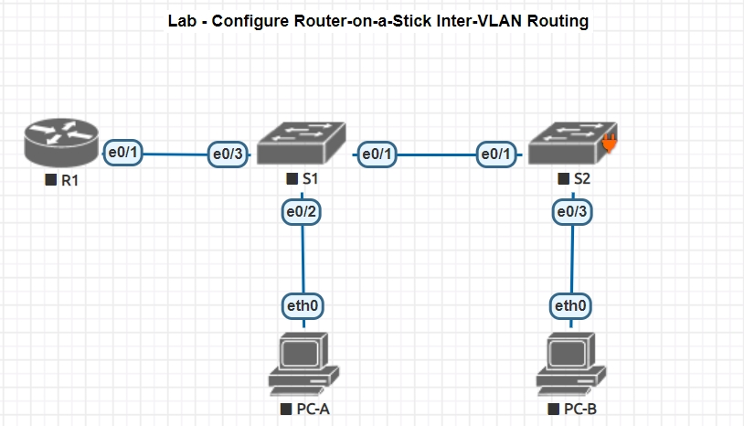

## VLAN и маршрутизация между VLAN // ДЗ 

### Configure Router-on-a-Stick Inter-VLAN Routing

### Цели:
- 1: Собрать схему лабораторной работы;
- 2: Сконфигурировать маршрутизацию между VLAN-ами по технологии "Маршрутизатор на палке".

### Собрана топология:


Имена интерфейсов на коммутаторах и маршрутизаторе имеют другие наименования, чем в оригинаьной лабораторной работе, т.к. в EVE-NG используются другие образы сетевых элементов.

Требуемые настройки сведены в таблицы

#### Таблица адресации
Device|Interface|IP Address|Subnet Mask|Default Gateway
---|---|---|---|---
R1|e0/1.3|192.168.3.1|255.255.255.0|N/A
-|e0/1.4|192.168.4.1|255.255.255.0|N/A
-|e0/1.8|N/A|N/A|N/A
S1|VLAN 3|192.168.3.11|255.255.255.0|192.168.3.1
S2|VLAN 3|192.168.3.12|255.255.255.0|192.168.3.1
PC-A|eth0|192.168.3.3|255.255.255.0|192.168.3.1
PC-B|eth0|192.168.4.3|255.255.255.0|192.168.4.1

#### Таблица VLAN-ов
VLAN|Name|Interface Assigned
---|---|---
3|Management|S1: VLAN 3; S2: VLAN 3; S1: e0/2
4|Operations|S2: e0/3
7|ParkingLot|S1: e0/0, e1/0-3; S2: e0/0-1, e1/0-3

#### Произведены предварительные настройки маршрутизатора и коммутаторов согласно задания лабораторной работы:
<details>
<summary> R1 </summary>
 
 ``` 
Router>enable
Router#conf t
Enter configuration commands, one per line.  End with CNTL/Z.
Router(config)#hostname R1
R1(config)#no ip domain-lookup
R1(config)#
R1(config)#
R1(config)#no ip domain-lookup
R1(config)#
R1(config)#enable secret class
R1(config)#line console 0
R1(config-line)#password cisco
R1(config-line)#login
R1(config-line)#line vty 0 4
R1(config-line)#password cisco
R1(config-line)#login
R1(config-line)#service password-encryption
R1(config)#banner motb $ NE VLEZAY -- UB'YOT!!! $
 
 ```
</details>
<details>
<summary> S1 </summary>
 
 ``` 
switch#conf t
switch(config)#hostname S1
S1(config)#no ip domain-lookup
S1(config)#enable secret class
S1(config)#line console 0
S1(config-line)#password cisco
S1(config-line)#login
S1(config)#line vty 0 4
S1(config-line)#password cisco
S1(config-line)#login
S1(config)#service password-encryption
S1(config)#banner motd $ NE VLEZAY -- UB'YOT!!! $
 
 ```
</details>

S2 настраивается аналогично

#### Настройка PC-A
<details>
<summary> PC-A </summary>
 
 ```
VPCS> set pcname PC-A

PC-A> ip 192.168.3.3 255.255.255.0 192.168.3.1
Checking for duplicate address...
PC-A : 192.168.3.3 255.255.255.0 gateway 192.168.3.1

PC-A> sh ip

NAME        : PC-A[1]
IP/MASK     : 192.168.3.3/24
GATEWAY     : 192.168.3.1
DNS         :
MAC         : 00:50:79:66:68:04
LPORT       : 20000
RHOST:PORT  : 127.0.0.1:30000
MTU         : 1500

PC-A>
 
 ```
</details>

PC-B настраивается аналогично

Создаю VLAN-ы на коммутаторах и конфигирурую согласно задания

<details>
<summary> S1 </summary>
 
 ```
S1(config)#vlan 3
S1(config-vlan)#name Management
S1(config-vlan)#vlan 4
S1(config-vlan)#name Operations
S1(config-vlan)#vlan 7
S1(config-vlan)#name ParkingLot
S1(config-vlan)#vlan 8
S1(config-vlan)#name Native

S1(config)#int vlan 3
S1(config-if)#ip address 192.168.3.11 255.255.255.0
S1(config-if)#no shutdown
S1(config-if)#exit
S1(config)#ip default-gateway 192.168.3.1

S1(config)#int range e0/0 , e1/0 - 3
S1(config-if-range)#switchport mode access
S1(config-if-range)#switchport access vlan 7
S1(config-if-range)#shutdown

S1(config)#int e0/2
S1(config-if)#switchport mode access
S1(config-if)#switchport access vlan 3

 ```
</details>
<details>
<summary> S2 </summary>
 
 ```

S2(config)#vlan 3
S2(config-vlan)#name Management
S2(config-vlan)#vlan 4
S2(config-vlan)#name Operations
S2(config-vlan)#vlan 7
S2(config-vlan)#name ParkingLot
S2(config-vlan)#vlan 8
S2(config-vlan)#name Native

S2(config)#int vlan 3
S2(config-if)#ip address 192.168.3.12 255.255.255.0
S2(config-if)#no shutdown
S2(config-if)#exit
S2(config)#ip default-gateway 192.168.3.1


S2(config)#interface range e0/0 - 1, e1/0 - 3
S2(config-if-range)#switchport mode access
S2(config-if-range)#switchport access vlan 7
S2(config-if-range)#shutdown

S2(config)#interface e0/3
S2(config-if)#switchport mode access
S2(config-if)#switchport access vlan 4

 ```
</details>

Проверка:
<details>
<summary> S1 </summary>
 
 ```

S1#sh vlan br

VLAN Name                             Status    Ports
---- -------------------------------- --------- -------------------------------
1    default                          active    Et0/1, Et0/3
3    Management                       active    Et0/2
4    Operations                       active
7    ParkingLot                       active    Et0/0, Et1/0, Et1/1, Et1/2
                                                Et1/3
8    Native                           active
1002 fddi-default                     act/unsup
1003 token-ring-default               act/unsup
1004 fddinet-default                  act/unsup
1005 trnet-default                    act/unsup
S1#

 ```
</details>
<details>
<summary> S2 </summary>
 
 ```

S2#sh vlan br

VLAN Name                             Status    Ports
---- -------------------------------- --------- -------------------------------
1    default                          active
3    Management                       active
4    Operations                       active    Et0/3
7    ParkingLot                       active    Et0/0, Et0/1, Et0/2, Et1/0
                                                Et1/1, Et1/2, Et1/3
8    Native                           active
1002 fddi-default                     act/unsup
1003 token-ring-default               act/unsup
1004 fddinet-default                  act/unsup
1005 trnet-default                    act/unsup

 ```
</details>

Настройка транков:
<details>
<summary> S1 </summary>
 
 ```


S1(config)#int e0/1
S1(config-if)#switchport trunk encapsulation dot1q
S1(config-if)#switchport mode trunk
S1(config-if)#switchport trunk native vlan 8
S1(config-if)#switchport trunk allowed vlan 3,4,8

S1(config)#int e0/3
S1(config-if)#switchport trunk encapsulation dot1q
S1(config-if)#switchport mode trunk
S1(config-if)#switchport trunk native vlan 8
S1(config-if)#switchport trunk allowed vlan 3,4,8

 ```
</details>
<details>
<summary> S2 </summary>
 
 ```


S2(config)#int e0/1
S2(config-if)#switchport trunk encapsulation dot1q
S2(config-if)#switchport mode trunk
S2(config-if)#switchport trunk native vlan 8
S2(config-if)#switchport trunk allowed vlan 3,4,8

 ```
</details>

Проверка:
<details>
<summary> S1 </summary>
 
 ```
S1#sh int trunk

Port        Mode             Encapsulation  Status        Native vlan
Et0/1       on               802.1q         trunking      8
Et0/3       on               802.1q         trunking      8

Port        Vlans allowed on trunk
Et0/1       3-4,8
Et0/3       3-4,8

Port        Vlans allowed and active in management domain
Et0/1       3-4,8
Et0/3       3-4,8

Port        Vlans in spanning tree forwarding state and not pruned
Et0/1       3-4,8
Et0/3       3-4,8

 ```
</details>
<details>
<summary> S2 </summary>
 
 ```
S2#sh int trunk

Port        Mode             Encapsulation  Status        Native vlan
Et0/1       on               802.1q         trunking      8

Port        Vlans allowed on trunk
Et0/1       3-4,8

Port        Vlans allowed and active in management domain
Et0/1       3-4,8

Port        Vlans in spanning tree forwarding state and not pruned
Et0/1       3-4,8


 ```
</details>


Настройка маршрутизатора
<details>
<summary> R1 </summary>
 
 ```

R1(config)#int e0/1
R1(config-if)#no shutdown
R1(config-if)#exit

R1(config)#interface e0/1.3
R1(config-subif)#desc Management Network
R1(config-subif)#encapsulation dot1q 3
R1(config-subif)#ip address 192.168.3.1 255.255.255.0
R1(config-subif)#interface e0/1.4
R1(config-subif)#desc Operations Network
R1(config-subif)#encapsulation dot1q 4
R1(config-subif)#ip address 192.168.4.1 255.255.255.0
R1(config-subif)#interface e0/1.8
R1(config-subif)#desc Native VLAN
R1(config-subif)#encapsulation dot1q 8 native

R1#sh ip int brief
Interface                  IP-Address      OK? Method Status                Protocol
Ethernet0/0                unassigned      YES unset  administratively down down
Ethernet0/1                unassigned      YES unset  up                    up
Ethernet0/1.3              192.168.3.1     YES manual up                    up
Ethernet0/1.4              192.168.4.1     YES manual up                    up
Ethernet0/1.8              unassigned      YES unset  up                    up
Ethernet0/2                unassigned      YES unset  administratively down down
Ethernet0/3                unassigned      YES unset  administratively down down
Serial1/0                  unassigned      YES unset  administratively down down
Serial1/1                  unassigned      YES unset  administratively down down
Serial1/2                  unassigned      YES unset  administratively down down
Serial1/3                  unassigned      YES unset  administratively down down
 
 ```
</details>

Проверка работоспособности:
<details>
<summary> Проверка пингов и трейсов с PC-A, PC-B </summary>
 
 ```

PC-A> ping 192.168.3.1

192.168.3.1 icmp_seq=1 timeout
84 bytes from 192.168.3.1 icmp_seq=2 ttl=255 time=1.528 ms
84 bytes from 192.168.3.1 icmp_seq=3 ttl=255 time=1.903 ms
84 bytes from 192.168.3.1 icmp_seq=4 ttl=255 time=1.332 ms
84 bytes from 192.168.3.1 icmp_seq=5 ttl=255 time=1.071 ms


PC-A> ping 192.168.4.3

84 bytes from 192.168.4.3 icmp_seq=1 ttl=63 time=1.787 ms
84 bytes from 192.168.4.3 icmp_seq=2 ttl=63 time=2.482 ms
84 bytes from 192.168.4.3 icmp_seq=3 ttl=63 time=7.766 ms
84 bytes from 192.168.4.3 icmp_seq=4 ttl=63 time=1.931 ms
84 bytes from 192.168.4.3 icmp_seq=5 ttl=63 time=2.000 ms


PC-A> ping 192.168.3.12

84 bytes from 192.168.3.12 icmp_seq=1 ttl=255 time=1.317 ms
84 bytes from 192.168.3.12 icmp_seq=2 ttl=255 time=1.321 ms
84 bytes from 192.168.3.12 icmp_seq=3 ttl=255 time=0.820 ms
84 bytes from 192.168.3.12 icmp_seq=4 ttl=255 time=0.822 ms
84 bytes from 192.168.3.12 icmp_seq=5 ttl=255 time=0.944 ms

PC-B> ping 192.168.3.3

84 bytes from 192.168.3.3 icmp_seq=1 ttl=63 time=4.522 ms
84 bytes from 192.168.3.3 icmp_seq=2 ttl=63 time=3.024 ms
84 bytes from 192.168.3.3 icmp_seq=3 ttl=63 time=4.788 ms
84 bytes from 192.168.3.3 icmp_seq=4 ttl=63 time=4.159 ms
84 bytes from 192.168.3.3 icmp_seq=5 ttl=63 time=3.115 ms

PC-B> trace 192.168.3.3
trace to 192.168.3.3, 8 hops max, press Ctrl+C to stop
 1   192.168.4.1   4.457 ms  4.280 ms  3.585 ms
 2   *192.168.3.3   2.037 ms (ICMP type:3, code:3, Destination port unreachable)


 ```
</details>
