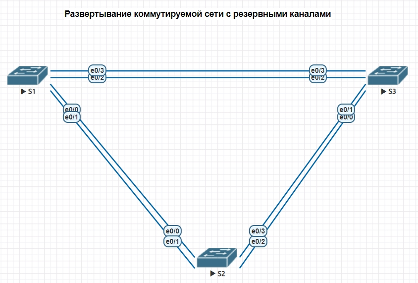

## Избыточность локальных сетей. STP // ДЗ

### Лабораторная работа. Развертывание коммутируемой сети с резервными каналами

### Цели:
- 1: собрать схему лабораторной работы;
- 2: проанализировать протокол связующего дерева, назначение, функционирование и настройка STP.

#### Таблица адресации
Устройство|Интерфейс|IP-адрес|Маска подсети
---|---|---|---
S1|VLAN 1|192.168.1.1|255.255.255.0
S2|VLAN 1|192.168.1.2|255.255.255.0
S2|VLAN 1|192.168.1.3|255.255.255.0


### Часть 1:	Создание сети и настройка основных параметров устройства

Создаю конфигурацию сети в EVE-NG, провожу первичную настройку коммутаторов.


### Собрана топология:


Имена интерфейсов на коммутаторах имеют другие наименования, чем в оригинаьной лабораторной работе, т.к. в EVE-NG используются другие образы сетевых элементов.

Ниже приведены команды для коммутатора S1, для коммутаторов S2 и S3 настройки аналогоичны за исключением IP-адресов.

<details>
<summary> S1 </summary>
 
 ``` 

Switch>en
Switch#conf t
Enter configuration commands, one per line.  End with CNTL/Z.
Switch(config)#hostname S1
S1(config)#no ip domain-lookup
S1(config)#enable secret class
S1(config)#line console 0
S1(config-line)#password cisco
S1(config-line)#login
S1(config-line)#line vty 0 4
S1(config-line)#password cisco
S1(config-line)#login
S1(config-line)#service password-encryption
S1(config)#banner motd $ NE VLEZAY -- UB'YOT!!! $
S1(config)#interface vlan 1

S1(config-if)#ip address 192.168.1.1 255.255.255.0
S1(config-if)#no shutdown
S1(config-if)#exit
S1#copy ru sta
Destination filename [startup-config]?
Building configuration...
Compressed configuration from 928 bytes to 680 bytes[OK]
S1#
 
 ```
</details>

#### Шаг 4:	Проверьте связь.

Проверка
<details>
<summary> пинги </summary>
 
 ``` 

S1#ping 192.168.1.2
Type escape sequence to abort.
Sending 5, 100-byte ICMP Echos to 192.168.1.2, timeout is 2 seconds:
.!!!!
Success rate is 80 percent (4/5), round-trip min/avg/max = 1/1/1 ms

S1#ping 192.168.1.3
Type escape sequence to abort.
Sending 5, 100-byte ICMP Echos to 192.168.1.3, timeout is 2 seconds:
!!!!!
Success rate is 100 percent (5/5), round-trip min/avg/max = 1/2/6 ms

S2#ping 192.168.1.3
Type escape sequence to abort.
Sending 5, 100-byte ICMP Echos to 192.168.1.3, timeout is 2 seconds:
!!!!!
Success rate is 100 percent (5/5), round-trip min/avg/max = 1/1/2 ms
 
 ```
</details>


### Часть 2:	Определение корневого моста

#### Шаг 1:	Отключите все порты на коммутаторах.
#### Шаг 2:	Настройте подключенные порты в качестве транковых.
#### Шаг 3:	Включите порты e0/1 и e0/3 на всех коммутаторах.

<details>
<summary> Шаги 1-3 на коммутаторе S1 </summary>
 
 ``` 

S1(config)#interface range e0/0-3
S1(config-if-range)#shutdown
S1(config-if-range)#
Mar 15 15:15:57.447: %LINK-5-CHANGED: Interface Ethernet0/0, changed state to administratively down
Mar 15 15:15:57.452: %LINK-5-CHANGED: Interface Ethernet0/1, changed state to administratively down
Mar 15 15:15:57.452: %LINK-5-CHANGED: Interface Ethernet0/2, changed state to administratively down
Mar 15 15:15:57.457: %LINK-5-CHANGED: Interface Ethernet0/3, changed state to administratively down
Mar 15 15:15:58.449: %LINEPROTO-5-UPDOWN: Line protocol on Interface Ethernet0/0, changed state to down
Mar 15 15:15:58.457: %LINEPROTO-5-UPDOWN: Line protocol on Interface Ethernet0/1, changed state to down
Mar 15 15:15:58.457: %LINEPROTO-5-UPDOWN: Line protocol on Interface Ethernet0/2, changed state to down
Mar 15 15:15:58.457: %LINEPROTO-5-UPDOWN: Line protocol on Interface Ethernet0/3, changed state to down
S1(config-if-range)#end
S1#

S1(config)#interface range e0/0-3
S1(config-if-range)#switchport trunk encapsulation dot1q
S1(config-if-range)#switchport mode trunk
S1(config-if-range)#end

S1(config)#interface range e0/0, e0/2
S1(config-if-range)#no shutdown
S1(config-if-range)#end

 
 ```
</details>

На коммутаторах S2 и S3 настройки аналогичны.


#### Шаг 4:	Отобразите данные протокола spanning-tree.


<details>
<summary> данные протокола spanning-tree </summary>
 
 ``` 

S1#sh spa

VLAN0001
  Spanning tree enabled protocol ieee
  Root ID    Priority    32769
             Address     aabb.cc00.1000
             This bridge is the root
             Hello Time   2 sec  Max Age 20 sec  Forward Delay 15 sec

  Bridge ID  Priority    32769  (priority 32768 sys-id-ext 1)
             Address     aabb.cc00.1000
             Hello Time   2 sec  Max Age 20 sec  Forward Delay 15 sec
             Aging Time  15  sec

Interface           Role Sts Cost      Prio.Nbr Type
------------------- ---- --- --------- -------- --------------------------------
Et0/1               Desg FWD 100       128.2    Shr
Et0/3               Desg FWD 100       128.4    Shr


S2#sh spa

VLAN0001
  Spanning tree enabled protocol ieee
  Root ID    Priority    32769
             Address     aabb.cc00.1000
             Cost        100
             Port        2 (Ethernet0/1)
             Hello Time   2 sec  Max Age 20 sec  Forward Delay 15 sec

  Bridge ID  Priority    32769  (priority 32768 sys-id-ext 1)
             Address     aabb.cc00.2000
             Hello Time   2 sec  Max Age 20 sec  Forward Delay 15 sec
             Aging Time  15  sec

Interface           Role Sts Cost      Prio.Nbr Type
------------------- ---- --- --------- -------- --------------------------------
Et0/1               Root FWD 100       128.2    Shr
Et0/3               Desg FWD 100       128.4    Shr


S3#sh spa

VLAN0001
  Spanning tree enabled protocol ieee
  Root ID    Priority    32769
             Address     aabb.cc00.1000
             Cost        100
             Port        4 (Ethernet0/3)
             Hello Time   2 sec  Max Age 20 sec  Forward Delay 15 sec

  Bridge ID  Priority    32769  (priority 32768 sys-id-ext 1)
             Address     aabb.cc00.3000
             Hello Time   2 sec  Max Age 20 sec  Forward Delay 15 sec
             Aging Time  300 sec

Interface           Role Sts Cost      Prio.Nbr Type
------------------- ---- --- --------- -------- --------------------------------
Et0/1               Altn BLK 100       128.2    Shr
Et0/3               Root FWD 100       128.4    Shr

 ```
</details>

На рисунке ниже приведены роли коммутаторов, а также роли и статусы портов


_С учетом выходных данных, поступающих с коммутаторов, ответьте на следующие вопросы._

_Какой коммутатор является корневым мостом?_


Корневым мостом является коммутатор S1.

_Почему этот коммутатор был выбран протоколом spanning-tree в качестве корневого моста?_

Корневой мост был выбран, поскольку он имел самый низкий BID (priority + sys-id-ext (VLAN) + MAC-адрес коммутатора)

_Какие порты на коммутаторе являются корневыми портами?_

S2: e0/1; S3: e0/3.

_Какие порты на коммутаторе являются назначенными портами?_

S1: e0/1, e0/3; S2: e0/3.

_Какой порт отображается в качестве альтернативного и в настоящее время заблокирован?_

S3: e0/1.

_Почему протокол spanning-tree выбрал этот порт в качестве невыделенного (заблокированного) порта?_

Алгоритм покрывающего дерева использует ROOT-коммутатор в качестве начала, а затем определяет,
какие порты следует заблокировать на основе стоимости пути. Если стоимости пути равны, он сравнивает BID.
Предпочтительны более низкие числа. В выходных данных выше канал между S2 и S3 имеет самую высокую стоимость
для ROOT-коммутатора. Стоимость пути через оба коммутатора одинакова, поэтому STA выбрал путь через коммутатор
с более низким BID и заблокировал порт (e0/1) на коммутаторе с более высоким BID (S2).

### Часть 3: Наблюдение за процессом выбора протоколом STP порта, исходя из стоимости портов

Коммутатор S3 с заблокированным STP портом e0/1.
Меняю стоимость порта.
<details>
<summary> замена стоимости порта </summary>
 
 ``` 

S3(config)#
S3(config)#interface e0/3
S3(config-if)#spanning-tree cost 18
S3(config-if)#
S3(config-if)#ex
S3(config)#exi
S3(config)#exit
S3#
Mar 15 21:36:08.684: %SYS-5-CONFIG_I: Configured from console by console
S3#sh spa

VLAN0001
  Spanning tree enabled protocol ieee
  Root ID    Priority    32769
             Address     aabb.cc00.1000
             Cost        18
             Port        4 (Ethernet0/3)
             Hello Time   2 sec  Max Age 20 sec  Forward Delay 15 sec

  Bridge ID  Priority    32769  (priority 32768 sys-id-ext 1)
             Address     aabb.cc00.3000
             Hello Time   2 sec  Max Age 20 sec  Forward Delay 15 sec
             Aging Time  15  sec

Interface           Role Sts Cost      Prio.Nbr Type
------------------- ---- --- --------- -------- --------------------------------
Et0/1               Desg FWD 100       128.2    Shr
Et0/3               Root FWD 18        128.4    Shr


S2#sh spa

VLAN0001
  Spanning tree enabled protocol ieee
  Root ID    Priority    32769
             Address     aabb.cc00.1000
             Cost        100
             Port        2 (Ethernet0/1)
             Hello Time   2 sec  Max Age 20 sec  Forward Delay 15 sec

  Bridge ID  Priority    32769  (priority 32768 sys-id-ext 1)
             Address     aabb.cc00.2000
             Hello Time   2 sec  Max Age 20 sec  Forward Delay 15 sec
             Aging Time  300 sec

Interface           Role Sts Cost      Prio.Nbr Type
------------------- ---- --- --------- -------- --------------------------------
Et0/1               Root FWD 100       128.2    Shr
Et0/3               Altn BLK 100       128.4    Shr

 ```
</details>


_Почему протокол spanning-tree заменяет ранее заблокированный порт на назначенный порт и блокирует порт, который был назначенным портом на другом коммутаторе?_

STP сначала смотрит на стоимость пути. Порт с более низкой стоимостью пути всегда будет предпочтительнее порта с более высокой стоимостью пути.

### Часть 4: Наблюдение за процессом выбора протоколом STP порта, исходя из приоритета портов

_a.	Включите порты e0/0 и e0/2 на всех коммутаторах._
_b.	Подождите 30 секунд, чтобы протокол STP завершил процесс перевода порта, после чего выполните команду show spanning-tree на коммутаторах некорневого моста. Обратите внимание, что порт корневого моста переместился на порт с меньшим номером, связанный с коммутатором корневого моста, и заблокировал предыдущий порт корневого моста._


<details>
<summary> выключаю все порты на коммутаторах </summary>
 
 ``` 

S1(config)#
S1(config)#int range e0/0, e0/2
S1(config-if-range)#no shutdown
S1(config-if-range)#end
S1#
Mar 15 16:54:17.687: %SYS-5-CONFIG_I: Configured from console by console
S1#
Mar 15 16:54:19.692: %LINK-3-UPDOWN: Interface Ethernet0/0, changed state to up
Mar 15 16:54:19.692: %LINK-3-UPDOWN: Interface Ethernet0/2, changed state to up
S1#
Mar 15 16:54:21.706: %LINEPROTO-5-UPDOWN: Line protocol on Interface Ethernet0/0, changed state to up
Mar 15 16:54:21.706: %LINEPROTO-5-UPDOWN: Line protocol on Interface Ethernet0/2, changed state to up


S1#sh spa

VLAN0001
  Spanning tree enabled protocol ieee
  Root ID    Priority    32769
             Address     aabb.cc00.1000
             This bridge is the root
             Hello Time   2 sec  Max Age 20 sec  Forward Delay 15 sec

  Bridge ID  Priority    32769  (priority 32768 sys-id-ext 1)
             Address     aabb.cc00.1000
             Hello Time   2 sec  Max Age 20 sec  Forward Delay 15 sec
             Aging Time  15  sec

Interface           Role Sts Cost      Prio.Nbr Type
------------------- ---- --- --------- -------- --------------------------------
Et0/0               Desg FWD 100       128.1    Shr
Et0/1               Desg FWD 100       128.2    Shr
Et0/2               Desg FWD 100       128.3    Shr
Et0/3               Desg FWD 100       128.4    Shr


S2#sh spa

VLAN0001
  Spanning tree enabled protocol ieee
  Root ID    Priority    32769
             Address     aabb.cc00.1000
             Cost        100
             Port        1 (Ethernet0/0)
             Hello Time   2 sec  Max Age 20 sec  Forward Delay 15 sec

  Bridge ID  Priority    32769  (priority 32768 sys-id-ext 1)
             Address     aabb.cc00.2000
             Hello Time   2 sec  Max Age 20 sec  Forward Delay 15 sec
             Aging Time  300 sec

Interface           Role Sts Cost      Prio.Nbr Type
------------------- ---- --- --------- -------- --------------------------------
Et0/0               Root FWD 100       128.1    Shr
Et0/1               Altn BLK 100       128.2    Shr
Et0/2               Desg FWD 100       128.3    Shr
Et0/3               Desg FWD 100       128.4    Shr


S3#sh spa

VLAN0001
  Spanning tree enabled protocol ieee
  Root ID    Priority    32769
             Address     aabb.cc00.1000
             Cost        100
             Port        3 (Ethernet0/2)
             Hello Time   2 sec  Max Age 20 sec  Forward Delay 15 sec

  Bridge ID  Priority    32769  (priority 32768 sys-id-ext 1)
             Address     aabb.cc00.3000
             Hello Time   2 sec  Max Age 20 sec  Forward Delay 15 sec
             Aging Time  300 sec

Interface           Role Sts Cost      Prio.Nbr Type
------------------- ---- --- --------- -------- --------------------------------
Et0/0               Altn BLK 100       128.1    Shr
Et0/1               Altn BLK 100       128.2    Shr
Et0/2               Root FWD 100       128.3    Shr
Et0/3               Altn BLK 100       128.4    Shr

 ```
</details>


_Какой порт выбран протоколом STP в качестве порта корневого моста на каждом коммутаторе некорневого моста?_

S2: e0/0, S3: e0/2

_Почему протокол STP выбрал эти порты в качестве портов корневого моста на этих коммутаторах?_


Значение порта по умолчанию для портов — 128; поэтому STP использовал номер порта, чтобы разорвать связь. Он выбрал меньший номер порта в качестве корневого порта и заблокировал порт с большим номером с помощью избыточного пути к корневому мосту.

### Вопросы для повторения

_1.	Какое значение протокол STP использует первым после выбора корневого моста, чтобы определить выбор порта?_

Стоимость пути.

_2.	Если первое значение на двух портах одинаково, какое следующее значение будет использовать протокол STP при выборе порта?_

BridgeID.

_3.	Если оба значения на двух портах равны, каким будет следующее значение, которое использует протокол STP при выборе порта?_

PortID.

Ниже приведены ссылки на конфигурацию лабораторной работы для EVE-NG и конфигурации коммутаторов и маршрутизатора

[Схема лабораторной работы](https://github.com/evgzol/OTUS-Network-Engineer/blob/main/lab02/01%20Lab%20STP.unl)

[Конфигурация коммутатора S1](https://github.com/evgzol/OTUS-Network-Engineer/blob/main/lab02/S1.cfg)

[Конфигурация коммутатора S2](https://github.com/evgzol/OTUS-Network-Engineer/blob/main/lab02/S2.cfg)

[Конфигурация коммутатора S3](https://github.com/evgzol/OTUS-Network-Engineer/blob/main/lab02/S3.cfg)
