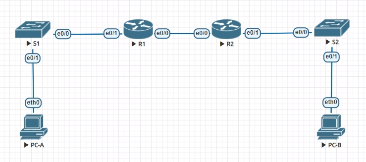

## DHCPv4/v6 и SLAAC // ДЗ

## Лабораторная работа №3. Внедрение и настройка DHCPv4/v6

### Лабораторная работа №3.1. Внедрение DHCPv4


#### Таблица адресации

|Устройство|Интерфейс|IP-адрес|Маска подсети|Шлюз по умолчанию|
|:------|:----------|:------------|:--------------|:--------------|
|R1	    |e0/0       |10.0.0.1	    |255.255.255.252|N/A            |
| 	    |e0/1 	    |N/A    	    |N/A            |N/A            |
| 	    |e0/1.100	  |192.168.1.1  |255.255.255.192|N/A            |
| 	    |e0/1.200  	|192.168.1.65 |255.255.255.192|N/A            |
| 	    |e0/1.1000  |N/A    	    |N/A            |N/A            |
|R2	    |e0/0 	    |10.0.0.2	    |255.255.255.252|N/A            |
| 	    |e0/1	      |192.168.1.129|255.255.255.128|N/A            |
|S1	    |VLAN 200   |192.168.1.66 |255.255.255.192|192.168.1.65   |
|S2	    |VLAN 1     |192.168.1.130|255.255.255.128|192.168.1.129  |
|PC-A	  |NIC	      |DHCP         |DHCP           |DHCP           |
|PC-B	  |NIC	      |DHCP         |DHCP           |DHCP           |

#### Таблица VLAN-ов

|VLAN	|Имя|Интерфейс|
|:----|:--------------|:------------------|
|1	  |N/A	          |S2: e0/1           |
|100	|Clients	      |S1: e0/1           |
|200	|Management	    |S1: VLAN 200       |
|999	|Parking_Lot	  |S1: e0/2, e0/3     |
|1000	|Native         |                   |


### Часть 1:	Построить сеть и настроить основные параметры устройства

Создаю конфигурацию сети в EVE-NG.


### Собрана топология:


Имена интерфейсов на коммутаторах имеют другие наименования, чем в оригинальной лабораторной работе, т.к. в EVE-NG используются другие образы сетевых элементов.


#### Шаг 3: Настройте основные параметры для каждого маршрутизатора

На примере R1

```bash
en
conf t
hostname R1
no ip domain-lookup
no ip domain-lookup
en secret class
line console 0
password cisco
login
line vty 0 4
password cisco
login
service password-encryption
banner motb $ NE VLEZAY -- UB'YOT!!! $
end
```
#### Шаг 4: Настройте маршрутизацию между VLAN на R1

```bash
en
conf t
int ethernet 0/0
ip address 10.0.0.1 255.255.255.252
no shut
int ethernet 0/1
no shut
int ethernet 0/1.100
description Clients
ip address 192.168.1.1 255.255.255.192
encapsulation dot1Q 100
int ethernet 0/1.200
description Management
ip address 192.168.1.65 255.255.255.192
encapsulation dot1Q 200
ip route 0.0.0.0 0.0.0.0 10.0.0.2
end
```


```bash
show ip int brief
Interface                  IP-Address      OK? Method Status                Protocol
Ethernet0/0                10.0.0.1        YES manual up                    up
Ethernet0/1                unassigned      YES unset  up                    up
Ethernet0/1.100            192.168.1.1     YES manual up                    up
Ethernet0/1.200            192.168.1.65    YES manual up                    up
Ethernet0/2                unassigned      YES unset  administratively down down
Ethernet0/3                unassigned      YES unset  administratively down down
```
#### Шаг 5: Настройте e0/1 на R2, затем e0/0 и статическую маршрутизацию для обоих маршрутизаторов
```bash
en
conf t
int ethernet 0/0
ip address 10.0.0.2 255.255.255.252
no shut
int ethernet 0/1
description Clients
ip address 192.168.1.129 255.255.255.128
no shut
exit 
ip route 0.0.0.0 0.0.0.0 10.0.0.1
end
```

```bash
show ip interface brief
Interface                  IP-Address      OK? Method Status                Protocol
Ethernet0/0                10.0.0.2        YES manual up                    up
Ethernet0/1                192.168.1.129   YES NVRAM  up                    up
Ethernet0/2                unassigned      YES NVRAM  administratively down down
Ethernet0/3                unassigned      YES NVRAM  administratively down down
```

#### Шаг 6: Настройте основные параметры для каждого коммутатора

На примере S1

```bash
conf t
hostname S1
no ip domain-lookup
en secret class
line console 0
password cisco
login
line vty 0 4
password cisco
login
service password-encryption
banner motd $ NE VLEZAY -- UB'YOT!!! $
end
```

#### Шаг 7: Создайте VLAN на S1

```bash
en
conf t
vlan 100
name Clients
vlan 200
name Management
vlan 999
name Parking_Lot
vlan 1000
name Native
exit
interface vlan 200
ip address 192.168.1.66 255.255.255.192
no shutdown
exit
ip default-gateway 192.168.1.65
ip route 0.0.0.0 0.0.0.0 192.168.1.65
int Ethernet0/2
switchport access vlan 999
shutdown
int ethernet0/3
switchport access vlan 999
shutdown
```


#### Шаг 8: Назначьте VLAN соответствующим интерфейсам коммутатора

<details>
<summary> S1 </summary>

```bash
en
conf t
int ethernet 0/1
switchport access vlan 100
end
```

```bash
show vlan brief
VLAN Name                             Status    Ports
---- -------------------------------- --------- -------------------------------
1    default                          active    Et0/0
100  Clients                          active    Et0/1
200  Management                       active
999  Parking_Lot                      active    Et0/2, Et0/3
1000 Native                           active
```
</details>

<details>
<summary> S2 </summary>

```bash
show vlan brief
VLAN Name                             Status    Ports
---- -------------------------------- --------- -------------------------------
1    default                          active    Et0/0, Et0/1, Et0/2, Et0/3
```

</details>


_Вопрос: Почему интерфейс e0/0 указан в списке VLAN 1?_

Потому что это VLAN по-умолчанию. Все клиенты находятся в нём.

#### Шаг 9: Вручную сконфигурируйте интерфейс e0/0 S1 как trunk 802.1Q 

```bash
en
conf t
int Ethernet0/0
switchport mode trunk
switchport trunk allowed vlan 100,200,1000
switchport trunk encapsulation dot1q
switchport trunk native vlan 1000
end
```

_Вопрос: На данный момент, какой IP-адрес был бы у ПК, если бы они были подключены к сети с использованием DHCP?_

ПК не получит IP-шник, т.к. нет DHCP-серверов

### Часть 2. Настройка и проверка двух DHCPv4-серверов на R1

#### Шаг 1. Настройте R1 с помощью пулов DHCPv4 для двух поддерживаемых подсетей. Ниже приведен только пул DHCP для подсети A

Настроим DHCP-пул:

DHCP-пул R1_LAN: 192.168.1.6--192.168.1.62
DHCP-пул R2_LAN: 192.168.1.134--192.168.1.254

```bash
en
conf t
ip dhcp excluded-address 192.168.1.1 192.168.1.5
ip dhcp pool R1_LAN
network 192.168.1.0 255.255.255.192
default-router 192.168.1.1
domain-name lab3
dns-server 192.168.1.1
lease 2 12 30
exit
ip dhcp excluded-address 192.168.1.129 192.168.1.133
ip dhcp pool R2_LAN
network 192.168.1.128 255.255.255.128
default-router 192.168.1.129
domain-name lab3
dns-server 192.168.1.129
lease 2 12 30
end
```

#### Шаг 2: Сохраните вашу конфигурацию

```bash
copy ru sta
```

#### Шаг 3: Проверьте конфигурацию сервера DHCPv4

```bash
R1#sh ip dhcp pool

Pool R1_LAN :
 Utilization mark (high/low)    : 100 / 0
 Subnet size (first/next)       : 0 / 0
 Total addresses                : 62
 Leased addresses               : 0
 Pending event                  : none
 1 subnet is currently in the pool :
 Current index        IP address range                    Leased addresses
 192.168.1.1          192.168.1.1      - 192.168.1.62      0

Pool R2_LAN :
 Utilization mark (high/low)    : 100 / 0
 Subnet size (first/next)       : 0 / 0
 Total addresses                : 126
 Leased addresses               : 0
 Pending event                  : none
 1 subnet is currently in the pool :
 Current index        IP address range                    Leased addresses
 192.168.1.129        192.168.1.129    - 192.168.1.254     0

R1#show ip dhcp binding
Bindings from all pools not associated with VRF:
IP address          Client-ID/	 	    Lease expiration        Type
		    Hardware address/
		    User name

R1#show ip dhcp server statistics
Memory usage         25783
Address pools        2
Database agents      0
Automatic bindings   0
Manual bindings      0
Expired bindings     0
Malformed messages   0
Secure arp entries   0

Message              Received
BOOTREQUEST          0
DHCPDISCOVER         0
DHCPREQUEST          0
DHCPDECLINE          0
DHCPRELEASE          0
DHCPINFORM           0

Message              Sent
BOOTREPLY            0
DHCPOFFER            0
DHCPACK              0
DHCPNAK              0
```

#### Шаг 4: Попытайтесь получить IP-адрес по протоколу DHCP на PC-A

```bash
VPCS> set pcname PC-A 
PC-A> dhcp
DDORA IP 192.168.1.6/26 GW 192.168.1.1

VPCS> show ip

NAME        : VPCS[1]
IP/MASK     : 192.168.1.6/26
GATEWAY     : 192.168.1.1
DNS         : 192.168.1.1
DHCP SERVER : 192.168.1.1
DHCP LEASE  : 217794, 217800/108900/190575
DOMAIN NAME : lab3
MAC         : 00:50:79:66:68:05
LPORT       : 20000
RHOST:PORT  : 127.0.0.1:30000
MTU         : 1500

PC-A> ping 192.168.1.1

84 bytes from 192.168.1.1 icmp_seq=1 ttl=255 time=0.501 ms
84 bytes from 192.168.1.1 icmp_seq=2 ttl=255 time=0.882 ms
84 bytes from 192.168.1.1 icmp_seq=3 ttl=255 time=0.811 ms
84 bytes from 192.168.1.1 icmp_seq=4 ttl=255 time=0.843 ms
84 bytes from 192.168.1.1 icmp_seq=5 ttl=255 time=0.715 ms
```

### Часть 3: Настройте и проверьте DHCP Relay на R2

#### Настройте R2 в качестве агента ретрансляции DHCP для локальной сети на e0/1

```bash
en
conf t
interface Ethernet0/1
ip helper-address 10.0.0.1
end
```

#### Шаг 2: Попытайтесь получить IP-адрес из DHCP на PC-B

```bash
VPCS> set pcname PC-B

PC-B> show ip

NAME        : PC-B[1]
IP/MASK     : 0.0.0.0/0
GATEWAY     : 0.0.0.0
DNS         :
MAC         : 00:50:79:66:68:06
LPORT       : 20000
RHOST:PORT  : 127.0.0.1:30000
MTU         : 1500

PC-B> dhcp
DDORA IP 192.168.1.134/25 GW 192.168.1.129

PC-B> show ip

NAME        : PC-B[1]
IP/MASK     : 192.168.1.134/25
GATEWAY     : 192.168.1.129
DNS         : 192.168.1.129
DHCP SERVER : 10.0.0.1
DHCP LEASE  : 217791, 217800/108900/190575
DOMAIN NAME : lab3
MAC         : 00:50:79:66:68:06
LPORT       : 20000
RHOST:PORT  : 127.0.0.1:30000
MTU         : 1500

PC-B> ping 192.168.1.6

84 bytes from 192.168.1.6 icmp_seq=1 ttl=62 time=2.645 ms
84 bytes from 192.168.1.6 icmp_seq=2 ttl=62 time=1.605 ms

PC-B> trace 192.168.1.6 -P 1
trace to 192.168.1.6, 8 hops max (ICMP), press Ctrl+C to stop
 1   192.168.1.129   0.905 ms  0.501 ms  0.517 ms
 2   10.0.0.1   0.766 ms  0.667 ms  0.877 ms
 3   192.168.1.6   1.154 ms  1.091 ms  1.121 ms
```

```bash
R1#sh ip dhcp binding
Bindings from all pools not associated with VRF:
IP address          Client-ID/	 	    Lease expiration        Type
		    Hardware address/
		    User name
192.168.1.6         0100.5079.6668.05       Mar 26 2025 01:49 AM    Automatic
192.168.1.134       0100.5079.6668.06       Mar 26 2025 02:06 AM    Automatic
```

### Лабораторная работа №3.2. Настройка DHCPv6

#### Таблица адресации

|Устройство|Интерфейс|IPv6 адрес          |
|:------------|:-----------|:---------------------|
|R1	          |e0/0        |2001:db8:acad:2::1/64 |
|  	          |      	     |fe80::1               |
|  	          |e0/1	       |2001:db8:acad:1::1/64 |
|  	          |     	     |fe80::1               |
|R2	          |e0/0	       |2001:db8:acad:2::2/64 |
|  	          |         	 |fe80::2               |
|  	          |e0/1	       |2001:db8:acad:3::1/64 |
|  	          |         	 |fe80::1               |
|PC-A	        |NIC	       |DHCP                  |
|PC-B	        |NIC	       |DHCP                  |

### Часть 1: Построение сети и настройка базовых параметров устройства

#### Настройка базовых параметров для каждого маршрутизатора

На R1 и R2:

```bash
en
conf t
ipv6 unicast-routing
no ip domain-lookup
end
copy running-config startup-config
```

#### Шаг 4: Настройка интерфейсов и маршрутизации для обоих маршрутизаторов

Настроим IPv6 маршрутизацию.

На R2:

```bash
en
conf t
interface Ethernet0/0
ipv6 address FE80::2 link-local
ipv6 address 2001:db8:acad:2::2/64
interface Ethernet0/1
ipv6 address FE80::1 link-local
ipv6 address 2001:db8:acad:3::1/64
exit
ipv6 route ::/0 2001:db8:acad:2::1
end
```

На R1:

```bash
en
conf t
interface Ethernet0/0
ipv6 address FE80::1 link-local
ipv6 address 2001:DB8:ACAD:2::1/64
interface Ethernet0/1.100
ipv6 address FE80::1 link-local
ipv6 address 2001:DB8:ACAD:1::1/64
exit
ipv6 route ::/0 2001:db8:acad:2::2
no ip dhcp pool R1_LAN
no ip dhcp pool R2_LAN
end

R1#ping 2001:db8:acad:2::2
Type escape sequence to abort.
Sending 5, 100-byte ICMP Echos to 2001:DB8:ACAD:2::2, timeout is 2 seconds:
!!!!!
Success rate is 100 percent (5/5), round-trip min/avg/max = 1/4/18 ms
R1#ping FE80::2
Output Interface: ethernet0/0
Type escape sequence to abort.
Sending 5, 100-byte ICMP Echos to FE80::2, timeout is 2 seconds:
Packet sent with a source address of FE80::1%Ethernet0/0
!!!!!
Success rate is 100 percent (5/5), round-trip min/avg/max = 1/1/1 ms
```

### Часть 2: Проверка назначения адреса SLAAC с помощью R1


Проверим, что PC-A присваивается IPv6 адрес по SLAAC.

```bash
PC-A> show ipv6

NAME              : PC-A[1]
LINK-LOCAL SCOPE  : fe80::250:79ff:fe66:6806/64
GLOBAL SCOPE      : 2001:db8:acad:1:2050:79ff:fe66:6806/64
DNS               :
ROUTER LINK-LAYER : aa:bb:cc:00:10:10
MAC               : 00:50:79:66:68:06
LPORT             : 20000
RHOST:PORT        : 127.0.0.1:30000
MTU:              : 1500
```

_Вопрос: Откуда взялась часть адреса, содержащая идентификатор хоста?_

2050:7966:6806 - host-id

### Часть 3: Настройка и проверка сервера DHCPv6 на R1

#### Шаг 2: Настройка R1 для обеспечения DHCPv6 без сохранения состояния для PC-A


Настроим stateless DHCPv6 сервер на `R1`

```bash
en
conf t
ipv6 dhcp pool R1-STATELESS
dns-server 2001:db8:acad::254
domain-name STATELESS.com
interface Ethernet0/1.100
ipv6 nd other-config-flag
ipv6 dhcp server R1-STATELESS
end
copy running-config startup-config
```

Проверяем на PC-A (Debian):

```bash
root#PC-A:~# cat /etc/resolv.conf
# Generated by NetworkManager
search STATELESS.com
nameserver 2001:db8:acad::254
```

### Часть 4: Настройка сервера DHCPv6 с сохранением состояния на R1


```bash
en
conf t
ipv6 dhcp pool R2-STATEFUL
address prefix 2001:db8:acad:3:aaa::/80
dns-server 2001:db8:acad::254
domain-name STATEFUL.com
interface Ethernet0/0
ipv6 nd managed-config-flag
ipv6 dhcp server R2-STATEFUL
end
copy running-config startup-config
```

### Часть 5: Настройте и проверьте DHCPv6 relay на R2 

#### Шаг 1: Включите PC-B и проверьте адрес SLAAC, который он генерирует


```bash
root#PC-B:~# ip a s dev ens3
2: ens3: <BROADCAST,MULTICAST,UP,LOWER_UP> mtu 1500 qdisc fq_codel state UP group default qlen 1000
    link/ether 00:50:00:00:07:00 brd ff:ff:ff:ff:ff:ff
    altname enp0s3
    inet6 2001:db8:acad:3:f1f:e7b0:26df:dd6a/64 scope global dynamic noprefixroute
       valid_lft 2591932sec preferred_lft 604732sec
    inet6 fe80::6f4b:8ab4:ca1c:2f69/64 scope link noprefixroute
       valid_lft forever preferred_lft forever
root#PC-B:~# cat /etc/resolv.conf
root#PC-B:~#
```

#### Шаг 2: Настройте R2 в качестве агента ретрансляции DHCP для локальной сети на e0/1

```bash
en
conf t
interface Ethernet0/1
ipv6 nd managed-config-flag
ipv6 dhcp relay destination 2001:DB8:ACAD:2::1 Ethernet0/0
```

#### Шаг 3: Попытайтесь получить IPv6-адрес из DHCPv6 на PC-B

```bash
root#PC-B:~# ip a s dev ens3
2: ens3: <BROADCAST,MULTICAST,UP,LOWER_UP> mtu 1500 qdisc fq_codel state UP group default qlen 1000
    link/ether 00:50:00:00:07:00 brd ff:ff:ff:ff:ff:ff
    altname enp0s3
    inet6 2001:db8:acad:3:aaa:184d:3965:d2a0/128 scope global dynamic noprefixroute
       valid_lft 172795sec preferred_lft 86395sec
    inet6 2001:db8:acad:3:5c92:a6ab:327a:566c/64 scope global dynamic noprefixroute
       valid_lft 2591995sec preferred_lft 604795sec
    inet6 fe80::aae7:13c9:39ff:2f86/64 scope link noprefixroute
       valid_lft forever preferred_lft forever

root#PC-B:~# cat /etc/resolv.conf
# Generated by NetworkManager
search STATEFUL.com
nameserver 2001:db8:acad::254

root#PC-B:~# ping 2001:DB8:ACAD:1::1
PING 2001:DB8:ACAD:1::1(2001:db8:acad:1::1) 56 data bytes
64 bytes from 2001:db8:acad:1::1: icmp_seq=1 ttl=63 time=9.78 ms
64 bytes from 2001:db8:acad:1::1: icmp_seq=2 ttl=63 time=1.02 ms
64 bytes from 2001:db8:acad:1::1: icmp_seq=3 ttl=63 time=0.934 ms
64 bytes from 2001:db8:acad:1::1: icmp_seq=4 ttl=63 time=0.945 ms
```
	


[Конфигурация коммутатора S1](https://github.com/evgzol/OTUS-Network-Engineer/blob/main/lab03/S1.txt)

[Конфигурация коммутатора S2](https://github.com/evgzol/OTUS-Network-Engineer/blob/main/lab03/S2.txt)

[Конфигурация маршрутизатора R1](https://github.com/evgzol/OTUS-Network-Engineer/blob/main/lab03/R1.txt)

[Конфигурация маршрутизатора R2](https://github.com/evgzol/OTUS-Network-Engineer/blob/main/lab03/R2.txt)
