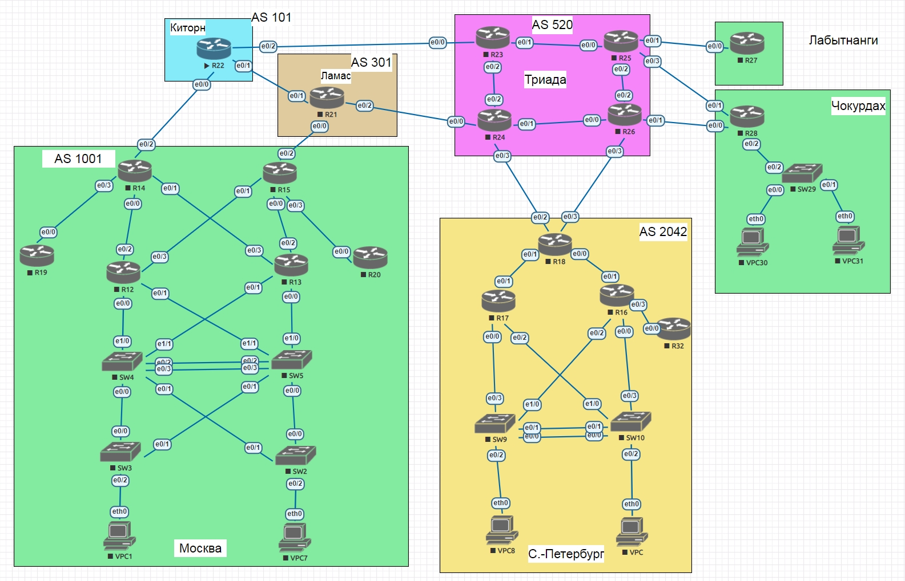
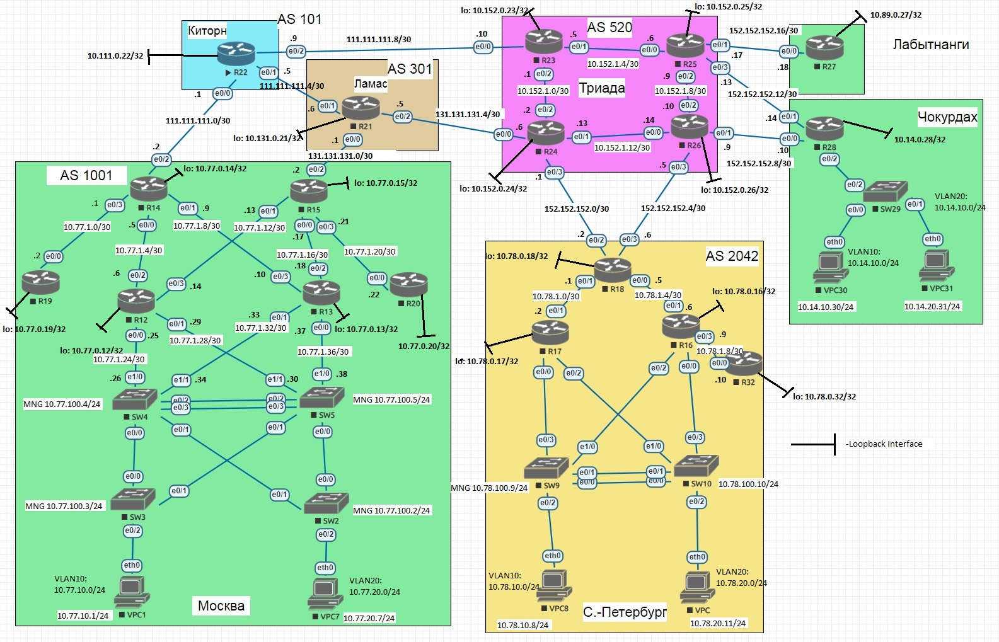

# Лабораторная работа №4 "Проектирование сети"

## **Задание**
1. Разработаете и задокументируете адресное пространство для лабораторного стенда.
2. Настроите ip адреса на каждом активном порту
3. Настроите каждый VPC в каждом офисе в своем VLAN.
4. Настроите VLAN/Loopbackup interface управления для сетевых устройств
5. Настройте сети офисов так, чтобы не возникало broadcast штормов, а использование линков было максимально оптимизировано

## 1. Разработка и документирование адресного пространства для лабораторного стенда

Схема сети представлена на рисунке ниже:



### Общая идеология разбиения адресного пространства

Считаем, что Москва, Санкт-Петербург, Чокурдак, Лабытнанги --- отделения компании, а Киторн, Ламас, Триада --- провайдеры.

Отделения компании имеют "приватную" адресацию из 10.0.0.0/8, у провайдеров --- "белые" IP-адреса во внешние сети, и "приватные" внутри.

Для отделений компании используем во втором октете автомобильный код региона РФ, а лля внутренней сети провайдеров --- несколько переосмысленный номер AS во втором октете (я художник, я так вижу).

Пользователей разводим по двум VLAN (10 и 20), VLANid для управления --- 100. За это отвечает третий октет.

Для Loopback в третьем октете --- "0", для сетей интерконнекта во внутренних сетях --- "1".

### Таблица распределения адресного пространства

| Net                                                          | Vlan | Name                              | Description     |
|--------------------------------------------------------------|------|-----------------------------------|-----------------|
| 10.77.0.0/16                                                 | -    | Внутренняя сеть                   | Москва          |
| 10.78.0.0/16                                                 | -    |                                   | Санкт-Петербург |
| 10.89.0.0/16                                                 | -    |                                   | Лабытнанги      |
| 10.14.0.0/16                                                 | -    |                                   | Чокудах         |
| 10.111.0.0/16                                                | -    |                                   | Киторн          |
| 10.131.0.0/16                                                | -    |                                   | Ламас           |
| 10.152.0.0/16                                                | -    |                                   | Триада          |
| 10.77.1.0/24                                                 | -    | Пространство для интерконнекта    | Москва          |
| 10.78.1.0/24                                                 | -    |                                   | Санкт-Петербург |
| 10.89.1.0/24                                                 | -    |                                   | Лабытнанги      |
| 10.14.1.0/24                                                 | -    |                                   | Чокудах         |
| 10.111.1.0/24                                                | -    |                                   | Киторн          |
| 10.131.1.0/24                                                | -    |                                   | Ламас           |
| 10.152.1.0/24                                                | -    |                                   | Триада          |
| 10.77.0.0/24                                                 | -    | Пространство для Loopback         | Москва          |
| 10.78.0.0/24                                                 | -    |                                   | Санкт-Петербург |
| 10.89.0.0/24                                                 | -    |                                   | Лабытнанги      |
| 10.14.0.0/24                                                 | -    |                                   | Чокудах         |
| 10.111.0.0/24                                                | -    |                                   | Киторн          |
| 10.131.0.0/24                                                | -    |                                   | Ламас           |
| 10.152.0.0/24                                                | -    |                                   | Триада          |
| 111.111.111.0/24                                             | -    | Внешняя сеть                      | Киторн          |
| 131.131.131.0/24                                             | -    |                                   | Ламас           |
| 152.152.152.0/24                                             | -    |                                   | Триада          |
| 10.77.10.0/24                                                | 10   | VLAN10, пользователи              | Москва          |
| 10.78.10.0/24                                                | 10   |                                   | Санкт-Петербург |
| 10.14.10.0/24                                                | 10   |                                   | Чокудах         |
| 10.77.20.0/24                                                | 20   | VLAN20, пользователи              | Москва          |
| 10.78.20.0/24                                                | 20   |                                   | Санкт-Петербург |
| 10.14.20.0/24                                                | 20   |                                   | Чокудах         |
| 10.77.100.0/24                                               | 100  | VLAN100, управление коммутаторами | Москва          |
| 10.78.100.0/24                                               | 100  |                                   | Санкт-Петербург |
| 10.14.100.0/24                                               | 100  |                                   | Чокудах         |

Для сетей интерконнекты будем испольлзовать /30-ые подсети.

Столбец Description будем испольлзовать для описания при настройке интерфейсов на сетевых элементах.

Теперь распределим IP-адреса по сетевым элементам, согласно приведённых выше принципов.

### Таблица распределения IP-адресов

HostName|Loopback|Port|IP-address|Network|Location|Description|Комментарий
---|---|---|---|---|---|---|---
R12|10.77.0.12|e0/0|10.77.1.25|10.77.1.24/30|Москва|***\_to\_SW4\_(e1/0)|
R12|10.77.0.12|e0/1|10.77.1.29|10.77.1.28/30|Москва|***\_to\_SW5\_(e1/1)|
R12|10.77.0.12|e0/2|10.77.1.6|10.77.1.4/30|Москва|***\_to\_R14\_(e0/0)|
R12|10.77.0.12|e0/3|10.77.1.14|10.77.1.12/30|Москва|***\_to\_R15\_(e1/1)|
R13|10.77.0.13|e0/0|10.77.1.37|10.77.1.36/30|Москва|***\_to\_SW5\_(e1/0)|
R13|10.77.0.13|e0/1|10.77.1.33|10.77.1.32/30|Москва|***\_to\_SW4\_(e1/1)|
R13|10.77.0.13|e0/2|10.77.1.18|10.77.1.16/30|Москва|***\_to\_R15\_(e0/0)|
R13|10.77.0.13|e0/3|10.77.1.10|10.77.1.8/30|Москва|***\_to\_R14\_(e0/1)|
R14|10.77.0.14|e0/0|10.77.1.5|10.77.1.4/30|Москва|***\_to\_R12\_(e0/2)|
R14|10.77.0.14|e0/1|10.77.1.9|10.77.1.8/30|Москва|***\_to\_R13\_(e0/3)|
R14|10.77.0.14|e0/2|111.111.111.2|111.111.111.0/30|Москва|***\_to\_R22\_(e0/0)\_Kitorn|
R14|10.77.0.14|e0/3|10.77.1.1|10.77.1.0/30|Москва|***\_to\_R19\_(e0/0)|
R15|10.77.0.15|e0/0|10.77.1.17|10.77.1.16/30|Москва|***\_to\_R13\_(e0/2)|
R15|10.77.0.15|e0/1|10.77.1.13|10.77.1.12/30|Москва|***\_to\_R12\_(e0/3)|
R15|10.77.0.15|e0/2|131.131.131.2|131.131.131.0/30|Москва|***\_to\_R21\_(e0/0)\_Lamas|
R15|10.77.0.15|e0/3|10.77.1.21|10.77.1.0/30|Москва|***\_to\_R20\_(e0/0)|
R19|10.77.0.19|e0/0|10.77.1.2|10.77.1.0/30|Москва|***\_to\_R14\_(e0/3)|
R20|10.77.0.20|e0/0|10.77.1.22|10.77.1.20/30|Москва|***\_to\_R15\_(e0/3)|
SW4|-|e0/1|10.77.1.26|10.77.1.24/30|Москва|***\_to\_R12\_(e0/0)|
SW4|-|e0/2|10.77.1.34|10.77.1.32/30|Москва|***\_to\_R13\_(e0/1)|
SW4|-|Vlan10|10.77.10.4|10.77.10.0/24|Москва||VLAN10
SW4|-|Vlan20|10.77.20.4|10.77.20.0/24|Москва||VLAN20
SW4|-|Vlan100|10.77.100.4|10.77.100.0/24|Москва||VLAN100
SW5|-|e0/1|10.77.1.38|10.77.1.36/30|Москва|***\_to\_R13\_(e0/0)|
SW5|-|e0/2|10.77.1.30|10.77.1.28/30|Москва|***\_to\_R12\_(e0/1)|
SW5|-|Vlan10|10.77.10.5|10.77.10.0/24|Москва||VLAN10
SW5|-|Vlan20|10.77.20.5|10.77.20.0/24|Москва||VLAN20
SW5|-|Vlan100|10.77.100.5|10.77.100.0/24|Москва||VLAN100
SW4, SW5|-|-|10.77.10.1|10.77.10.0/24|Москва||VRRP VLAN10
SW4, SW5|-|-|10.77.20.1|10.77.20.0/24|Москва||VRRP VLAN20
SW4, SW5|-|-|10.77.100.1|10.77.100.0/24|Москва||VRRP VLAN100
R16|10.78.0.16|e0/0|-|-|Санкт-Петербург|***\_to\_SW10\_(e0/3)|
R16|10.78.0.16|e0/0.10|10.78.10.16|10.78.10.0/24|Санкт-Петербург|***\_VLAN\_10|
R16|10.78.0.16|e0/0.20|10.78.20.16|10.78.20.0/24|Санкт-Петербург|***\_VLAN\_20|
R16|10.78.0.16|e0/0.100|10.78.100.16|10.78.100.0/24|Санкт-Петербург|***\_VLAN\_100\_MNG|
R16|10.78.0.16|e0/1|10.78.1.6|10.78.1.4/30|Санкт-Петербург|***\_to\_R18\_(e0/0)|
R16|10.78.0.16|e0/2|-|-|Санкт-Петербург|***\_to\_SW9\_(e1/0)|
R16|10.78.0.16|e0/3|10.78.1.9|10.78.1.8/30|Санкт-Петербург|***\_to\_R32\_(e0/0)|
R17|10.78.0.17|e0/0|-|-|Санкт-Петербург|***\_to\_SW9\_(e0/3)|
R17|10.78.0.17|e0/0.10|10.78.10.17|10.78.10.0/24|Санкт-Петербург|***\_VLAN\_10|
R17|10.78.0.17|e0/0.20|10.78.20.17|10.78.20.0/24|Санкт-Петербург|***\_VLAN\_20|
R17|10.78.0.17|e0/0.100|10.78.100.17|10.78.100.0/24|Санкт-Петербург|***\_VLAN\_100\_MNG|
R17|10.78.0.17|e0/1|10.78.1.2|10.78.1.0/30|Санкт-Петербург|***\_to\_R18\_(e0/1)|
R17|10.78.0.17|e0/2|-|-|Санкт-Петербург|***\_to\_SW10\_(e1/0)|
R18|10.78.0.18|e0/0|10.78.1.5|10.78.1.4/30|Санкт-Петербург|***\_to\_R16\_(e0/1)|
R18|10.78.0.18|e0/1|10.78.1.1|10.78.1.0/30|Санкт-Петербург|***\_to\_R17\_(e0/1)|
R18|10.78.0.18|e0/2|152.152.152.2|152.152.152.0/30|Санкт-Петербург|***\_to\_R24\_(e0/3)\_Triada|
R18|10.78.0.18|e0/3|152.152.152.6|152.152.152.4/30|Санкт-Петербург|***\_to\_R26\_(e0/3)\_Triada|
R17, R18|-|-|10.78.10.1|10.78.10.0/24|Санкт-Петербург||VRRP VLAN10
R17, R18|-|-|10.78.20.1|10.78.20.0/24|Санкт-Петербург||VRRP VLAN20
R17, R18|-|-|10.78.100.1|10.78.100.0/24|Санкт-Петербург||VRRP VLAN100
R32|10.78.0.32|e0/0|10.78.1.10|10.78.1.8/30|Санкт-Петербург|***\_to\_R16\_(e0/3)|
R27|10.89.0.27|e0/0|152.152.152.18|152.152.152.16/30|Лабытнанги|***\_to\_R27\_(e0/1)\_Triada|
R28|10.14.0.28|e0/0|152.152.152.10|152.152.152.8/30|Чокудак|***\_to\_R26\_(e0/1)\_Triada|
R28|10.14.0.28|e0/1|152.152.152.14|152.152.152.12/30|Чокудак|***\_to\_R25\_(e0/3)\_Triada|
R28|10.14.0.28|e0/2|-|-|Чокудак|***\_to\_SW29\_(e0/2)|
R28|10.14.0.28|e0/2.10|10.14.10.28|10.14.10.0/24|Чокудак|***\_VLAN\_10|
R28|10.14.0.28|e0/2.20|10.14.20.28|10.14.20.0/24|Чокудак|***\_VLAN\_20|
R28|10.14.0.28|e0/2.100|10.14.100.28|10.14.100.0/24|Чокудак|***\_VLAN\_100\_MNG|
R22|10.111.0.22|e0/0|111.111.111.1|111.111.111.0/30|Киторн (провайдер)|***\_to\_R14\_(e0/2)\_MSK|
R22|10.111.0.22|e0/1|111.111.111.5|111.111.111.4/30|Киторн (провайдер)|***\_to\_R21\_(e0/1)\_Lamas|
R22|10.111.0.22|e0/2|111.111.111.9|111.111.111.8/30|Киторн (провайдер)|***\_to\_R23\_(e0/0)\_Triada|
R21|10.131.0.21|e0/0|131.131.131.1|131.131.131.0/30|Ламас (провайдер)|***\_to\_R15\_(e0/2)\_MSK|
R21|10.131.0.21|e0/1|111.111.111.6|111.111.111.4/30|Ламас (провайдер)|***\_to\_R22\_(e0/1)\_Kitorn|
R21|10.131.0.21|e0/2|131.131.131.5|131.131.131.4/30|Ламас (провайдер)|***\_to\_R24\_(e0/0)\_Triada|
R23|10.152.0.23|e0/0|111.111.111.10|111.111.111.8/30|Триада (провайдер)|***\_to\_R22\_(e0/2)\_Kitorn|
R23|10.152.0.23|e0/1|10.152.1.5|10.152.1.4/30|Триада (провайдер)|***\_to\_R25\_(e0/0)|
R23|10.152.0.23|e0/2|10.152.1.1|10.152.1.0/30|Триада (провайдер)|***\_to\_R24\_(e0/2)|
R24|10.152.0.24|e0/0|131.131.131.6|131.131.131.4/30|Триада (провайдер)|***\_to\_R21\_(e0/2)\_Lamas|
R24|10.152.0.24|e0/1|10.152.1.13|10.152.1.12/30|Триада (провайдер)|***\_to\_R26\_(e0/0)|
R24|10.152.0.24|e0/2|10.152.1.2|10.152.1.0/30|Триада (провайдер)|***\_to\_R23\_(e0/2)|
R24|10.152.0.24|e0/3|152.152.152.1|152.152.152.0/30|Триада (провайдер)|***\_to\_R18\_(e0/2)\_SPB|
R25|10.152.0.25|e0/0|10.152.1.6|10.152.1.4/30|Триада (провайдер)|***\_to\_R23(e0/1)|
R25|10.152.0.25|e0/1|152.152.152.17|152.152.152.16/30|Триада (провайдер)|***\_to\_R27\_(e0/0)\_LBT|
R25|10.152.0.25|e0/2|10.152.1.9|10.152.1.8/30|Триада (провайдер)|***\_to\_R26\_(e0/2)|
R25|10.152.0.25|e0/3|152.152.152.13|152.152.152.12/30|Триада (провайдер)|***\_to\_R28\_(e0/1)\_CHK|
R26|10.152.0.26|e0/0|10.152.1.14|10.152.1.12/30|Триада (провайдер)|***\_to\_R24\_(e0/1)|
R26|10.152.0.26|e0/1|152.152.152.9|152.152.152.8/30|Триада (провайдер)|***\_to\_R28\_(e0/0)\_CHK|
R26|10.152.0.26|e0/2|10.152.1.10|10.152.1.8/30|Триада (провайдер)|***\_to\_R25\_(e0/2)|
R26|10.152.0.26|e0/3|152.152.152.5|152.152.152.4/30|Триада (провайдер)|***\_to\_R18\_(e0/3)\_SPB|
VPC1|-|eth0|10.77.10.101|10.77.10.0/24|Москва||VLAN10
VPC7|-|eth0|10.77.10.107|10.77.20.0/24|Москва||VLAN20
VPC8|-|eth0|10.78.10.108|10.78.10.0/24|Санкт-Петербург||VLAN10
VPC11|-|eth0|10.78.20.111|10.78.20.0/24|Санкт-Петербург||VLAN20
VPC30|-|eth0|10.14.10.130|10.14.10.0/24|Чокудак||VLAN10
VPC31|-|eth0|10.14.20.131|10.14.20.0/24|Чокудак||VLAN20
SW2|-|Vlan100|10.77.100.2|10.77.100.0/24|Москва||VLAN100
SW3|-|Vlan100|10.77.100.3|10.77.100.0/24|Москва||VLAN100
SW9|-|Vlan100|10.78.100.9|10.78.100.0/24|Санкт-Петербург||VLAN100
SW10|-|Vlan100|10.78.100.10|10.78.100.0/24|Санкт-Петербург||VLAN100
SW29|-|Vlan100|10.14.100.29|10.14.100.0/24|Чокудак||VLAN100

Для удобства, нанёс IP-адреса на схему сети. 



## 2. Настройка IP-адреса на каждом активном порту

Все настройки не привожу, пример настроек для маршрутизаторов (на примере R12):
  ```
  interface Ethernet0/0
   ip address 10.77.1.25 255.255.255.252
  end
  ```
и коммутаторов (на примере SW4):
  ```
  interface Ethernet1/0
   no switchport
   ip address 10.77.1.26 255.255.255.252
   duplex auto
  end
  ```

## 3. Настройте каждый VPC в каждом офисе в своем VLAN.

Пример настроек на VPC1:
  ```
  set pcname VPC1
  ip 10.77.10.101 10.77.10.1 24
  save
  ```
  
 ## 4. Настроите VLAN/Loopbackup interface управления для сетевых устройств
 
IP-адреса для Loopback-ов и VLAN приведены в IP-плане выше.

Для GW в подсетях VLAN используются .1 адреса.

Пример настроек Loopback на примере R12:
  ```
  interface Loopback0
  ip address 10.77.0.12 255.255.255.255
  end
  ```
Пример настроек Management VLAN на примере SW4:
  ```
  interface Vlan100
  ip address 10.77.100.4 255.255.255.0
  end
  ```

## 5. Настройте сети офисов так, чтобы не возникало broadcast штормов, а использование линков было максимально оптимизировано

В Москве и Санкт-Петербурге мезду SW4, SW5 и SW9, SW10 настрою агрегирование линков в LACP:

  ```
interface Port-channel1
 switchport trunk allowed vlan 10,20,100
 switchport trunk encapsulation dot1q
 switchport mode trunk
exit

interface Ethernet0/2
 switchport trunk allowed vlan 10,20,100
 switchport trunk encapsulation dot1q
 switchport mode trunk
 channel-group 1 mode active
exit


interface Ethernet0/3
 switchport trunk allowed vlan 10,20,100
 switchport trunk encapsulation dot1q
 switchport mode trunk
 channel-group 1 mode active
exit
  ```
Для предупреждения широковещательных штормов на всех коммутаторах поднимаю PVST:

  ```
spanning-tree mode pvst
spanning-tree extend system-id
  ```
  
В Москве и Санкт-Петербурге настраиваю VRRP между SW4, SW5 и R17, R16 соответственно

  ```
SW4#sh vrrp
Vlan10 - Group 2
  State is Master
  Virtual IP address is 10.77.10.1
  Virtual MAC address is 0000.5e00.0102
  Advertisement interval is 1.000 sec
  Preemption enabled
  Priority is 110
  Master Router is 10.77.10.4 (local), priority is 110
  Master Advertisement interval is 1.000 sec
  Master Down interval is 3.570 sec

Vlan20 - Group 3
  State is Master
  Virtual IP address is 10.77.20.1
  Virtual MAC address is 0000.5e00.0103
  Advertisement interval is 1.000 sec
  Preemption enabled
  Priority is 110
  Master Router is 10.77.20.4 (local), priority is 110
  Master Advertisement interval is 1.000 sec
  Master Down interval is 3.570 sec

Vlan100 - Group 1
  State is Master
  Virtual IP address is 10.77.100.1
  Virtual MAC address is 0000.5e00.0101
  Advertisement interval is 1.000 sec
  Preemption enabled
  Priority is 110
  Master Router is 10.77.100.4 (local), priority is 110
  Master Advertisement interval is 1.000 sec
  Master Down interval is 3.570 sec


SW5#show vrrp
Vlan10 - Group 2
  State is Backup
  Virtual IP address is 10.77.10.1
  Virtual MAC address is 0000.5e00.0102
  Advertisement interval is 1.000 sec
  Preemption enabled
  Priority is 100
  Master Router is 10.77.10.4, priority is 110
  Master Advertisement interval is 1.000 sec
  Master Down interval is 3.609 sec (expires in 2.609 sec)

Vlan20 - Group 3
  State is Backup
  Virtual IP address is 10.77.20.1
  Virtual MAC address is 0000.5e00.0103
  Advertisement interval is 1.000 sec
  Preemption enabled
  Priority is 100
  Master Router is 10.77.20.4, priority is 110
  Master Advertisement interval is 1.000 sec
  Master Down interval is 3.609 sec (expires in 3.043 sec)

Vlan100 - Group 1
  State is Backup
  Virtual IP address is 10.77.100.1
  Virtual MAC address is 0000.5e00.0101
  Advertisement interval is 1.000 sec
  Preemption enabled
  Priority is 100
  Master Router is 10.77.100.4, priority is 110
  Master Advertisement interval is 1.000 sec
  Master Down interval is 3.609 sec (expires in 3.043 sec)
  ```


  ```
  R17#sh vrrp
Ethernet0/0.10 - Group 1
  State is Master
  Virtual IP address is 10.78.10.1
  Virtual MAC address is 0000.5e00.0101
  Advertisement interval is 1.000 sec
  Preemption enabled
  Priority is 100
  Master Router is 10.78.10.17 (local), priority is 100
  Master Advertisement interval is 1.000 sec
  Master Down interval is 3.609 sec

Ethernet0/0.20 - Group 2
  State is Init
  Virtual IP address is 10.78.20.1
  Virtual MAC address is 0000.5e00.0102
  Advertisement interval is 1.000 sec
  Preemption enabled
  Priority is 100
  Master Router is unknown, priority is unknown
  Master Advertisement interval is unknown
  Master Down interval is unknown

Ethernet0/0.100 - Group 3
  State is Master
  Virtual IP address is 10.78.100.1
  Virtual MAC address is 0000.5e00.0103
  Advertisement interval is 1.000 sec
  Preemption enabled
  Priority is 100
  Master Router is 10.78.100.17 (local), priority is 100
  Master Advertisement interval is 1.000 sec
  Master Down interval is 3.609 sec

R16#sh vrrp
Ethernet0/0.10 - Group 1
  State is Master
  Virtual IP address is 10.78.10.1
  Virtual MAC address is 0000.5e00.0101
  Advertisement interval is 1.000 sec
  Preemption enabled
  Priority is 100
  Master Router is 10.78.10.16 (local), priority is 100
  Master Advertisement interval is 1.000 sec
  Master Down interval is 3.609 sec

Ethernet0/0.20 - Group 2
  State is Master
  Virtual IP address is 10.78.20.1
  Virtual MAC address is 0000.5e00.0102
  Advertisement interval is 1.000 sec
  Preemption enabled
  Priority is 100
  Master Router is 10.78.20.16 (local), priority is 100
  Master Advertisement interval is 1.000 sec
  Master Down interval is 3.609 sec

Ethernet0/0.100 - Group 3
  State is Backup
  Virtual IP address is 10.78.100.1
  Virtual MAC address is 0000.5e00.0103
  Advertisement interval is 1.000 sec
  Preemption enabled
  Priority is 100
  Master Router is 10.78.100.17, priority is 100
  Master Advertisement interval is 1.000 sec
  Master Down interval is 3.609 sec (expires in 3.508 sec)


  ```
  
 В Чокурдахе настраиваю "роутер на палочке" на R28:
 
  ```
interface Ethernet0/2.10
 description *** VLAN 10
 encapsulation dot1Q 10
 ip address 10.14.10.28 255.255.255.0
exit

interface Ethernet0/2.20
 description *** VLAN 20
 encapsulation dot1Q 20
 ip address 10.14.20.28 255.255.255.0
exit

interface Ethernet0/2.100
 description *** VLAN 100 MNG
 encapsulation dot1Q 100
 ip address 10.14.100.28 255.255.255.0
exit

  ```
 
## Выводы
 
Приведённый IP-план обеспечивает разделение IP-пространств между разными сущностями, гибкость и масштабируемось.

Конфигурационныe файлы можно найти по [ссылке](./cfg).
