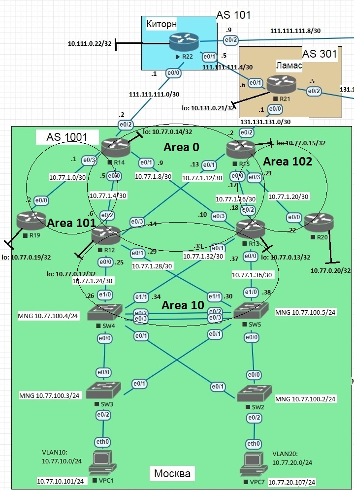

# Лабораторная работа №6 "OSPF. Фильтрация"

## Цель
Настроить OSPF офисе Москва
Разделить сеть на зоны
Настроить фильтрацию между зонами

## Задание

Маршрутизаторы R14-R15 находятся в зоне 0 - backbone.
Маршрутизаторы R12-R13 находятся в зоне 10. Дополнительно к маршрутам должны получать маршрут по умолчанию.
Маршрутизатор R19 находится в зоне 101 и получает только маршрут по умолчанию.
Маршрутизатор R20 находится в зоне 102 и получает все маршруты, кроме маршрутов до сетей зоны 101.

Схема сети Московского отделения с разбиением на зоны представлена на рисунке ниже:



Таблица OSPF router-id:

| device | router-id | 
|-----| ----| 
|R14 | 14.14.14.14 |
|R15 | 15.15.15.15 |
|R12 | 12.12.12.12 |
|R13 | 13.13.13.13 |
|R19 | 19.19.19.19 |
|R20 | 20.20.20.20 |
|SW4 | 4.4.4.4 |
|SW5 | 5.5.5.5 |

Будем настраивать согласно следующих допущений:

- Тип Area 10 - stub
- Тип Area 101 - stub, no-summary
- На маршрутизаторах R14 и R15 распространение шлюза по-умолчанию
- R14 --- R19 и R15 --- R20 настраивается сеть OSPF p-to-p

## Определяем маршрутизаторы R14-R15 в зону 0 - backbone


Настроим OSPF Area 0 на R14:
```
router ospf 1
 router-id 14.14.14.14
 area 101 stub no-summary
 default-information originate
exit


interface Loopback0
 ip address 10.77.0.14 255.255.255.255
 ip ospf 1 area 0
exit

interface Ethernet0/0
 description *** to R12 (e0/2)
 ip address 10.77.1.5 255.255.255.252
 ip ospf 1 area 0
exit

interface Ethernet0/1
 description *** to R13 (e0/3)
 ip address 10.77.1.9 255.255.255.252
 ip ospf 1 area 0
exit

interface Ethernet0/3
 description *** to R19 (e0/0)
 ip address 10.77.1.1 255.255.255.252
 ip ospf network point-to-point
 ip ospf 1 area 101
end


```
и R15:

```
router ospf 1
 router-id 15.15.15.15
 default-information originate
exit


interface Loopback0
 ip address 10.77.0.15 255.255.255.255
 ip ospf 1 area 0
exit

interface Ethernet0/0
 description *** to R13 (e0/2)
 ip address 10.77.1.17 255.255.255.252
 ip ospf 1 area 0
exit

interface Ethernet0/1
 description *** to R12 (e0/3)
 ip address 10.77.1.13 255.255.255.252
 ip ospf 1 area 0
exit


interface Ethernet0/3
 description *** to R19 (e0/0)
 ip address 10.77.1.21 255.255.255.252
 ip ospf network point-to-point
 ip ospf 1 area 102
end

```

## Определяем маршрутизаторы R12-R13 находятся в зоне 10. Дополнительно к маршрутам должны получать маршрут по умолчанию

Настроим OSPF на R12:

```
router ospf 1
 router-id 12.12.12.12
 area 10 stub
exit

interface Loopback0
 ip address 10.77.0.12 255.255.255.255
 ip ospf 1 area 0
exit

interface Ethernet0/0
 description *** to SW4 (e1/0)
 ip address 10.77.1.25 255.255.255.252
 ip ospf 1 area 10
exit

interface Ethernet0/1
 description *** to SW5 (e1/1)
 ip address 10.77.1.29 255.255.255.252
 ip ospf 1 area 10
exit

interface Ethernet0/2
 description *** to R14 (e0/0)
 ip address 10.77.1.6 255.255.255.252
 ip ospf 1 area 0
exit

interface Ethernet0/3
 description *** to R15 (e1/1)
 ip address 10.77.1.14 255.255.255.252
 ip ospf 1 area 0
end
```
R13:
```
router ospf 1
 router-id 13.13.13.13
 area 10 stub
exit

interface Loopback0
 ip address 10.77.0.13 255.255.255.255
 ip ospf 1 area 0
exit

interface Ethernet0/0
 description *** to SW5 (e1/0)
 ip address 10.77.1.37 255.255.255.252
 ip ospf 1 area 10
exit

interface Ethernet0/1
 description *** to SW4 (e1/1)
 ip address 10.77.1.33 255.255.255.252
 ip ospf 1 area 10
exit

interface Ethernet0/2
 description *** to R15 (e0/0)
 ip address 10.77.1.18 255.255.255.252
 ip ospf 1 area 0
exit

interface Ethernet0/3
 description *** to R14 (e0/1)
 ip address 10.77.1.10 255.255.255.252
 ip ospf 1 area 0
end
```

SW4:
```
router ospf 1
 router-id 4.4.4.4
 area 10 stub
exit

interface Ethernet1/0
 no switchport
 ip address 10.77.1.26 255.255.255.252
 duplex auto
 ip ospf 1 area 10
exit

interface Ethernet1/1
 no switchport
 ip address 10.77.1.34 255.255.255.252
 duplex auto
 ip ospf 1 area 10
exit

interface Vlan10
 ip address 10.77.10.4 255.255.255.0
 ip ospf 1 area 10
 vrrp 2 ip 10.77.10.1
 vrrp 2 priority 110
exit

interface Vlan20
 ip address 10.77.20.4 255.255.255.0
 ip ospf 1 area 10
 vrrp 3 ip 10.77.20.1
 vrrp 3 priority 110
exit

interface Vlan100
 ip address 10.77.100.4 255.255.255.0
 ip ospf 1 area 10
 vrrp 1 ip 10.77.100.1
 vrrp 1 priority 110
end
```
и

SW5:
```
router ospf 1
 router-id 5.5.5.5
 area 10 stub
exit

interface Ethernet1/0
 no switchport
 ip address 10.77.1.38 255.255.255.252
 duplex auto
 ip ospf 1 area 10
exit

interface Ethernet1/1
 no switchport
 ip address 10.77.1.30 255.255.255.252
 duplex auto
 ip ospf 1 area 10
exit

interface Vlan10
 ip address 10.77.10.5 255.255.255.0
 ip ospf 1 area 10
 vrrp 2 ip 10.77.10.1
exit

interface Vlan20
 ip address 10.77.20.5 255.255.255.0
 ip ospf 1 area 10
 vrrp 3 ip 10.77.20.1
exit

interface Vlan100
 ip address 10.77.100.5 255.255.255.0
 ip ospf 1 area 10
 vrrp 1 ip 10.77.100.1
end

```

Проверяем соседство на R12:

```
Neighbor ID     Pri   State           Dead Time   Address         Interface
14.14.14.14       1   FULL/DR         00:00:37    10.77.1.5       Ethernet0/2
15.15.15.15       1   FULL/DR         00:00:36    10.77.1.13      Ethernet0/3
4.4.4.4           1   FULL/BDR        00:00:38    10.77.1.26      Ethernet0/0
5.5.5.5           1   FULL/BDR        00:00:30    10.77.1.30      Ethernet0/1
```
И наличие ```O*E2 0.0.0.0/0 на R12```
```
R12#sh ip route
Codes: L - local, C - connected, S - static, R - RIP, M - mobile, B - BGP
       D - EIGRP, EX - EIGRP external, O - OSPF, IA - OSPF inter area
       N1 - OSPF NSSA external type 1, N2 - OSPF NSSA external type 2
       E1 - OSPF external type 1, E2 - OSPF external type 2
       i - IS-IS, su - IS-IS summary, L1 - IS-IS level-1, L2 - IS-IS level-2
       ia - IS-IS inter area, * - candidate default, U - per-user static route
       o - ODR, P - periodic downloaded static route, H - NHRP, l - LISP
       a - application route
       + - replicated route, % - next hop override

Gateway of last resort is 10.77.1.13 to network 0.0.0.0

O*E2  0.0.0.0/0 [110/1] via 10.77.1.13, 00:04:09, Ethernet0/3
                [110/1] via 10.77.1.5, 00:05:34, Ethernet0/2
      10.0.0.0/8 is variably subnetted, 21 subnets, 3 masks
C        10.77.0.12/32 is directly connected, Loopback0
O        10.77.0.13/32 [110/21] via 10.77.1.13, 01:10:26, Ethernet0/3
                       [110/21] via 10.77.1.5, 01:10:16, Ethernet0/2
O        10.77.0.14/32 [110/11] via 10.77.1.5, 01:11:17, Ethernet0/2
O        10.77.0.15/32 [110/11] via 10.77.1.13, 01:11:27, Ethernet0/3
O IA     10.77.1.0/30 [110/20] via 10.77.1.5, 01:11:17, Ethernet0/2
C        10.77.1.4/30 is directly connected, Ethernet0/2
L        10.77.1.6/32 is directly connected, Ethernet0/2
O        10.77.1.8/30 [110/20] via 10.77.1.5, 01:11:17, Ethernet0/2
C        10.77.1.12/30 is directly connected, Ethernet0/3
L        10.77.1.14/32 is directly connected, Ethernet0/3
O        10.77.1.16/30 [110/20] via 10.77.1.13, 01:11:27, Ethernet0/3
O IA     10.77.1.20/30 [110/20] via 10.77.1.13, 01:11:27, Ethernet0/3
C        10.77.1.24/30 is directly connected, Ethernet0/0
L        10.77.1.25/32 is directly connected, Ethernet0/0
C        10.77.1.28/30 is directly connected, Ethernet0/1
L        10.77.1.29/32 is directly connected, Ethernet0/1
O        10.77.1.32/30 [110/20] via 10.77.1.26, 01:09:14, Ethernet0/0
O        10.77.1.36/30 [110/20] via 10.77.1.30, 01:09:14, Ethernet0/1
O        10.77.10.0/24 [110/11] via 10.77.1.30, 01:09:14, Ethernet0/1
                       [110/11] via 10.77.1.26, 01:08:39, Ethernet0/0
O        10.77.20.0/24 [110/11] via 10.77.1.30, 01:09:14, Ethernet0/1
                       [110/11] via 10.77.1.26, 01:08:39, Ethernet0/0
O        10.77.100.0/24 [110/11] via 10.77.1.30, 01:09:14, Ethernet0/1
                        [110/11] via 10.77.1.26, 01:08:39, Ethernet0/0

```
Видно, что маршрут по умолчанию "прилетает" по OSPF.


## Определяем маршрутизатор R19 в зону 101 и получаем только маршрут по умолчанию

Настроим на R19:

```
router ospf 1
 router-id 19.19.19.19
 area 101 stub no-summary
exit

interface Loopback0
 ip address 10.77.0.19 255.255.255.255
 ip ospf 1 area 101
exit

interface Ethernet0/0
 description *** to R14 (e0/3)
 ip address 10.77.1.2 255.255.255.252
 ip ospf network point-to-point
 ip ospf 1 area 101
end
```
Проверяем соседство и маршруты:
```
R19#sh ip ospf neighbor

Neighbor ID     Pri   State           Dead Time   Address         Interface
14.14.14.14       1   FULL/BDR        00:00:30    10.77.1.1       Ethernet0/0
R19#sh ip rou
R19#sh ip route
Codes: L - local, C - connected, S - static, R - RIP, M - mobile, B - BGP
       D - EIGRP, EX - EIGRP external, O - OSPF, IA - OSPF inter area
       N1 - OSPF NSSA external type 1, N2 - OSPF NSSA external type 2
       E1 - OSPF external type 1, E2 - OSPF external type 2
       i - IS-IS, su - IS-IS summary, L1 - IS-IS level-1, L2 - IS-IS level-2
       ia - IS-IS inter area, * - candidate default, U - per-user static route
       o - ODR, P - periodic downloaded static route, H - NHRP, l - LISP
       a - application route
       + - replicated route, % - next hop override

Gateway of last resort is 10.77.1.1 to network 0.0.0.0

O*IA  0.0.0.0/0 [110/11] via 10.77.1.1, 00:00:15, Ethernet0/0
      10.0.0.0/8 is variably subnetted, 3 subnets, 2 masks
C        10.77.0.19/32 is directly connected, Loopback0
C        10.77.1.0/30 is directly connected, Ethernet0/0
L        10.77.1.2/32 is directly connected, Ethernet0/0

```

## Определяем маршрутизатор R20 в зону 102 и получаем все маршруты, кроме маршрутов до сетей зоны 101

На R20 настраиваем стандартную зону:
```
router ospf 1
 router-id 19.19.19.19
 exit


interface Loopback0
 ip address 10.77.0.20 255.255.255.255
 ip ospf 1 area 102
exit

interface Ethernet0/0
 description *** to R15 (e0/3)
 ip address 10.77.1.22 255.255.255.252
 ip ospf network point-to-point
 ip ospf 1 area 102
end
```

Вывод show ip route:
```
R20#sh ip ro
Codes: L - local, C - connected, S - static, R - RIP, M - mobile, B - BGP
       D - EIGRP, EX - EIGRP external, O - OSPF, IA - OSPF inter area
       N1 - OSPF NSSA external type 1, N2 - OSPF NSSA external type 2
       E1 - OSPF external type 1, E2 - OSPF external type 2
       i - IS-IS, su - IS-IS summary, L1 - IS-IS level-1, L2 - IS-IS level-2
       ia - IS-IS inter area, * - candidate default, U - per-user static route
       o - ODR, P - periodic downloaded static route, H - NHRP, l - LISP
       a - application route
       + - replicated route, % - next hop override

Gateway of last resort is 10.77.1.21 to network 0.0.0.0

O*E2  0.0.0.0/0 [110/1] via 10.77.1.21, 00:00:19, Ethernet0/0
      10.0.0.0/8 is variably subnetted, 20 subnets, 3 masks
O IA     10.77.0.12/32 [110/21] via 10.77.1.21, 00:00:19, Ethernet0/0
O IA     10.77.0.13/32 [110/21] via 10.77.1.21, 00:00:19, Ethernet0/0
O IA     10.77.0.14/32 [110/31] via 10.77.1.21, 00:00:19, Ethernet0/0
O IA     10.77.0.15/32 [110/11] via 10.77.1.21, 00:00:19, Ethernet0/0
O IA     10.77.0.19/32 [110/41] via 10.77.1.21, 00:00:19, Ethernet0/0
C        10.77.0.20/32 is directly connected, Loopback0
O IA     10.77.1.0/30 [110/40] via 10.77.1.21, 00:00:19, Ethernet0/0
O IA     10.77.1.4/30 [110/30] via 10.77.1.21, 00:00:19, Ethernet0/0
O IA     10.77.1.8/30 [110/30] via 10.77.1.21, 00:00:19, Ethernet0/0
O IA     10.77.1.12/30 [110/20] via 10.77.1.21, 00:00:19, Ethernet0/0
O IA     10.77.1.16/30 [110/20] via 10.77.1.21, 00:00:19, Ethernet0/0
C        10.77.1.20/30 is directly connected, Ethernet0/0
L        10.77.1.22/32 is directly connected, Ethernet0/0
O IA     10.77.1.24/30 [110/30] via 10.77.1.21, 00:00:19, Ethernet0/0
O IA     10.77.1.28/30 [110/30] via 10.77.1.21, 00:00:19, Ethernet0/0
O IA     10.77.1.32/30 [110/30] via 10.77.1.21, 00:00:19, Ethernet0/0
O IA     10.77.1.36/30 [110/30] via 10.77.1.21, 00:00:19, Ethernet0/0
O IA     10.77.10.0/24 [110/31] via 10.77.1.21, 00:00:19, Ethernet0/0
O IA     10.77.20.0/24 [110/31] via 10.77.1.21, 00:00:19, Ethernet0/0
O IA     10.77.100.0/24 [110/31] via 10.77.1.21, 00:00:19, Ethernet0/0
R20#
```
Отфильтруем маршруты из зоны 101 маршрутизаторе R15:

```
ip prefix-list WITHOUT_Area101 seq 5 deny 10.77.0.19/32 
ip prefix-list WITHOUT_Area101 seq 10 deny 10.77.1.0/30 le 32
ip prefix-list WITHOUT_Area101 seq 15 permit 0.0.0.0/0 le 32

router ospf 1
 router-id 15.15.15.15
 area 102 filter-list prefix WITHOUT_Area101 in
 default-information originate
exit
```

Проверяем на маршруты из Area 101:

```
R20#sh ip ro
Codes: L - local, C - connected, S - static, R - RIP, M - mobile, B - BGP
       D - EIGRP, EX - EIGRP external, O - OSPF, IA - OSPF inter area
       N1 - OSPF NSSA external type 1, N2 - OSPF NSSA external type 2
       E1 - OSPF external type 1, E2 - OSPF external type 2
       i - IS-IS, su - IS-IS summary, L1 - IS-IS level-1, L2 - IS-IS level-2
       ia - IS-IS inter area, * - candidate default, U - per-user static route
       o - ODR, P - periodic downloaded static route, H - NHRP, l - LISP
       a - application route
       + - replicated route, % - next hop override

Gateway of last resort is 10.77.1.21 to network 0.0.0.0

O*E2  0.0.0.0/0 [110/1] via 10.77.1.21, 00:33:08, Ethernet0/0
      10.0.0.0/8 is variably subnetted, 18 subnets, 3 masks
O IA     10.77.0.12/32 [110/21] via 10.77.1.21, 00:33:08, Ethernet0/0
O IA     10.77.0.13/32 [110/21] via 10.77.1.21, 00:33:08, Ethernet0/0
O IA     10.77.0.14/32 [110/31] via 10.77.1.21, 00:33:08, Ethernet0/0
O IA     10.77.0.15/32 [110/11] via 10.77.1.21, 00:33:08, Ethernet0/0
C        10.77.0.20/32 is directly connected, Loopback0
O IA     10.77.1.4/30 [110/30] via 10.77.1.21, 00:33:08, Ethernet0/0
O IA     10.77.1.8/30 [110/30] via 10.77.1.21, 00:33:08, Ethernet0/0
O IA     10.77.1.12/30 [110/20] via 10.77.1.21, 00:33:08, Ethernet0/0
O IA     10.77.1.16/30 [110/20] via 10.77.1.21, 00:33:08, Ethernet0/0
C        10.77.1.20/30 is directly connected, Ethernet0/0
L        10.77.1.22/32 is directly connected, Ethernet0/0
O IA     10.77.1.24/30 [110/30] via 10.77.1.21, 00:33:08, Ethernet0/0
O IA     10.77.1.28/30 [110/30] via 10.77.1.21, 00:33:08, Ethernet0/0
O IA     10.77.1.32/30 [110/30] via 10.77.1.21, 00:33:08, Ethernet0/0
O IA     10.77.1.36/30 [110/30] via 10.77.1.21, 00:33:08, Ethernet0/0
O IA     10.77.10.0/24 [110/31] via 10.77.1.21, 00:33:08, Ethernet0/0
O IA     10.77.20.0/24 [110/31] via 10.77.1.21, 00:33:08, Ethernet0/0
O IA     10.77.100.0/24 [110/31] via 10.77.1.21, 00:33:08, Ethernet0/0
R20#
```
Видно, что маршруты 10.77.0.19/32 и 10.77.1.0/30 успешно отвильтрованы.

Конфигурационныe файлы можно найти по [ссылке](./cfg).
