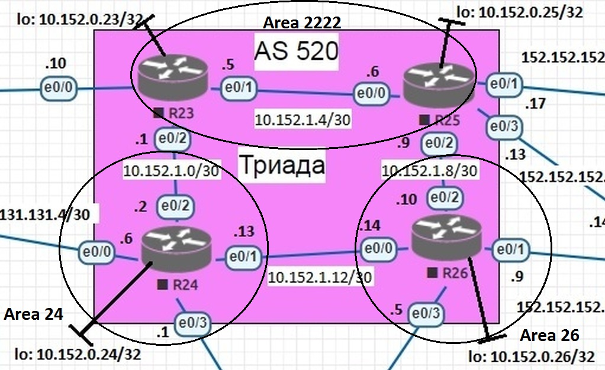

# Лабораторная работа №7 "IS-IS"

## Цель
Настроить IS-IS в офисе Триада.

## Задание
Настроить IS-IS в ISP Триада.
R23 и R25 находятся в зоне 2222.
R24 находится в зоне 24.
R26 находится в зоне 26.

Схема сети провайдера Триада с разбиением на зоны представлена на рисунке ниже:




Минимальная настройка протокола осушествляется командой:

```
router isis
net 49.2222.0000.0000.0023.00
```

где 49.2222.0000.0000.0023.00 --- NSAP-адрес маршрутизатора:
49 - указывает тип адреса (приватный), 2222 - номер зоны, 0000.0000.0023 - ID устройства (у нас будет по номеру маршрутизатора), 00 - селектор (всегда ноль).

Т.о. таблица NSAP-адресов выглядит следующим образом:

| Маршрутизатор| NSAP-адрес   |
| --------     | -------     |
| R23          | 49.2222.0000.0000.0023.00 |
| R24          | 49.0024.0000.0000.0024.00 |
| R25          | 49.2222.0000.0000.0025.00 |
| R26          | 49.0026.0000.0000.0026.00 |


На интерфейсах выполняем:

```
(config-if)#ip router isis
```

Подробная настройка ниже.


Настраиваем зону 2222 на R23 и R25.
R23:
```
interface Ethernet0/1
 no shutdown
 description *** to R25 (e0/0)
 ip address 10.152.1.5 255.255.255.252
 ip router isis 
exit

interface Ethernet0/2
 no shutdown
 description *** to R24 (e0/2)
 ip address 10.152.1.1 255.255.255.252
 ip router isis
exit

router isis
 net 49.2222.0000.0000.0023.00
end 

```

R25:
```
interface Ethernet0/0
 no shutdown
 description *** to R23(e0/1)
 ip address 10.152.1.6 255.255.255.252
 ip router isis 
exit

interface Ethernet0/2
 no shutdown
 description *** to R26 (e0/2)
 ip address 10.152.1.9 255.255.255.252
 ip router isis
exit

router isis
 net 49.2222.0000.0000.0025.00
end 

```

Настраиваем зону 24 на R24:
```
interface Ethernet0/1
 no shutdown
 description *** to R26 (e0/0)
 ip address 10.152.1.13 255.255.255.252
 ip router isis
exit

interface Ethernet0/2
 no shutdown
 description *** to R23 (e0/2)
 ip address 10.152.1.2 255.255.255.252
 ip router isis
exit

router isis
 net 49.0024.0000.0000.0024.00
end 

```

Настраиваем зону 26 на R26:
```
interface Ethernet0/0
 no shutdown
 description *** to R24 (e0/1)
 ip address 10.152.1.14 255.255.255.252
 ip router isis
exit

interface Ethernet0/2
 no shutdown
 description *** to R25 (e0/2)
 ip address 10.152.1.10 255.255.255.252
 ip router isis
exit

router isis
 net 49.0026.0000.0000.0026.00
end 
```

Производим проверку:

```
R23#sh isis neighbors

System Id      Type Interface   IP Address      State Holdtime Circuit Id
R24            L2   Et0/2       10.152.1.2      UP    8        R24.02
R25            L1   Et0/1       10.152.1.6      UP    9        R25.01
R25            L2   Et0/1       10.152.1.6      UP    9        R25.01
R23#
R23#sh ip route isis
Codes: L - local, C - connected, S - static, R - RIP, M - mobile, B - BGP
       D - EIGRP, EX - EIGRP external, O - OSPF, IA - OSPF inter area
       N1 - OSPF NSSA external type 1, N2 - OSPF NSSA external type 2
       E1 - OSPF external type 1, E2 - OSPF external type 2
       i - IS-IS, su - IS-IS summary, L1 - IS-IS level-1, L2 - IS-IS level-2
       ia - IS-IS inter area, * - candidate default, U - per-user static route
       o - ODR, P - periodic downloaded static route, H - NHRP, l - LISP
       a - application route
       + - replicated route, % - next hop override

Gateway of last resort is not set

      10.0.0.0/8 is variably subnetted, 7 subnets, 2 masks
i L1     10.152.1.8/30 [115/20] via 10.152.1.6, 00:07:14, Ethernet0/1
i L2     10.152.1.12/30 [115/20] via 10.152.1.2, 00:03:31, Ethernet0/2
R23#
R23#show isis topology

IS-IS TID 0 paths to level-1 routers
System Id            Metric     Next-Hop             Interface   SNPA
R23                  --
R25                  10         R25                  Et0/1       aabb.cc01.9000

IS-IS TID 0 paths to level-2 routers
System Id            Metric     Next-Hop             Interface   SNPA
R23                  --
R24                  10         R24                  Et0/2       aabb.cc01.8020
R25                  10         R25                  Et0/1       aabb.cc01.9000
R26                  20         R24                  Et0/2       aabb.cc01.8020
                                R25                  Et0/1       aabb.cc01.9000
```
из которой видно, что соседство установилось и распространились пути. Также видно, что появились две LSDB-таблицы: одна для L1 связей (соседи по зоне), вторая для L2 (из внешних зон).

Конфигурационныe файлы можно найти по [ссылке](./cfg).
