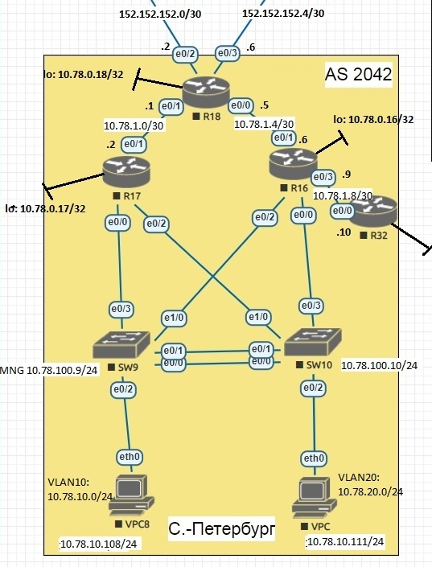

# Лабораторная работа №8 "EIGRP"

## Цель
Настроить EIGRP в С.-Петербург;
Использовать named EIGRP

## Задание

1. В офисе С.-Петербург настроить EIGRP
2. R32 получает только маршрут по умолчанию
3. R16-17 анонсируют только суммарные префиксы
4. Использовать EIGRP named-mode для настройки сети


Схема сети в Санкт-Петербурге представлена на рисунке ниже:




## Решение


### Настройка
По условию задания, R16-17 анонсируют только суммарные префиксы.

Настроим на R16:
- EIGRP;
- суммаризацию пользовательских сетей 10.78.0.0/16 (loopback-и, пользовательские подсети, подсеть управления);
- ограничение анонса маршрутов в сторону R32 по префикс-листу DEFAULT.
```
router eigrp SPB
 address-family ipv4 unicast autonomous-system 2042
  af-interface Ethernet0/1
   summary-address 10.78.0.0 255.255.0.0
  exit-af-interface
  topology base
   distribute-list prefix DEFAULT out Ethernet0/3
  exit-af-topology
  network 10.78.0.16 0.0.0.0
  network 10.78.1.4 0.0.0.3
  network 10.78.1.8 0.0.0.3
  network 10.78.10.0 0.0.0.255
  network 10.78.20.0 0.0.0.255
  network 10.78.100.0 0.0.0.255
  eigrp router-id 16.16.16.16
 exit-address-family

ip prefix-list DEFAULT seq 5 permit 0.0.0.0/0
route-map DEFAULT-ONLY permit 10
 match ip address prefix-list ONLY-DEFAULT

```

Настроим на R17:
- EIGRP
- суммаризацию пользовательских сетей 10.78.0.0/16 (loopback-и, пользовательские подсети, подсеть управления).
```
router eigrp SPB
 address-family ipv4 unicast autonomous-system 2042
  af-interface Ethernet0/1
   summary-address 10.78.0.0 255.255.0.0
  exit-af-interface
  topology base
  exit-af-topology
  network 10.78.0.17 0.0.0.0
  network 10.78.1.0 0.0.0.3
  network 10.78.10.0 0.0.0.255
  network 10.78.20.0 0.0.0.255
  network 10.78.100.0 0.0.0.255
  eigrp router-id 17.17.17.17
 exit-address-family
```


Настроим на R18:
- EIGRP;
- редистрибуцию статики по умолчанию.
```
router eigrp SPB
 address-family ipv4 unicast autonomous-system 2042
  topology base
   redistribute static
  exit-af-topology
  network 10.78.0.18 0.0.0.0
  network 10.78.1.0 0.0.0.3
  network 10.78.1.4 0.0.0.3
  eigrp router-id 18.18.18.18
 exit-address-family
```
Настроим на R18:
- EIGRP.
```
router eigrp SPB
 address-family ipv4 unicast autonomous-system 2042
  topology base
  exit-af-topology
  network 10.78.0.32 0.0.0.0
  network 10.78.1.8 0.0.0.3
  eigrp router-id 32.32.32.32
 exit-address-family
```

### Проверка

Пропишем на R18 статикой в сторону R24 и R26 маршруты по умолчанию:
```
ip route 0.0.0.0 0.0.0.0 152.152.152.1
ip route 0.0.0.0 0.0.0.0 152.152.152.5
```

### R16

Таблица маршрутизации:
```
R16#sh ip route eigrp
Codes: L - local, C - connected, S - static, R - RIP, M - mobile, B - BGP
       D - EIGRP, EX - EIGRP external, O - OSPF, IA - OSPF inter area
       N1 - OSPF NSSA external type 1, N2 - OSPF NSSA external type 2
       E1 - OSPF external type 1, E2 - OSPF external type 2
       i - IS-IS, su - IS-IS summary, L1 - IS-IS level-1, L2 - IS-IS level-2
       ia - IS-IS inter area, * - candidate default, U - per-user static route
       o - ODR, P - periodic downloaded static route, H - NHRP, l - LISP
       a - application route
       + - replicated route, % - next hop override

Gateway of last resort is 10.78.1.5 to network 0.0.0.0

D*EX  0.0.0.0/0 [170/1536000] via 10.78.1.5, 00:01:55, Ethernet0/1
      10.0.0.0/8 is variably subnetted, 16 subnets, 4 masks
D        10.78.0.0/16 is a summary, 02:46:48, Null0
D        10.78.0.17/32
           [90/1024640] via 10.78.100.17, 02:24:16, Ethernet0/0.100
D        10.78.0.18/32 [90/1024640] via 10.78.1.5, 01:34:44, Ethernet0/1
D        10.78.0.32/32 [90/1024640] via 10.78.1.10, 01:36:21, Ethernet0/3
D        10.78.1.0/30 [90/1536000] via 10.78.100.17, 01:34:44, Ethernet0/0.100
                      [90/1536000] via 10.78.1.5, 01:34:44, Ethernet0/1
```
Проверим связность:

```
R16#ping 10.78.0.17
Type escape sequence to abort.
Sending 5, 100-byte ICMP Echos to 10.78.0.17, timeout is 2 seconds:
!!!!!
Success rate is 100 percent (5/5), round-trip min/avg/max = 1/2/3 ms
R16#ping 10.78.0.18
Type escape sequence to abort.
Sending 5, 100-byte ICMP Echos to 10.78.0.18, timeout is 2 seconds:
!!!!!
Success rate is 100 percent (5/5), round-trip min/avg/max = 1/1/1 ms
R16#ping 10.78.100.9
Type escape sequence to abort.
Sending 5, 100-byte ICMP Echos to 10.78.100.9, timeout is 2 seconds:
!!!!!
Success rate is 100 percent (5/5), round-trip min/avg/max = 1/1/2 ms
R16#ping 10.78.0.32
Type escape sequence to abort.
Sending 5, 100-byte ICMP Echos to 10.78.0.32, timeout is 2 seconds:
!!!!!
Success rate is 100 percent (5/5), round-trip min/avg/max = 1/1/2 ms
R16#ping 10.78.100.10
Type escape sequence to abort.
Sending 5, 100-byte ICMP Echos to 10.78.100.10, timeout is 2 seconds:
!!!!!
Success rate is 100 percent (5/5), round-trip min/avg/max = 1/1/2 ms
R16#ping 10.78.10.108
Type escape sequence to abort.
Sending 5, 100-byte ICMP Echos to 10.78.10.108, timeout is 2 seconds:
!!!!!
Success rate is 100 percent (5/5), round-trip min/avg/max = 1/1/1 ms
R16#ping 10.78.20.111
Type escape sequence to abort.
Sending 5, 100-byte ICMP Echos to 10.78.20.111, timeout is 2 seconds:
!!!!!
Success rate is 100 percent (5/5), round-trip min/avg/max = 1/1/2 ms
```
### R17

Таблица маршрутизации:
```
R17#sh ip route eigrp
Codes: L - local, C - connected, S - static, R - RIP, M - mobile, B - BGP
       D - EIGRP, EX - EIGRP external, O - OSPF, IA - OSPF inter area
       N1 - OSPF NSSA external type 1, N2 - OSPF NSSA external type 2
       E1 - OSPF external type 1, E2 - OSPF external type 2
       i - IS-IS, su - IS-IS summary, L1 - IS-IS level-1, L2 - IS-IS level-2
       ia - IS-IS inter area, * - candidate default, U - per-user static route
       o - ODR, P - periodic downloaded static route, H - NHRP, l - LISP
       a - application route
       + - replicated route, % - next hop override

Gateway of last resort is 10.78.1.1 to network 0.0.0.0

D*EX  0.0.0.0/0 [170/1536000] via 10.78.1.1, 00:26:12, Ethernet0/1
      10.0.0.0/8 is variably subnetted, 14 subnets, 4 masks
D        10.78.0.0/16 is a summary, 02:48:36, Null0
D        10.78.0.16/32
           [90/1024640] via 10.78.100.16, 02:48:34, Ethernet0/0.100
D        10.78.0.18/32 [90/1024640] via 10.78.1.1, 01:59:01, Ethernet0/1
D        10.78.0.32/32
           [90/1536640] via 10.78.100.16, 02:00:38, Ethernet0/0.100
D        10.78.1.4/30 [90/1536000] via 10.78.100.16, 01:59:01, Ethernet0/0.100
                      [90/1536000] via 10.78.1.1, 01:59:01, Ethernet0/1
D        10.78.1.8/30 [90/1536000] via 10.78.100.16, 02:48:34, Ethernet0/0.100
D        10.78.20.0/24
           [90/1536000] via 10.78.100.16, 02:48:34, Ethernet0/0.100
R
```
Проверим связность:

```
R17#ping 10.78.0.16
Type escape sequence to abort.
Sending 5, 100-byte ICMP Echos to 10.78.0.16, timeout is 2 seconds:
!!!!!
Success rate is 100 percent (5/5), round-trip min/avg/max = 2/2/3 ms
R17#ping 10.78.0.18
Type escape sequence to abort.
Sending 5, 100-byte ICMP Echos to 10.78.0.18, timeout is 2 seconds:
!!!!!
Success rate is 100 percent (5/5), round-trip min/avg/max = 1/2/5 ms
R17#ping 10.78.0.32
Type escape sequence to abort.
Sending 5, 100-byte ICMP Echos to 10.78.0.32, timeout is 2 seconds:
!!!!!
Success rate is 100 percent (5/5), round-trip min/avg/max = 2/2/4 ms
R17#ping 10.78.100.9
Type escape sequence to abort.
Sending 5, 100-byte ICMP Echos to 10.78.100.9, timeout is 2 seconds:
!!!!!
Success rate is 100 percent (5/5), round-trip min/avg/max = 1/1/1 ms
R17#ping 10.78.100.10
Type escape sequence to abort.
Sending 5, 100-byte ICMP Echos to 10.78.100.10, timeout is 2 seconds:
!!!!!
Success rate is 100 percent (5/5), round-trip min/avg/max = 1/2/6 ms
R17#ping 10.78.10.108
Type escape sequence to abort.
Sending 5, 100-byte ICMP Echos to 10.78.10.108, timeout is 2 seconds:
!!!!!
Success rate is 100 percent (5/5), round-trip min/avg/max = 1/1/2 ms
R17#ping 10.78.20.111
Type escape sequence to abort.
Sending 5, 100-byte ICMP Echos to 10.78.20.111, timeout is 2 seconds:
!!!!!
Success rate is 100 percent (5/5), round-trip min/avg/max = 2/3/5 ms

```

### R18

Таблица маршрутизации:
```
R18#sh ip route eigrp
Codes: L - local, C - connected, S - static, R - RIP, M - mobile, B - BGP
       D - EIGRP, EX - EIGRP external, O - OSPF, IA - OSPF inter area
       N1 - OSPF NSSA external type 1, N2 - OSPF NSSA external type 2
       E1 - OSPF external type 1, E2 - OSPF external type 2
       i - IS-IS, su - IS-IS summary, L1 - IS-IS level-1, L2 - IS-IS level-2
       ia - IS-IS inter area, * - candidate default, U - per-user static route
       o - ODR, P - periodic downloaded static route, H - NHRP, l - LISP
       a - application route
       + - replicated route, % - next hop override

Gateway of last resort is 152.152.152.5 to network 0.0.0.0

      10.0.0.0/8 is variably subnetted, 6 subnets, 3 masks
D        10.78.0.0/16 [90/1024640] via 10.78.1.6, 02:01:37, Ethernet0/0
                      [90/1024640] via 10.78.1.2, 02:01:37, Ethernet0/1

```
Проверим связность:

```
R18#ping 10.78.0.16
Type escape sequence to abort.
Sending 5, 100-byte ICMP Echos to 10.78.0.16, timeout is 2 seconds:
!!!!!
Success rate is 100 percent (5/5), round-trip min/avg/max = 2/2/4 ms
R18#ping 10.78.0.17
Type escape sequence to abort.
Sending 5, 100-byte ICMP Echos to 10.78.0.17, timeout is 2 seconds:
!!!!!
Success rate is 100 percent (5/5), round-trip min/avg/max = 3/4/6 ms
R18#ping 10.78.0.32
Type escape sequence to abort.
Sending 5, 100-byte ICMP Echos to 10.78.0.32, timeout is 2 seconds:
!!!!!
Success rate is 100 percent (5/5), round-trip min/avg/max = 1/2/3 ms
R18#
R18#ping 10.78.100.9
Type escape sequence to abort.
Sending 5, 100-byte ICMP Echos to 10.78.100.9, timeout is 2 seconds:
!!!!!
Success rate is 100 percent (5/5), round-trip min/avg/max = 1/1/3 ms
R18#ping 10.78.100.10
Type escape sequence to abort.
Sending 5, 100-byte ICMP Echos to 10.78.100.10, timeout is 2 seconds:
!!!!!
Success rate is 100 percent (5/5), round-trip min/avg/max = 2/3/4 ms
R18#ping 10.78.10.108
Type escape sequence to abort.
Sending 5, 100-byte ICMP Echos to 10.78.10.108, timeout is 2 seconds:
!!!!!
Success rate is 100 percent (5/5), round-trip min/avg/max = 1/1/2 ms
R18#ping 10.78.20.111
Type escape sequence to abort.
Sending 5, 100-byte ICMP Echos to 10.78.20.111, timeout is 2 seconds:
!!!!!
Success rate is 100 percent (5/5), round-trip min/avg/max = 1/3/11 ms

```

### R32

Таблица маршрутизации:
```
R32#sh ip route eigrp
Codes: L - local, C - connected, S - static, R - RIP, M - mobile, B - BGP
       D - EIGRP, EX - EIGRP external, O - OSPF, IA - OSPF inter area
       N1 - OSPF NSSA external type 1, N2 - OSPF NSSA external type 2
       E1 - OSPF external type 1, E2 - OSPF external type 2
       i - IS-IS, su - IS-IS summary, L1 - IS-IS level-1, L2 - IS-IS level-2
       ia - IS-IS inter area, * - candidate default, U - per-user static route
       o - ODR, P - periodic downloaded static route, H - NHRP, l - LISP
       a - application route
       + - replicated route, % - next hop override

Gateway of last resort is 10.78.1.9 to network 0.0.0.0

D*EX  0.0.0.0/0 [170/2048000] via 10.78.1.9, 00:08:17, Ethernet0/0
```
Проверим связность:

```
R32#ping 10.78.0.16
Type escape sequence to abort.
Sending 5, 100-byte ICMP Echos to 10.78.0.16, timeout is 2 seconds:
!!!!!
Success rate is 100 percent (5/5), round-trip min/avg/max = 1/1/2 ms
R32#ping 10.78.0.17
Type escape sequence to abort.
Sending 5, 100-byte ICMP Echos to 10.78.0.17, timeout is 2 seconds:
!!!!!
Success rate is 100 percent (5/5), round-trip min/avg/max = 2/3/7 ms
R32#ping 10.78.0.18
Type escape sequence to abort.
Sending 5, 100-byte ICMP Echos to 10.78.0.18, timeout is 2 seconds:
!!!!!
Success rate is 100 percent (5/5), round-trip min/avg/max = 1/1/3 ms
R32#ping 10.78.100.9
Type escape sequence to abort.
Sending 5, 100-byte ICMP Echos to 10.78.100.9, timeout is 2 seconds:
!!!!!
Success rate is 100 percent (5/5), round-trip min/avg/max = 3/3/5 ms
R32#ping 10.78.100.10
Type escape sequence to abort.
Sending 5, 100-byte ICMP Echos to 10.78.100.10, timeout is 2 seconds:
!!!!!
Success rate is 100 percent (5/5), round-trip min/avg/max = 2/3/5 ms
R32#ping 10.78.10.108
Type escape sequence to abort.
Sending 5, 100-byte ICMP Echos to 10.78.20.111, timeout is 2 seconds:
!!!!!
Success rate is 100 percent (5/5), round-trip min/avg/max = 1/2/7 ms
R32#ping 10.78.20.111
Type escape sequence to abort.
Sending 5, 100-byte ICMP Echos to 10.78.20.111, timeout is 2 seconds:
!!!!!
Success rate is 100 percent (5/5), round-trip min/avg/max = 1/3/8 ms
R32#

```

Конфигурационныe файлы можно найти по [ссылке](./cfg).
