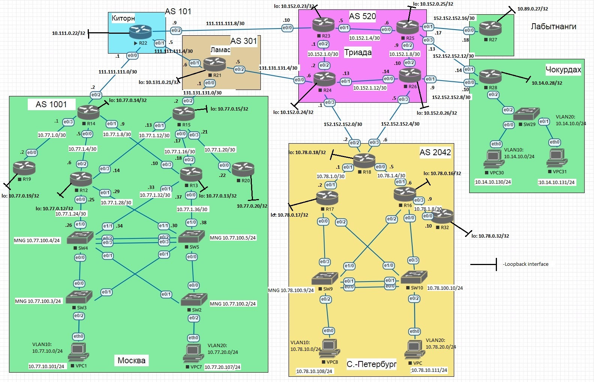

# Лабораторная работа №9 "BGP. Основы (eBGP)"

## Цель
Настроить BGP между автономными системами
Организовать доступность между офисами Москва и С.-Петербург

## Задание

1. Настроите eBGP между офисом Москва и двумя провайдерами - Киторн и Ламас.
2. Настроите eBGP между провайдерами Киторн и Ламас.
3. Настроите eBGP между Ламас и Триада.
4. Настроите eBGP между офисом С.-Петербург и провайдером Триада.
5. Организуете IP доступность между пограничным роутерами офисами Москва и С.-Петербург.


Схема сети представлена на рисунке ниже:




## Решение


### Настройка

#### Москва

R14: 
```
router bgp 1001
 bgp router-id 10.77.0.14
 bgp log-neighbor-changes
 neighbor 111.111.111.1 remote-as 101
end

```

R15: 
```
router bgp 1001
 bgp router-id 10.77.0.15
 bgp log-neighbor-changes
 neighbor 131.131.131.1 remote-as 301
end

```

#### Киторн

R22: 
```
router bgp 101
 bgp router-id 10.111.0.22
 bgp log-neighbor-changes
 network 111.111.111.0 mask 255.255.255.0
 neighbor 111.111.111.2 remote-as 1001
 neighbor 111.111.111.6 remote-as 301
 neighbor 111.111.111.10 remote-as 520
exit

ip route 111.111.111.0 255.255.255.0 Null0
end

```

#### Ламас

R21: 
```
router bgp 301
 bgp router-id 10.131.0.22
 bgp log-neighbor-changes
 network 131.131.131.0 mask 255.255.255.0
 neighbor 131.131.131.2 remote-as 1001
 neighbor 111.111.111.5 remote-as 101
 neighbor 131.131.131.6 remote-as 520
exit

ip route 131.131.131.0 255.255.255.0 Null0
end

```

#### Триада

R24: 
```
router bgp 520
 bgp router-id 10.152.0.24
 bgp log-neighbor-changes
 network 152.152.152.0 mask 255.255.255.0
 neighbor 131.131.131.5 remote-as 301
 neighbor 152.152.152.2 remote-as 2042
exit

ip route 152.152.152.0 255.255.255.0 Null0
end

```

R26: 
```
router bgp 520
 bgp router-id 10.152.0.26
 bgp log-neighbor-changes
 network 152.152.152.0 mask 255.255.255.0
  neighbor 152.152.152.6 remote-as 2042
exit

ip route 152.152.152.0 255.255.255.0 Null0
end

```
#### Санкт-Петербург

R18:
```
router bgp 2042
 bgp router-id 10.78.0.18
 bgp log-neighbor-changes
 neighbor 152.152.152.1 remote-as 520
 neighbor 152.152.152.5 remote-as 520
end

```

### Проверка (соседство и маршруты)

R14:
```
R14#show ip bgp summary
BGP router identifier 10.77.0.14, local AS number 1001
BGP table version is 4, main routing table version 4
3 network entries using 420 bytes of memory
3 path entries using 240 bytes of memory
3/3 BGP path/bestpath attribute entries using 432 bytes of memory
3 BGP AS-PATH entries using 72 bytes of memory
0 BGP route-map cache entries using 0 bytes of memory
0 BGP filter-list cache entries using 0 bytes of memory
BGP using 1164 total bytes of memory
BGP activity 3/0 prefixes, 3/0 paths, scan interval 60 secs

Neighbor        V           AS MsgRcvd MsgSent   TblVer  InQ OutQ Up/Down  State/PfxRcd
111.111.111.1   4          101      42      41        4    0    0 00:33:52        3
R14#show bgp
BGP table version is 4, local router ID is 10.77.0.14
Status codes: s suppressed, d damped, h history, * valid, > best, i - internal,
              r RIB-failure, S Stale, m multipath, b backup-path, f RT-Filter,
              x best-external, a additional-path, c RIB-compressed,
Origin codes: i - IGP, e - EGP, ? - incomplete
RPKI validation codes: V valid, I invalid, N Not found

     Network          Next Hop            Metric LocPrf Weight Path
 *>  111.111.111.0/24 111.111.111.1            0             0 101 i
 *>  131.131.131.0/24 111.111.111.1                          0 101 301 i
 *>  152.152.152.0/24 111.111.111.1                          0 101 301 520 i
```

R15:
```
R15#show ip bgp summary
BGP router identifier 10.77.0.15, local AS number 1001
BGP table version is 4, main routing table version 4
3 network entries using 420 bytes of memory
3 path entries using 240 bytes of memory
3/3 BGP path/bestpath attribute entries using 432 bytes of memory
3 BGP AS-PATH entries using 72 bytes of memory
0 BGP route-map cache entries using 0 bytes of memory
0 BGP filter-list cache entries using 0 bytes of memory
BGP using 1164 total bytes of memory
BGP activity 3/0 prefixes, 3/0 paths, scan interval 60 secs

Neighbor        V           AS MsgRcvd MsgSent   TblVer  InQ OutQ Up/Down  State/PfxRcd
131.131.131.1   4          301      39      36        4    0    0 00:30:33        3
R15#show bgp
BGP table version is 4, local router ID is 10.77.0.15
Status codes: s suppressed, d damped, h history, * valid, > best, i - internal,
              r RIB-failure, S Stale, m multipath, b backup-path, f RT-Filter,
              x best-external, a additional-path, c RIB-compressed,
Origin codes: i - IGP, e - EGP, ? - incomplete
RPKI validation codes: V valid, I invalid, N Not found

     Network          Next Hop            Metric LocPrf Weight Path
 *>  111.111.111.0/24 131.131.131.1                          0 301 101 i
 *>  131.131.131.0/24 131.131.131.1            0             0 301 i
 *>  152.152.152.0/24 131.131.131.1                          0 301 520 i
```

R22:
```
R22#show ip bgp summary
BGP router identifier 10.111.0.22, local AS number 101
BGP table version is 4, main routing table version 4
3 network entries using 420 bytes of memory
3 path entries using 240 bytes of memory
3/3 BGP path/bestpath attribute entries using 432 bytes of memory
2 BGP AS-PATH entries using 48 bytes of memory
0 BGP route-map cache entries using 0 bytes of memory
0 BGP filter-list cache entries using 0 bytes of memory
BGP using 1140 total bytes of memory
BGP activity 3/0 prefixes, 3/0 paths, scan interval 60 secs

Neighbor        V           AS MsgRcvd MsgSent   TblVer  InQ OutQ Up/Down  State/PfxRcd
111.111.111.2   4         1001      44      45        4    0    0 00:36:19        0
111.111.111.6   4          301      40      42        4    0    0 00:31:53        2
111.111.111.10  4          520       0       0        1    0    0 never    Idle
R22#show bgp
BGP table version is 4, local router ID is 10.111.0.22
Status codes: s suppressed, d damped, h history, * valid, > best, i - internal,
              r RIB-failure, S Stale, m multipath, b backup-path, f RT-Filter,
              x best-external, a additional-path, c RIB-compressed,
Origin codes: i - IGP, e - EGP, ? - incomplete
RPKI validation codes: V valid, I invalid, N Not found

     Network          Next Hop            Metric LocPrf Weight Path
 *>  111.111.111.0/24 0.0.0.0                  0         32768 i
 *>  131.131.131.0/24 111.111.111.6            0             0 301 i
 *>  152.152.152.0/24 111.111.111.6                          0 301 520 i

```


R21:
```
R21#show ip bgp summary
BGP router identifier 10.131.0.22, local AS number 301
BGP table version is 4, main routing table version 4
3 network entries using 420 bytes of memory
3 path entries using 240 bytes of memory
3/3 BGP path/bestpath attribute entries using 432 bytes of memory
2 BGP AS-PATH entries using 48 bytes of memory
0 BGP route-map cache entries using 0 bytes of memory
0 BGP filter-list cache entries using 0 bytes of memory
BGP using 1140 total bytes of memory
BGP activity 3/0 prefixes, 3/0 paths, scan interval 60 secs

Neighbor        V           AS MsgRcvd MsgSent   TblVer  InQ OutQ Up/Down  State/PfxRcd
111.111.111.5   4          101      42      40        4    0    0 00:32:30        1
131.131.131.2   4         1001      38      41        4    0    0 00:32:28        0
131.131.131.6   4          520      38      41        4    0    0 00:31:24        1
R21#show bgp
BGP table version is 4, local router ID is 10.131.0.22
Status codes: s suppressed, d damped, h history, * valid, > best, i - internal,
              r RIB-failure, S Stale, m multipath, b backup-path, f RT-Filter,
              x best-external, a additional-path, c RIB-compressed,
Origin codes: i - IGP, e - EGP, ? - incomplete
RPKI validation codes: V valid, I invalid, N Not found

     Network          Next Hop            Metric LocPrf Weight Path
 *>  111.111.111.0/24 111.111.111.5            0             0 101 i
 *>  131.131.131.0/24 0.0.0.0                  0         32768 i
 *>  152.152.152.0/24 131.131.131.6            0             0 520 i

```

R24:
```
R24#show ip bgp summary
BGP router identifier 10.152.0.24, local AS number 520
BGP table version is 4, main routing table version 4
3 network entries using 420 bytes of memory
3 path entries using 240 bytes of memory
3/3 BGP path/bestpath attribute entries using 432 bytes of memory
2 BGP AS-PATH entries using 48 bytes of memory
0 BGP route-map cache entries using 0 bytes of memory
0 BGP filter-list cache entries using 0 bytes of memory
BGP using 1140 total bytes of memory
BGP activity 3/0 prefixes, 3/0 paths, scan interval 60 secs

Neighbor        V           AS MsgRcvd MsgSent   TblVer  InQ OutQ Up/Down  State/PfxRcd
131.131.131.5   4          301      43      40        4    0    0 00:33:26        2
152.152.152.2   4         2042      17      19        4    0    0 00:10:32        0
R24#show bgp
BGP table version is 4, local router ID is 10.152.0.24
Status codes: s suppressed, d damped, h history, * valid, > best, i - internal,
              r RIB-failure, S Stale, m multipath, b backup-path, f RT-Filter,
              x best-external, a additional-path, c RIB-compressed,
Origin codes: i - IGP, e - EGP, ? - incomplete
RPKI validation codes: V valid, I invalid, N Not found

     Network          Next Hop            Metric LocPrf Weight Path
 *>  111.111.111.0/24 131.131.131.5                          0 301 101 i
 *>  131.131.131.0/24 131.131.131.5            0             0 301 i
 *>  152.152.152.0/24 0.0.0.0                  0         32768 i

```

R26:
```
R26#show ip bgp summary
BGP router identifier 10.152.0.26, local AS number 520
BGP table version is 2, main routing table version 2
1 network entries using 140 bytes of memory
1 path entries using 80 bytes of memory
1/1 BGP path/bestpath attribute entries using 144 bytes of memory
0 BGP route-map cache entries using 0 bytes of memory
0 BGP filter-list cache entries using 0 bytes of memory
BGP using 364 total bytes of memory
BGP activity 1/0 prefixes, 1/0 paths, scan interval 60 secs

Neighbor        V           AS MsgRcvd MsgSent   TblVer  InQ OutQ Up/Down  State/PfxRcd
152.152.152.6   4         2042      17      16        2    0    0 00:10:55        0
R26#show bgp
BGP table version is 2, local router ID is 10.152.0.26
Status codes: s suppressed, d damped, h history, * valid, > best, i - internal,
              r RIB-failure, S Stale, m multipath, b backup-path, f RT-Filter,
              x best-external, a additional-path, c RIB-compressed,
Origin codes: i - IGP, e - EGP, ? - incomplete
RPKI validation codes: V valid, I invalid, N Not found

     Network          Next Hop            Metric LocPrf Weight Path
 *>  152.152.152.0/24 0.0.0.0                  0         32768 i

```

R18:
```
R18#show ip bgp summary
BGP router identifier 10.78.0.18, local AS number 2042
BGP table version is 4, main routing table version 4
3 network entries using 420 bytes of memory
4 path entries using 320 bytes of memory
3/3 BGP path/bestpath attribute entries using 432 bytes of memory
3 BGP AS-PATH entries using 72 bytes of memory
0 BGP route-map cache entries using 0 bytes of memory
0 BGP filter-list cache entries using 0 bytes of memory
BGP using 1244 total bytes of memory
BGP activity 3/0 prefixes, 4/0 paths, scan interval 60 secs

Neighbor        V           AS MsgRcvd MsgSent   TblVer  InQ OutQ Up/Down  State/PfxRcd
152.152.152.1   4          520      20      18        4    0    0 00:11:08        3
152.152.152.5   4          520      16      18        4    0    0 00:11:07        1
R18#show bgp
BGP table version is 4, local router ID is 10.78.0.18
Status codes: s suppressed, d damped, h history, * valid, > best, i - internal,
              r RIB-failure, S Stale, m multipath, b backup-path, f RT-Filter,
              x best-external, a additional-path, c RIB-compressed,
Origin codes: i - IGP, e - EGP, ? - incomplete
RPKI validation codes: V valid, I invalid, N Not found

     Network          Next Hop            Metric LocPrf Weight Path
 *>  111.111.111.0/24 152.152.152.1                          0 520 301 101 i
 *>  131.131.131.0/24 152.152.152.1                          0 520 301 i
 *   152.152.152.0/24 152.152.152.5            0             0 520 i
 *>                   152.152.152.1            0             0 520 i

```

#### Проверка связности

ping R18 ---> R14
```
R18#ping 111.111.111.2
Type escape sequence to abort.
Sending 5, 100-byte ICMP Echos to 111.111.111.2, timeout is 2 seconds:
!!!!!
Success rate is 100 percent (5/5), round-trip min/avg/max = 2/3/5 ms
```

ping R18 ---> R15
```
R18#ping 131.131.131.2
Type escape sequence to abort.
Sending 5, 100-byte ICMP Echos to 131.131.131.2, timeout is 2 seconds:
!!!!!
Success rate is 100 percent (5/5), round-trip min/avg/max = 1/1/4 ms
```


ping R14 ---> R18
```
R14#ping 152.152.152.2
Type escape sequence to abort.
Sending 5, 100-byte ICMP Echos to 152.152.152.2, timeout is 2 seconds:
!!!!!
Success rate is 100 percent (5/5), round-trip min/avg/max = 2/3/6 ms
R14#ping 152.152.152.6
Type escape sequence to abort.
Sending 5, 100-byte ICMP Echos to 152.152.152.6, timeout is 2 seconds:
!!!!!
Success rate is 100 percent (5/5), round-trip min/avg/max = 2/3/6 ms

```
ping R15 ---> R18
```
R15#ping 152.152.152.2
Type escape sequence to abort.
Sending 5, 100-byte ICMP Echos to 152.152.152.2, timeout is 2 seconds:
!!!!!
Success rate is 100 percent (5/5), round-trip min/avg/max = 1/2/3 ms
R15#ping 152.152.152.6
Type escape sequence to abort.
Sending 5, 100-byte ICMP Echos to 152.152.152.6, timeout is 2 seconds:
!!!!!
Success rate is 100 percent (5/5), round-trip min/avg/max = 1/2/3 ms

```

Конфигурационныe файлы можно найти по [ссылке](./cfg).
