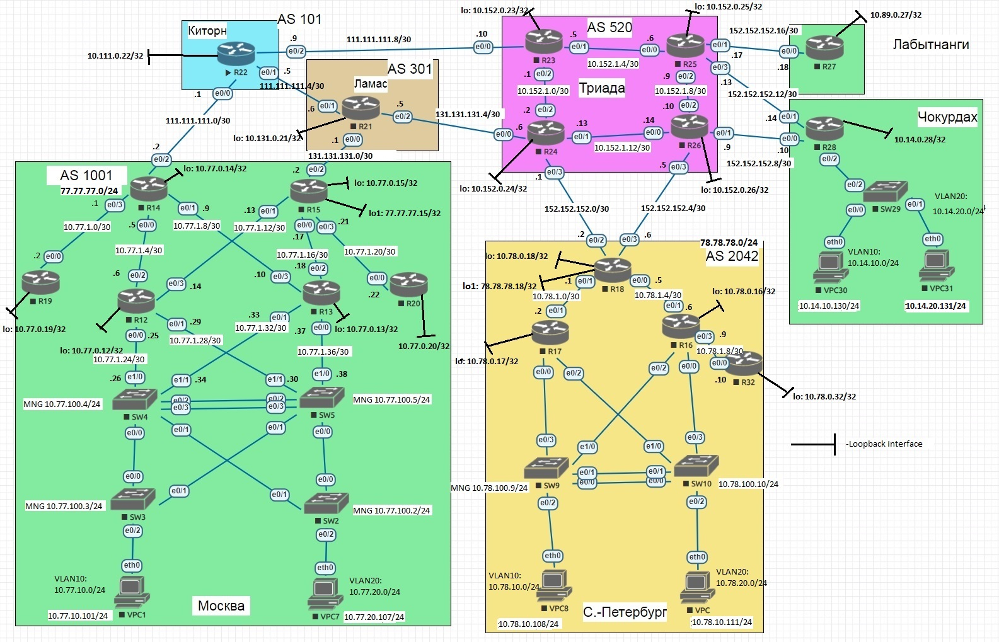

# Лабораторная работа №14 "IPSec over DmVPN"

## Задание

1. Настройте GRE поверх IPSec между офисами Москва и С.-Петербург
2. Настройте DMVPN поверх IPSec между Москва и Чокурдах, Лабытнанги
3. Все узлы в офисах в лабораторной работе должны иметь IP связность

Дополнительно: Для IPSec использовать CA и сертификаты.

Схема сети представлена на рисунке ниже:




## Решение

Подниму на R12 сервер сертификации:


```
ip domain name otus.ru

ip http server
crypto key generate rsa general-keys label R12 exportable modulus 2048
crypto pki server R12
 database level complete
 no shut

end
```


Настраиваю на клиентах (на примере R15):


R15:
```
ip domain name otus.ru
ip host R12 77.77.77.12
crypto key generate rsa
crypto pki trustpoint R12
 enrollment url http://77.77.77.12
exit

crypto pki authenticate R12
crypto pki enroll R12

end
```

На R12 подтвердим все сертификаты: crypto pki server R12 grant all

Проверка:
```
R12#sh crypto pki server R12 cert
Serial Issued date              Expire date               Subject Name
1       05:29:18 UTC Aug 25 2025 05:29:18 UTC Aug 24 2028  cn=R12
2       06:43:23 UTC Aug 25 2025 06:43:23 UTC Aug 25 2026  serialNumber=67109104+hostname=R15.otus.ru
3       06:43:23 UTC Aug 25 2025 06:43:23 UTC Aug 25 2026  serialNumber=67109088+hostname=R14.otus.ru
4       06:58:50 UTC Aug 25 2025 06:58:50 UTC Aug 25 2026  serialNumber=67109296+hostname=R27.otus.ru
5       06:58:50 UTC Aug 25 2025 06:58:50 UTC Aug 25 2026  serialNumber=67109312+hostname=R28.otus.ru
6       06:58:50 UTC Aug 25 2025 06:58:50 UTC Aug 25 2026  serialNumber=67109152+hostname=R18.otus.ru

```

### Настройте GRE поверх IPSec между офисами Москва и С.-Петербург

Настройка на примере R14, на остальных узлах конфигурация аналогичная:
```
crypto isakmp policy 1
 encr aes 191
 hash sha256
 group 5
exit

crypto ipsec transform-set IPSEC esp-aes esp-sha-hmac
 mode transport
exit

crypto ipsec profile LAB14
 set transform-set IPSEC
exit

crypto isakmp policy 1
 encr aes 192
 hash sha256
 group 5
exit

crypto ipsec transform-set IPSEC esp-aes esp-sha-hmac
 mode transport
exit


crypto ipsec profile LAB14
 set transform-set IPSEC
exit

interface Tunnel0
 tunnel protection ipsec profile LAB14
end
```

Проверка:
```
R14#sh crypto ipsec sa interface tunnel 0

interface: Tunnel0

    Crypto map tag: Tunne10-head-0, local addr 77.77.77.114

   protected vrf: (none)
   local ident (addr/mask/prot/port): (77.77.77.114/255.255.255.255/47/0)
   remote ident (addr/mask/prot/port): (78.78.78.18/255.255.255.255/47/0)
   current peer 78.78.78.18 port 500
     PERMIT, flags={origin_is_acl,)
	#pkts encaps: 6385,	#pkts encrypt: 6385, #pkts digest: 6385
	#pkts decaps: 6359, #pkts decrypt: 6359, #pkts verify: 6359
	#pkts compressed: 0, #pkts decompressed: 0
	#pkts not compressed: 0, #pkts compr. failed: 0
	#pkts not decompressed: 0, #pkts decompress failed: 0
	#send errors 0, #recv errors 0
	
     local crypto endpt.: 77.77.77.114, remote crypto endpt.: 78.78.78.18
	 plaintext mtu 1458, path mtu 1500, ip mtu 1500, ip mtu idb Ethernet1/0
	 current outbound spi: 0xEF56DF76 (4015447926)
	 PFS (Y/N): N, DH group: none
	 
	 inbound esp sas:
      spi: 0x329508E5 (848627941)
	   transform: esp-aes esp-sha-hmac ,
	   in use settings ={Transport, }
	   conn id: 43, flow_id: SW:43, sibling_flags 80000000, crypto map: Tunnel0-head-0
	   sa timing: remaining key lifetime (k/sec): (4364894/1687)
	   IV size: 16 bytes
	   replay detection support: Y
	   Status: ACTIVE(ACTIVE)

    inbound ah sas:
	
	inbound pcp sas:
	
	outbound esp sas:
	 spi: 0xEF56DF76 (4015447926)
	   transform: esp-aes esp-sha-hmac ,
	   in use settings ={Transport, }
	   conn id: 44, flow id: SW:44, sibling_flags 80000000, crypto map: Tunnel0-head-0
	   sa timing: remaining key lifetime (k/sec): (4364892/1687)
	   IV size: 16 bytes
	   replay detection support: Y
	   Status: ACTIVE (ACTIVE)
	   
    outbound ah sas:
    outbound pcp sas:
```


### Настройте DMVPN поверх IPSec между Москва и Чокурдах, Лабытнанги

Настраиваю туннельный интерфейс на примере R14, на остальных узлах конфигурация аналогичная:
```
interface Tunnel1
 tunnel protection ipsec profile LAB14
end
```

Проверка:

```
R14#sh crypto ipsec sa int tunnel 1

interface: Tunnel1
    Crypto map tag: Tunnel1-head-0, local addr 77.77.77.214
	
   protected vrf: (none)
   local ident (addr/mask/prot/port): (77.77.77.214/255.255.255.255/47/0)
   remote ident (addr/mask/prot/port): (152.152.152.10/255.255.255.255/47/0)
   current_peer 152.152.152.10 port 500
     PERMIT, flags=(origin_is_acl,}
	#pkts encaps: 5016, #pkts encrypt: 5016, #pkts digest: 5016
	#pkts decaps: 5006, #pkts decrypt: 5006, #pkts verify: 5006
	#pkts compressed: 0, #pkts decompressed: 0
	#pkts not compressed: 0, #pkts compr. failed: 0
	#pkts not decompressed: 0, #pkts decompress failed: 0
	#send errors 0, #recv errors 0
	
	 local crypto endpt.: 77.77.77.214, remote crypto endpt.: 152.152.152.10
	 plaintext mtu 1458, path mtu 1500, ip mtu 1500, ip mtu idb (none)
	 current outbound spi: 0x7F89C997 (2139736471)
	 PFS (Y/N): N, DH group: none
	 
	 inbound esp sas:
	  spi: 0x502C4387 (1345078151)
	    transform: esp-aes esp-sha-hmac,
		in use settings ={Transport,}
		conn id: 41, flow_id: SW:41, sibling_flags 80000000, crypto map: Tunnel1-head-0
		sa timing: remaining key lifetime (k/sec): (4324257/1098)
		IV size: 16 bytes
		replay detection support: Y
		Status: ACTIVE (ACTIVE)
	
	 inbound ah sas:
	 
	 inbound pcp sas:
	 
	 outbound esp sas:
	  spi: 0x7F89c997 (2139736471) 
	    transform: esp-aes esp-sha-hmac ,
		in use settings ={Transport, }
		conn id: 42, flow_id: SW:42, sibling_flags 80000000, crypto map: Tunnel1-head-0
		sa timing: remaining key lifetime (k/sec): (4324255/1098)
		IV size: 16 bytes
		replay detection support: Y
		Status: ACTIVE (ACTIVE)
		
     outbound ah sas:
	 
	 outbound pcp sas:

   protected vrf: (none)
   local ident (addr/mask/prot/port): (77.77.77.214/255.255.255.255/47/0)
   remote ident (addr/mask/prot/port): (152.152.152.18/255.255.255.255/47/0)
   current peer 152.152.152.18 port 500
     PERMIT, flags=(origin_is_acl,}
	#pkts encaps: 5018, #pkts encrypt: 5018, #pkts digest: 5018
	#pkts decaps: 4996, #pkts decrypt: 4996, #pkts verify: 4996
	#pkts compressed: 0, #pkts decompressed: 0
	#pkts not compressed: 0, #pkts compr. failed: 0
	#pkts not decompressed: 0, #pkts decompress failed: 0
	#send errors 0, #recv errors 0
	
	 local crypto endpt.: 77.77.77.214, remote crypto endpt.: 152.152.152.18
	 plaintext mtu 1458, path mtu 1500, ip mtu 1500, ip mtu idb (none)
	 current outbound spi: 0x782E1641 (2016286273)
	 PFS (Y/N): N, DH group: none
	 
	 inbound esp sas:
	  spi: 0xA67E0510 (2793276688)
	    transform: esp-aes esp-sha-hmac ,
		in use settings =(Transport,
		conn id: 45, flow_id: SW:45, sibling_flags 80004000, crypto map: Tunnel1-head-0
		sa timing: remaining key lifetime (k/sec): (4274412/1222)
		IV size: 16 bytes replay detection support: Y
		Status: ACTIVE (ACTIVE)
		
	 inbound ah sas:
	 
	 inbound pcp sas:
	 
	 outbound esp sas:
	  spi: 0x782E1641 (2016286273)
	    transform: esp-aes esp-sha-hmac ,
		in use settings =(Transport, )
		conn id: 46, flow_id: sW:46, sibling_flags 80004000, crypto map: Tunnel1-head-0
		sa timing: remaining key lifetime (k/sec): (4274409/1222)
		IV size: 16 bytes
		replay detection support: Y
		Status: ACTIVE (ACTIVE)
	 
	 outbound ah sas:
	 
	 outbound pcp sas:
```


Конфигурационныe файлы можно найти по [ссылке](./cfg).
